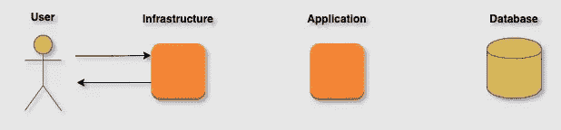

# 如何解决数据库的升级问题

> 原文：<https://towardsdatascience.com/escalating-your-database-1f945adf67ec?source=collection_archive---------37----------------------->

## *了解当您遇到性能问题时升级数据库的最佳技术*

[ev](https://unsplash.com/@ev?utm_source=medium&utm_medium=referral) 在 [Unsplash](https://unsplash.com?utm_source=medium&utm_medium=referral) 上的照片

当项目增长时，最常见的瓶颈之一是在数据库方面。这可能是因为程序的复杂性由于新的需求而增加，或者更常见的是，由于应用程序应该处理的流量的增加。

## 之前的考虑

像在许多其他情况下一样，您应该根据指标升级您的数据库。一般来说，在没有首先研究数据库、应用程序和基础设施指标的情况下，我不会建议应用任何数据库升级。此规则的唯一例外是当您的应用程序出现故障时，经常出现超出范围、性能和/或延迟问题，甚至数据库过载和锁定。

此外，我的建议是，除非必要，否则不要应用这些技巧。如果您不希望或没有面临数据库问题，您不应该过度扩展您的系统。您必须意识到不同升级选项的权衡以及它们带来的后果，例如系统复杂性的增加、维护中的问题、调试难度的增加等等。

让我们一起回顾一下可用的主要选项:

# **添加一个索引**

为应用程序所需的搜索向表中添加额外的索引将降低查询的延迟。

这种解决方案的缺点是您将消耗更多的数据库硬盘空间。创建新索引时，会创建一个记录数与原始表相同的新表。

此外，请注意，使用这种解决方案时，对数据库的写操作会比较慢，因为您需要在索引表中执行额外的搜索和写操作。一般来说，这不会是一个问题，除非您的 IOPS 操作在写入方面非常不平衡(尤其是在包含几百万条记录的大型表中)，或者/或者您滥用了这个解决方案，在同一个表中添加了几个索引。

# **使用缓存解决方案**

基本上，当您缓存一个查询时，数据库引擎不会在下一次被请求时重复相同的查询。当然，这可以节省时间、减少延迟并提高性能。您可以在不同级别应用缓存:

*   在数据库引擎级别。当查询到达数据库时，如果该查询之前已经完成，引擎提供缓存版本。虽然在数据库级别处理缓存的方式因系统而异，但是当查询的任何元素有任何修改时，整个查询都会被清除。

作者图片

*   在应用程序级别。应用程序接受一个请求，但是它不是获取数据库的信息，而是提供一个缓存响应(例如，使用 Memcache 或 Redis)。该系统为开发人员提供了完全的所有权，因为他们可以控制何时清理缓存并以编程方式配置 TTL。

作者图片

*   在基础设施层面。一旦用户调用应用程序，而不是运行代码，就会提供一个缓存的响应(例如，使用 Varnish)。这种解决方案避免了应用程序，但是作为一种折衷，清理缓存更加困难。同时，它没有连接到应用程序，应该依赖于适当的 TTL 配置。

作者图片

# **使用复制品**

该选项背后的想法是设置一个或多个将与主数据库实例同步的副本。然后，您可以导出副本的读取流量。这样，您减少了主实例的写操作流量，从而提高了整个系统的性能。

这个解决方案的权衡包括复杂性和成本的增加(您应该至少加倍实例)。此外，您应该在数据库端有一个健壮的基础设施，确保正确的复制，没有错误或严重的滞后。

作者图片

# **应用分片**

基本上，这个解决方案将主数据库分成多个更小的数据库，称为碎片。虽然不同的操作将由不同的(更小的)碎片来处理，但在大多数情况下，性能和延迟将显著改善，从而结束几乎所有的数据库瓶颈。

分片有两种不同的实现方式，垂直共享和水平分片:

**水平分片**:每个原始表的内容被拆分到不同的机器上，保持它们之间相同的表结构(列、索引等)。)

**垂直分割**:表格在列级分割。

作者图片

虽然每个分片中的数据集更小，但是任何原子查询都会运行得更快；此外，写操作失败和并发问题的风险更低。请注意，情况并不总是如此，当您需要连接来自不同碎片的值时，尤其是当您还按多个列进行分组或排序时，性能会受到严重影响。

分片数据库为您提供了几个好处，但是它也带来了巨大的复杂性。当您需要将您的系统从非分片转移到分片时，它的初始实现需要一个详细的计划和实现。然后，维护需要对现有的新基础设施以及分片架构有深入的了解。任何新的开发都应该记住分片架构，并且需要更多的时间进行规划。

简化分片 App- DB 工作流-作者图片

# 最后的想法

升级数据库从来都不是一项简单的任务。让我坚持两点:首先，在开始之前，你需要精确的度量。其次，您需要深入理解您的应用程序、需求和缺陷，不仅包括纯技术方面，还包括产品和用户期望。

最后，请注意，我保持文章的一般性。升级数据库问题是一件严肃的事情。我并没有特意介绍代理实现、Viper 或 MariaDB 缓存系统——只是提到一些您可以考虑的潜在情况。本文的目的是让您对可以应用的关键解决方案有一个大致的了解。细节和实现同样取决于您的指标和应用。