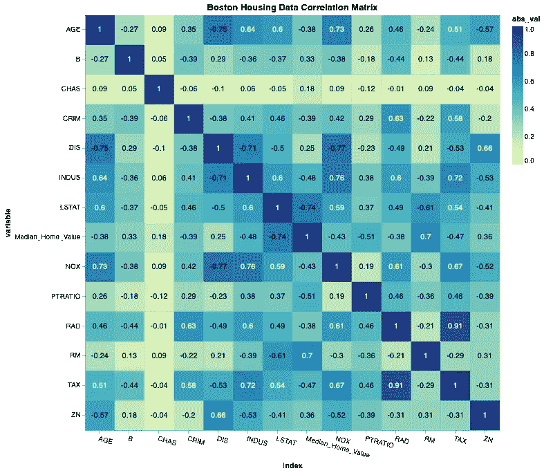
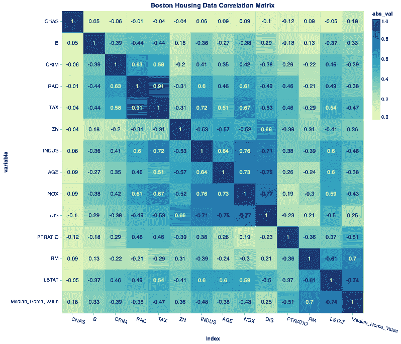
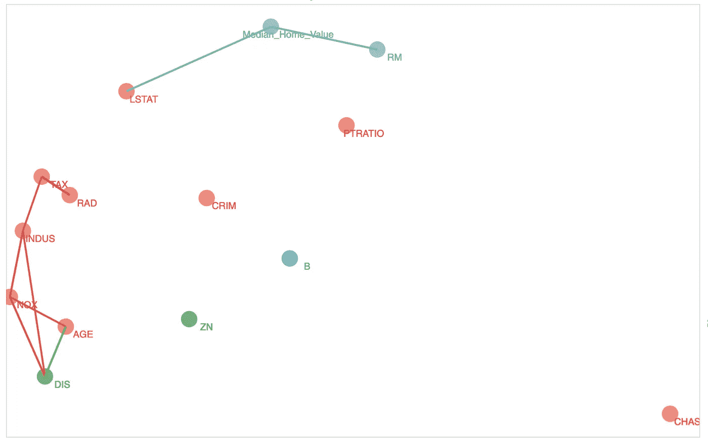
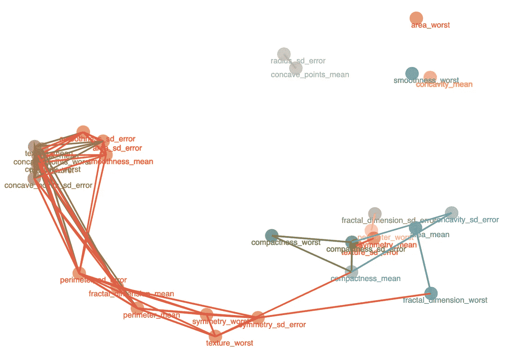
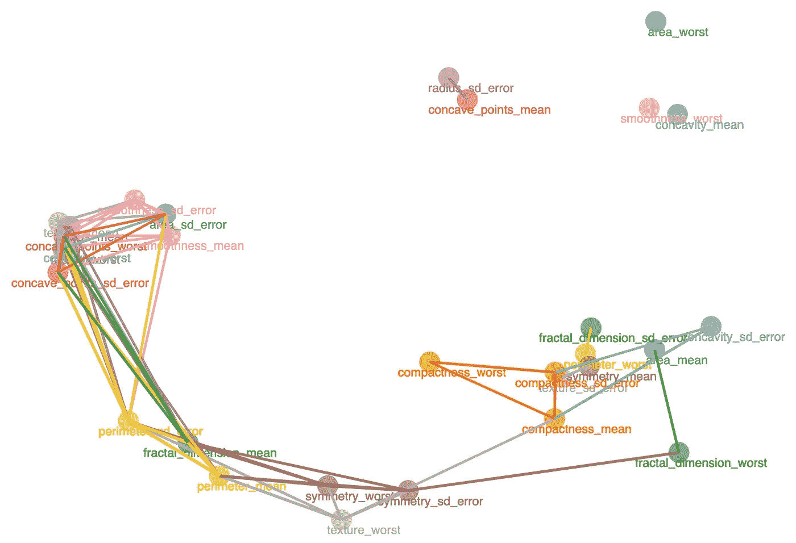
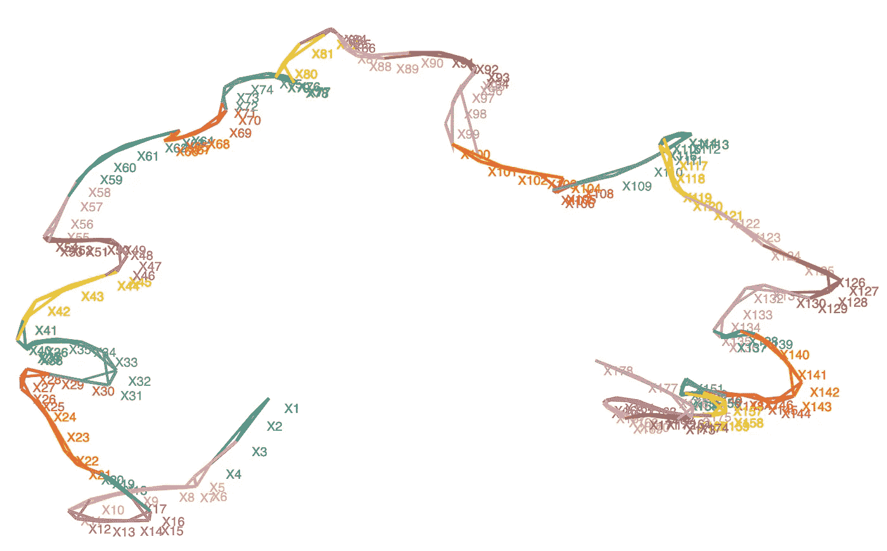
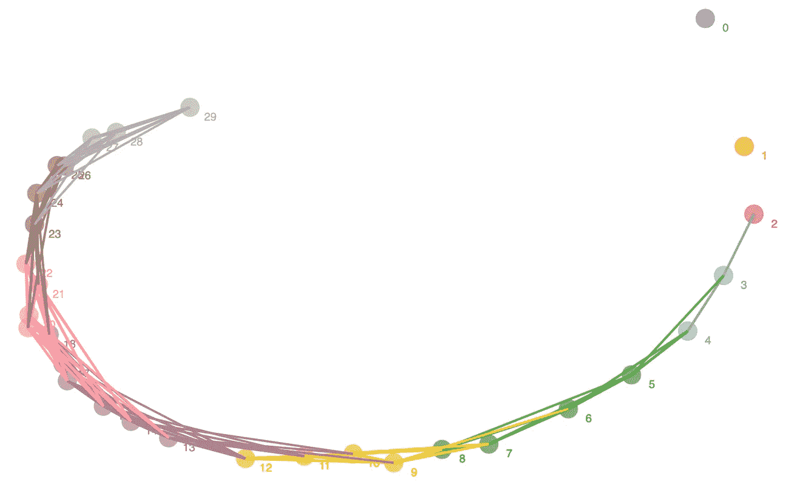
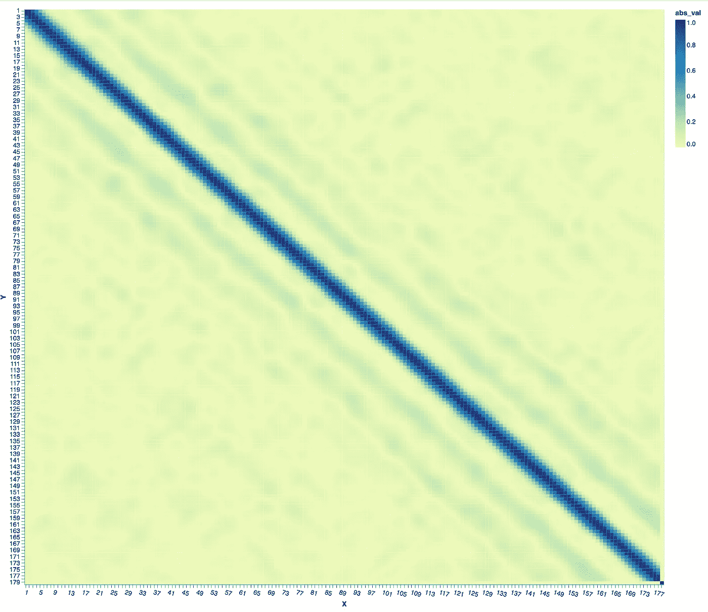
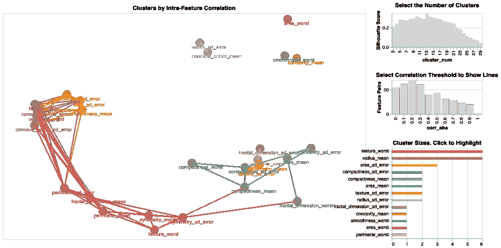

# 将相关矩阵转移到…特征空间。

> 原文：<https://towardsdatascience.com/escape-the-correlation-matrix-into-feature-space-4d71c51f25e5?source=collection_archive---------22----------------------->

## 介绍一种绘制相关矩阵的新技术。它使您能够快速识别数据中的高级结构。

在 [Unsplash](https://unsplash.com/s/photos/space?utm_source=unsplash&utm_medium=referral&utm_content=creditCopyText) 上 [Juskteez Vu](https://unsplash.com/@juskteez?utm_source=unsplash&utm_medium=referral&utm_content=creditCopyText) 拍摄的照片。其他所有图片均由作者提供。

我们都有过擅长使用劣质产品的经历。贵公司与不可靠的 CRM 签订了为期四年的合同。带有可怕的数据库连接器的表单工具，您永远也找不到时间来迁移它。MS Access。由于惯性、组织限制或成本，我们经常发现自己使用低劣的工具和技术，学习它们的小怪癖，将肌肉记忆投入到一系列重复的对话框中。您是否尝试过将 Excel 文件保存为 CSV 文件？

> 如果将工作簿保存为 CSV 格式，其中的某些功能可能会丢失。

有时候，使用这些工具是必要的。谁知道呢，也许它甚至能塑造性格？

> *但是作为数据科学家，我们通常有能力选择自己的工具。这样做是非常重要的，因为我们的工具塑造了我们对什么是容易的，什么是可能的。*

相关矩阵就是这些糟糕的工具之一。更具体地说，在我们习惯性地需要执行大量任务的情况下，它是一种对有限的任务集有效的工具。因为相关矩阵有着悠久的历史，并且在较小的数据集上工作得足够好，所以我们把它视为唯一的游戏。我提出了特征空间图——这是一个补充相关性矩阵的工具，对数据科学家和非专家都有用。代码很容易适应自己——参见[最小示例](https://gist.github.com/MattJBritton/b6944218903312f6220bfb48706b593c)和[完整笔记本](https://github.com/MattJBritton/ExquisiteCorrpse)。

## 我们如何使用相关矩阵

那么相关矩阵到底有什么问题呢？让我们来看一个例子。假设我们正在使用[波士顿住房数据集](http://www.cs.toronto.edu/~delve/data/boston/bostonDetail.html)，我们的目标是为一个社区的中值房价建立一个预测模型。

我们可能会询问缺失值，查看单变量分布，查阅我们的数据字典，但我们最大的问题之一将是:

> 这些特征之间以及与目标之间是如何关联的？

作为优秀的数据科学家，我们希望尽可能地了解我们的数据集，而不是仅仅向它扔一个神经网络。这将有助于我们:

*   特征工程
*   特征选择
*   降维/解决多重共线性
*   并最终将结果传达给利益相关者

因此，我们开始行动(打个比方，我的[运行工作台](https://xkcd.com/1329/)还没有进来)，并构建一个关联矩阵。它计算[皮尔逊相关系数](https://en.wikipedia.org/wiki/Pearson_correlation_coefficient)(缩写为 *r* )，数据中的每一对数量特征接收一个从-1 到 0 到+1 的单个数字，分别表示它们的线性相关性为强负、不存在或强正。当输出为表格时，它显示任意两个要素之间的(线性)关系的强度。我们进行一些光视觉化，然后！

> 但是我们如何使用这个图表呢？让我们扪心自问…
> 
> —我们想做什么？
> 
> —这东西能帮我们做到吗？

作为数据科学家，我们希望至少做到以下几点:

1.  找出任何两个感兴趣的特征之间的相关性。
2.  了解数据的高级结构—是否存在大量多重共线性？密切相关的特征的“集群”在哪里？
3.  学习一些我们不知道的，也可能想不到要问的东西。

上面的相关矩阵明显优于第一点。它本质上只是一个查找表，通过用颜色对值进行双重编码进行了改进。

第二点有点棘手。这里的“结构”是指存在于个体元素集合体中的组织形式——就像看着一栋房子说“它有三层”或“地基正在下沉”，而不仅仅是“那两块砖是相邻的”。在特征空间中，我们正在寻找的结构是提供独特预测值的共线特征或独立特征的聚类。

在高维空间中，更复杂的关系是可能的，这将我们引向第三个目标——学习我们不知道的东西。如果我们只是想验证一个假设，有大量的统计测试。但是获得一种我们从未想过要考虑的洞察力是分析和可视化的核心。

## 太相关-太少，太相关

> 那么，我们的相关矩阵是否有助于我们找到特征的聚类，并产生关于数据的新见解？

算是吧。我们可以从黑方块的盛行来判断我们是否有很多共线性。我们可以观察一行或一列，注意到它很暗或很亮，并了解该特征是否接近许多其他特征。但是，这将需要大量的时间来识别集群。一个问题是所有的列看起来都有点相同，我们必须不断检查轴标签，以确保我们看到的是正确的。

随着时间和努力，我们可以推断出，例如， *RAD* 、 *TAX* 、 *INDUS* 、 *AGE* 和 *NOX* 之间高度相关，并可能形成一个集群。做到这一点所需的信息都在这里。

> 但是可视化的目的是利用我们进化中磨练出来的视觉敏锐度来快速发现仅仅盯着一张图表看不到的模式。

在这一点上，我认为这不是一个产生洞察力的工具。

但是等等！如果集群是我们所追求的，那么为什么不只是对轴进行排序，使相关的特征彼此相邻呢？你能看出从原始版本到这个版本的改进吗？

未排序(左)和排序(右)相关矩阵。在排序后的版本中，特征簇更容易被挑选出来。

现在橡胶上路了！沿着对角线扫描，寻找色块。我们可以立即看到 *CRIM* 、 *RAD* 和 *TAX* 以及 *INDUS* 、 *AGE* 、 *NOX* 和 *DIS* 之间的集群。

我们在这里所做的是利用我们大脑的进化磨砺的[前注意处理](https://www.csc2.ncsu.edu/faculty/healey/PP/)来快速挑选出基于[格式塔原则](https://www.usertesting.com/blog/gestalt-principles)的模式，例如接近和相似。

> 可视化的主要目标之一是将有趣的数据绑定到这些模式上——我们基本上是在建造望远镜，并要求我们的大脑告诉我们森林中有什么在移动。

除了这些群集，我们的大脑还会挑选出其他模式。当然 *RAD* 和 *TAX* 相关性较高，但都与 *CRIM* 和 *B* 相关性较小。LSTAT 似乎与 *Median_Home_Value* 和 RM 在一个聚类中，但它与大多数其他特征有相当强的相关性。看起来 *NOX* / *DIS* 和 *RAD* / *TAX* 簇相互关联，但与 *LSTAT* / *RM* 簇的关联度没有那么大。

## 充分利用二次元

这些是我们之前讨论过的复杂而令人惊讶的结构。我们的排序相关矩阵使它们可见，但我们仍然需要引用轴标签并跟踪一行或一列，对于一个有数百列的数据集，相关矩阵甚至不适合一个页面！

相关矩阵的另一个限制是两个轴的排序顺序相同，因此一个特征只能与另外两个特征直接相邻。这限制了我们用接近度来衡量亲密程度的能力。在排序后的矩阵中，我们试图分析用颜色编码很好的关系，但用距离编码不好。这给了图表一种“魔眼”的特征，并使它对非专家来说不那么容易接近。

> 嗯，什么图表可以让我们在二维空间中定位元素，这样我们就可以有水平和垂直的接近度？
> 
> 散点图！

我们所需要的是为每个特征生成 X，Y 坐标的方法。完整的方法可在[源代码](https://github.com/MattJBritton/ExquisiteCorrpse)中找到，总结如下:

*   取相关矩阵的绝对值，从 1 中减去每个值。它被方便地转换成距离矩阵！
*   然后，我们可以使用 PCA 将 NxN 矩阵减少到 Nx2。
*   使用两个主要成分绘制每个特征的位置。
*   利用特征集聚生成特征集群。
*   根据聚类给每个要素着色。
*   画线表示至少 *r* = 0.7 的关系。

## 特征空间图

下面的特征空间图(FSD)使用位置、颜色(对于聚类成员)和链接(对于强相关性)的组合来以互补的方式描述特征之间的关系。甚至一眼，我们就可以看出:

波士顿住房数据集的特征空间图。

*   *CHAS* 完全独立。
*   大多数特性被集中到一个大的集群中，但是在这个集群中，一个核心集是紧密相关的。
*   与相关矩阵相比，我们能够快速识别出 *LSTAT* 在与目标和许多其他特征相关中占据独特的位置，包括 *RM* ，否则它是独立的。

> 这是一个快速的洞察，对特征工程和选择非常有帮助。如果我们需要细节，我们可以在我们的相关矩阵中查找它们，把它放在适当的位置，作为一个查找工具。

## 按比例放大

波士顿住房数据非常小，所以相关矩阵和特征空间图更加匹配。但是 FSD 确实在更大的数据集上大放异彩。让我们看看[乳腺癌数据集](https://archive.ics.uci.edu/ml/datasets/Breast+Cancer+Wisconsin+(Diagnostic))的 FSD，它有 30 列:

乳腺癌数据集的特征空间图

我们可以立即看到这些数据中有明显的特征聚类。橙色和棕色集群内部以及彼此之间有很强的相关性。红色聚类中的要素都离橙色聚类较远，并且彼此之间的相关性较弱。也有异常值，如*平滑度 _ 最差，面积 _ 最差*和*凹度 _ 平均值*。 *Radius_sd_error* 和*凹点 _ 均值*奇怪的是相互关联，没有别的。

该数据由几种类型的测量值(半径、周长、对称性等)和为每种测量值计算的统计值(平均值、标准偏差、最差)组成。我们可以尝试回答的一个高级问题是，我们是否可以只使用每种度量类型的“平均值”,而抛弃其余的。换句话说，要素是按测量类型分类的吗？

具有用户提供的颜色映射领域知识的特征空间图

通过对特征到测量类型的颜色映射进行硬编码，我们可以很容易地找到答案！

> 没有。

有一些物理上相邻的测量类型，例如橙色的*密实度* _。但是总的来说，度量类型在这里并不驱动相关性。

然而，这是一个很好的拒绝假设。如果我们已经将几个数据集合并在一起进行分析，并且现在想要确定它们的特征在多大程度上重叠，这种方法也会非常有帮助。只需给每个数据集中的变量赋予它们自己的颜色。

## 时间序列

我特别惊讶的是为[癫痫发作识别](https://archive.ics.uci.edu/ml/datasets/Epileptic+Seizure+Recognition)上的时间序列数据集创建的 FSD。每个数据点由在一秒钟内进行的 178 次脑电图测量组成。我们想问的关于时间序列的第一个问题是是否有任何重复或循环的行为。

癫痫发作识别数据集的特征空间图

这个看起来有点像澳大利亚的斑点向我们展示了每个特征只与它的邻居相关(例如，前面和后面的时间片)。奇怪的形状来自 PCA 试图根据时间顺序将每个特征从其他特征中推开。

然而，我们如何解释所有的弯曲和花饰？我们可能有理由期望马尔可夫链看起来更像这样:

合成半随机马尔可夫链的特征空间图

换句话说，一个没有环的圆形。这暗示除了 5 个连续时间戳的每个块之间之外，在该数据集中还有其他相关性。让我们检查一下相关矩阵:

乍看之下，相关性矩阵提供了相同的故事——在每个点前后延伸 2-3 个时间戳的高度相关点的带，否则没有相关性。但如果我们仔细观察，可以看到两组与主线平行的微弱线条——一组在每个点前后约 17 个点，另一组在每个点前后约 35 个点。这个奇怪的视觉假象表明，在这个数据中有一个小的循环效应。在 FSD 中，我们甚至可以看到线条弯曲，使得 X18、X33 和 X49 尽可能地靠在一起，接近我们上面看到的趋势。相当酷！

## 结论

特征空间图是一种工具，它补充了相关性矩阵，并提供了定量特征之间相关性的更快概要。在本文中，我将展示如何使用它来揭示需要进一步研究的有趣关系。代码可从下面获得(或查看完整的笔记本[此处](https://github.com/MattJBritton/ExquisiteCorrpse))，包括额外的配置和交互功能，包括:

*   缩放和平移
*   用于选择聚类数量的小部件
*   更改显示相关线的 *r* 阈值的小部件
*   显示集群数量和大小的图表
*   能够传入用户定义的颜色方案，如上所示

功能空间图的完全交互式版本

## 脚注

有关该排序的完整实现，请参见[对应的 R 包](https://rdrr.io/cran/lessR/man/corReorder.html)。
在本文的例子中，CHAS 布尔变量包含在相关矩阵中。尽管皮尔逊相关系数被编码为一个数字，但它不是为处理分类变量而设计的，因此在实践中不应该这样做。请参见[预测能力评分](/rip-correlation-introducing-the-predictive-power-score-3d90808b9598)以获得可处理任何类型变量的类似特征评分。