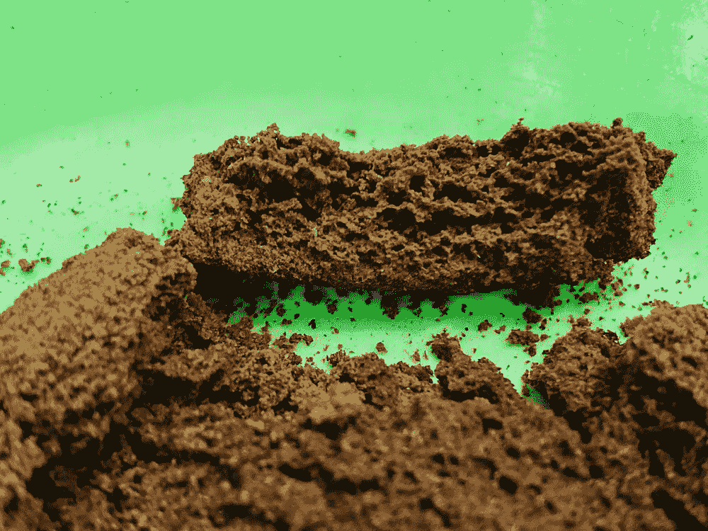
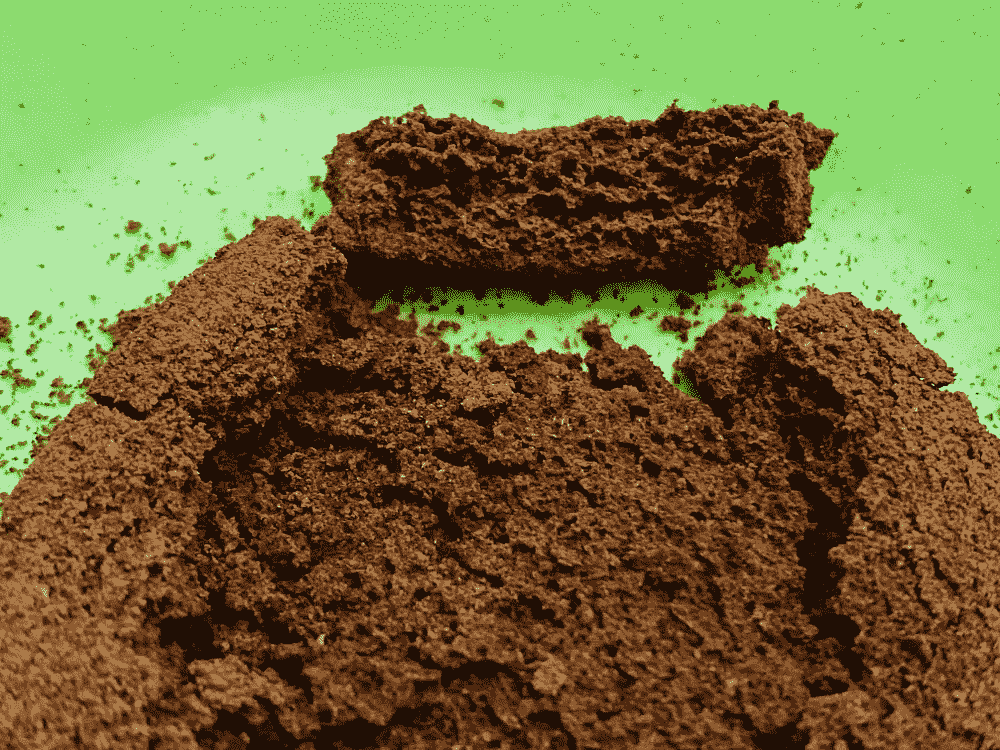
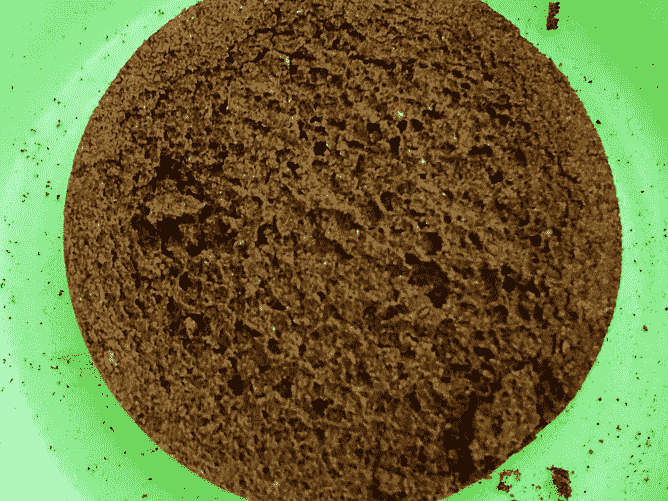
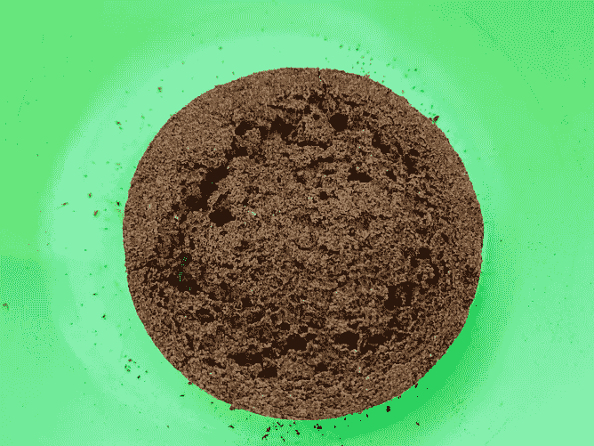
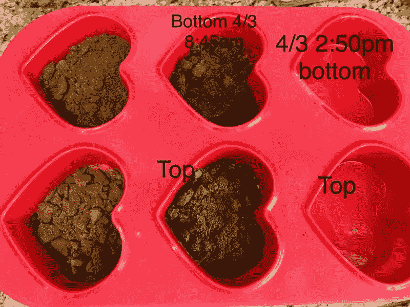
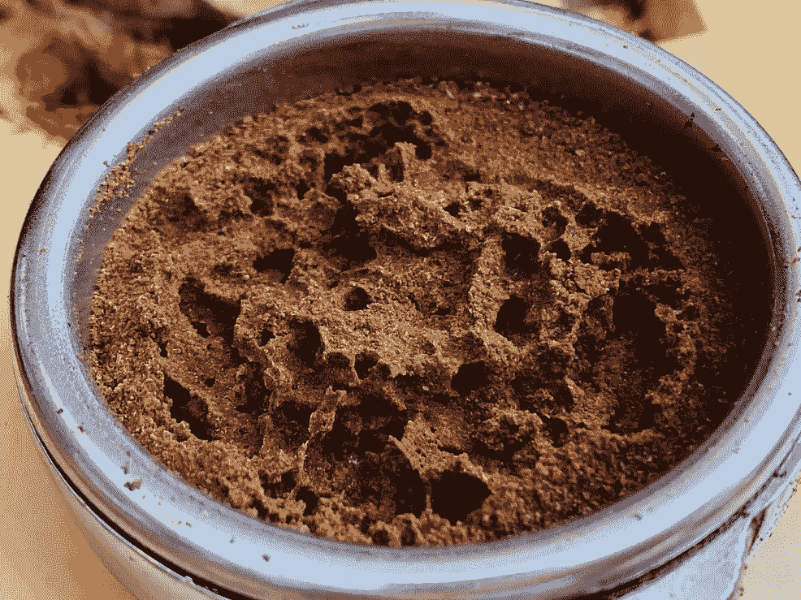
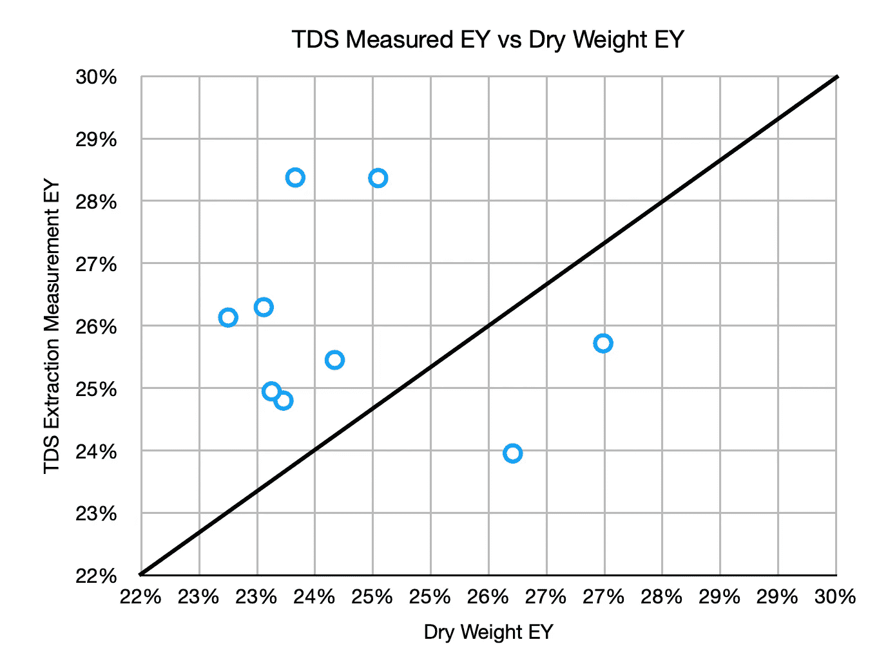
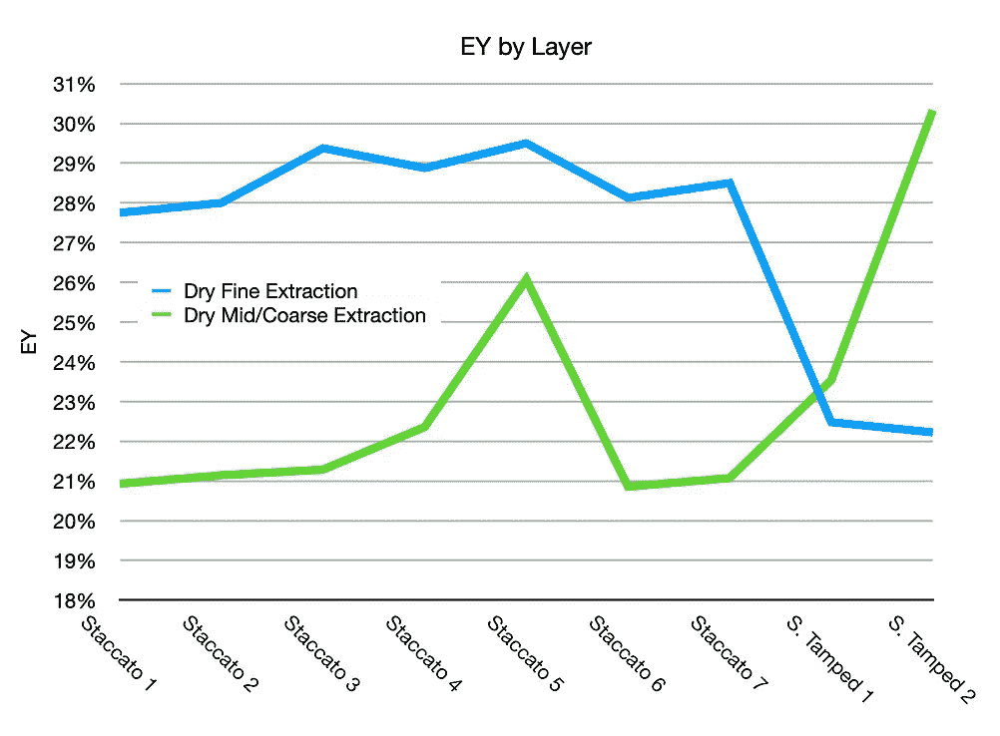

# 分层提取浓缩咖啡

> 原文：<https://towardsdatascience.com/espresso-extraction-by-layer-fc2780335aee?source=collection_archive---------34----------------------->

## 垂直探索提取

在开发[断奏镜头](https://medium.com/overthinking-life/staccato-espresso-leveling-up-espresso-70b68144f94)时，我注意到用过的咖啡层在镜头后保持分离。我决定弄干这些圆盘，看看每层的咖啡萃取量。我很好奇这将揭示什么，如果这可以告知如何提取一杯普通的浓缩咖啡。

这是提取后的断奏夯实镜头的顶层，看起来像海绵。

# 断续浓缩咖啡和断续捣实概述

[断续浓缩咖啡](https://medium.com/overthinking-life/staccato-espresso-leveling-up-espresso-70b68144f94)的制作方法是将咖啡过筛，将过滤篮分层，底部是精细层，然后是粗糙层，最后是中间层。这是一个如何准备冰球的旧图(注意:我现在使用塑料分配器，不再使用回形针。我也不再使用黑色 OCD 风格的分配器)。

有时会有更多的层，这是由于通过 bean 分割精细层或添加一层 Robusta

从断续浓缩咖啡中，我得到了[断续捣实](/staccato-tamping-improving-espresso-without-a-sifter-b22de5db28f6)，这里有两层不同的捣实压力，如下图所示:

断续浓缩咖啡层的一个例子:

# 干燥层

一个断奏夯实镜头的顶层看起来像一块海绵。一张断续浓缩咖啡照片的顶层看起来相似，但我没有照片。通常，你可以说这是通道，但在这种情况下，通道通常是穿过圆盘的。由于我在图层之间使用了纸质滤镜，这个不连贯的夯实的照片很容易被分割。纸过滤器是一种有效的方法，可以将照片分层，以了解咖啡是如何提取的。

我拿起每个冰球，把它们放在碗里或纸杯蛋糕架上。用一个碗，我测量了碗的起始重量。有了纸杯蛋糕托盘，我就把它当成了储藏室，在需要称重的时候用勺子把蛋糕渣刮出来。纸杯蛋糕托盘中剩余的粉末量不超过 0.05 克

咖啡壶放在柜台上大约需要一周的时间才能变干。它们可以在低温的烤箱里烤得更快，我偶尔会这么做，但这比把冰球放在托盘里等待需要更多的关注。

我拍了几张显示不同层次的照片。断奏圆盘的主要问题是中/粗层不能保持完整。正如你在照片中看到的，精细层保持完好无损。

# 小规模分析

我查看了测量提取率(EY)与测量提取干重的对比。

大多数镜头测量提取高于干重，但有可能一些水仍然保留，即使干燥后。

按层查看提取情况，细层比中/粗层提取更多。对于断续的夯实镜头(右边的两个)，顶层的提取比底层高。断奏夯实击球的顶层和底层的主要区别在于夯实压力。

我对废弃的场地很好奇。如果中/粗层提取的咖啡较少，我想知道是否可以收集它们并重新研磨。我怀疑，即使是正常拍摄中的球场地面也很少被提取，你可以在拍摄后对它们进行筛选，并尝试重新打磨以进行新的拍摄。这种类型的实验至少可以让我们深入了解水到底有多深，咖啡能被提取出来。

总的来说，该测试表明较细的颗粒具有较高的提取率，但是密度在提取中起着很大的作用。我仍然认为萃取率随时间和粒度的变化是一个难以解开的谜，我希望这里或那里的小实验将有助于这种理解。

如果你愿意，可以在 Twitter 和 YouTube 上关注我，我会在那里发布不同机器上的浓缩咖啡视频和浓缩咖啡相关的东西。你也可以在 [LinkedIn](https://www.linkedin.com/in/robert-mckeon-aloe-01581595?source=post_page---------------------------) 上找到我。

# 我的进一步阅读:

[解构咖啡:分割烘焙、研磨、分层以获得更好的浓缩咖啡](/deconstructed-coffee-split-roasting-grinding-and-layering-for-better-espresso-fd408c1ac535)

[浓缩咖啡的预浸:更好的浓缩咖啡的视觉提示](/pre-infusion-for-espresso-visual-cues-for-better-espresso-c23b2542152e)

[咖啡的形状](/the-shape-of-coffee-fa87d3a67752)

[搅拌还是旋转:更好的浓缩咖啡体验](https://towardsdatascience.com/p/8cf623ea27ef)

[香辣浓缩咖啡:热磨，冷捣以获得更好的咖啡](/spicy-espresso-grind-hot-tamp-cold-36bb547211ef)

[断续浓缩咖啡:提升浓缩咖啡](https://medium.com/overthinking-life/staccato-espresso-leveling-up-espresso-70b68144f94)

[用纸质过滤器改进浓缩咖啡](/the-impact-of-paper-filters-on-espresso-cfaf6e047456)

[浓缩咖啡中咖啡溶解度的初步研究](/coffee-solubility-in-espresso-an-initial-study-88f78a432e2c)

[断奏捣固:不用筛子改进浓缩咖啡](/staccato-tamping-improving-espresso-without-a-sifter-b22de5db28f6)

[浓缩咖啡模拟:计算机模型的第一步](https://towardsdatascience.com/@rmckeon/espresso-simulation-first-steps-in-computer-models-56e06fc9a13c)

[更好的浓缩咖啡压力脉动](/pressure-pulsing-for-better-espresso-62f09362211d)

[咖啡数据表](https://towardsdatascience.com/@rmckeon/coffee-data-sheet-d95fd241e7f6)

[工匠咖啡价格过高](https://towardsdatascience.com/overthinking-life/artisan-coffee-is-overpriced-81410a429aaa)

[被盗浓缩咖啡机的故事](https://towardsdatascience.com/overthinking-life/the-tale-of-a-stolen-espresso-machine-6cc24d2d21a3)

[浓缩咖啡过滤器分析](/espresso-filters-an-analysis-7672899ce4c0)

[便携式浓缩咖啡:指南](https://towardsdatascience.com/overthinking-life/portable-espresso-a-guide-5fb32185621)

克鲁夫筛:一项分析