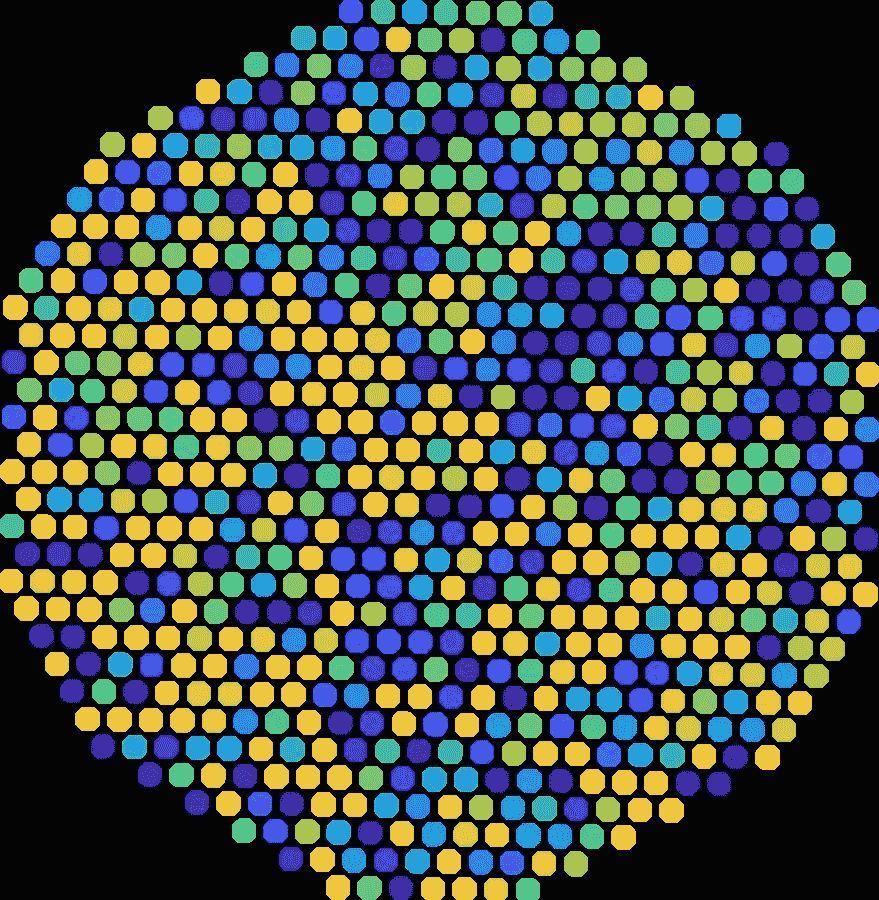

# 浓缩咖啡过滤器比较:佩萨多 vs VST

> 原文：<https://towardsdatascience.com/espresso-filter-comparison-pesado-vs-vst-18a1321e62d?source=collection_archive---------24----------------------->

## 每个人一个样本，进行测试

我真的很喜欢我的 [VST](https://store.vstapps.com/products/vst-precision-filter-baskets) 过滤篮，但我有机会尝试一个 [Pesado](https://pesado.com.au/collections/perfectionist/products/pesado-filter-basket-24-5-18g) 过滤篮。它们由 [IMS](https://www.imsfiltri.com) 制造，设计与普通 IMS 篮筐或 VST 篮筐略有不同。所以我做了一个月的对照实验，用相同的参数拍了两张照片，在 VST 和佩萨多之间交替。之前，我已经研究过 [IMS 超细和](/ims-superfine-vs-vst-a-small-sample-espresso-filter-comparison-4c9233e194)VST 过滤器，但是我没有看到在味道、提取率和拍摄时间方面的任何一般性能差异。

左:佩萨多，右:VST

我的预期是一个过滤器会比另一个好，但我不确定是哪一个。我还分析了过滤篮本身，看看它们是否会给出哪个篮子会胜出的提示。我想也许会有一个更精确的洞或者有一个更好的空间分布。

最终，我将提前分享，我没有看到性能上的统计差异，也没有看到[分析过滤孔](/espresso-filters-an-analysis-7672899ce4c0)本身时的任何指标。**大警告**是我只有一个 VST 过滤器和一个 Pesado 过滤器，它们很可能是这些公司过滤器的平均分布。

顶排:佩萨多，底排:VST

# 过滤分析

我使用[图像分析来查看过滤孔](/espresso-filters-an-analysis-7672899ce4c0)，看看我是否看到任何重大差异。这包括在一个黑暗的房间里拍摄一张特写图像，将滤镜放在一个明亮的屏幕上。然后，我测量了每个洞的大小，并制作了一张图片，对洞的大小进行颜色编码，以寻找图案。

## 从上往下看:

左:佩萨多，右 VST

## 从底部成像:

左:佩萨多，右 VST

在使用相机校准测量孔时，平均尺寸存在差异，但标准偏差(每个孔相对于平均值的变化量)非常小。作为参考，非精密滤波器的标准偏差通常要大 3 倍。

# 绩效指标

我使用了两个指标来评估过滤器之间的差异:[最终得分](https://link.medium.com/uzbzVt7Db7)和[咖啡萃取](https://link.medium.com/EhlakB9Db7)。

最终得分是 7 个指标(强烈、浓郁、糖浆、甜味、酸味、苦味和余味)记分卡的平均值。当然，这些分数是主观的，但它们符合我的口味，帮助我提高了我的拍摄水平。分数有一些变化。我的目标是保持每个指标的一致性，但有时粒度很难，会影响最终得分。

使用折射仪测量总溶解固体(TDS ),该数字用于确定提取到杯中的咖啡的百分比，并结合一杯咖啡的输出重量和咖啡的输入重量，称为提取率(EY)。

# 数据:成对拍摄

数据收集最简单的部分是我可以同时运行其他实验，只要每次两次拍摄之间的所有参数都相同。结果是在佩萨多和 VST 有 30 多对镜头。

首先，我比较了每一对照片，看看最终得分或 EY 是否有明显的趋势。有时 VST 做得更好，但有时佩萨多做得更好。对于这些图表，如果一个过滤器更好，值将更多地高于或低于沿 y=x 的黑线。

然后我通过咖啡烘焙分离出数据，因为也许过滤器在一些烘焙上比其他的表现得更好。但是，我没有看到数据中的趋势，如下图所示:

然后我整理了所有的数据，比较了使用佩萨多拍摄的最佳照片和使用 VST 拍摄的最佳照片。这不如成对样本好，但我想也许其中一个过滤器会做得更好。在这些排序对中，VST 的得分/EY 比佩萨多高，但那是在更少的样本上。此外，EY 的是低端，我不是完美的分布。在提取的较低端的大多数镜头是由于分布误差和环形图案。

查看相同数据的另一种方式是使用折线图，同样，在下端，它似乎表明 VST 略有优势。但我不会把钱押在这上面。

## 时间度量

由于我没有在《品味》或《EY》中看到任何可以区分它们的东西，我想我应该通过查看覆盖滤镜的[时间(TCF)](/pre-infusion-for-espresso-visual-cues-for-better-espresso-c23b2542152e) 和总时间来仔细检查拍摄时间。TCF 是我在其他情况下用来决定预浸何时结束以最大限度地提取和品尝的指标。我将这些时间指标与最终得分和 EY 进行了比较，因为如果一个过滤器更好，那么对于某个拍摄时间，它应该有更高的最终得分和 EY。

TCF 没有显示出这两种过滤器之间有多大的区别。

总拍摄时间也没有显示任何差异。从时间角度来看，考虑到 ey 和最终得分相似，这表明它们具有相似的流量。

就像之前与 IMS 超细过滤器的比较一样，我看不出 Pesado 和 VST 在性能上有什么不同。每个人都希望他们的过滤器是第一名，但我怀疑这将需要另一种类型的创新，以改善艺术的浓缩咖啡过滤篮。

这个测试的**大警告**是我每种只有一个样本。理想情况下，人们会希望收集控制所有其他变量的几个样本的数据。这当然需要更多的时间和金钱，但这将是一个有趣的实验，可以毫无疑问地证明谁制造的浓缩咖啡过滤器更好，或者一旦你达到一定的精度，过滤器就不那么重要了。

如果你愿意，请在 [Twitter](https://mobile.twitter.com/espressofun?source=post_page---------------------------) 和 [YouTube](https://m.youtube.com/channel/UClgcmAtBMTmVVGANjtntXTw?source=post_page---------------------------) 上关注我，我会在那里发布不同机器上的浓缩咖啡照片和浓缩咖啡相关的视频。你也可以在 [LinkedIn](https://www.linkedin.com/in/robert-mckeon-aloe-01581595?source=post_page---------------------------) 上找到我。

# 我的进一步阅读:

[浓缩咖啡的预浸:更好的浓缩咖啡的视觉提示](/pre-infusion-for-espresso-visual-cues-for-better-espresso-c23b2542152e)

[咖啡的形状](/the-shape-of-coffee-fa87d3a67752)

[搅拌还是旋转:更好的浓缩咖啡体验](https://towardsdatascience.com/p/8cf623ea27ef)

[香辣浓缩咖啡:热磨，冷捣以获得更好的咖啡](/spicy-espresso-grind-hot-tamp-cold-36bb547211ef)

[断续浓缩咖啡:提升浓缩咖啡](https://towardsdatascience.com/overthinking-life/staccato-espresso-leveling-up-espresso-70b68144f94)

[用纸质过滤器改进浓缩咖啡](/the-impact-of-paper-filters-on-espresso-cfaf6e047456)

[浓缩咖啡中咖啡溶解度的初步研究](/coffee-solubility-in-espresso-an-initial-study-88f78a432e2c)

[断奏捣固:不用筛子改进浓缩咖啡](/staccato-tamping-improving-espresso-without-a-sifter-b22de5db28f6)

[浓缩咖啡模拟:计算机模型的第一步](https://towardsdatascience.com/@rmckeon/espresso-simulation-first-steps-in-computer-models-56e06fc9a13c)

[压力脉动带来更好的浓缩咖啡](/pressure-pulsing-for-better-espresso-62f09362211d)

[咖啡数据表](https://towardsdatascience.com/@rmckeon/coffee-data-sheet-d95fd241e7f6)

[工匠咖啡价格过高](https://towardsdatascience.com/overthinking-life/artisan-coffee-is-overpriced-81410a429aaa)

[被盗浓缩咖啡机的故事](https://towardsdatascience.com/overthinking-life/the-tale-of-a-stolen-espresso-machine-6cc24d2d21a3)

[浓缩咖啡过滤器分析](/espresso-filters-an-analysis-7672899ce4c0)

[便携式浓缩咖啡:指南](https://towardsdatascience.com/overthinking-life/portable-espresso-a-guide-5fb32185621)

[克鲁夫筛:分析](https://towardsdatascience.com/overthinking-life/kruve-coffee-sifter-an-analysis-c6bd4f843124)