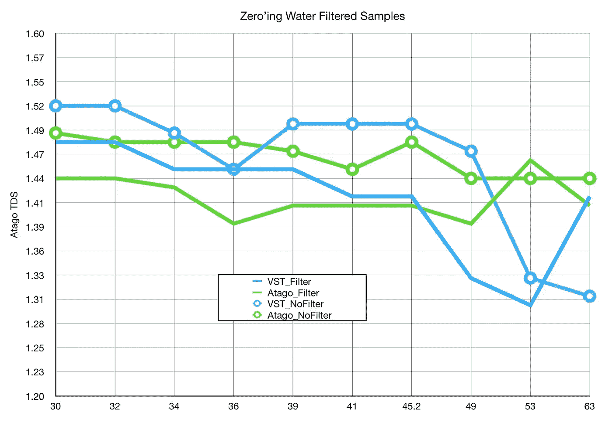

# 浓缩咖啡测量:溶解度

> 原文：<https://towardsdatascience.com/espresso-measurement-solubility-b1f53b91c2b9?source=collection_archive---------62----------------------->

## 用数据看到更大的图景，第 3 部分

咖啡溶解度被证明是使用定性方法区分镜头的最简单和最好的指标。幸运的是，一些团体，如[苏格拉底咖啡](http://socraticcoffee.com)和[复合咖啡](https://compoundcoffee.com)已经比较了折光率仪，考虑到它们的成本，这同样重要。这是从苏格拉底咖啡，复合咖啡收集的数据，和我讨论折射仪的数据。这是系列的第三部分，第一部分关注[预浸、压力和水温](/espresso-parameters-pre-infusion-pressure-and-water-temperature-f543a3c4044e)，第二部分关注[研磨、分配和捣实](/espresso-preparation-grinding-distribution-and-tamping-50f452f78aa8)。

为了测量溶解度，人们使用折射仪。这可以测量总溶解固体(TDS)，如果你有饮料的重量，它可以确定你杯子里有多少咖啡。一旦你知道你的杯子里有多少咖啡，你就可以通过除以输入的咖啡重量来计算提取率(EY)。EY 是你提取的咖啡的百分比。一般来说，30%的咖啡能够被提取出来，而好的浓缩咖啡的提取率大概在 18%到 22%之间。

标准的 [VST 数字折射仪](https://store.vstapps.com/products/vst-lab-cof-esp-iii-refractometer)价格约为 700 美元，即使是价格更低的也要 300 美元(Atago)。最终，我买了一个 20 美元的[白利糖度计](https://www.amazon.com/Refractometer-Scale-Specific-Hamh-Optics-Tools/dp/B076WZGMYT/ref=asc_df_B076WZGMYT/?tag=hyprod-20&linkCode=df0&hvadid=242010195246&hvpos=1o1&hvnetw=g&hvrand=10690488401580580868&hvpone=&hvptwo=&hvqmt=&hvdev=c&hvdvcmdl=&hvlocint=&hvlocphy=9032131&hvtargid=pla-420967809789&psc=1)，后来，我终于决定买一个更贵的(Atago)。我还收集数据来帮助理解 Atago 的工作情况，以及它与更便宜的工具白利糖度计的比较。

# 零水

任何折光仪都需要校准，通常使用蒸馏水。 [Socratic Coffee 调查了](http://socraticcoffee.com/2015/04/measuring-total-dissolved-solids-a-refractometer-comparison/)VST 和 Atago 仪表使用蒸馏水和冲泡水的不同之处。

他们发现了与咖啡温度有关的下降趋势，但当比较两米时，似乎没有太大的趋势。

# 过滤样本

如果我们观察样品是否使用[注射器过滤器](https://store.vstapps.com/collections/refractometer-accessories/products/syringe-filters-for-espresso-coffee)过滤，未过滤的样品最终具有更高的 TDS。苏格拉底咖啡做了一个很好的调查，在我自己的一个小样本上，我能够看到一个与粗注射器过滤器相似的趋势。

关于滤波的更多数据显示，每个样本中，滤波后的样本具有较低的 TDS。考虑到过滤器的作用，这是有意义的(它过滤掉影响折光仪的较大颗粒)。

当他们又一次[观察过滤和未过滤样本之间的差异时，对 ey 也有明显的影响。然而，我不相信一个过滤器是值得的成本或努力。](http://socraticcoffee.com/2015/07/measuring-total-dissolved-solids-a-refractometer-comparison-part-iii-espresso-filters/)

# VST 二/三对阿塔戈

苏格拉底咖啡比较了 [VST 折光仪和 Atago](http://socraticcoffee.com/2015/05/measuring-total-dissolved-solids-a-refractometer-comparison-part-ii/) ，结果很有趣。首先，VST 二世相对于 VST 三世偏移了一个常数。

[他们又看了两个](http://socraticcoffee.com/2015/04/measuring-total-dissolved-solids-a-refractometer-comparison/)，我们能做的一件事就是把所有的数据结合起来。这样做，有一个明显的趋势之间的阿塔戈和 VST 的意思是，他们在测量能力相当。这两个分布相当大，使用双尾 t 检验，它们的 p 值为 0.9842，这意味着它们是同一个分布。

# 比较 EY 和 TDS

Socratic Coffee 将他们的大部分数据显示为 TDS，而不是提取产量(EY)，值得注意的是，EY 的产量重量略有差异。因此，我根据每次拍摄的预期产量和他们对分发工具的影响所做的一项研究[的实际产量来计算 EY。](http://socraticcoffee.com/2016/12/examining-the-impact-of-the-ocd-on-total-dissolved-solids-extraction/)

最明显的区别是，使用 40g 输出的 EY 是对实际 EY 的低估。

我也对 VSTII/III 和 Atago 进行了分析。有一些细微的差别，足以让我停留在 EY 的领域，而不是 TDS。最终，我不认为它对潜在的结论有影响。

# 白利糖度与数字

[复合咖啡对比廉价的白利糖度计](https://compoundcoffee.com/experiments/28_Experiment-155-Coffee-Extraction-and-sugar)看糖分。他们可能不知道白利糖度和 TDS 之间存在直接的转换关系(通常 TDS = 0.85 *白利糖度或白利糖度= 1.176 * TDS)。他们的数据不仅表明了这一点，还表明使用白利糖度计相当于使用 TDS 计。对于他们的数据，方程略有不同(Brix = 1.1367 * TDS + 0.6102)，但仍然非常接近。

我做了[一项有趣的研究](/affordable-coffee-solubility-tools-tds-for-espresso-brix-vs-atago-f8367efb5aa4)拍摄了大量照片，我用 Atago 测量仪测量了 TDS，用廉价的折射计测量了白利糖度。我发现两者有相似的分布，具有统计学意义，因为我在 1:1，拍摄的后半部分收集，然后计算 3:1 比率标记的最终 TDS。

这些折光仪的数据非常令人兴奋，因为这有助于证明为家庭咖啡师购买廉价折光仪的合理性。目前，折光仪是量化和区分一杯浓缩咖啡的主要工具，通常只由专业咖啡师使用。

我希望考虑使用白利糖度计的人可以买一个便宜的白利糖度计，看看这个信息是否对他们的日常生活有帮助，然后再花几百美元。

如果你愿意，请在 [Twitter](https://mobile.twitter.com/espressofun?source=post_page---------------------------) 和 [YouTube](https://m.youtube.com/channel/UClgcmAtBMTmVVGANjtntXTw?source=post_page---------------------------) 上关注我，我会在那里发布不同机器上的浓缩咖啡照片和浓缩咖啡相关的视频。你也可以在 [LinkedIn](https://www.linkedin.com/in/robert-mckeon-aloe-01581595?source=post_page---------------------------) 上找到我。

# 我的进一步阅读:

[搅拌还是旋转:更好的浓缩咖啡体验](/to-stir-or-to-swirl-better-espresso-experience-8cf623ea27ef)

[香辣浓缩咖啡:热磨，冷捣以获得更好的咖啡](/spicy-espresso-grind-hot-tamp-cold-36bb547211ef)

[断续浓缩咖啡:提升浓缩咖啡](https://medium.com/overthinking-life/staccato-espresso-leveling-up-espresso-70b68144f94)

[用纸质过滤器改进浓缩咖啡](/the-impact-of-paper-filters-on-espresso-cfaf6e047456)

[浓缩咖啡中咖啡溶解度的初步研究](https://link.medium.com/bpcEYBTam7)

[断奏捣固:不用筛子改进浓缩咖啡](/staccato-tamping-improving-espresso-without-a-sifter-b22de5db28f6)

[浓缩咖啡模拟:计算机模型的第一步](https://medium.com/@rmckeon/espresso-simulation-first-steps-in-computer-models-56e06fc9a13c)

[更好的浓缩咖啡压力脉动](/pressure-pulsing-for-better-espresso-62f09362211d)

[咖啡数据表](/coffee-data-sheet-d95fd241e7f6)

[工匠咖啡价格过高](https://medium.com/overthinking-life/artisan-coffee-is-overpriced-81410a429aaa)

[被盗浓缩咖啡机的故事](https://medium.com/overthinking-life/the-tale-of-a-stolen-espresso-machine-6cc24d2d21a3)

[浓缩咖啡过滤器分析](/espresso-filters-an-analysis-7672899ce4c0)

[便携式浓缩咖啡:指南](https://medium.com/overthinking-life/portable-espresso-a-guide-5fb32185621)

[克鲁夫筛:一项分析](https://medium.com/overthinking-life/kruve-coffee-sifter-an-analysis-c6bd4f843124)