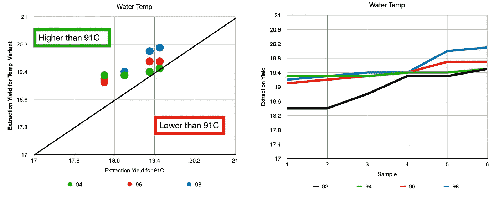

# 浓缩咖啡参数:预浸、压力和水温

> 原文：<https://towardsdatascience.com/espresso-parameters-pre-infusion-pressure-and-water-temperature-f543a3c4044e?source=collection_archive---------17----------------------->

## 用其他数据看到更大的画面，第 1 部分

在收集了一年多浓缩咖啡的数据后，我感觉自己像一座孤岛。很少有人像我一样在 espresso 上收集数据，espresso 社区几乎没有数据分析。如果它确实存在，它隐藏在付费墙后面，对外界没有太多的指示。总的来说，实验都是单一样本或者忽略了对某些参数的控制，这就是为什么我印象深刻地发现了[复合咖啡](https://compoundcoffee.com)、[苏格拉底咖啡](https://compoundcoffee.com)和[五感咖啡](https://www.fivesenses.com.au)。当然，学术研究是有的，但它通常不涵盖像压力和温度这样的基本问题，而这些问题在研究领域之外是可以获得的。

关键数据，以防你想跳过其他的。

复合咖啡有过各种各样的实验，但我从未听说过。我很惊讶他们没有更出名或被更多引用，但我怀疑这是因为他们收集的数据都放在表格中，人们很难看到清晰的图片(他们没有用图表显示他们的发现)。Fives Senses Coffee 只有一个我感兴趣的研究，Socratic Coffee 有表格和图表(他们的数据包含在第 2 和第 3 部分中)用于各种实验。

在这项工作中，我将检查与预浸、水温和压力相关的数据，因为它们会影响提取。假设是更高的提取与更好的味道相关，我的数据表明，假设相同的输出量。

我的理解是，大多数人认为最好的办法是在水温为 94 摄氏度、压力为 9 巴的情况下，几乎不预注入水。很好奇数据是怎么说的。

# 复合咖啡

我挖掘了他们的数据，并写了一些分析，以帮助向世界展示他们的结果。他们的实验得到了很好的控制和很好的记录，但是他们的分析有两个错误:

1.  没有图形表示。
2.  统计学意义的 p 值误用。

我可以用一些有趣的情节来解决第一个问题，但第二个问题可以让任何人陷入统计上的困境。

统计显著性可以表示为使用 t 检验拒绝零假设。零假设是数据的两个分布样本来自同一个总体分布。如果您有超过 30 个样本，您可以进行 t 检验，以确定分布是否在统计上[不同](/statistical-significance-hypothesis-testing-the-normal-curve-and-p-values-93274fa32687)，这意味着检验的 p 值小于 0.05。一个更强的测试是配对 t 测试，其中有成对的数据点。

Compound Coffee 将 t-test 应用于他们的数据，他们所有的测试都只有不到 30 个样本。通常，他们有 10 个样本，他们使用 p 值来确定一种技术是否优于另一种技术。这并不意味着一种技术不是，但他们不能用 p 值来看。我喜欢看数据，我的经验是，通过找到合适的情节，结论(如果有的话)对不熟悉的人来说应该是显而易见的。

在看他们的数据时，我看过未排序和排序的。我对数据进行分类是因为每个样本不应该与前一个相关，所以公平的比较是最好的与最好的比较，第二好的与第二好的比较，…以及最差的与最差的比较。

# 9 巴提取前的预注入

他们在 9 巴提取压力前查看了[预注入，发现预注入无助于提取产量(数据见附录 A)。然而，从他们的表格中很难看出这一点。我绘制原始数据，然后进行排序，在第一组数据中，我使用了与基线样本的直接比较。](https://compoundcoffee.com/experiments/13_Pre-infusion-and-its-impact-on-espresso)

这是所有排序后的样本。9 巴是明显的赢家，但有趣的是，30 秒的预输注具有更一致的结果(各次注射之间的差异更小)。似乎提取的可变性随着预灌输的增加而降低。

同样，这些结果不可能有统计学意义，因为它们是欠采样的，但它们仍然是有趣的。

# 注射压力

复合咖啡研究了在提取过程中改变机器压力的，他们发现 7 到 8 巴是最佳的(数据在附录 B 中)而不是 9 巴。然而，当他们没有足够的样本时，他们声称有统计学意义。

所有样本都已分类排列好。

数据排序后，我看到的情况是，7 巴的提取略好于 8 巴。从这个图表中可以清楚地看出，9 巴不是更高萃取的最佳压力。

所以我们只比较 8 小节和 7 小节:

图上的一个点看起来像异常值，但除此之外，7 根棒线看起来稍微好一点。尽管如此，我们不知道它是否有统计学意义，因为我们没有足够的样本值。

# 7 巴提取前的预注入

Compound Coffee 随后对[预浸进行了测试，使用 7 根萃取棒而不是 9 根萃取棒](https://compoundcoffee.com/experiments/14_Pre-infusion-on-a-low-brew-pressure)，考虑到基于之前的结果，7 根萃取棒似乎比 9 根萃取棒产生更高的萃取率。下面是排序值和控制样本之间的比较。

较高的预浸渍产生高得多的提取，即使对于较低的分布也是如此。对于较高的预输注时间，注射之间的可变性比在 9 巴提取时稍高，这给较高的预输注与较低的提取可变性相关的概念带来不确定性。

另一方面，这个结论看起来很清楚，但是同样，这些结果应该放在可行性的背景下，而不是统计证明的确定性。这些结果符合我对更长时间预输注的经验，但我还没有足够控制我的变量来表明更长时间的预输注总是更好。

# 水温

复合咖啡查看了冲泡时的[水温，他们想知道它是如何影响提取的(附录 D)。他们扫描了 91C 到 95C，数据显示 95C 比 91C 好。下面是与 91C 的比较，更高的温度似乎做得更好。](https://compoundcoffee.com/experiments/15_the-best-temperature-for-espresso)

以下是所有经过分类的样本，再次显示 95C 的提取率更高，但这一趋势并不总是成立。方差有点高，无法得出可靠的结论。较高的温度只是提供了更一致的提取，因为它的范围比其他温度小得多。一个可靠的结论是，91C 不能保证提供最高的提取率。

[五感咖啡](https://www.fivesenses.com.au/blog/brew-temperature-and-its-effects-on-espresso/)研究了水温，温度高一些，样本少一些。他们没有足够的数据来证明统计意义，但似乎高于 92 摄氏度的温度是更可取的。

我很想看到这些实验在不同的烘烤中进行更深入的研究，收集更多的样本。这些数据表明了以下结论，但需要更多的数据:

1.  对于提取来说，7 巴比 9 巴好。
2.  15 秒或更长时间的预浸，然后是 7 巴萃取，提供了更高的咖啡萃取率。
3.  水温在 95C 左右或更高更好。

浓缩咖啡领域已经爆炸了，但它仍然缺乏一种数据驱动的方法，这种方法在其他研究领域非常有用。我希望重新审视这些数据能帮助人们踏上自己的旅程，发现这些群体的亮点，并激励其他人使用数据来推动创新。

[第 2 部分](/espresso-preparation-grinding-distribution-and-tamping-50f452f78aa8)将涵盖研磨、分配和夯实。第 3 部分将介绍咖啡提取工具。

如果你愿意，可以在 [Twitter](https://mobile.twitter.com/espressofun?source=post_page---------------------------) 和 [YouTube](https://m.youtube.com/channel/UClgcmAtBMTmVVGANjtntXTw?source=post_page---------------------------) 上关注我，我会在那里发布不同机器上的浓缩咖啡照片和浓缩咖啡相关的视频。你也可以在 [LinkedIn](https://www.linkedin.com/in/robert-mckeon-aloe-01581595?source=post_page---------------------------) 上找到我。

# 我的进一步阅读:

[香辣浓缩咖啡:热磨，冷捣以获得更好的咖啡](/spicy-espresso-grind-hot-tamp-cold-36bb547211ef)

[断续浓缩咖啡:提升浓缩咖啡](https://medium.com/overthinking-life/staccato-espresso-leveling-up-espresso-70b68144f94)

[用纸质过滤器改进浓缩咖啡](/the-impact-of-paper-filters-on-espresso-cfaf6e047456)

[浓缩咖啡中咖啡的溶解度:初步研究](/coffee-solubility-in-espresso-an-initial-study-88f78a432e2c)

[断奏捣固:不用筛子改进浓缩咖啡](/staccato-tamping-improving-espresso-without-a-sifter-b22de5db28f6)

[浓缩咖啡模拟:计算机模型的第一步](https://medium.com/@rmckeon/espresso-simulation-first-steps-in-computer-models-56e06fc9a13c)

[压力脉动带来更好的浓缩咖啡](/pressure-pulsing-for-better-espresso-62f09362211d)

[咖啡数据表](https://towardsdatascience.com/@rmckeon/coffee-data-sheet-d95fd241e7f6)

[工匠咖啡价格过高](https://medium.com/overthinking-life/artisan-coffee-is-overpriced-81410a429aaa)

被盗浓缩咖啡机的故事

[浓缩咖啡过滤器分析](/espresso-filters-an-analysis-7672899ce4c0)

[便携式浓缩咖啡:指南](https://medium.com/overthinking-life/portable-espresso-a-guide-5fb32185621)

[克鲁夫筛:一项分析](https://medium.com/overthinking-life/kruve-coffee-sifter-an-analysis-c6bd4f843124)

# 附录 A

# 附录 B

# 附录 C

# 附录 D

