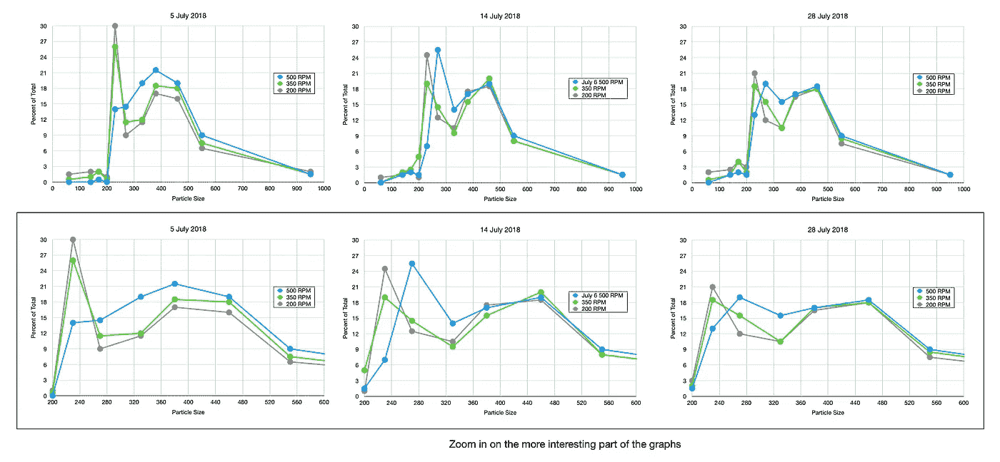

# 浓缩咖啡的制备:研磨、分配和捣实

> 原文：<https://towardsdatascience.com/espresso-preparation-grinding-distribution-and-tamping-50f452f78aa8?source=collection_archive---------31----------------------->

## 用其他数据看到更大的画面第 2 部分

之前，我们通过几个数据源查看了[预注入、压力和温度](https://link.medium.com/sm4RlhvNG6)，以了解什么提供了最佳提取。现在，让我们看看研磨、分配和捣固。

使用的主要指标是提取率(EY)或总溶解固体(TDS)。使用 TDS、输出重量和输入重量计算 EY。它们与口味关系不大，能够达到更高的 ey 或 TDS，因此目标是更高的 TDS 或 EY。

# 研磨机刀片锋利度

[Socratic Coffee 研究了毛刺锐度](http://socraticcoffee.com/2015/05/total-dissolved-solids-study-to-measure-the-tds-of-dull-burrs-vs-good-burrs/)与保水性的关系，分类后的数据在提取方面没有显示出太大的差异。我很好奇，如果使用多个研磨设置或豆会提供一个更清晰的图片。

他们继续研究提取率，分类成对比较的数据和线形图显示，刀片越锋利，提取率越高。更锋利的刀片最有可能影响研磨分布，但他们没有进一步深入这些实验。

# 研磨速度

[苏格拉底式咖啡还研究了研磨机的速度](https://www.instagram.com/p/BnoEAisDHo9/?utm_source=ig_web_copy_link)以及它如何影响咖啡渣的分布。然而，在最初的图表中，他们没有显示每次烘烤的所有速度，只有一个图表。我拆分了他们的数据，你可以看到中间部分受 500 RPM 的影响最大，所以我放大了那部分数据。很难在看不到味道或 TDS 效果的情况下显示分布，但拍摄一致性的关键是保持 RPM 一致。

# 圆盘准备中的顶部空间

[苏格拉底咖啡在顶空做了一个小研究](https://www.instagram.com/p/BkAh1dQjPdk/)用 20g 的篮子和 22g 的篮子。他们在最初的演示文稿中使用了方框图，但由于样本数量较少，我认为最好绘制出排序后的样本。箱形图非常适合汇总数据，但是当分布不是高斯分布时，很难理解箱形图。非高斯分布的最佳提示是中值偏离平均值。理想情况下，它们应该居中，如果不居中，不均匀的分布可能表明采样规模太小。

所以我用他们的箱线图估算了他们的原始数据，给出了最小值、最大值、中值、25%和 75%的界限。对于十个样本，该信息立即给出样本 1、3、7 和 10。其余的是点之间的插值，考虑到中值是样本 5 和 6 的平均值。

结果没有显示出明显的差异，苏格拉底咖啡或其他人也没有做过进一步的实验。

# 过滤篮

苏格拉底式咖啡看了几次过滤篮。首先，他们查看了[仿制药与 VST & IMS](https://www.instagram.com/p/6-nR63yuPV/) ，然后是[仿制药与 IMS](https://www.instagram.com/p/6kRoQDSuDF/) ，然后是[一个跨越四个篮子](https://www.instagram.com/p/BPy1N5kDsB2/)的更大样本:仿制药、佩萨多、铂尔曼和 VST。Pesado 属于 IMS 类别。所有这些数据最初都是箱线图格式的，我根据箱线图参数估计了原始样本。

最左边的奇数样本是由于 IMS 数据中的低 EY 异常值和一般数据中的高 EY 异常值。

总的来说，似乎使用任何精确的篮子都比通用的要好。但是如果我们把所有这些数据结合起来会怎么样呢？对比一下怎么样？对 VST 来说，结果显示它们导致更高的提取率。对于普尔曼过滤器，就不那么清楚了。对于佩萨多，似乎有所增加，但不清楚它是否比 VST 更好。

与 VST 相比，铂尔曼和佩萨多的表现稍差，但统计意义尚不明确。一个更大范围的烘烤对比肯定会很有趣，因为即使是一次烘烤也不能保证讲述整个故事。我想知道是否有些过滤器对某些研磨分布或烘焙水平更好，而对其他的则不是。我再次注意到数据的缺乏，能有这样的数据真是太好了。

# 咖啡分销

多年来，许多人试图使用不同的技术或工具来改善咖啡的分配。在复合咖啡和苏格拉底咖啡之间，有一些有趣的数据表明大多数经销商弊大于利。

## 强迫症工具

强迫症工具似乎是高质量咖啡师的必备工具，但数据显示并非如此。我甚至买了一个，但是我已经改用一个弯曲的回形针了。[苏格拉底咖啡研究了 OCD 工具与在三台研磨机上敲击 portafilter 的对比](http://socraticcoffee.com)。研磨机显然不那么重要，但拍摄时间似乎变化很大。

如果我们取所有的样本，我们实际上每个样本有 30 个样本，现在直接进行有意义结果的两两配对 t 检验，我们得到 p = 8.1384e-11，这意味着两者之间的差异在统计上有意义(p < 0.05 is statistically significant).

## OCD2 & BT Tool

They then went to look at two more: the BT and OCD2 distribution tools. Both of which don’t perform well against the control sample.

## Bonus Data: Grinder Comparison

Inside this data for OCD tools, they used three different grinders. So we could also do a grinder comparison. I looked at the data with and without sorting. Either way, the K30 looks like a better grinder in this experiment, but there was not an analysis on the grind distribution for this grind setting. It is not clear that each grinder was best dialed in; I would like to assume so, but I can’t be certain. This points to the difficulty of running espresso experiments and controlling all the variables.

## Tapping, NSEW, Stockfleth, and OCD

[Compound Coffee 比较了四种分布方法](https://compoundcoffee.com/experiments/9_King-of-Distribution-Techniques)，但他们将数据转储到一个没有图表的表格中。我在这里用两种方式想象它们。两者都表明答案不明确，但 Stockfleth 方法似乎更好一点。强迫症工具并不是一个明显的赢家，但它不像在苏格拉底咖啡实验中那样糟糕。

## 手指、1–8–0 浅、1–8–0 深和捻线分布技术

[复合咖啡做了第二批分销商](https://compoundcoffee.com/experiments/32_Experiment-159-King-of-Distribution-Round2)，但他们都没能做得比好的奥莱手指分销更好。

## 总体印象

分发工具似乎没什么帮助，但不清楚为什么。我只是怀疑，因为大多数只影响冰球的上半部分。我本以为 Twister 工具会做得更好，但事实并非如此。

# 篡改者！

## 夯实压力

[苏格拉底式咖啡研究了萃取时的夯实压力](http://socraticcoffee.com/2015/07/the-impact-of-tamping-pressure-on-espresso-extraction/)，结果与许多人声称的正确夯实压力背道而驰。这一数据只表明没有一个明确的趋势。唯一有意思的是，10 磅夯锤的提取时间比其他夯锤略低，但只要提取正常，这并不重要。否则，似乎需要稍大于夯锤重量的低夯压。

## 篡改类型

[苏格拉底咖啡看了很多捣棒](http://socraticcoffee.com/2015/08/comparing-the-impact-of-tamper-on-tds/)，LM、Easy、Pullman(Pullman 的简称)看起来都很相似。有人可能会说 Perg 和 Pull 捣棒更好，但没有足够的证据来证明这一点。

[复合咖啡也看了 LM，Pergtamp，和 Levy](https://compoundcoffee.com/experiments/10_the-most-important-article-about-tamping-you-) 。他们的结果似乎有一个更大的不同，那就是 T4 和征税。

因此， [Compound Coffee 进一步测试了两者之间的正面交锋](https://compoundcoffee.com/experiments/11_Pergtamp-vs-Levy-Tamp)，Pergtamp 显然是赢家。我甚至将两个数据集结合起来，进行了 t 检验。抽样只有 25 个样本，并且它具有 0.0178 的低 p 值，这表明对于这些样本，存在统计上显著的差异。

# 体积与手动

[咖啡师 Hustle 做了一个比较](https://www.baristahustle.com/blog/man-vs-volumetric/)，一个咖啡师(Jamie)根据体重停止一杯咖啡，另一个让机器在特定的音量停止一杯咖啡。这是一场机器对人类的测试，虽然一系列结果显示机器赢了，但仍然有太多的混合。这台机器肯定更加稳定，但这并不意味着一个熟练的咖啡师不能拍出令人惊叹的照片。

这些都是有趣的实验来绘制和分析。我真的很喜欢查看数据集，特别是考虑到这些数据集很小，而且不知道咖啡烘焙或咖啡豆如何影响结果。然而，我们可以从这些数据中得出一些有趣的想法:

1.  保持你的刀刃锋利。
2.  OCD 分发工具并没有真正的帮助。
3.  Stockfleth 方法非常有用。
4.  不需要用力夯实。
5.  并非所有的篡改者都是生来平等的；Pergtamp 或类似产品将优于其他篡改工具。
6.  如果您希望能够像自动机器一样拍摄出相似一致性的照片，请使用标尺。

我希望这些数据的收集能够帮助人们了解或者更好地激励人们收集数据。本系列的下一篇文章将讨论 TDS 测量工具。

如果你愿意，可以在 Twitter 和 YouTube 上关注我，我会在那里发布不同机器上的浓缩咖啡视频和浓缩咖啡相关的东西。你也可以在 [LinkedIn](https://www.linkedin.com/in/robert-mckeon-aloe-01581595?source=post_page---------------------------) 上找到我。

# 我的进一步阅读:

[香辣浓缩咖啡:热磨，冷捣以获得更好的咖啡](/spicy-espresso-grind-hot-tamp-cold-36bb547211ef)

[断续浓缩咖啡:提升浓缩咖啡](https://medium.com/overthinking-life/staccato-espresso-leveling-up-espresso-70b68144f94)

[用纸质过滤器改进浓缩咖啡](/the-impact-of-paper-filters-on-espresso-cfaf6e047456)

[浓缩咖啡中咖啡的溶解度:初步研究](/coffee-solubility-in-espresso-an-initial-study-88f78a432e2c)

[断奏捣固:不用筛子改进浓缩咖啡](/staccato-tamping-improving-espresso-without-a-sifter-b22de5db28f6)

[浓缩咖啡模拟:计算机模型的第一步](https://medium.com/@rmckeon/espresso-simulation-first-steps-in-computer-models-56e06fc9a13c)

[更好的浓缩咖啡压力脉动](/pressure-pulsing-for-better-espresso-62f09362211d)

[咖啡数据表](/coffee-data-sheet-d95fd241e7f6)

[工匠咖啡价格过高](https://medium.com/overthinking-life/artisan-coffee-is-overpriced-81410a429aaa)

[被盗咖啡机的故事](https://medium.com/overthinking-life/the-tale-of-a-stolen-espresso-machine-6cc24d2d21a3)

[浓缩咖啡过滤器分析](/espresso-filters-an-analysis-7672899ce4c0)

[便携式浓缩咖啡:指南](https://medium.com/overthinking-life/portable-espresso-a-guide-5fb32185621)

克鲁夫筛:一项分析