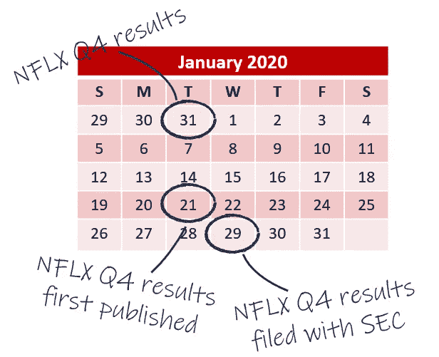
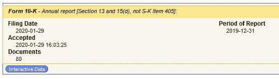
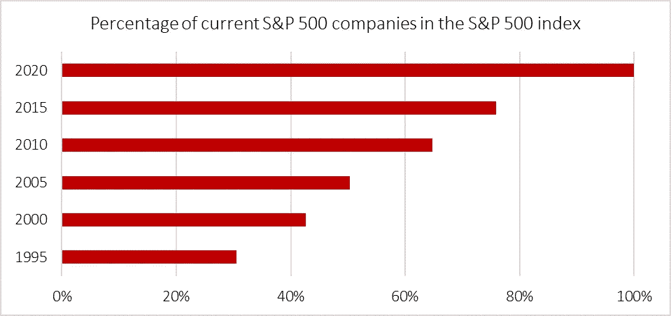

# 基于股票市场数据构建机器学习模型的基本准则

> 原文：<https://towardsdatascience.com/essential-guidelines-for-building-machine-learning-models-on-stock-market-data-717e92d5feed?source=collection_archive---------42----------------------->

## 在股票市场数据上建立机器学习模型时需要考虑的三件重要事情

图片:Pixabay.com

***注来自《走向数据科学》的编辑:*** *虽然我们允许独立作者根据我们的* [*规则和指导方针*](/questions-96667b06af5) *发表文章，但我们不认可每个作者的贡献。你不应该在没有寻求专业建议的情况下依赖一个作者的作品。详见我们的* [*读者术语*](/readers-terms-b5d780a700a4) *。*

为股票市场投资建立一个机器学习模型似乎是一个很好的主意。如果这个模式成功了，它会让你变得富有。如果没有，你至少会知道建立一个机器学习模型需要什么。股票市场如此欢迎机器学习的另一个原因是历史数据的可用性。

但是，仅仅因为数据是广泛可用的，并不意味着你可以不加考虑地使用它。事实上，在基于历史基本面股票数据建立机器学习模型时，有三个基本问题需要考虑。忽略它们会使你的模型对现实世界的应用毫无用处。下面，我将讨论在为机器学习处理股市数据时需要遵循的三个基本准则。

> 在对 2020 年 1 月 1 日的模型进行训练和回溯测试时，我可以使用网飞第四季度的基本面数据吗？不，你不应该——当然，除非你想作弊。

# 1.不要使用未来的数据进行回溯测试

想象一下，你正在建立一个机器学习模型，它将在每个季度初预测股票的季度表现。这种模型应该为投资者提供准确的指导，例如在 2020 年 1 月 1 日，一只股票在 2020 年 3 月 30 日之前是上涨、下跌还是横盘整理。当建立这样一个模型时，你需要确保你没有使用未来的数据。在我们的例子中，这意味着你的训练集不能包含 2020 年 1 月 1 日及以后的数据。

要使历史股票市场数据变得复杂一点，您还需要考虑数据何时可用。让我们回到我们的例子，看看网飞截至 2020 年 12 月 31 日的第四季度业绩。在对 2020 年 1 月 1 日的模型进行训练和回溯测试时，我可以使用网飞第四季度的基本面数据吗？不，你不应该——当然，除非你想作弊。原因是 2020 年 1 月 21 日公布了 Q4 业绩。这是测试和训练你的模型的截止日期之后的 20 天。因此，在你的模型中使用第四季度的结果意味着你要么有内部消息，要么有一个神奇的水晶球。下面是说明市场数据可用性问题的时间表。

网飞第四季度业绩的公布和归档

对此我能做些什么？如何确保我的模型中没有使用未来的数据？

有三种方法可以解决这个问题。第一个解决方案是使用所谓的即时市场数据。时间点数据会考虑数据何时公开。这确保了当您查看网飞在 2020 年 1 月 1 日的最新收入时，您将获得第三季度的数据，而不是第四季度的数据，因为那时还没有这些数据。大多数主要的付费市场数据提供商都允许您访问这些即时数据。例如，彭博允许您使用他们的 BQL API 检索时间点数据。

如果你无法获得即时市场数据，那么你可以使用滞后市场数据。美国证券交易委员会(SEC)规定，公司必须在前三个季度结束后 35 天内、最后一个季度结束后 60 天内提交收益报告。在我们的示例中，我们可以强制模型使用 2019 年 10 月 16 日发布的第三季度结果。

第三种选择是在 SEC 的 EDGAR 网站【https://www.sec.gov/edgar/searchedgar/companysearch.html[的帮助下创建自己的即时市场数据库。EDGAR 网站包括每份年度和季度报告的归档日期信息。多亏了几个很棒的免费 Python 包，可以相对容易地搜集这些信息。](https://www.sec.gov/edgar/searchedgar/companysearch.html)

SEC EDGAR 网站上的网飞 10-K 年度报告提交日期信息

然而，使用滞后的市场数据或通过抓取 SEC 的 EDGAR 网站建立自己的时间点数据库，都无法击败专门的时间点数据提供商的准确性。它不考虑重述，滞后数据可能“过于滞后”。即使您精心构建时间点数据库也会包含不准确性。例如，网飞在 2020 年 1 月 21 日发布了第四季度的业绩，但在 8 天后的 2020 年 1 月 29 日提交了报告。但是，如果你没有时间点市场数据提供商，使用滞后数据或建立自己的时间点数据库是下一个最好的选择。

> 使用静态股票列表进行回溯测试意味着你忽略了所有破产或因其他原因退市的公司。

# 2.当心不断变化的股票市场，避免生存偏差

每当你为股市投资建立机器学习模型时，你都必须决定要考虑哪些股票。这可以是一个指数，如标准普尔 500 或美国所有公开交易的股票。无论你选择什么样的股票，你都需要意识到它的构成在不断变化。让我们把标准普尔 500 指数作为我们的股票宇宙，我们将使用它作为我们的机器学习模型。标准普尔 500 指数目前包括 505 家公司。2015 年，目前构成标准普尔 500 指数的公司中只有 75%是该指数的一部分。剩下的 25%是因为业绩不佳而被摘牌或者干脆从标准普尔 500 指数中剔除的公司。2010 年，这个数字是 65%，而在 2000 年，只有 45%的标准普尔 500 成份股构成了该指数。

标准普尔 500 指数构成变化

忽视不断变化的股票市场会把你的模型引入所谓的生存偏差。使用静态股票列表进行回溯测试意味着你忽略了所有破产或因其他原因退市的公司。此外，在他们真正成为“赢家”之前，你就在考虑“赢家”。再来看 AMD。2016 年 AMD 股价从 2.10 到 11.30。然后在 2017 年 3 月，AMD 取代 Urban Outfitters 加入了标准普尔 500 指数。因此，在 2016 年你的标准普尔 500 宇宙中有 AMD 会被认为是作弊。

解决这个问题的方法很简单。不要在你的股票市场中使用静态的股票列表。确保你对每个时期进行调整，以反映任何给定时间点的真实成分。

# 3.使用调整后的价格

在为机器学习处理股市数据时，要考虑的最后一件重要事情很简单。使用调整后的股票价格。对于有经验的甚至是新手的股票交易者来说，这似乎是显而易见的。但对于没有股市经验的数据科学家来说，调整后的价格可能是一个新概念。这里有一个简短的解释为什么我们使用调整后的股票价格。

例如，公司可能会决定进行二对一的股票分割。这意味着，如果你拥有 100 股，在股票分割后，你将拥有 200 股。这样的股票分割会如何影响股价？自然，价格会减半，因为公司的价值没有变化。调整后的股票价格考虑了影响价格但不影响基础价值的股票分割和其他类似事件，并对其进行调整以反映更准确的股票价值。

幸运的是，大多数主要的股市数据提供商默认使用调整后的价格，因此使用非调整后价格的可能性很低。只要仔细检查你是否真的在使用调整后的价格，你不应该在事后担心它。

这是你在股市数据上建立机器学习模型时应该考虑的三个基本准则。遵循它们能确保成功的机器学习模型吗？肯定不是！建立一个模型有无数种可能性。知道哪个可行哪个不可行，几乎是不可能的。但是，遵循这些准则将确保您的模型建立在坚实的基础上。