# ROC 曲线下面积和积分

> 原文：<https://towardsdatascience.com/essential-math-for-data-science-area-under-the-roc-curve-and-integrals-8a0f718dc9df?source=collection_archive---------17----------------------->

## [数据科学的基本数学](https://towardsdatascience.com/tagged/essential-math)

## 使用 ROC 曲线下的面积了解积分和模型性能比较


*(* 图片作者 *)*

# 积分和曲线下的面积

微积分是数学的一个分支，它通过两个主要领域提供研究函数变化率的工具:导数和积分。在机器学习和数据科学的背景下，您可能会使用积分来计算曲线下的面积(例如，评估具有 ROC 曲线的模型的性能，或者根据密度来计算概率。

在本文中，您将学习积分和曲线下面积，使用 ROC 曲线下面积的实际数据科学示例来比较两种机器学习模型的性能。从这个例子开始，你会从数学的角度看到曲线下面积和积分的概念(来自我的书《数据科学基础数学》)。

# 实际项目

比方说，你想从葡萄酒的各种化学特性来预测葡萄酒的质量。你想做一个质量的二元分类(区分非常好的葡萄酒和不太好的葡萄酒)。您将开发一些方法，允许您在考虑受试者操作特征(ROC)曲线下面积不平衡数据的情况下评估您的模型。

## 资料组

为此，我们将使用一个数据集来显示红葡萄酒的各种化学特性及其质量评级。数据集来自这里:[https://archive.ics.uci.edu/ml/datasets/wine+quality](https://archive.ics.uci.edu/ml/datasets/wine+quality)。相关论文是 Cortez，Paulo 等人的“通过物理化学性质的数据挖掘对葡萄酒偏好建模”决策支持系统 47.4(2009):547–553。

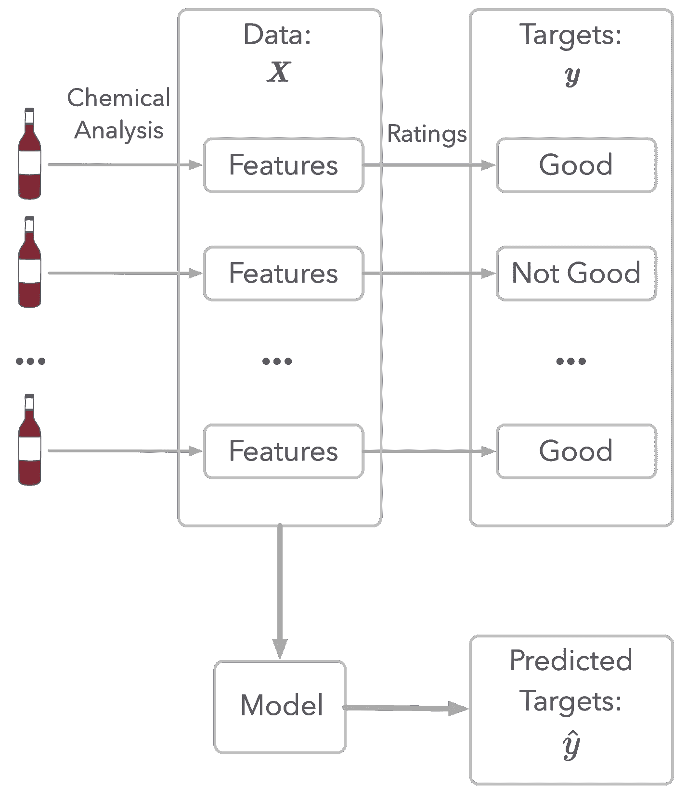

*图 1:葡萄酒质量建模示意图。(*图片作者 *)*

如图 1 所示，数据集代表了葡萄酒的化学分析(特性)和质量评级。这个评级是目标:这是你要尝试评估的。

首先，让我们加载数据，看看特性:

```
Index([‘fixed acidity’, ‘volatile acidity’, ‘citric acid’, ‘residual sugar’,
 ‘chlorides’, ‘free sulfur dioxide’, ‘total sulfur dioxide’, ‘density’,
 ‘pH’, ‘sulphates’, ‘alcohol’, ‘quality’],
 dtype=’object’)
```

最后一列`quality`很重要，因为您将使用它作为您分类的目标。质量由从 3 到 8 的等级来描述:

```
array([5, 6, 7, 4, 8, 3])
```

既然目标是对*非常好*质量的红酒进行分类，那么让我们决定当评级为 7 或 8 时红酒是非常好的，否则就不是非常好。

让我们创建一个数据集，其中`y`是质量(因变量，0 表示评分小于 7，1 表示评分大于或等于 7)，而`X`包含所有其他特征。

在查看数据之前，要做的第一件事是将数据分成一部分用于训练算法(训练集)和一部分用于测试算法(测试集)。这将使您能够评估模型在培训期间不可见的数据上的性能。

## 预处理

作为第一步，让我们标准化数据，以帮助算法的收敛。你可以使用 Sklearn 的类`StandardScaler`。

请注意，您不希望考虑来自测试集的数据来进行标准化。方法`fit_transform()`计算标准化所需的参数并同时应用。然后，您可以对测试集应用相同的标准化，而无需再次拟合。

## 第一个模型

作为第一个模型，让我们在训练集上训练逻辑回归，并在测试集上计算分类准确度(正确分类的百分比):

```
0.8729166666666667
```

准确度约为 0.87，这意味着 87%的测试示例已被正确分类。你应该对这个结果感到高兴吗？

# 不平衡数据集的度量

## 不平衡数据集

由于我们将数据分为非常好的葡萄酒和不太好的葡萄酒，因此数据集是*不平衡的*:每个目标类别对应的数据量不同。

让我们看看你在消极类(不是很好的葡萄酒)和积极类(很好的葡萄酒)中有多少观察结果:

```
0.8650580875781948
```

```
0.13494191242180517
```

它表明大约有 86.5%的例子对应于 0 类，13.5%对应于 1 类。

## 简单模型

为了说明关于准确性和不平衡数据集的这一点，让我们创建一个模型作为基线，并查看其性能。这将有助于您了解使用准确性之外的其他指标的优势。

利用数据集不平衡这一事实的非常简单的模型将总是估计具有最大数量观察值的类。在你的例子中，这样一个模型将总是估计所有的葡萄酒都是坏的，并得到相当的准确性。

让我们通过创建低于 0.5 的随机概率来模拟这个模型(例如，0.15 的概率意味着该类有 15%的可能性是正的)。我们需要这些概率来计算准确性和其他指标。

```
array([2.08511002e-01, 3.60162247e-01, 5.71874087e-05, …,
 4.45509477e-01, 1.36436118e-02, 2.61025624e-01])
```

假设如果概率高于 0.5，则该类被估计为正:

```
array([0, 0, 0, …, 0, 0, 0])
```

变量`y_pred_random`只包含零。让我们评估一下这个随机模型的准确性:

```
0.8625
```

这说明，即使是随机模型，精度一点都不差:不代表模型好。

总的来说，每一类都有不同数量的观察值，你不能依靠精确度来评估你的模型的性能。在我们的例子中，模型可以只输出零，你会得到大约 86%的准确性。

您需要其他指标来评估具有不平衡数据集的模型的性能。

## ROC 曲线

精度的一个很好的替代方法是接收机工作特性(ROC)曲线。你可以在 Géron，Aurélien 查看 Aurélien Géron 关于 ROC 曲线的非常好的解释。使用 Scikit-Learn、Keras 和 TensorFlow 进行机器学习:构建智能系统的概念、工具和技术。奥莱利媒体，2019。

主要思想是将模型中的估计分为四类:

*   真阳性(TP):预测值为 1，真实类别为 1。
*   误报(FP):预测是 1，但真实类别是 0。
*   真负值(TN):预测值为 0，真实类别为 0。
*   假阴性(FN):预测值为 0，但真实类别为 1。

让我们为您的第一个逻辑回归模型计算这些值。可以使用 Sklearn 的函数`confusion_matrix`。它提供了一个组织如下的表格:

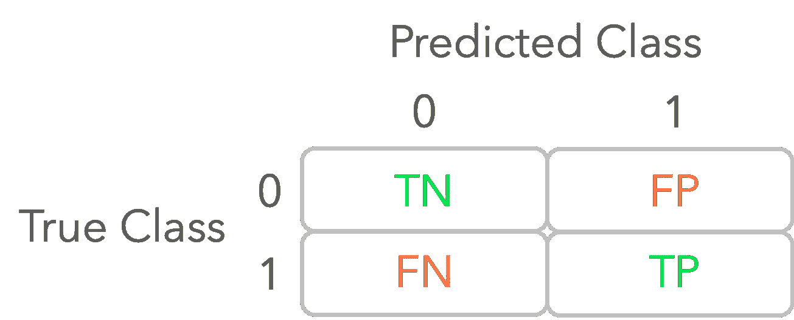

*图 2:混淆矩阵的图示。(*图片作者 *)*

```
array([[414, 0],
 [ 66, 0]])
```

你可以看到，没有一个积极的观察已被正确分类(TP)与随机模型。

***决定阈值***

在分类任务中，您希望估计数据样本的类别。对于像逻辑回归这样输出 0 到 1 之间概率的模型，您需要使用*决策阈值*或仅使用*阈值*将该分数转换为 0 或 1 类。高于阈值的概率被认为是正类。例如，使用决策阈值的默认选择 0.5，当模型输出高于 0.5 的分数时，您认为估计的类是 1。

但是，您可以选择其他阈值，用于评估模型性能的指标将取决于此阈值。

使用 ROC 曲线，您可以考虑 0 到 1 之间的多个阈值，并根据每个阈值的假阳性率来计算真阳性率。

可以使用 Sklearn 的函数`roc_curve`来计算假阳性率(fpr)和真阳性率(tpr)。该函数还输出相应的阈值。让我们用我们模拟的随机模型来试试吧，在这个模型中，输出只有低于 0.5 的值(`y_pred_random_proba`)。

让我们来看看输出结果:

```
array([0\. , 0\. , 0.07246377, …, 0.96859903, 0.96859903,
 1\. ])
```

```
array([0\. , 0.01515152, 0.01515152, …, 0.98484848, 1\. ,
 1\. ])
```

```
array([1.49866143e+00, 4.98661425e-01, 4.69443239e-01, …,
 9.68347894e-03, 9.32364469e-03, 5.71874087e-05])
```

现在，您可以根据这些值绘制 ROC 曲线:

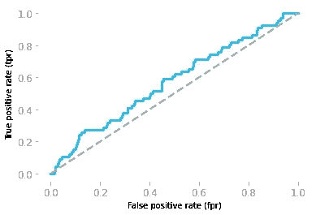

*图 3:随机模型对应的 ROC 曲线。(*图片作者 *)*

图 3 显示了对应于随机模型的 ROC 曲线。它给出了真阳性率，作为每个阈值的假阳性率的函数。

但是，要小心，阈值是从 1 到 0。例如，左下方的点对应于阈值 1:有 0 个真阳性和 0 个假阳性，因为不可能有大于 1 的概率，所以阈值为 1 时，没有观察结果可以归类为阳性。在右上方，阈值是 0，因此所有的观察都被分类为阳性，导致 100%的真阳性和 100%的假阳性。

对角线周围的 ROC 曲线意味着模型不比随机模型好，这里就是这种情况。对于所有假阳性率值，完美的模型将与真阳性率为 1 的 ROC 曲线相关联。

现在让我们来看看与您之前训练的逻辑回归模型相对应的 ROC 曲线。你将需要来自模型的概率，你可以使用`predict_proba()`而不是`predict`得到:

```
array([[0.50649705, 0.49350295],
 [0.94461852, 0.05538148],
 [0.97427601, 0.02572399],
 …,
 [0.82742897, 0.17257103],
 [0.48688505, 0.51311495],
 [0.8809794 , 0.1190206 ]])
```

第一列是类 0 的分数，第二列是分数 1(因此，每行的总和是 1)，所以您可以只保留第二列。

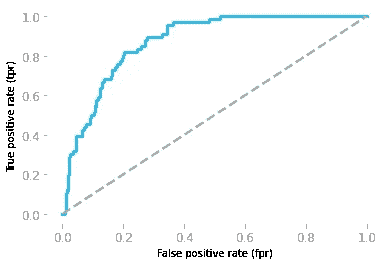

*图 logistic 模型对应的 ROC 曲线。(*图片作者 *)*

您可以在图 4 中看到，您的模型实际上比随机模型更好，这是您无法从模型精度中得知的(它们是等价的:随机模型大约为 0.86，而您的模型为 0.87)。

目视检查是好的，但是用一个单一的数字指标来比较你的模型也是至关重要的。这通常由 ROC 曲线下的面积提供。在接下来的章节中，你会看到曲线下的面积是多少，以及如何计算。

# 积分

*积分*是微分的逆运算。取一个函数 f(x)并计算它的导数 f'(x)，f'(x)的*不定积分*(也称为*反导数*)返回 f(x)(直到一个常数，你很快就会看到)。

您可以使用积分来计算曲线下的*面积，这是由函数界定的形状的面积，如图 5 所示。*

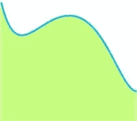

*图 5:曲线下的区域。(*图片作者 *)*

*定积分*是特定区间上的积分。它对应于这个区间内曲线下的面积。

# 例子

通过这个例子你会看到如何理解函数的积分和曲线下面积的关系。为了说明这个过程，您将使用曲线下面积的离散化来近似函数 g(x) = 2x 的积分。

## 示例描述

让我们再以行驶中的火车为例。你看到速度是时间的函数，距离是时间的导数。这些功能如图 6 所示。

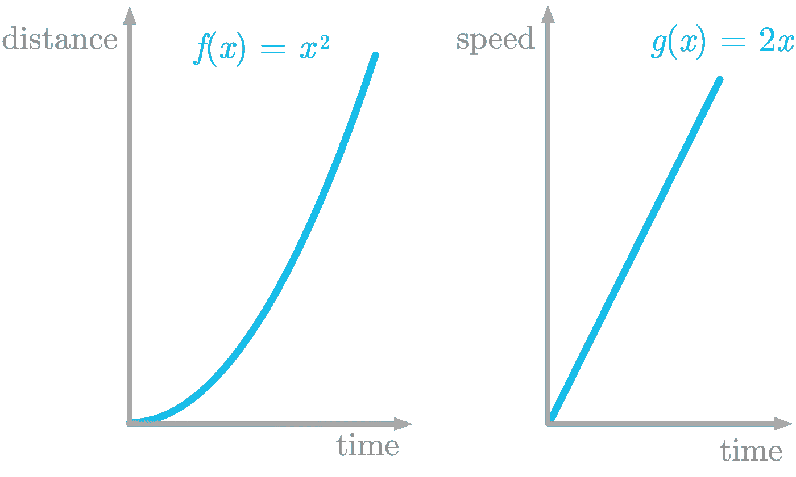

*图 6:左图显示 f(x ),它是距离与时间的函数，右图显示它的导数 g(x ),它是速度与时间的函数。(*图片作者 *)*

图 6 左图所示的函数定义为 f(x) = x。其导数定义为 g(x)=2x。

在这个例子中，你将学习如何找到 g(x)曲线下面积的近似值。

## 分割函数

要估算一个形状的面积，可以使用切片法:用简单的形状(如矩形)将形状切割成小切片，计算每个切片的面积，然后求和。

你要做的就是找到 g(x)曲线下面积的近似值。

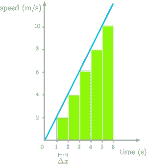

*图 7:通过将速度曲线下的面积离散化为时间的函数，得到曲线下面积的近似值。(*图片作者 *)*

图 7 显示了 f'(x)的曲线下的区域，该区域被切成一秒钟的矩形(我们称之为差值δx)。请注意，我们低估了面积(查看丢失的三角形)，但我们稍后会解决这个问题。

让我们试着理解切片的含义。拿第一个来说:它的面积被定义为 2 ⋅ 1。切片的高度是一秒钟的速度(值为 2)。所以第一个切片有两个单位的速度乘以一个单位的时间。面积相当于速度和时间的乘积:这是一个距离。

例如，如果你以每小时 50 英里的速度行驶了两个小时，你行驶了 50 ⋅ 2 = 100 英里的距离。这是因为速度的单位对应于距离和时间的比率(比如英里*每小时*)。你得到:(距离/时间)⋅时间=距离。

总结一下，距离对时间函数的导数就是速度对时间的函数，速度对时间函数的曲线下面积(它的积分)给你一个距离。这就是导数和积分的关系。

## 履行

让我们用切片来近似函数 g(x)=2x 的积分。首先，让我们定义函数 g(x):

如图 7 所示，您将认为该函数是离散的，并以δx = 1 为步长。您可以创建一个值从 0 到 6 的 x 轴，并对每个值应用函数`g_2x()`。您可以使用 Numpy 方法`arange(start, stop, step)`创建一个数组，用从`start`到`stop`的值填充(不包括):

```
array([0, 1, 2, 3, 4, 5, 6])
```

```
array([ 0, 2, 4, 6, 8, 10, 12])
```

然后，您可以通过迭代并将宽度(δx)乘以高度(此时的 y 值)来计算切片的面积。切片的。正如您所看到的，这个区域(下面代码中的`delta_x * y[i-1]`)对应于一个距离(移动的火车在第 I 个片段中行驶的距离)。最后，您可以将结果追加到一个数组中(下面代码中的`slice_area_all`)。

注意`y`的索引是`i-1`，因为矩形在我们估计的 x 值的左边。例如，对于 x=0 和 x=1，面积为零。

```
array([ 0., 0., 2., 4., 6., 8., 10.])
```

这些值是切片的面积。

要计算从起点到相应时间点(不对应每个切片)的距离，可以用 Numpy 函数`cumsum()`计算`slice_area_all`的累计和:

```
array([ 0., 0., 2., 6., 12., 20., 30.])
```

这是 g(x)的曲线下面积作为 x 的函数的估计值，我们知道函数 g(x)是 f(x)=x 的导数，所以我们要通过对 g(x)的积分把 f(x)取回来。

让我们画出我们的估计和 f(x)，我们称之为“真实函数”，来比较它们:


*图 8:估算函数和原始函数的比较。(*图片作者 *)*

图 8 中表示的估计表明该估计并不差，但是可以改进。这是因为我们错过了图 9 中用红色表示的所有三角形。

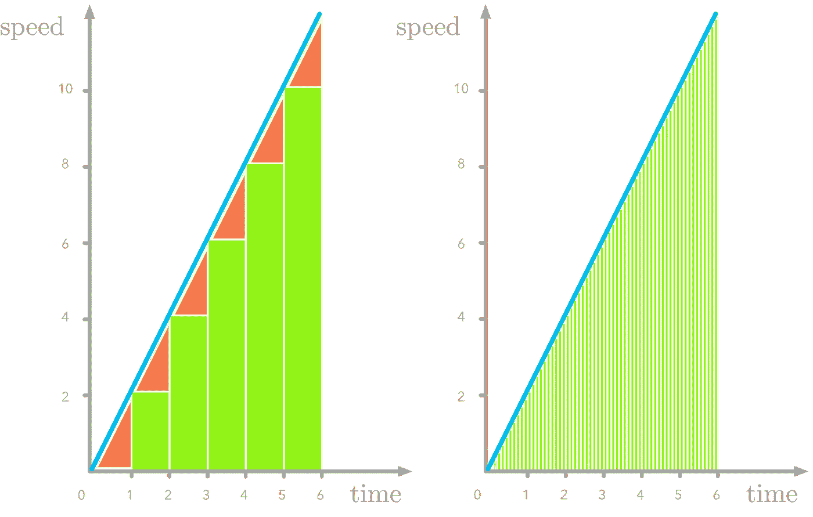

图 9:速度函数切片中的缺失部分(红色)。δx 越小误差越小 *(* 图片作者 *)*

让我们估计δx = 0.1 的积分函数:

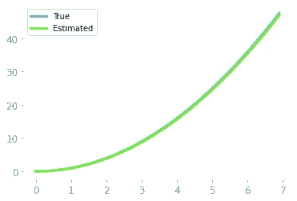

*图 10:切片宽度越小，对原始函数的估计越好。(*图片作者 *)*

如图 10 所示，我们恢复了(至少，直到一个附加常数)我们对其导数进行积分的原始函数。

## 延长

在我们之前的例子中，您对函数 2x 进行了积分，这是一个线性函数，但是对于任何连续函数，原理都是相同的(例如，参见图 11)。

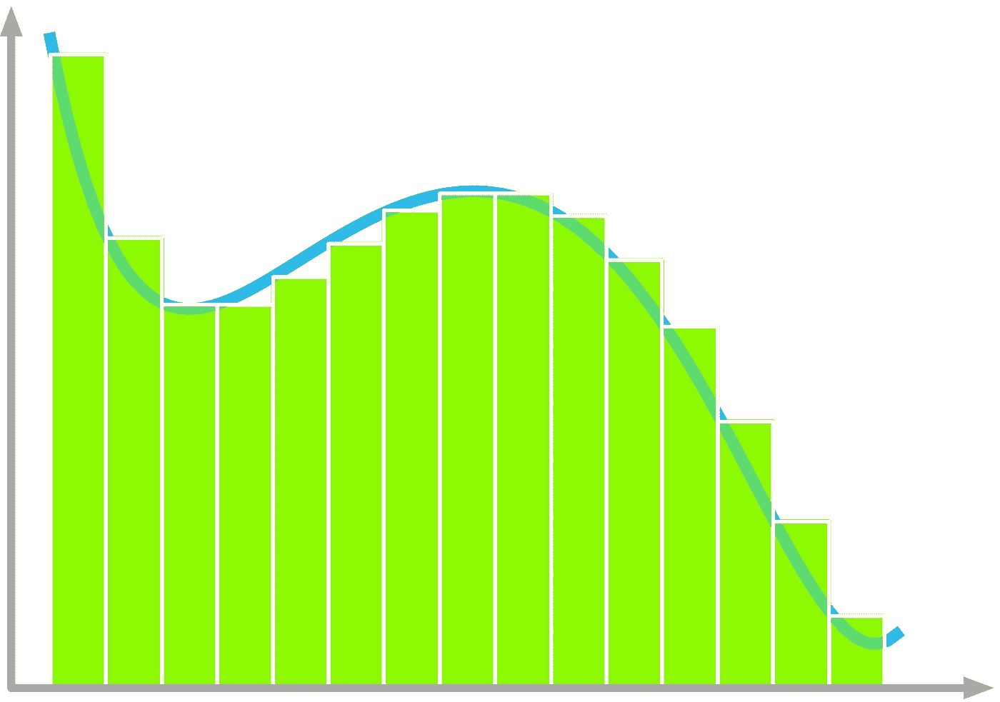

*图 11:切片方法可用于许多线性或非线性函数，包括所有连续函数。(*图片作者 *)*

# 黎曼和

使用这种切片方法近似积分被称为*黎曼和*。黎曼和可以用不同的方法计算，如图 12 所示。

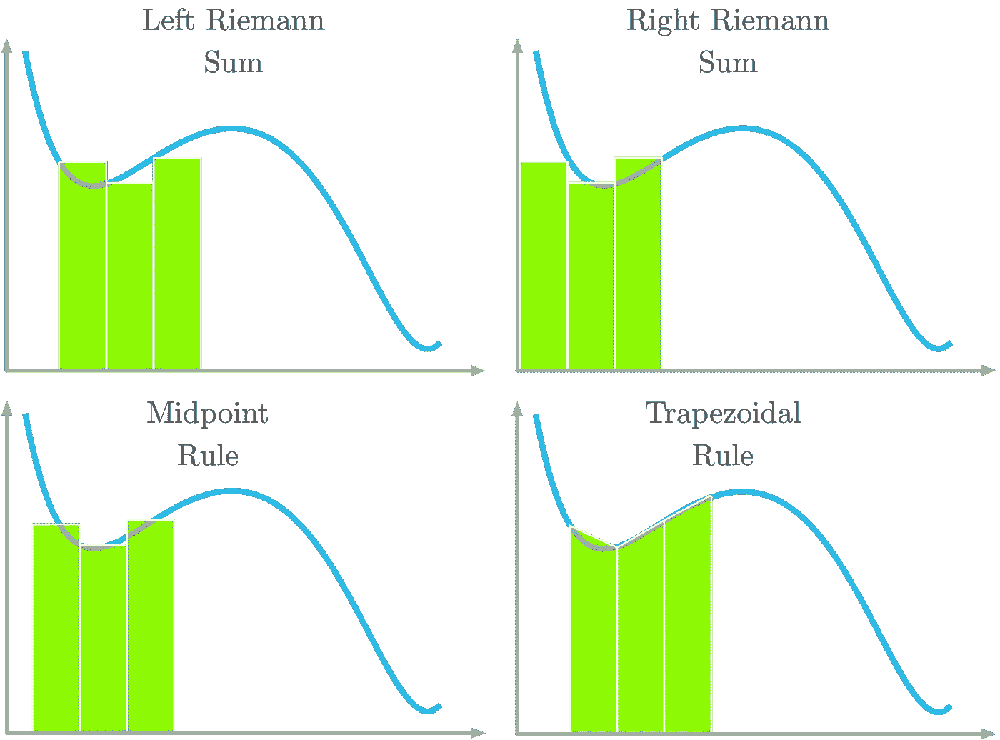

*图 12:积分逼近的四种黎曼和。(*图片作者 *)*

如图 12 所示，使用左黎曼和，曲线与矩形的左角对齐。使用右黎曼和，曲线与矩形的右角对齐。使用中点规则，曲线与矩形的中心对齐。对于梯形法则，使用梯形形状而不是矩形。曲线穿过梯形的两个顶角。

# 数学定义

在上一节中，您看到了曲线下面积和积分之间的关系(您从导数中恢复了原始函数)。现在让我们看看积分的数学定义。

函数 f(x)关于 x 的积分表示如下:

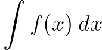

符号 dx 被称为 x 的*微分*，指的是 x 的无穷小变化的想法，它是 x 中接近 0 的差。积分的主要思想是对无限个宽度无限小的切片求和。

符号∫是整数符号，表示无限个切片的总和。

每个切片的高度是值 f(x)。f(x)的乘法

因此 dx 是每个切片的面积。最后，∫ f(x) dx 是无限个切片的切片面积之和(切片的宽度趋于零)。这是曲线下的*区域。*

你在上一节看到了如何近似函数积分。但是如果你知道一个函数的导数，你就可以在知道它是逆运算的情况下检索积分。例如，如果您知道:

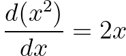

可以得出 2x 的积分是 x，但是，有一个问题。如果你给我们的函数加一个常数，导数是一样的，因为常数的导数是零。举个例子，

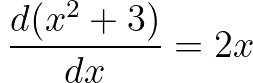

不可能知道常数的值。因此，您需要在表达式中添加一个未知常数，如下所示:

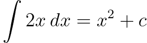

其中 c 是常数。

***定积分***

在*定积分*的情况下，用整数符号上下的数字表示积分区间，如下所示:

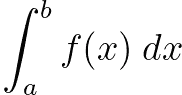

它对应于 x=a 和 x=b 之间函数 f(x)曲线下的面积，如图 13 所示。

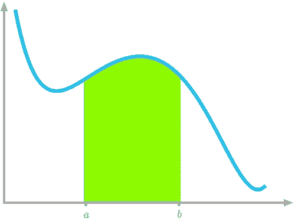

图 13:x = a 和 x=b 之间曲线下的面积 *(* 图片作者 *)*

# ROC 曲线下面积

现在你知道了曲线下的面积与积分的关系，让我们来看看如何计算它来比较你的模型。

请记住，您的 ROC 曲线如图 14 所示:

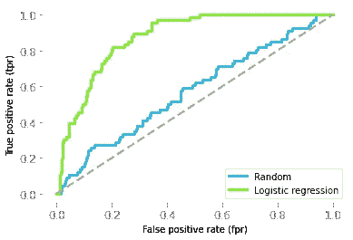

*图 14:随机模型(蓝色)和逻辑回归模型(绿色)的 ROC 曲线。(*图片作者 *)*

先说随机模型。您希望将每个真阳性率值乘以 x 轴上的宽度(即相应的假阳性率值与前一个值之差)进行求和。您可以通过以下方式获得这些差异:

```
array([0.00241546, 0.01207729, 0\. , …, 0.01207729, 0\. ,
 0.06038647])
```

所以随机模型的 ROC 曲线下的面积是:

```
0.5743302591128678
```

或者您可以简单地使用 Sklearn 的函数`roc_auc_score()`,将真实目标值和概率作为输入:

```
0.5743302591128678
```

ROC 曲线下 0.5 的面积对应于不比随机更好的模型，面积 1 对应于完美的预测。

现在，让我们将该值与您的模型的 ROC 曲线下的面积进行比较:

```
0.8752378861074513
```

这表明你的模型实际上并不差，你对葡萄酒质量的预测也不是随机的。

在机器学习中，你可以用几行代码来训练复杂的算法。然而，正如你在这里看到的，一点数学知识可以帮助你充分利用它，加快你的工作。它会让你在学科的各个方面更加轻松，甚至，例如，理解像 Sklearn 这样的机器学习库的文档。

*原载于 2020 年 11 月 6 日*[*https://hadrienj . github . io*](https://hadrienj.github.io/posts/ch02_integrals_medium/)*。*

**这篇文章是我的书*数据科学基础数学*的样本！**

[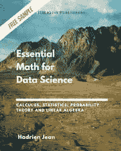](https://bit.ly/34ZXUsy)

[在此获取图书！](https://bit.ly/34ZXUsy)