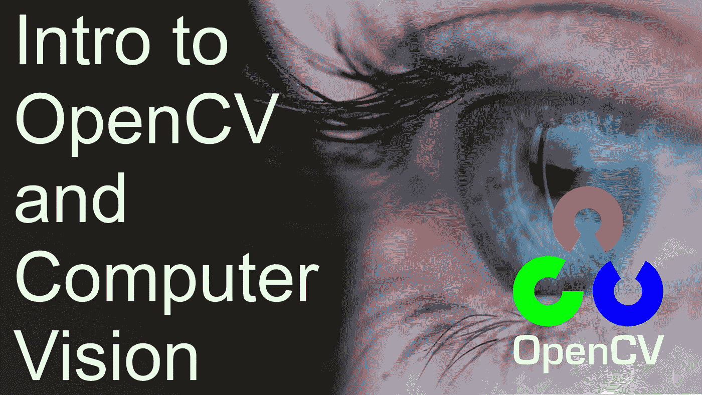
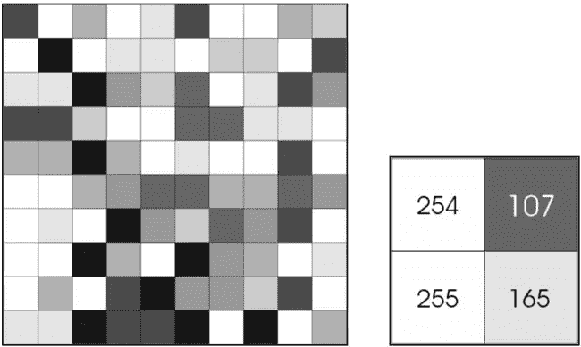
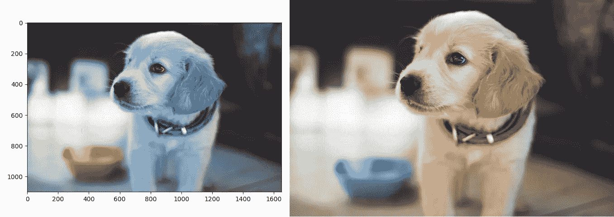
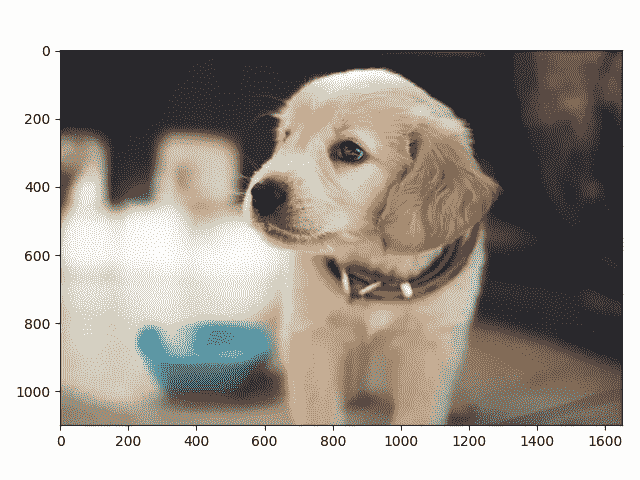
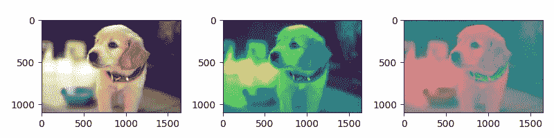
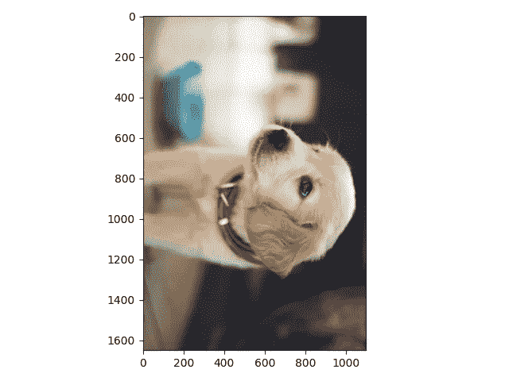
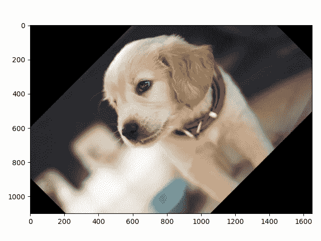
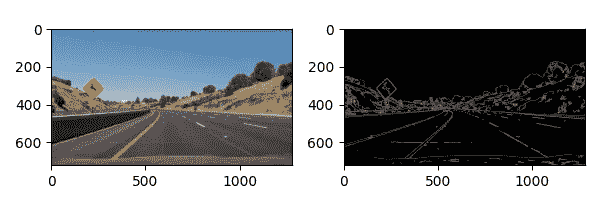

# 帮助您开始学习计算机视觉的基本 OpenCV 函数

> 原文：<https://towardsdatascience.com/essential-opencv-functions-to-get-you-started-into-computer-vision-743df932e60?source=collection_archive---------59----------------------->

## 计算机视觉

## 了解常见的 OpenCV 函数及其应用



作者图片

计算机视觉是人工智能的一个领域，它训练计算机解释和理解视觉世界。因此，许多项目涉及使用相机和视频中的图像，以及使用多种技术，如图像处理和深度学习模型。

OpenCV 是一个旨在解决常见计算机视觉问题的库，它在该领域非常受欢迎，非常适合在生产中学习和使用。这个库有多种语言的接口，包括 Python、Java 和 C++。

在整篇文章中，我们将介绍 OpenCV 中不同的(常见的)函数，它们的应用，以及如何开始使用每一个函数。尽管我将提供 Python 中的例子，但是对于不同的支持语言，概念和函数是相同的。

# 我们今天到底要学什么？

*   读取、写入和显示图像
*   更改色彩空间
*   调整图像大小
*   图像旋转
*   边缘检测

# 读取、写入和显示图像

在我们可以用计算机视觉做任何事情之前，我们需要能够阅读和理解计算机是如何处理图像的。计算机唯一能处理的信息是二进制信息(0 和 1)，包括文本、图像和视频。

# 计算机是如何处理图像的

为了理解计算机是如何“理解”一幅图像的，你可以画出一个图像大小的矩阵，在这个矩阵中，你在每个单元格上指定一个值，代表该位置图像的颜色。

让我们以灰度图像为例:



对于这种特殊情况，我们可以为图像中的每个块(或像素)分配一个数值(可以解释为二进制)。这个数值可以是任何范围的，尽管习惯上用 0 代表黑色，255 代表白色，中间的所有整数代表强度。

当我们处理彩色图像时，根据库和我们选择的表示颜色的方式，情况会有所不同。我们将在后面的文章中详细讨论，然而，它们都或多或少地分享相同的想法，即使用不同的通道来表示颜色，RGB(红色、绿色和蓝色)是最受欢迎的选项之一。对于 RGB，我们需要 3 个通道来构建每个像素，因此我们的 2d 矩阵现在是深度为 3 的 3d 矩阵，其中每个通道都是特定颜色的强度，当混合时，我们得到像素的最终颜色。

# 使用 OpenCV 处理图像

现在让我们进入代码来执行处理图像时最重要的三个功能，[读取](https://docs.opencv.org/4.3.0/d4/da8/group__imgcodecs.html#ga288b8b3da0892bd651fce07b3bbd3a56)，显示，[保存](https://docs.opencv.org/4.3.0/d4/da8/group__imgcodecs.html#gabbc7ef1aa2edfaa87772f1202d67e0ce)。

```
import cv2
import matplotlib.pyplot as plt# Reading the image
image = cv2.imread('sample1.jpg')# Showing the image
plt.imshow(image)
plt.show()# Saving the image
cv2.imwrite('sample1_output.jpg', image)
```

如果您运行我们的代码，现在您将得到一个保存到磁盘的图像，以及另一个作为绘图结果的图像。



作者图片，来自 Berkay Gumustekin 在 [Unsplash](https://unsplash.com/photos/ngqyo2AYYnE) 发布的原始图片

左边的图像是我们绘制的，而右边的是保存到磁盘的图像。除了尺寸上的差异(由于剧情原因)，左边的图像看起来很奇怪，看起来是蓝色的，但为什么会不同呢？(对了，右图没错)。

左边的图像看起来颜色奇怪的原因与 OpenCV 默认读取图像的方式有关。OpenCV `imread()`函数将使用 **BGR** 通道读取图像，假定为 **RGB** ，由绘图函数使用。这对于 OpenCV 来说是正常的，我们接下来会讨论修复它的方法。

# 更改色彩空间

什么是色彩空间？在我们之前的例子中，我们看到了计算机是如何处理图像的，我们看到，为了表示颜色，我们需要使用通道，当组合时，我们得到图像的最终颜色。设置这些通道的配置是色彩空间。不知不觉中，我们已经在之前的代码片段中涵盖了 2 种不同的色彩空间，我们使用了 **RGB** 和 **BGR** ，但是还有更多具有非常特殊和有趣的属性。其他一些流行的颜色空间包括 **LAB** 、 **YCrCb** 、 **HLS、**和 **HSV** 。由于每个颜色空间都有自己的属性，一些算法或技术在一个空间中可能比其他空间中工作得更好，因此在这些颜色空间之间改变图像是很重要的，谢天谢地，OpenCV 为我们提供了一个非常容易使用的函数来实现这一目的。

满足 [cvtColor](https://docs.opencv.org/4.3.0/d8/d01/group__imgproc__color__conversions.html#ga397ae87e1288a81d2363b61574eb8cab) ，让我们看看如何用它来修复我们上面的情节

```
import cv2
import matplotlib.pyplot as plt# Reading the image
image = cv2.imread('sample1.jpg')# Change color space
image = cv2.cvtColor(image, cv2.COLOR_BGR2RGB)# Showing the image
plt.imshow(image)
plt.show()
```

我们现在有了一只漂亮的棕色狗:



让我们探索一些其他的色彩空间:

```
import cv2
import matplotlib.pyplot as plt# Reading the image
original = cv2.imread('sample1.jpg')fig = plt.figure(figsize=(8, 2))
axarr = fig.subplots(1, 3)# Change color space
image = cv2.cvtColor(original, cv2.COLOR_BGR2RGB)
axarr[0].imshow(image)image = cv2.cvtColor(original, cv2.COLOR_BGR2GRAY)
axarr[1].imshow(image)image = cv2.cvtColor(original, cv2.COLOR_BGR2LAB)
axarr[2].imshow(image) plt.show()
```



# 调整图像大小

既然我们能够加载、显示和更改图像的颜色空间，接下来我们需要关注的是调整大小。在计算机视觉中调整图像的大小很重要，因为 ML 中的学习模型使用固定大小的输入。大小将取决于模型，但为了确保我们的图像将在模型上工作，我们需要相应地调整它们的大小。

OpenCV 提供了一个名为 [resize](https://docs.opencv.org/4.3.0/da/d54/group__imgproc__transform.html#ga47a974309e9102f5f08231edc7e7529d) 的实用方法，让我们看一个如何使用它的例子。

```
import cv2# Reading the image
original = cv2.imread('sample1.jpg')# Resize
resized = cv2.resize(original, (200, 200))print(original.shape)
print(resized.shape)
```

哪些输出

```
(1100, 1650, 3)
(200, 200, 3)
```

# 图像旋转

训练模型的一个关键部分是我们将用来训练它的数据集。如果数据集没有足够的样本和分布良好的样本，训练好的模型很可能会失败。但有时我们没有足够大的数据集，或者我们没有我们想要训练模型的所有情况，所以我们运行改变图像的过程来生成新的图像。在很多情况下，将图像旋转到不同的角度可以帮助我们提高模型的效率，但我们不会在这里一一介绍。相反，我想向您展示如何使用 OpenCV 来旋转图像。

让我们看一个 OpenCV 中的[旋转](https://docs.opencv.org/4.3.0/d2/de8/group__core__array.html#ga4ad01c0978b0ce64baa246811deeac24)函数的例子

```
import cv2
import matplotlib.pyplot as plt# Reading the image
image = cv2.imread('sample1.jpg')
image = cv2.cvtColor(image, cv2.COLOR_BGR2RGB)image = cv2.rotate(image, cv2.ROTATE_90_CLOCKWISE)plt.imshow(image)
plt.show()
```



尽管这种方法非常容易使用，但它也限制了我们的选择，我们不能以任何角度旋转。为了更好地控制旋转，我们可以使用 [getRotationMatrix2D](https://docs.opencv.org/4.3.0/da/d54/group__imgproc__transform.html#gafbbc470ce83812914a70abfb604f4326) 和 [warpAffine](https://docs.opencv.org/4.3.0/da/d54/group__imgproc__transform.html#ga0203d9ee5fcd28d40dbc4a1ea4451983) 来代替。

```
import cv2
import matplotlib.pyplot as plt# Reading the image
image = cv2.imread('sample1.jpg')
image = cv2.cvtColor(image, cv2.COLOR_BGR2RGB)rows, cols = image.shape[:2]
deg = 45
# (col/2,rows/2) is the center of rotation for the image
# M is the coordinates of the center
M = cv2.getRotationMatrix2D((cols/2, rows/2), deg, 1)
image = cv2.warpAffine(image, M, (cols, rows))plt.imshow(image)
plt.show()
```



# 边缘检测

边缘是图像中图像亮度急剧变化或不连续的点。这种不连续性通常对应于:

*   深度的不连续性
*   表面方向的不连续性
*   材料特性的变化
*   场景照明的变化

边缘是图像的一个非常有用的特征，可以用作 ML 管道的一部分，我们已经看到了一些边缘如何帮助我们检测道路上的形状或线条的例子。

[](https://medium.com/@bajcmartinez/understanding-implementing-shape-detection-using-hough-transform-with-opencv-python-cd04346115c0) [## 使用 Hough 变换和 OpenCV & Python 理解和实现形状检测

### 用几行 Python 代码在图像中找到车道和眼睛

medium.com](https://medium.com/@bajcmartinez/understanding-implementing-shape-detection-using-hough-transform-with-opencv-python-cd04346115c0) [](https://medium.com/@bajcmartinez/finding-lanes-without-deep-learning-5407053560cb) [## 不用深度学习就能找到车道

### 今天我们将在一个项目中合作，使用 python 在图像和视频中寻找车道。对于该项目，我们…

medium.com](https://medium.com/@bajcmartinez/finding-lanes-without-deep-learning-5407053560cb) 

CV2 为我们提供了这个任务的 [Canny](https://docs.opencv.org/4.3.0/dd/d1a/group__imgproc__feature.html#ga04723e007ed888ddf11d9ba04e2232de) 函数，下面是它的使用方法:

```
import cv2
import matplotlib.pyplot as plt# Reading the image
original = cv2.imread('sample2.jpg')fig = plt.figure(figsize=(6, 2))
axarr = fig.subplots(1, 2)axarr[0].imshow(cv2.cvtColor(original, cv2.COLOR_BGR2RGB))threshold1 = 50
threshold2 = 200
grey = cv2.cvtColor(original, cv2.COLOR_BGR2GRAY)
image = cv2.Canny(original, threshold1, threshold2)
axarr[1].imshow(image, cmap='gray') plt.show()
```



# 摘要

OpenCV 是一个非常棒的处理图像和视频的库，它提供了大量有用的工具和函数，可以处理从最简单到更复杂的场景。我们今天讨论的函数只是图库中的几个。如果你有兴趣探索库文档，看看样本，有很多，从简单的图像处理，如转置，到更高级的功能，如轮廓检测，特征检测，甚至人脸检测。

我希望你喜欢阅读这篇文章，并且请加入到关于你最喜欢的 OpenCV 函数的讨论中来。

感谢阅读！