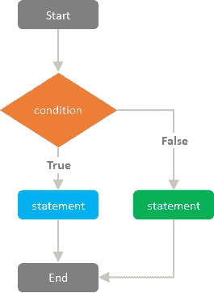
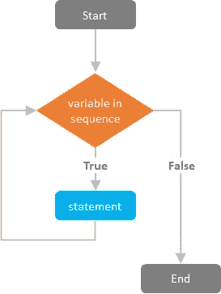
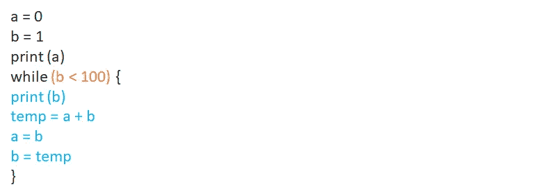
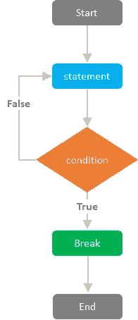

# 基本编程|控制结构

> 原文：<https://towardsdatascience.com/essential-programming-control-structures-2e5e73285df4?source=collection_archive---------0----------------------->

## 节目的骨干


如果你想开始编程，我必须承认前景并不好:不同的操作系统，如此多的编程语言，以及达到相同结果的无尽方式。这些情况要么让你逃跑(尽可能快、尽可能远，希望你再也不会碰到编程)，要么让你面对野兽。如果你决定面对它，那么你将不知道从哪里开始，或者如何处理它。你只会有问题，甚至可能没有一个答案，但你知道吗？这是一个很好的开始方式。实际上，我就是这样开始编程的。我相信，如果我想理解程序，我必须回答这个问题:

> 程序是如何工作的，你如何构建它们？

当然不是一个简单的问题，但是拜托，更难的问题已经有答案了，对吧？看一看马文·明斯基。被认为是人工智能之父之一的明斯基写了 [**【心灵的社会】**](http://www.acad.bg/ebook/ml/Society%20of%20Mind.pdf) 来回答我们这个时代最困难的问题之一:*什么是人类的心灵，它是如何工作的？*从一个革命性的角度来看，明斯基认为我们的思维是由小思维(或更基本的成分)的集合组成的，这些思维已经进化成执行高度特定的任务。根据他的说法，这些微小心灵中的大多数缺乏我们认为的智力属性，并且受到严重限制，只能通过与其他组件的相互作用来达到感觉，想法或有目的的行动。

这个想法包含了一个强有力的概念:**复杂的事情可以被认为是一组简单的主题，也可以被分割成更基本的东西，直到你达到一个正确的理解。如果你这样想的话，任何有效的系统都可以被解释为一组更简单的功能，当这些功能组合在一起时，与它们各自的性能相比，可以达到更好的效果。**

出于这个原因，如果我想理解计算机程序(并学习如何制作它们)，我需要理解它们的构建模块。你看，当一个程序运行时，代码被计算机逐行(从上到下，从左到右)读取，就像你读一本书一样。在某个时候，程序可能会遇到需要做出决定的情况，例如跳转到程序的不同部分或再次运行某个片段。这些影响程序代码流程的决策被称为控制结构。

**控制结构可以被认为是计算机程序的构建模块**。它们是使程序能够“做出决定”的命令，遵循这样或那样的路径。一个程序通常不局限于线性的指令序列，因为在它的处理过程中，它可能会分叉、重复代码或绕过某些部分。控制结构是分析变量并根据给定的参数选择前进方向的模块。

编程语言中的基本控制结构是:

*   **条件句(或选择):**，用于在满足条件的情况下执行一条或多条语句。
*   **循环(或迭代):**其目的是将一个语句重复一定的次数或在满足一个条件的时候。

现在，让我们来看看这些概念中的每一个。下面我们将深入使用 R 编程语言(数据科学中最常用的语言之一)，但是同样的思想和解释适用于任何其他编程语言。

# 条件式

“条件”是编程的核心。它们背后的思想是，它们允许你控制基于程序中不同条件执行的代码流(例如，来自用户的输入，或者运行程序的机器的内部状态)。在本文中，我们将探讨**“If 语句”**和**“If-Else 语句”**的条件控制结构。

## 1) If 语句

“If 语句”在满足条件时执行一条或多条语句。如果该条件的测试为真，则执行该语句。但是如果它是假的(条件不满足)，那么什么都不会发生。让我们想象一下:


如果语句

“If 语句”的语法是:


**示例**

举个简单的例子，假设您想要验证变量(x)的值是否为正:


在本例中，首先我们将值 4 赋给变量(x ),并使用“If 语句”来验证该值是否等于或大于 0。如果测试结果为真(如本例)，该函数将打印句子:*“变量 x 是一个正数”*。

*输出*

```
[1] "variable x is a positive number"
```

但是由于“If 语句”只在测试条件为真时执行语句，如果变量值为负会发生什么呢？要在测试条件下执行一个结果为假的语句，我们需要使用“If-Else 语句”。

## 2) If-Else 语句

这种控制结构允许程序遵循可选的执行路径，无论条件是否满足。



If-Else 语句

“If-Else 语句”的语法是:


指令的“else 部分”是可选的，仅当条件测试为假时才进行评估。

**例 1**

按照我们的示例，我们通过添加“else 部分”来扩展前面的条件“If 语句”,以测试变量的值是正还是负，并在测试结果为真还是假时执行操作。


在本例中，我们将值-4 赋给变量(x ),并使用“If 语句”来验证该值是否等于或大于 0。如果测试结果为真，函数将打印句子:*“变量 x 是一个正数”*。但是在测试结果为假的情况下(就像在这种情况下)，函数继续执行替代表达式并打印句子:*“变量 x 是负数”*。

*输出*

```
[1] "variable x is a negative number"
```

**例 2**

比方说，你需要定义两个以上的条件，就像给考试评分一样。在这种情况下，你可以评分 A，B，C，D 或 F (5 个选项)，那么，你会怎么做呢？

“If-Else 语句”可以有多个可选语句。在下面的例子中，我们定义了一个初始分数，以及一个包含 5 个评级类别的“If-Else 语句”。这段代码将遍历每一个条件，直到得到一个真实的测试结果。


*输出*

```
[1] “C”
```

# 环

“循环语句”只不过是通过组织动作序列和对需要重复的部分进行分组来实现多步骤过程的自动化。作为编程的核心部分，迭代(或循环)赋予了计算机强大的能力。他们可以根据需要经常重复一系列步骤，简单步骤的适当重复可以解决复杂的问题。

一般来说，有两种类型的“循环技术”:

1.  **“For Loops”:**是在计数器或索引的控制下，执行规定次数的程序。
2.  **“While 循环”**和**“重复循环”:**基于逻辑条件的开始和验证。在循环构造的开始或结束时测试条件。

让我们来看看它们:

## 1)对于循环

在这种控制结构中，语句以连续的顺序在一系列值上一个接一个地执行，这些值只有在“For 循环”启动时才被求值(从不重新求值)。在这种情况下，迭代次数是固定的，并且是预先知道的。



For 循环

如果对变量(可以采用指定序列中的值)的条件评估结果为真，将对该值字符串顺序执行一个或多个语句。一旦第一个条件测试完成(结果为真)，就执行语句并再次评估条件，经历一个迭代过程。“序列中的变量”部分对序列中的每个值执行这个测试，直到它覆盖了最后一个元素。

如果不满足条件，并且结果为假(例如，“序列中的变量”部分已经完成了序列的所有元素)，则循环结束。如果条件测试在第一次迭代中的结果为假，则“For 循环”永远不会执行。

“For 循环”的语法是:


**例 1**

为了展示“For 循环”是如何工作的，首先我们将创建一个序列，通过连接不同的水果名称来创建一个列表(称为“fruit_list”):


我们将使用这个水果列表作为“For 循环”中的“序列”，并让“For 循环”为序列中提供的每个值(水果列表中的不同水果)运行一次语句(打印每个值的名称):


这样，“For 循环”的结果如下:

```
## [1] "Apple"
## [1] "Kiwi"
## [1] "Orange"
## [1] "Banana"
```

好了，我们打印了列表中每个值的名字。没什么大不了的，对吧？好的一面是“For 循环”可以用来产生更有趣的结果。看看下面的例子。

**例二**

如果我们想修改值，或者按顺序执行计算，该怎么办？您可以使用“For Loops”对向量的每个值(相同类型的元素，在本例中为数字元素)依次执行数学运算。

在本例中，我们将创建一个数字序列(从 1 到 10)，并设置一个“For 循环”来计算和打印该序列中每个值的平方根:


在这种情况下，“For 循环”的结果是:

```
[1] 1
[1] 1.414214
[1] 1.732051
[1] 2
[1] 2.236068
[1] 2.449490
[1] 2.645751
[1] 2.828427
[1] 3
[1] 3.162278
```

您可以在一个数字序列上使用任何类型的数学运算符，正如我们将在本文后面看到的，在不同的控制结构之间进行各种组合，以获得更复杂的结果。

## 2) While 循环

在“While Loops”**中，首先评估一个条件**，如果测试该条件的结果为真，则重复执行一个或多个语句，直到该条件变为假。


While 循环

与“If 语句”不同，在“If 语句”中，测试为真的条件只执行一次表达式就结束了，“While 循环”是反复执行某个表达式直到条件变为假的迭代语句。如果条件永远不会为假，那么“While 循环”将永远继续下去，程序将会崩溃。反之，如果循环开始时条件测试结果为假，表达式将永远不会执行。

“While 循环”的语法是:


**例 1**

让我们看一个例子。首先，我们将创建一个变量(x ),并给它赋值 1。然后，我们设置一个“While 循环”来迭代测试该变量上的条件，直到条件测试结果为假:


它是这样工作的:变量(x)的初始值是 1，所以当我们测试条件“变量(x)小于 10 吗？”，结果计算为 TRUE，执行表达式，打印变量(x)的结果，在第一种情况下是 1。但随后发生了一些事情:变量(x)在函数结束前增加 1，在下一次迭代中，x 的值将为 2。

这种变量的重新分配是很重要的，因为它最终会达到假条件，循环退出(x = 10)。未能改变“While 循环”中的初始条件将导致无限循环和程序崩溃。

*输出*

```
[1] 1
[1] 2
[1] 3
[1] 4
[1] 5
[1] 6
[1] 7
[1] 8
[1] 9
```

**例二**

你听说过**斐波那契数列**吗？这是一系列数字，其特点是序列中的下一个数字是通过将它前面的两个数字相加得到的:0、1、1、2、3、5、8、13、21……这个序列可以在几个[自然现象](https://www.sciencemag.org/news/2016/05/sunflowers-show-complex-fibonacci-sequences)中找到，在[金融](https://www.investopedia.com/terms/f/fibonaccilines.asp)、[音乐](https://www.classicfm.com/discover-music/fibonacci-sequence-in-music/)、[建筑](https://www.atlasobscura.com/articles/le-corbusiers-modulor-rule)等学科中有不同的应用。

让我们使用“While 循环”来计算它。



在这种情况下，我们将序列中的最大值**设置为停止条件**，这样循环只打印小于 100 的斐波纳契数列。当一个序列元素(不管它是什么)变得大于 100 时，循环周期结束。

```
[1] 0
[1] 1
[1] 1
[1] 2
[1] 3
[1] 5
[1] 8
[1] 13
[1] 21
[1] 34
[1] 55
[1] 89
```

**例 3**

用“While 循环”生成斐波纳契数列的另一种方法是，不将数列的最大值设置为停止条件，而是设置您想要生成的数列元素的数量**。**


这个“While 循环”将序列中的下一个元素追加到前一个元素的末尾，直到达到停止条件。在这种情况下，当序列达到 10 个元素时(无论是哪个值)，循环结束。

*输出*

```
[1] 0 1 1 2 3 5 8 13 21 34
```

## 3)重复循环

与“While Loops”紧密相连，“Repeat Loops”**迭代执行语句**，但**直到满足停止条件**。这样，不管条件的结果是什么，语句都至少执行一次，并且只有当某个条件为真时才退出循环:



重复循环

“重复循环”的语法是:


“重复循环”使用“中断语句”作为停止条件。“中断语句”与中断循环内循环的条件测试相结合，因为当程序遇到中断时，它会在循环结束后立即将控制传递给指令(如果有)。

如果不满足中断条件，“重复循环”将永远运行。请看这两个例子

**例 1**

首先我们创建一个变量(x)并给它赋值 5。然后，我们设置一个“重复循环”来迭代地打印变量的值，修改变量的值(增加 1)，并在该变量上测试一个条件(如果它等于 10)，直到条件测试结果为真。


当变量(x)达到 10 时，触发“中断条件”,循环结束。

*输出*

```
[1] 5
[1] 6
[1] 7
[1] 8
[1] 9
```

**例二**

现在让我们假设我们产生一个随机数列表，我们不知道它的生成顺序。

在这个例子中，我们将使用一个“重复循环”来生成一个正态分布的随机数序列(您可以使用任何其他分布来生成 random，我们只选择这一个)，并在其中一个数大于 1 时破坏该序列。因为我们不知道哪些数字会先出现，所以我们不知道序列会有多长:我们只知道破缺条件。


首先，我们使用“set.seed”指令来固定随机数(总是生成相同的随机数)，并使这个例子可再现。

然后，我们通过生成一个正态分布的随机数，打印它，并检查该数是否大于 1 来启动“重复循环”。只有当这个条件为真时(可能是第一个生成的数字，也可能不是)，循环才会传递到 break 语句并结束。

*输出*

```
[1] -0.9619334
[1] -0.2925257
[1] 0.2587882
[1] -1.152132
[1] 0.1957828
[1] 0.03012394
[1] 0.08541773
[1] 1.11661
```

这再一次表明了设定一个合适的破裂条件的重要性。否则将导致无限循环。

# 最后的想法

我们已经看到并解释了孤立的概念，但是“控制结构”可以按照你想要的任何方式组合:循环可能包含几个内部循环；条件句可能包含循环和条件句，选项是无穷无尽的。(事实上，在回顾“重复循环”时，我们发现示例中包含嵌套的“If 语句”)。

您可以通过组合我们在本文中解释的“控制结构”来开发高级解决方案。正如明斯基所说，我们可以通过简单成分的相互作用达到复杂的结果。控制结构构成了计算中决策过程的基本模块。它们改变了程序的流程，使我们能够从简单的构件中构造出复杂的指令集。

> **我的建议是:** **了解一下他们**。

它会让你更容易编码和理解程序，并帮助你找到解决问题的新方法。

> 对这些话题感兴趣？在 [Linkedin](https://www.linkedin.com/in/lopezyse/) 或 [Twitter](https://twitter.com/lopezyse) 上关注我