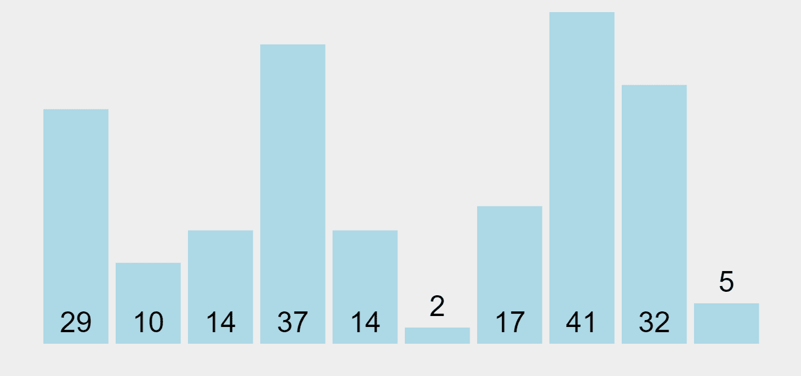
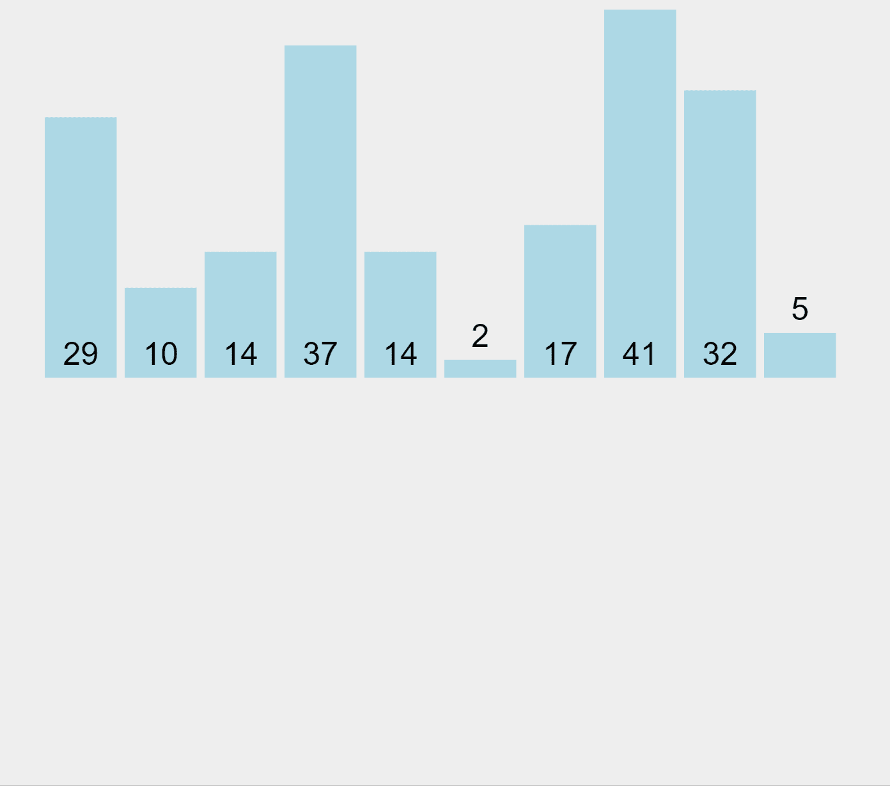
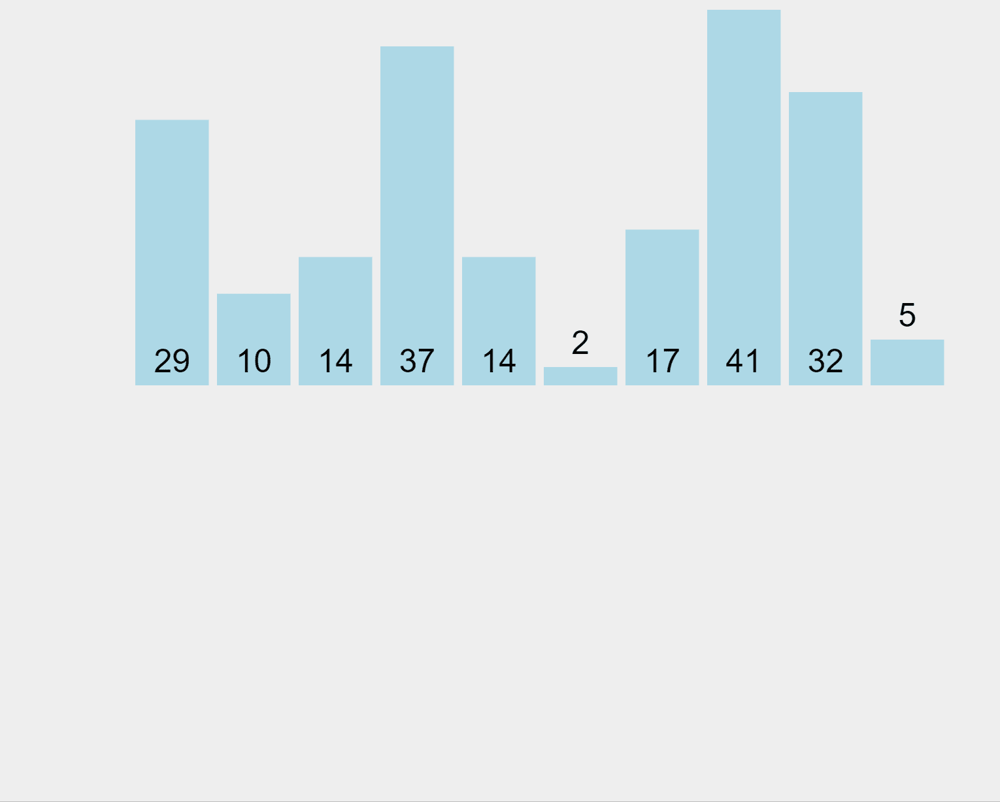

# 基本编程|排序算法

> 原文：<https://towardsdatascience.com/essential-programming-sorting-algorithms-76099c6c4fb5?source=collection_archive---------13----------------------->

## 基本编程工具指南

埃菲社在 [Unsplash](https://unsplash.com?utm_source=medium&utm_medium=referral) 上拍摄的照片

你日历中的下一个任务，你最喜欢的运动队在联盟中的排名位置，你手机中的联系人列表，所有这些都是有顺序的。当我们处理信息时，顺序很重要。我们用秩序来理解我们的生活，优化我们的决定。想象一下，在一个混合字母顺序的字典中查找一个单词，或者试图在一个无序的定价列表中找到最便宜的产品。我们订购东西是为了做出更合理的决定(这实际上是一种错觉)，这让我们对结果更有信心。

但有一个问题:这个世界是混乱的，是天生无序的(至少从我们人类的感知来看)。今天的数据又乱又多，真是糟糕的组合。我们怎样才能以一种对我们有意义的方式来整理这个海量的信息漩涡？这就是计算机排序算法发挥关键作用的地方。

# 排序算法的世界

简单来说，**算法就是解决问题的一步一步的方法**。算法的基础是接受一个输入并执行一系列特定的动作以达到一个结果。它们被广泛应用于计算机编程、数学，甚至我们的日常生活中(例如，一个烹饪食谱就是一个算法)。

算法远在计算机发明之前就存在了，但是自从现代技术的爆炸以来，计算机算法已经扩展并到处复制。现在，从计算机算法的巨大宇宙中，我认为排序算法值得一个特殊的章节。

> 排序算法是计算机科学的基础。它们**将无序的数据转化为按照某种标准**排序的数据，例如字母顺序、最高到最低值或最短到最长距离。

它们基本上以项目列表作为输入，对这些列表执行特定的操作，并以有序的方式交付这些项目作为输出。排序算法的许多应用包括在零售网站上按价格组织商品，以及确定网站在搜索引擎结果页面上的顺序

有许多不同的排序算法，但它们有一个共同点，那就是可视化后更容易理解。在下面的例子中，我们取一个无序列表，用 5 种不同的算法进行排序:*选择排序*、*插入排序*、*冒泡排序*、*合并排序*和*快速排序*。让我们来看看。

## 选择排序

选择排序算法基于这样的思想:在未排序的列表中找到最小或最大元素，然后以排序的方式将其放在正确的位置。在升序排序的情况下，最小的元素将在第一个，在降序排序的情况下，最大的元素将在开始。

因此，当按升序排序时，选择排序的工作方式是反复从列表的未排序部分中找到最小元素，并将其放在开头。在每次迭代中，从列表的未排序部分选取最小元素，并将其移动到列表的排序部分。为了做到这一点，该算法在进行传递时寻找最小值(在升序的情况下),并在完成传递后，将其放置在适当的位置。

选择排序算法(升序)

看上面的例子。需要升序排序的列表分为两部分，左端排序的部分和右端未排序的部分。最初，已排序的部分是空的，未排序的部分是整个列表。从未排序列表中选择最小的元素(本例中为 2)(用洋红色标记)，并与最左边的元素交换，该元素成为排序数组的一部分(现在为橙色)。这个过程通过将未排序的元素从未排序的列表一个接一个地移动到已排序的列表来继续，直到没有元素剩下为止。

选择排序非常直观，但由于它需要扫描整个列表来查找下一个小值，所以在处理大量数据时会非常慢。

## 插入排序

你在游戏中整理过扑克牌吗？如果答案是肯定的，那么这就是插入排序。

与选择排序类似，插入排序将元素分为排序列表和未排序列表。在该算法中，按顺序搜索元素，将未排序的项目移动并插入到排序列表中，直到覆盖所有未排序的值。

插入排序算法(升序)

在我们的示例中，从左边开始，算法将第一个元素(29)标记为已排序。然后，它选取位于未排序列表中的第二个元素(10)，并将其与位于排序列表中的前一个元素进行比较。因为 10 小于 29，所以它将较高的元素向右移动，并将较小的元素插入第一个位置。现在，元素 10 和 29 表示排序后的列表。该算法通过从右侧的未排序列表中提取元素并将其与左侧的排序列表中的元素进行比较来顺序执行这一练习，以确定将它们插入到哪个位置。

插入排序是自适应的，这意味着如果提供部分排序的数组作为输入，它会减少总的步骤数，从而提高效率。像选择排序一样，插入排序不适合大数据量，因为它不适合其他排序算法。

## 冒泡排序

冒泡排序基于这样一种思想，即反复比较相邻元素对，然后如果它们以错误的顺序存在，就交换它们的位置。

如果一个元素列表必须按升序排序，那么冒泡排序将从比较列表的第一个元素和第二个元素开始。如果第一个元素大于第二个元素，它将**交换**两个元素，并继续比较第二个和第三个元素，依此类推。

冒泡排序算法(升序)

在我们的例子中，算法从比较第一个元素(29)和第二个元素(10)开始。因为 29 比 10 大，所以它交换它们并将 29 作为列表中的第二个元素。然后，它对第二个元素(29)和第三个元素(14)执行相同的操作，并对所有列表元素重复该操作。因此，在第一遍中，列表中最高的元素(41)将被放置在列表的末尾(右侧)。该算法将多次遍历所有元素，直到它们都被排序，“冒泡”每个元素到它所属的位置。

冒泡排序通常被认为是一种低效的排序工具，因为它必须在知道元素的最终位置之前交换项目。然而，如果在一次传递中没有交换，那么我们知道列表必须被排序。如果冒泡排序发现一个列表已经被排序，它可以被修改为提前停止，这为它提供了识别排序列表的能力。

## 合并排序

合并排序是一种非常有效的算法，它将元素列表分成相等的两半，然后以排序的方式组合它们。

该算法从重复地将一个列表分解成几个子列表开始，直到每个子列表由一个元素组成并且不能再被分割(创建一个元素的分区)。每个子列表的第一个元素在它们之间进行比较，并且如果以升序排序，则两者中较小的元素成为新的合并排序列表的新元素。重复该过程，直到所有子列表都为空，并且一个新合并的列表覆盖了所有子列表的所有元素，从而得到一个排序列表。

这里的秘密是一个只有一个元素的列表已经被排序了，所以一旦我们把原始列表分解成只有一个元素的子列表，我们就成功地把问题分解成了基本问题。这种方法被称为**【分而治之】**，其基本思想是将一个单一的大问题分解成更小的子问题，解决更小的子问题，并组合它们的解决方案，以找到原始大问题的解决方案。

合并排序算法(升序)

在我们的例子中，算法首先将元素列表分成 1 个分区。然后，它合并第一个(29)和第二个(10)元素，对它们进行排序(在本例中是按升序)，并将它们放回列表中。然后，它合并第一个(现在是 10 个)、第二个(现在是 29 个)和第三个(14 个)元素，对它们进行排序，并将它们放回列表中。它对所有子列表执行这个过程，合并子结果，直到得到一个唯一的排序列表。

由于合并排序将输入分成多个块，因此可以同时并行地对每个块进行排序，从而产生极快的结果。

## 快速排序

快速排序是最有效的排序算法之一，它基于将数据集划分为子组，然后再将子组递归划分为更小的组，以优化排序过程。该算法的工作原理是在数据集中找到一个**“pivot element”**，并将其作为排序的基础。

快速排序还使用了**“分而治之”**的方法来划分和组织 pivot 周围的元素，这样:pivot 的左侧包含所有小于 pivot 元素的元素，右侧包含所有大于 pivot 的元素(这称为**“分区”**)。这样，pivot 值从将整个元素分成两部分开始，通过为每个子部分找到一个 pivot 递归工作，直到所有部分只包含一个元素。

快速排序算法

在上面的例子中，未排序分区的第一个元素被选作 pivot 元素(用黄色突出显示)。比它小的元素用绿色标记并排序在左边，比它大的元素用紫色突出显示并排序在右边。

我们来看看顺序。开始时，选择 29(左边的第一个元素)作为支点。当枢轴被放置在适当的位置时，所有比它小的元素被放置在左边(一个子组)，比它高的元素被放置在右边(另一个子组)。然后选取 5(左侧未排序列表的第一个元素)作为新的 pivot 元素，整个过程不断迭代，直到这一侧排序完毕。

一旦左侧组被排序，算法就移动到右侧未排序的组，并挑选 41(左侧的第一个元素)作为中枢，并在这一侧执行相同的过程，直到整个数据集从最低到最高排序。

在快速排序中，可以选择数据集中的任何元素作为轴心:第一个元素、最后一个元素或任何其他随机元素。那么最好的办法是什么呢？和往常一样，没有一个直接的解决方案，这取决于你试图解决的问题。您可以:

1.  总是选择第一个元素作为轴心
2.  总是选择最后一个元素作为轴心
3.  选择一个随机元素作为轴心
4.  选择中线作为轴心

如果分区后产生的子划分是不平衡的(也就是说，在轴心的一侧得到的元素很少，而在另一侧得到的元素很多)，那么快速排序将需要更多的时间来完成。为了避免这种情况，您可以选择**随机枢纽元素**并分散获得不平衡分区的风险。

# 选哪个？

自然，计算机科学家不断发明额外的排序算法，它们各有利弊，所以要谨慎选择你的排序算法。选择正确的排序算法，你的程序就能快速运行。选择错误的排序算法，你的程序对用户来说可能会慢得让人无法忍受。**一般来说，插入排序最适合小列表，冒泡排序最适合已经排序的列表，快速排序通常是日常使用中最快的。**

你明白了:一些算法在管理相对少量的项目时速度很快，但是如果你强迫它们管理大量的项目，速度就会很慢。另一方面，其他算法在对最初几乎正确排序的项目进行排序时非常快速和有效，但如果对列表中随机分散的项目进行排序时则非常慢。

但是如果你能从每一个中取其精华呢？**混合算法**是我们要走的路。

> 混合算法结合了解决同一问题的两种或多种其他算法，或者选择一种，或者在处理过程中在它们之间切换。

这样做是为了组合每个组件的所需功能，以便整体性能优于单个组件的性能。例如 [**Tim Sort**](https://hackernoon.com/timsort-the-fastest-sorting-algorithm-youve-never-heard-of-36b28417f399) 是一种混合排序算法，源自合并排序和插入排序，旨在实现真实世界数据的高性能。该算法查找已经排序的数据的子序列(称为“自然运行”)，并使用它们更有效地对剩余部分进行排序。

> 对这些话题感兴趣？在 Linkedin[或 Twitter](https://www.linkedin.com/in/lopezyse/) 上关注我