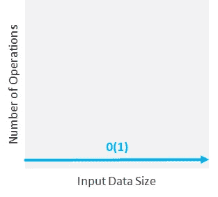
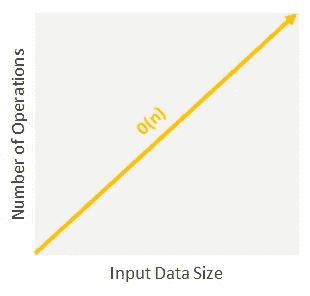
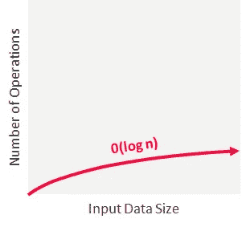
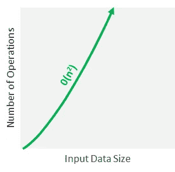
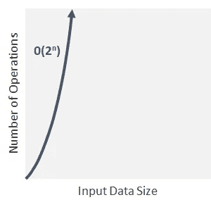
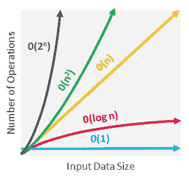

# 基本编程|时间复杂性

> 原文：<https://towardsdatascience.com/essential-programming-time-complexity-a95bb2608cac?source=collection_archive---------1----------------------->

## 如何衡量算法的效率

[Icons8 团队](https://unsplash.com/@icons8?utm_source=medium&utm_medium=referral)在 [Unsplash](https://unsplash.com?utm_source=medium&utm_medium=referral) 上的照片

在计算机编程中，就像在生活的其他方面一样，解决一个问题有不同的方法。这些不同的方法可能意味着不同的时间、计算能力或您选择的任何其他指标，因此我们需要比较不同方法的效率，以选择正确的方法。

现在，你可能知道，计算机能够根据算法解决问题。

> **算法是告诉计算机做什么和如何做的程序或指令(一组步骤)**。

如今，它们进化得如此之快，以至于即使完成同样的任务，它们也可能有很大的不同。在最极端的情况下(顺便说一下，这很常见)，用不同编程语言编写的不同算法可能会告诉不同硬件和操作系统的不同计算机以完全不同的方式执行相同的任务。太疯狂了，不是吗？

> 事情是这样的，一种算法需要几秒钟才能完成，而另一种算法即使是很小的数据集也需要几分钟。我们如何比较不同的性能并选择最佳算法来解决特定的问题？

幸运的是，有很多方法可以做到这一点，我们不需要等到算法工作时才知道它是否能快速完成工作，或者它是否会在输入的压力下崩溃。当我们考虑一个算法的复杂性时，我们不应该真的关心所执行的操作的确切数量；相反，**我们应该关心运算的数量如何与问题大小相关**。想一想:如果问题规模翻倍，运算次数保持不变吗？他们会加倍吗？它们会以其他方式增加吗？为了回答这些问题，我们需要测量算法的时间复杂度。

**时间复杂度代表一条语句被执行的次数**。算法的时间复杂度不是执行特定代码所需的实际时间，因为它取决于其他因素，如编程语言、操作软件、处理能力等。时间复杂性背后的思想是，它只能以一种仅依赖于算法本身及其输入的方式来度量算法的执行时间。

为了表达算法的时间复杂度，我们使用了一种叫做*“大 O 符号”*的东西。**大 O 符号是我们用来描述算法时间复杂度的语言。**这是我们比较解决问题的不同方法的效率的方式，有助于我们做出决策。

**大 O 符号根据算法相对于输入**(该输入称为“n”)的增长速度来表示算法的运行时间。这样，举例来说，如果我们说一个算法的运行时间“按照输入大小的数量级”增长，我们可以用“O(n)”来表示。如果我们说一个算法的运行时间“与输入大小的平方成正比”，我们可以用“O(n)”来表示。但是这到底是什么意思呢？

理解时间复杂性的关键是理解事物增长的速率。这里讨论的速率是每个输入大小所用的时间。有不同类型的时间复杂性，所以让我们检查最基本的。

## 恒定时间复杂度:O(1)

当时间复杂度恒定时(记为“O(1)”)，输入(n)的大小无关紧要。时间复杂度恒定的算法运行时间恒定，与 n 的大小无关。它们不会根据输入数据改变运行时间，这使它们成为最快的算法。

恒定时间复杂度

例如，如果您想知道一个数字是奇数还是偶数，您可以使用具有恒定时间复杂度的算法。不管这个数字是 1 亿还是 90 亿(输入“n”)，算法都只会执行一次相同的操作，然后给你结果。

此外，如果您想一次性打印出一个短语，如经典的“Hello World ”,那么您也应该以恒定的时间复杂度运行，因为无论您使用哪种操作系统或哪种机器配置，这个短语或任何其他短语的操作量(在本例中为 1)都将保持不变。

为了保持恒定，这些算法不应该包含循环、递归或对任何其他非恒定时间函数的调用。对于常数时间算法，运行时间不会增加:数量级始终为 1。

## 线性时间复杂度:O(n)

当时间复杂度与输入的大小成正比时，您将面临线性时间复杂度，即 O(n)。具有这种时间复杂度的算法将在“n”次运算中处理输入(n)。这意味着随着输入的增加，算法完成的时间也相应增加。

线性时间复杂度

在这种情况下，您必须查看列表中的每一项才能完成任务(例如，找到最大值或最小值)。或者你也可以思考一些日常任务，比如读一本书或者找一张 CD(还记得吗？)在 CD 堆栈中:如果必须检查所有数据，输入大小越大，操作次数就越多。

线性运行时间算法非常常见，它们与算法从输入中访问每个元素的事实有关。

## 对数时间复杂度:O(log n)

具有这种复杂性的算法使得计算速度惊人。如果一个算法的执行时间与输入大小的对数成正比，则称该算法在对数时间内运行。这意味着不是增加执行每个后续步骤的时间，而是以与输入“n”成反比的幅度减少时间。

对数时间复杂度

它的秘密是什么？这些类型的算法从来不需要检查所有的输入，因为它们通常在每一步都丢弃大量未经检查的输入。这个时间复杂度一般与每次将问题分成两半的算法有关，这是一个被称为“分而治之”的概念。**分治算法**使用以下步骤解决问题:

1.他们**将给定的问题**分成相同类型的子问题。
2。他们递归地**解决**这些子问题。
3。他们恰当地**组合**子答案来回答给定的问题。

考虑这个例子:假设你想在一个所有单词都按字母顺序排序的字典中查找一个单词。至少有两种算法可以做到这一点:

**算法 A:**

*   从书的开头开始，按顺序进行，直到找到您要查找的联系人。

**算法 B:**

*   从中间打开书，检查上面的第一个单词。
*   如果你要找的单词按字母顺序排列比较大，那么它会出现在右半部分。否则，它看起来在左半部。

两者哪一个更快？算法 A 一个字一个字地进行 O(n)，而算法 B 在每次迭代 O(log n)时将问题分成两半，以更有效的方式获得相同的结果。

对数时间算法(O(log n))是仅次于常数时间算法(O(1))的最快算法。

## 二次时间复杂度:O(n)

在这种类型的算法中，运行时间与输入大小的平方成正比(类似于线性，但为平方)。

在大多数情况下，特别是对于大型数据集，具有二次时间复杂度的算法需要大量时间来执行，应该避免使用。

二次时间复杂度

嵌套的 **For 循环**在二次时间上运行，因为您正在另一个线性操作中运行一个线性操作，或者 *n*n* 等于 *n .*

如果你面对这些类型的算法，你要么需要大量的资源和时间，要么你需要想出一个更好的算法。

## 指数时间复杂度:O(2^n)

在指数时间算法中，输入(n)每增加一次，增长率就增加一倍，通常会遍历输入元素的所有子集。每当一个输入单位增加 1，就会导致您执行的操作数量加倍。这听起来不太妙，对吧？

具有这种时间复杂度的算法通常用在你对最佳解决方案了解不多的情况下，你必须对数据尝试每一种可能的组合或排列。

指数时间复杂度

指数时间复杂度通常见于**蛮力算法**。这些算法盲目地迭代整个可能解的域，以搜索一个或多个满足条件的解。他们试图通过尝试每一种可能的解决方案来找到正确的解决方案，直到碰巧找到正确的方案。这显然不是执行任务的最佳方式，因为它会影响时间复杂度。在*密码术*中，暴力算法被用作攻击方法，通过尝试随机字符串直到找到解锁系统的正确密码来破解密码保护。

与二次时间复杂度一样，您应该避免运行时间为指数的算法，因为它们不能很好地伸缩。

# 如何度量时间复杂度？

一般来说，我们已经看到算法的运算越少，速度就越快。这看起来是一个很好的原则，但我们如何将它应用到现实中呢？

> 如果我们有一个算法(不管它是什么)，我们如何知道它的时间复杂度？

在某些情况下，这可能相对容易。假设您有一个循环的外部**，它遍历输入列表中的所有项，然后有一个嵌套的循环**的内部**，它再次遍历输入列表中的所有项。执行的总步骤数是 n * n，其中 n 是输入数组中的项数。**

> 但是怎么求复杂函数的时间复杂度呢？

为了找到答案，我们需要将算法代码分解成几个部分，并尝试找出各个部分的复杂性。是的，很抱歉告诉你，但是没有一个按钮可以告诉你一个算法的时间复杂度。你必须自己去做。

主要时间复杂性

**作为一条经验法则，最好是尝试让你的函数运行在线性时间复杂度之下或之内，**但显然这并不总是可能的。

有不同的**大 O 符号**，像*【最佳情况】**一般情况】*和*【最坏情况】*，但真正重要的是**最坏情况**；这些会严重破坏一切。它们直击为什么时间复杂性很重要的核心，并指出为什么一些算法不花几十亿年就不能解决一个问题。

**最坏情况分析**给出了算法执行期间必须执行的基本操作的最大数量。它假设输入处于最糟糕的状态，必须做最大的努力来纠正错误。例如，对于旨在以升序对数组进行排序的排序算法，当输入数组以降序排序时，会出现最坏的情况。在这种情况下，必须执行最大数量的基本操作(比较和赋值)来以升序设置数组。请这样想:如果您必须在目录中通过阅读每个名字来搜索一个名字，直到找到正确的名字，最坏的情况是您想要的名字是目录中的最后一个条目。

综上所述，**一个算法的时间复杂度越好，算法在实际中执行工作的速度就越快。**你在设计或管理算法的时候应该考虑到这一点，考虑到这对于一个算法是实用还是完全无用有很大的影响。

> 对这些话题感兴趣？在 [Linkedin](https://www.linkedin.com/in/lopezyse/) 或 [Twitter](https://twitter.com/lopezyse) 上关注我