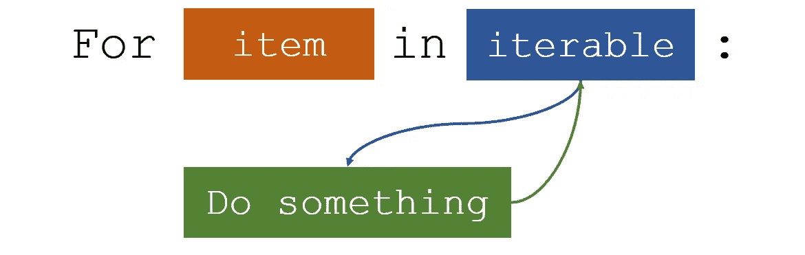
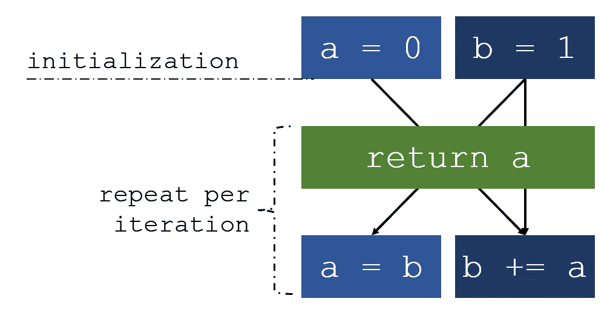
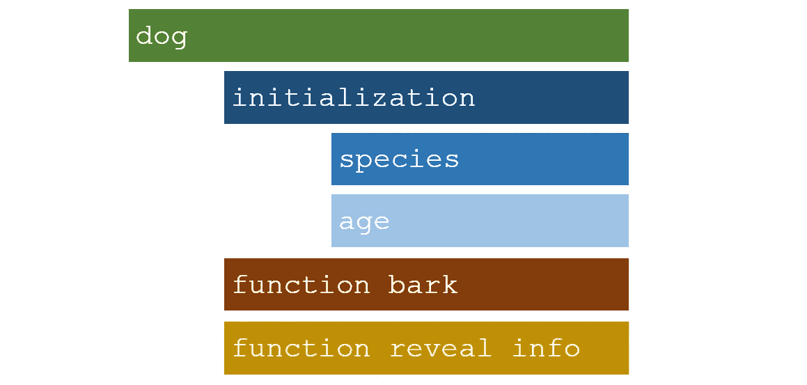
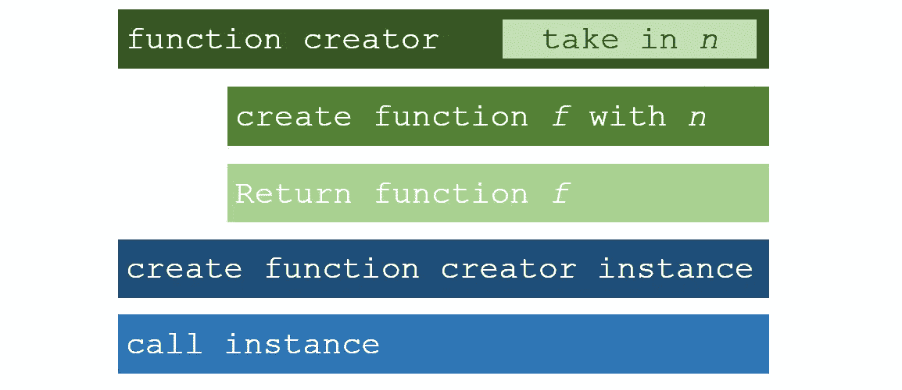

# 任何认真的程序员都需要知道的基本 Python 概念和结构，解释

> 原文：<https://towardsdatascience.com/essential-python-concepts-any-serious-programmer-needs-to-know-explained-429aad86b92e?source=collection_archive---------14----------------------->


来源: [Pixabay](https://pixabay.com/photos/architecture-skyscraper-urban-city-768432/)

## 生成器、面向对象编程、闭包、装饰器等等

本文将概述一些重要的 Python 概念，任何认真的程序员都应该知道并理解这些概念才能实现。这些概念形成了高级 Python 编程的框架，以智能地处理和实现问题。

# 发电机

用 Python 构建一个迭代器，一个可以迭代的对象，需要做大量的工作。一个类(面向对象的编程)必须用一个`__iter__()`和`__next__()`方法构建，内部状态必须被存储和更新，当没有值要返回时，必须产生一个`StopIteration`错误。



Python 中的迭代。作者创建的图像。

为了避免这个冗长的过程，Python 生成可以自动创建迭代器。上面描述的创建迭代器的所有过程都是由 Python 和生成器自动完成的。生成器是一个函数，它返回一个可以迭代的对象(迭代器)(一次覆盖一个值)。

生成器函数被定义为一个函数，但是使用了关键字`yield`而不是传统的`return`。如果函数体包含`yield`，那么它将自动成为一个生成器函数。

```
def simple_generator():
     yield 1
     yield 2
     yield 3for value in simple_generator():
     print(value)
```

前四行代码定义了生成器，它将迭代返回`1`、`2`和`3`。最后两行通过迭代打印输出值来演示迭代，输出:

```
1
2
3
```

一个生成器对象仍然需要一个函数来描述对象，但是需要设置为等于一个变量，在本例中为`x`。

```
x = simple_generator()
print(next(x))
print(next(x))
print(next(x))
```

例如，下面的代码创建一个斐波那契数列生成器，其中每一项都是前面两项(0、1、1、2、3、5、8、13、…)的和。

```
def fibonacci(limit):
     a, b = 0, 1

     while a < limit:
          yield a
          a, b = b, a+b
```

用于跟踪序列的两个数字是`a`和`b`，它们分别被初始化为 0 和 1。当`a`低于限值(函数中指定为参数的数字)时，程序产生(返回)a 的值。然后，`a`和`b`同时更新，其中`a`设置为`b`，而`b`设置为自身加上`a`。这将序列 1 向右移动，同时保留用于生成下一个序列值(前两个数字)的相关信息。



斐波那契序列发生器逻辑。作者创建的图像。

然后可以迭代生成器，在这种情况下使用 for 循环:

```
for i in fibonacci(8):
     print(i)
```

因此，输出将遍历 Fibonacci 序列中值为 8 的所有元素:

```
0
1
1
2
3
5
```

# 面向对象编程

面向对象编程是 Python 的一个特性，它允许对方法和变量进行干净和有组织的存储。Python 中的面向对象编程(OOP)由`class`对象组成，其中包含关于该对象的信息。

例如，假设我们想用 Python 创建一只虚拟狗。一个类的个人属性存储在一个`__init__`函数中。必须包括`self`参数，以及创建时需要定义的该对象的任何其他属性，例如狗的`species`和`age`。

```
class dog:
     def __init__(self, species, age):
          self.species = species
          self.age = age
```

可以用`.`在`class`对象内部调用对象的变量和函数，前面的元素引用对象，句号后面的项目引用被调用的对象。`self.species = species`将内部变量设置为输入参数`species`的值。

我们还可以在类中创建函数:

```
class dog:
     def __init__(self, species, age):
          self.species = species
          self.age = age def bark(self, call='Woof!'):
          print(call) def reveal_information(self):
          print('I am a', self.species)
          print('I am', self.age, 'years old')
```

这两个内部函数`bark`和`reveal_information`是由类执行和附加的方法。然后，我们可以为 dog 类设置一个变量`pepper`。我们必须指定初始化参数，`species`和`age`。

```
pepper = dog(species='German Shepard', age=3)
```

然后，我们可以调用`pepper`的属性:

```
pepper.reveal_information()
```

这将输出:

```
I am a German Shepard
I am 3 years old
```



面向对象的可视化类。作者创建的图像。

Python 中的面向对象编程适用于许多目的。尽管它可能需要更多的输入来设置，但它允许更多的可读代码。

# 关闭

闭包可以避免使用全局值，并提供了一种数据隐藏形式，为问题提供了一种面向对象的解决方案。当一个类中要实现的方法很少时，闭包可以提供一种替代的、更优雅的解决方案。当属性和方法的数量增加时，一个类就更合适了。以下标准演示了当嵌套函数引用其封闭范围内的值时 Python 中的闭包:

*   存在嵌套函数(函数中的函数)
*   嵌套函数引用封闭函数中声明的值
*   封闭函数返回嵌套函数



闭合图。作者创建的图像。

让我们用一个示例函数`make_multiplier`来演示闭包，它接受一个参数`*n*`并返回一个带有该参数的函数。

```
def make_multiplier(n):
    def multiplier(x):
        return x * n
    return multiplier
```

创建一个将某物乘以 3 的函数的过程如下:

```
times3 = make_multiplier(3)
```

因为函数`make_multiplier`返回一个函数，`times3`是一个函数。

```
print(times3(9))
```

…返回…

```
27
```

…因为 3 乘以 9 等于 27。闭包可能是用 Python 完成这项任务的最佳方式。

# 内置枚举

Python 内置枚举*牛逼*。也许开发人员面临的最常见的任务是在跟踪索引的同时遍历列表中的一项。在许多没有枚举的其他语言中，程序员需要手动完成这项工作，例如在 Python 中:

```
counter = 0
for item in a_list:
     do_something_with(item)
     do_something_else_with(counter)
     counter += 1
```

然而，Python 的`enumerate()`函数通过返回一个不可打包的元组来自动跟踪每次迭代的计数器:

```
for index, item in enumerate(a_list):
     do_something_with(item)
     do_something_with(index)
```

作为演示，下面的代码…

```
for index, item in enumerate(['a','b','c']):
     print(index,item)
```

…会输出…

```
0 a
1 b
2 c
```

# 装修工

装饰者接受一个函数，向该函数添加一些功能，然后返回它。这在需要父函数的小变化的情况下非常有用，因为可以用装饰器来改变函数，而不是为需要的函数的每个变化重写函数。

假设我们有一个函数`ordinary()`，它的唯一目的是打印出一个字符串`“I am an ordinary function.”`

```
def ordinary():
    print("I am an ordinary function.")
```

假设我们还想添加另一条消息，`“I was decorated!”`我们可以创建一个函数`decorate()`，它接收一个函数，打印添加的消息，然后调用原始函数，其对象作为参数输入到函数`decorate()`中。添加额外字符串和调用原始函数的过程可以存储在一个内部函数中，其对象用`decorate()`返回。

```
def decorate(function):
    def inner_function():
        print("I was decorated!")
        function()
    return inner_function
```

为了修饰原始函数`ordinary()`，我们将在原始函数上调用函数`decorate()`。我们存储`decorate()`输出到`decorated`的变量是一个函数(函数`decorate()`中的`inner_function`)。

```
decorated = decorate(ordinary)
decorated()
```

调用`decorated()`产生输出…

```
I was decorated!
I am an ordinary function.
```

装饰者使用`@`符号来自动装饰一个功能。

```
@decorate
def ordinary():
    print("I am an ordinary function.")
```

在函数定义前使用`@`符号会自动修饰函数。它的计算方式与前面概述的修饰函数的方法相同。

通过在一个函数前添加几行`@decorate`，多个 decorators 可以相互链接。

# 感谢阅读！

如果您对代码示例或概念有任何疑问，请在下面的回复中提问。