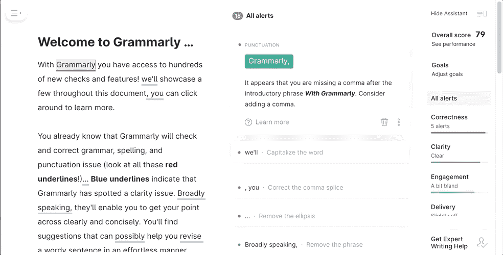

# 数据科学项目的基本软件工具

> 原文：<https://towardsdatascience.com/essential-software-tools-for-data-science-projects-32c86ac54ca6?source=collection_archive---------26----------------------->

## Python，Matplotlib 样式，Git，Git 自述文件，Git 页面，VSCode，概念，语法

如有疑问，请始终选择“黑暗模式”选项！由[克莱门特 Photo】在](https://unsplash.com/@clemhlrdt?utm_source=medium&utm_medium=referral) [Unsplash](https://unsplash.com?utm_source=medium&utm_medium=referral) 拍摄的照片

在本文中，我们将研究如何设置一些工具，以实现更具可重复性和协作性的工作流。本指南将有助于人们开始他们的第一个 ML 项目，或者数据科学领域的资深人士在☕️意外洒出咖啡后重新设置他们的 MacBook🤦‍♂️.然而，鉴于这篇文章是在周五起草的，啤酒溢出的可能性要大得多。

*免责声明:这里将描述的“基本软件”是基于作者的个人偏好和必然存在的一套更好的工具—请在评论中添加您的建议。本文绝不试图宣传或推广任何特定的软件，所有程序都可以免费获得。*

**需求**:这里的指令将基于 MAC OS(v 10.15)；然而，安装 Linux 或 Windows 也是可行的。

# 大纲:

这里的部分基本上是独立的，请随意跳过！

1.  Git:版本控制和代码备份是必须的。GitHub 允许你为你的项目创建一个吸引人的自述文件，甚至可以免费托管你的网站。
2.  Python:设置一个虚拟环境，用于包安装和分配一个默认的漂亮的绘图风格宏。
3.  VSCode:使用 Python 笔记本的一种更高级的方式。
4.  理念:创建并分享关于你的项目的漂亮笔记。
5.  语法上:提高你的写作技巧。

# 1.饭桶

这里，我们将假设对`git`和 GitHub 有一些熟悉。如果你真的想学习更多关于版本控制的知识，或者需要复习，去看看 Anne Bonner 的这篇令人惊叹的文章。与 GitHub 存储库交互的最有效方式是通过 iTerm2 这样的终端应用程序，它提供了惊人的 git 集成、自动建议和语法高亮显示，正如这里描述的。此外，它[允许直接在终端](https://www.iterm2.com/documentation-images.html)中打开图像(和 gif)。

带有自动建议和语法高亮显示的 iterm 2(*图片由作者*提供)

你的项目不应该只有一个平淡无奇的自述页面，所以像这里描述的[一样写一个吸引人的项目描述](https://guides.github.com/features/wikis/)，并附上一些[徽章(盾牌)](https://github.com/badges/shields)，如下所示。

[https://github.com/badges/shields](https://github.com/badges/shields)资源库的自述页面。(*图片作者*)

最后，如果你需要一个网站来托管你的项目，或者需要一个在线作品集来展示多个项目，GitHub 提供了工具来轻松做到这一点，正如埃米尔·吉尔在这里描述的[。学习 HTML 和 CSS 技能的一个好方法是从](https://medium.com/r?url=https%3A%2F%2Ftowardsdatascience.com%2Flaunch-a-website-for-free-in-5-simple-steps-with-github-pages-e9680bcd94aa) [HTML5 UP](https://html5up.net/) 下载一个免费的网站模板，然后开始修补。

一个免费的 HTML5 模板，Strata，来自[https://html5up.net/strata](https://html5up.net/strata)(作者提供*图片)*

# 2.计算机编程语言

这里我们将继续用`pip`和`virtualenv`进行 Python 包的 ***本地*** 安装。

*如果你需要获得最新版本的 Python 使用* `*brew install python*` *(* [*看这里*](https://brew.sh/) *如果你的笔记本电脑上没有* `*brew*` *)。这将安装最新版本的* `*python*` *和* `*pip*` *。如果您已经安装了旧版本的 Python(例如 v2)并且* `*python*` *命令链接到它(检查* `*python --version*` *)，brew 会使* `*python3*` *和* `*pip3*` *可用。*

首先，安装环境管理器*(如果* `*python --version*` *为 v2，则使用* `*pip3*` *)*

接下来，创建一个新目录，并在该目录中实例化一个新的 Python 环境

这将允许我们在那个环境中直接安装 Python 包，而不是“全局”安装。该环境需要用以下命令激活(每次登录)

您应该会在终端中看到`(my_project_env)`。如果您有许多要安装的软件包，只需将它们列在一个文件中——您也可以在其中指定版本— `requirements.txt`

然后让`pip`在`my_project_env`中一次性安装好

## 默认 Python Matplotlib 样式

如果希望您的绘图看起来比使用默认 Matplotlib 选项的绘图更有吸引力，可以设置自定义 Matplotlib 样式。这里有一个例子:

*资料来自* [*奥雷连·杰龙的《动手机器学习》一书*](https://www.oreilly.com/library/view/hands-on-machine-learning/9781492032632/) *。* ( *作者图片*)

为了实现这种风格，下载这个宏文件 [ml_style.mplstyle](https://github.com/glukicov/ML_GPU/blob/master/helpers/ml_style.mplstyle) (随意修改/分发该文件)，并将这些行添加到您的 Python/Jupyter 代码中

# 3.虚拟代码

Jupyter 在大笔记本之间切换标签时反应迟钝，令人有些沮丧。自从过渡到 [VSCode](https://code.visualstudio.com/download) 之后，Jupyter 就没有什么可错过的了:Python 笔记本的所有功能都在。此外，VSCode 是 Python、C、LaTeX 和其他文件的快速而强大的编辑器。此外，可以将 VSCode 设置为与其他更熟悉的编辑器(如 Sublime 或 Atom)具有相同的快捷方式和行为——答对了！

[Bikash Sundaray 写了一篇关于为 Python 笔记本设置 VSCode 的伟大文章](/jupyter-notebook-in-visual-studio-code-3fc21a36fe43)。此外，你可以[连接到一个远程 Jupyter 会话](https://code.visualstudio.com/docs/python/jupyter-support#_connect-to-a-remote-jupyter-server)上运行，例如，你的 GPU Ubuntu 服务器([更多关于这个在这里](/set-up-of-a-personal-gpu-server-for-machine-learning-with-ubuntu-20-04-100e787105ad))用于神经网络训练。

VSCode Python 笔记本中的内联绘图和代码自动建议。(*图片作者*)

# 4.概念

一个强大的平台来做笔记和创建文档是必须的。它有两个目的:1)让你自己有条理，2)让你可以轻松地与他人分享你的笔记。[概念](https://www.notion.so/about)允许你组织你的文档，并使任务、模板、会议、代码嵌入变得轻而易举。 [Sergio Ruiz 写了一份综合指南，介绍如何利用这个概念的许多特性。](/organize-and-document-your-machine-learning-or-any-research-project-with-notion-623d52fae972)

注意语法突出显示。(*图片作者*)

一封学术风格的电子邮件(即以。edu、英国等。)会免费授予你一个 Pro 版本。如果你以前使用过 Evernote，那么它提供了一个迁移工具，对我来说，它的效果和预期的一样。

*注意:截至 2020 年 8 月，仅支持美国英语和韩语，英国英语(拼写检查)以及其他语言。*

# 5.语法上

在你的模型上获得高准确度的分数是很棒的；然而，一个成功的数据科学项目需要有效地交流你的发现和方法。[Grammarly](https://app.grammarly.com/)——一个人工智能支持的语法、语气和风格助手——让你提高写作技能。

语法在行动！(*图片作者*)

*请注意，ideal 将很快实现语法集成(与独立应用程序)，希望如此。同时，只有通过浏览器打开概念时，Grammarly 才起作用。*

# 编后记

我希望这篇文章有助于您开始数据科学项目。如果您有任何意见或建议，请告诉我。即将到来的后续文章将描述其他健壮的工具和方法(DevOps)来改进您的工作流。