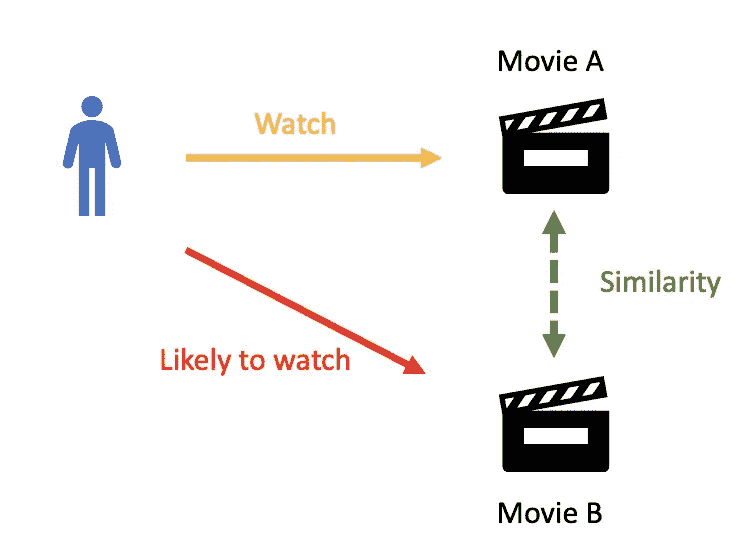
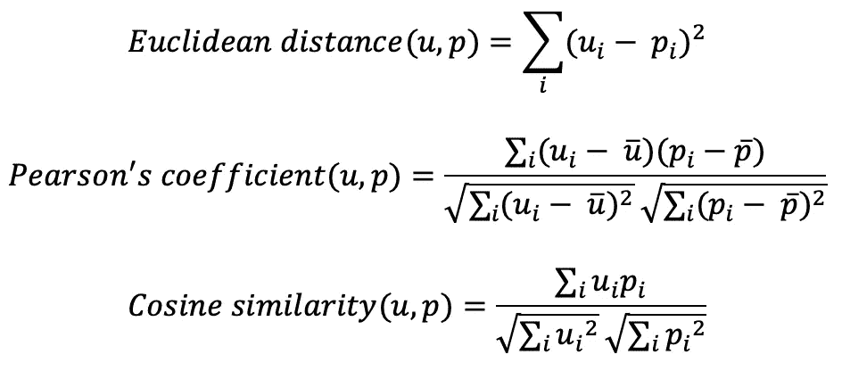
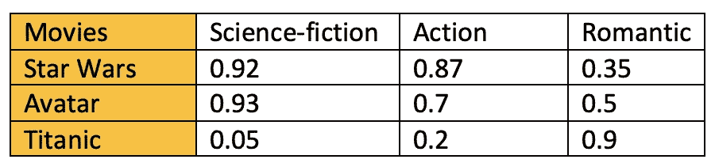
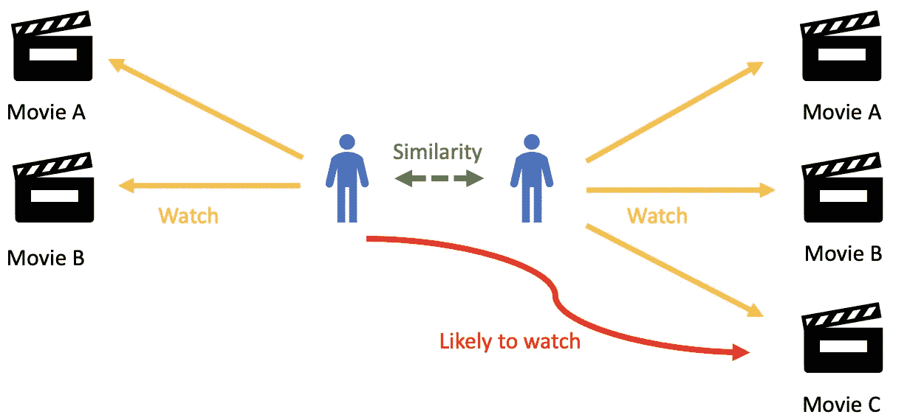
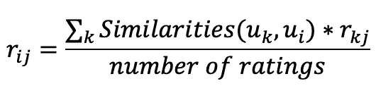
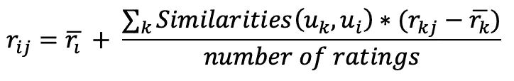
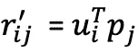
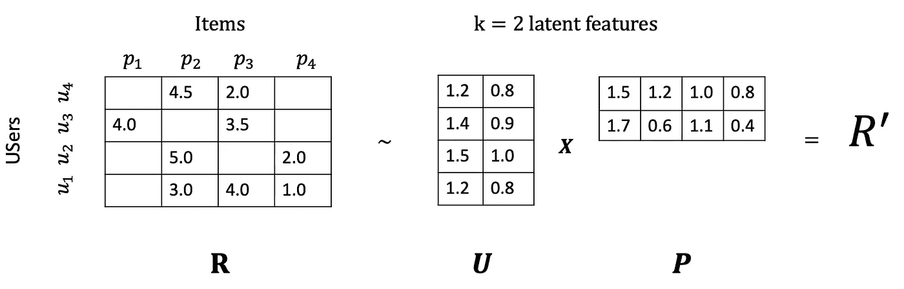
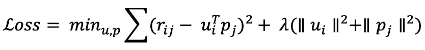

# 推荐引擎的本质:基于内容和协同过滤

> 原文：<https://towardsdatascience.com/essentials-of-recommendation-engines-content-based-and-collaborative-filtering-31521c964922?source=collection_archive---------25----------------------->

来源: [altkom 软件&咨询](https://altkomsoftware.pl/en/blog/recommendation-system/)

## 两种推荐引擎的描述和比较

你有没有想过为什么脸书上的广告与你感兴趣的东西如此相关，或者网飞上的“电影匹配”是如何工作的？是魔法吗？不会。在这两种情况下，推荐引擎或系统都会根据你的历史行为做出预测。

如果你是科幻电影迷，看过《星球大战》，推荐引擎可能会建议你看《阿凡达》。这种方法被称为**基于内容的过滤**，因为它分析每个项目的内容并找到相似的项目。虽然非常有用，但它需要对每个项目有透彻的了解，以便找到相似的项目。

我们还可以想到另一种情况，你的一个和你有很多相似之处的朋友告诉你“昨天，我去电影院看了乔治·卢卡斯的新电影，太棒了！你真应该去看看”。与其他用户有共同点也可以是推荐电影的好方法。下面是第二种推荐引擎:**协同过滤**。

在本文中，我将回顾基于内容的过滤和协作过滤背后的原理，然后对它们进行比较。

# 基于内容的过滤

> 这里的想法是推荐与你之前喜欢的物品相似的物品。该系统首先找到所有文章对之间的相似性，然后使用与用户已经评估的文章最相似的文章来生成推荐列表。
> 
> 但是一个新的问题出现了:**如何才能找到物品之间的相似之处？**

为了比较两个项目，我们需要将它们转换为向量等数学对象，在此基础上，我们可以计算度量标准，如*欧几里德距离、皮尔逊系数*或*余弦相似度*。
以下是上述不同指标的公式:

一种常用的技术是 **TF-IDF** (频率术语—倒置文档频率)。它是一种统计度量，用于评估一个单词与一组文档中的一个文档的相关性。这是通过将两个度量相乘来实现的:单词在文档中出现的次数(术语频率)和该单词出现在文档中的次数的倒数(逆文档频率)。如果一部电影是像《星球大战》is 那样的科幻片，科幻这个词可能会在电影描述中出现很多，所以词条频率会高，如果电影语料库中科幻片不多，词条频率的倒数也会高。最后归一化后，TF-IDF 的值会接近 1。

如果我们将这种技术应用于一组胶片，在归一化之后，我们可以获得下表。此表中的数字是随机的似是而非的值。

现在我们有了描述电影的向量，我们可以计算这些向量中的两个向量之间的*欧几里德距离、皮尔逊系数或余弦相似度*。比如《星球大战》和《阿凡达》向量之间的欧氏距离是 0.05，而《星球大战》和《泰坦尼克号》之间的距离是 1.5。结果越接近 0，元素越相似。这样，我们就可以根据自己选择的特点(科幻、动作、言情)清楚地看到《星球大战》和《阿凡达》有多接近，《星球大战》和《泰坦尼克号》有多远。

正如您所看到的，对于这个方法，了解每个元素的内容是非常重要的。在下一部分中，我们将深入研究协作方法，它是一种同时基于用户和对象之间相似性的方法。

# 协同过滤

> 协同过滤不需要任何东西，只需要用户对一组项目的历史偏好。

协同过滤的标准方法被称为 [**最近邻**](/a-simple-introduction-to-k-nearest-neighbors-algorithm-b3519ed98e) 算法。我们有一个 n × m 的评级矩阵，我们称之为 r，用户矩阵表示为 u，项目矩阵表示为 p。用户 I 由向量 uᵢ表示，他们是 n 个用户，所以 i = 1，…n。项目由向量 pⱼ表示，他们是 m 个项目，所以 j=1， …m .现在，如果目标用户 I 没有观看/评价项目 j，我们想要预测评价 rᵢⱼ。该过程是计算目标用户 I 和所有其他用户之间的相似性，选择前 x 个相似用户，并且取这些具有相似性的 x 个用户的评价的加权平均值作为权重。 评级 rᵢⱼ的定义是:

然而，人们有不同的评分标准，有些人往往比其他人给出更高的分数。这种偏差可以通过在计算加权平均值时减去每个用户在所有项目上的平均分，再加上目标用户的平均分来避免，如下所示。

然后，我们使用*皮尔逊相关、余弦相似度*或*欧几里德距离*来计算相似度。

但是这种方法有一些限制。它没有很好地处理稀疏性，例如，当邻居中没有人对你试图为目标用户预测的项目进行评级时。

由于**稀疏性和可伸缩性**是标准 CF 方法的两个最大挑战，这里出现了一种更先进的方法，将原始稀疏矩阵分解为具有潜在因子/特征和更少稀疏性的低维矩阵。这种方法被称为**矩阵分解**。回想一下，R 是矩阵评级，我们想把 R 写成两个矩阵的乘积:U 是用户矩阵，P 是项目矩阵。由于分解不可能完全相等(R 与 U 和 P 的乘积稍有不同)，我们引入了另一个称为 R '的矩阵，它表示预测的等级。它被定义为 p 与 U 乘积的结果。

矩阵 U 的行数等于用户数。矩阵 P 的列数等于项目数。矩阵 U 的列数等于矩阵 P 的行数，矩阵 P 等于潜在向量的数量。

在下面的例子中，我选择的潜在向量的数量等于 2。为了理解这种选择，我们需要查看 [SVD 分解](/theory-of-principal-component-analysis-pca-and-implementation-on-python-5d4839f9ae89)，其中潜在向量的数量是确保 r '能够捕捉原始矩阵 r 内的大部分方差的向量的数量，因此 r '是 r 的近似值，R' ≈ R。我们注意到 rᵢⱼ'是用户 I 对项目 j 的近似评级。因此，我们有:

这个想法是为了尽量缩小 rᵢⱼ和 rᵢⱼ'.之间的差异问题暴露如下:

> 但是，我们如何找到最优向量 uᵢ和 pⱼ呢？

回想一下，这些向量代表用户 I 和物品 j。如果您熟悉机器学习，为了进行预测，我们总是使用我们希望最小化的损失函数:

优化过程的目的是找到使损失函数最小的最佳 U 和 P。此外， [L2 正则化](/l1-and-l2-regularization-methods-ce25e7fc831c)已被添加，以防止用户和项目向量的过度拟合。

# 两种技术的比较

尽管在基于内容的过滤中，该模型不需要其他用户的数据，因为推荐是特定于该用户的，但它是协同过滤算法的核心。然而，对元素的透彻了解对于基于内容的算法是必不可少的，而在协同过滤方法中只需要元素评估。

与这一点密切相关的是引入新元素的问题，也称为“冷启动问题”。如果在训练期间没有看到某个元素，则系统不能为其创建嵌入，也不能使用该元素查询模型。虽然一些技术作为 WALS 中的[投影或](https://developers.google.com/machine-learning/recommendation/collaborative/summary)[试探法存在，以生成新的嵌入](https://developers.google.com/machine-learning/recommendation/collaborative/summary)，但是添加新的功能将增强基于内容的过滤方法。

*PS:我现在是柏克莱大学的工程硕士，如果你想讨论这个话题，请随时联系我。* [*这里的*](http://jonathan_leban@berkeley.edu) *是我的邮箱。*