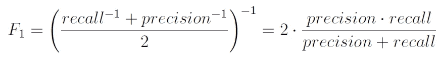
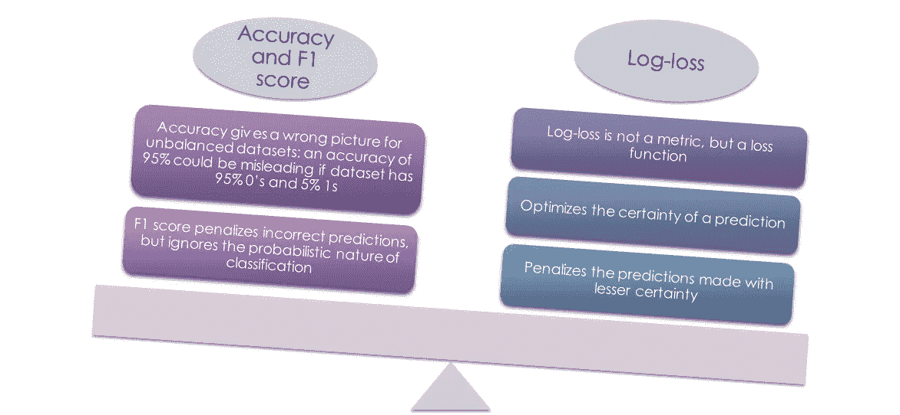
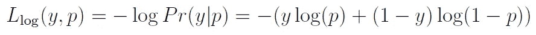
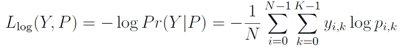
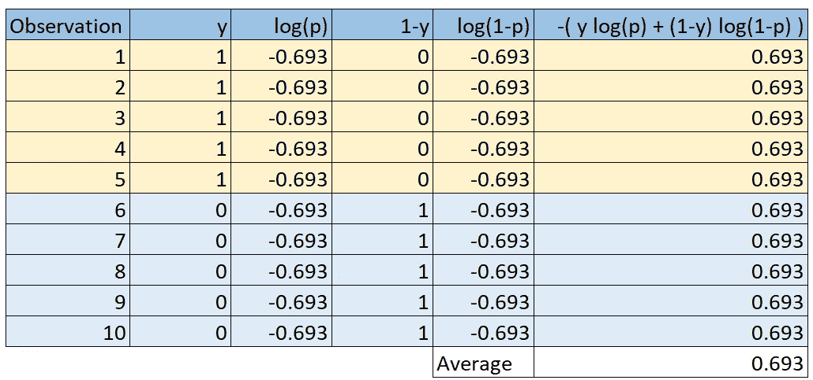
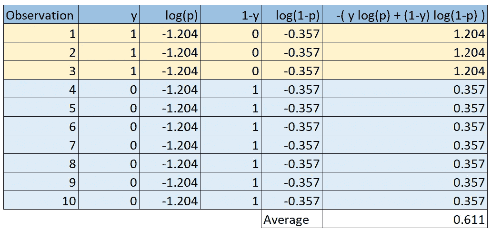
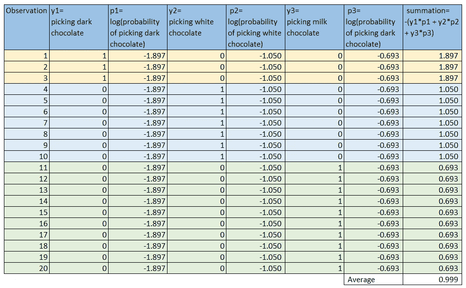

# 你的模型的对数损失比随机猜测的对数损失好吗？

> 原文：<https://towardsdatascience.com/estimate-model-performance-with-log-loss-like-a-pro-9f47d13c8865?source=collection_archive---------23----------------------->

## 在二元或多类分类问题中，如何获得考虑类不平衡的随机猜测对数损失基线得分

照片由[帕特里克·福尔](https://unsplash.com/@patrickian4?utm_source=medium&utm_medium=referral)在 [Unsplash](https://unsplash.com?utm_source=medium&utm_medium=referral) 拍摄

# 介绍

你做了一个分类模型。

您在某处读到过关于对数损失作为一种评估模型性能的方法。关于对数损失幻数。

但与准确性不同，使用它并衡量你的模型得到的对数损失是好是坏并不是很直观，对吗？尤其是当你的班级不平衡的时候。

如果是，那么你点击了正确的链接！

在这篇文章中，我试图回答这些问题:

1.  为什么是日志丢失？
2.  什么是日志丢失？
3.  与随机猜测相比，如何衡量模型性能？
4.  班级不平衡怎么办？
5.  当目标是多类时该怎么办？
6.  你能给我适用于所有这些情况的代码吗？(当然，我可以！)

# 为什么是日志丢失？

建立一个模型只是完成了一半的工作。需要有一个评估指标来衡量模型的性能。在行业中，不同种类的度量标准被用来评估模型。度量标准的选择是模型类型和目标的函数。对于分类任务，混淆矩阵提供了几个度量标准可供选择，如准确度、精确度和召回率。

虽然分类准确性是最广泛使用的度量标准，但它可能是最容易误导的。准确度被定义为正确预测与总预测的比率。事实上，准确性并不能给出错误预测的信息。

具体来说，在两种情况下，准确性度量失败。第一，两个班以上的时候。模型可能会忽略一个或多个类。在这种情况下，该指标不会给出关于每个类别的个体准确性的信息。第二，当数据存在不平衡类时。例如，如果二进制分类数据集具有 90:10 的类别不平衡比率，那么具有 90%分类准确度的模型是不提供信息的模型。

为了解决这些限制，F1 分数是另一个度量，它被定义为精确度和召回率的调和平均值。精度是被正确识别的阳性病例的比例，而召回是被正确识别的实际阳性病例的比例。提高 F1 分数有助于同时提高准确率和召回率。取调和平均值是有意义的，因为与算术平均值相比，调和平均值对极值的惩罚更大。

作者图片

> 尽管作为一种度量，F1 分数比准确性好，但在分类模型中仍然存在缺点，其中类别预测是基于类别概率的。

考虑两个模型，其中对于特定观察，第一个模型预测概率为 0.6 的类别，而另一个模型预测概率为 0.9 的类别。F1 分数将对这些模型一视同仁，因为这两个模型都预测了此次观察的相同类别。它没有考虑预测的确定性。如果实际值为 1，那么两个模型都是正确的。但是第二种模式显然更好，不是吗？

比较精确度和 F1 与对数损失(图片由作者提供)

为了考虑分类概率，可以使用对数损失。Log-loss 是每个实例的校正预测概率对数的负平均值。

# 什么是日志丢失？

> Log-loss 是每个实例的校正预测概率对数的负平均值。

对于具有真实标签 y **∈** {0，1}和概率估计 p=Pr(y=1)的二元分类，每个样本的对数损失是给定真实标签的分类器的负对数似然性:

作者图片

这延伸到如下的多类情况。假设一组样本的真实标签被编码为 1-of-K 二进制指示矩阵 y，即如果样本 I 具有取自一组 k 个标签的标签 k，则 yᵢ,ₖ = 1。设 p 是概率估计的矩阵，pᵢ,ₖ = Pr(tᵢ,ₖ=1).那么整个集合的对数损失为

作者图片

好了，理论到此为止。让我们直接讨论眼前的问题，好吗？？

# 与随机猜测相比，如何衡量模型性能？

想象一下。我有一盒巧克力。它有 5 块黑巧克力和 5 块白巧克力。如果我让你不偷看盒子里的巧克力并猜它是哪一种，你会说有 50%的机会是黑色的，对吗？换句话说，你的随机猜测准确率是 50%。

也就是说，准确度分数在 50%以上的模型比随机猜测要好。在这里，你直观的知道 100%的准确率是最好的，0%是最差的。

对于日志丢失，事情不那么明显，也不那么直观。你需要把你的猜测代入上面给出的公式。

考虑一个有 10 个观察值的数据集。目标 y 有五个 1 代表黑巧克力，五个 0 代表白巧克力。如果你随机猜测，得到一个黑巧克力的概率，p = Pr(y =黑)=0.5。用 1 代替黑巧克力，用 0 代替白巧克力，上面的公式给出了下面的计算。

平衡二元分类的随机猜测对数损失(图片由作者提供)

取最后一列的平均值，瞧！你有你的随机猜测日志损失。因此，如果你的模型的对数损失小于(损失是负的，记住！？)0.693，肯定比乱猜强！

这就引出了我们的下一个问题，如果机会不是 50-50 呢？

# 班级不平衡怎么办？

还记得我那盒著名的巧克力吗？如果现在我告诉你它有三块黑巧克力和七块白巧克力，你不会说取出黑巧克力的机会是 50-50，对吗？

这里选一个黑巧克力的概率就变成了，p = Pr(y =黑)=3/10=0.3。现在，用 1 代替黑巧克力，用 0 代替白巧克力，看看下面的计算。

不平衡二元分类的随机猜测对数损失(图片由作者提供)

看看随机猜测 log-loss 是怎么从 0.693 降到 0.611 的？这意味着酒吧被设置了更严格的条件，嗯？该模型的性能需要优于 0.611。

最后，让我们看看当你的盒子里有更多种类的巧克力时会发生什么！美味，不是吗！？

# 当目标是多类时该怎么办？

这次我在盒子里放了 10 块牛奶巧克力。现在计算更加不直观了，但是请耐心听我说。这次我们有三种标签——黑巧克力、白巧克力和牛奶巧克力。

注意 y 代表拿起一种巧克力的事件。之前我们取 y=1 代表黑巧克力。于是 1-y 自动变成了白巧克力。然而，这一次，我们明确地说出了巧克力的类型。我们取 y1 =拿起一块黑巧克力的事件，y2 =拿起一块白巧克力的事件，y3 =拿起一块牛奶巧克力的事件。然后，根据随机猜测，

选择黑巧克力的概率=3/20=0.15

选择白巧克力的概率=7/20=0.35

选牛奶巧克力的概率=10/20=0.5

现在这些计算就有意义了。

不平衡多类分类的随机猜测对数损失(图片由作者提供)

这就对了。这个不平衡多类问题的随机猜测对数损失为 0.999。

请注意，每行的最后一个单元格表示上一节中给出的公式的内部求和。当将列相加时，在计算平均值时，表示外部求和。

好的，你明白了，但是当你遇到一个具有不同类别和患病率的新数据集时，该怎么办呢？你接着读下一部分，傻瓜。

# 你能给我适用于所有这些情况的代码吗？

这是一个 python 函数，它将类的比率列表作为输入，并输出一个随机猜测的对数损失。如果你的模型的对数损失小于这个数字，你的工作就完成了！

看到那个论点“多”了吗？我用它来按照输入的比率创建随机的观察样本。如果您给 multi=1000，代码将按照提供的比率创建 1000 个观察值。然后使用 sklearn 的 log-loss 函数得到你的基线。整洁，是吧！？

# 结论

在本文中，我解释了为什么 log-loss 是评估分类模型性能的好选择。我解释了它是什么，并展示了如何针对三种场景计算它——平衡二进制、不平衡二进制和不平衡多类分类。最后提供的 python 函数可以帮助您获得分类问题的基线。

## 参考

[https://sci kit-learn . org/stable/modules/model _ evaluation . html # log-loss](https://scikit-learn.org/stable/modules/model_evaluation.html#log-loss)

在 [LinkedIn](https://www.linkedin.com/in/mohannishant/) 上和我联系！

在 [GitHub](https://github.com/mohannishant6) 上看看我的一些很酷的项目！