# 用机器学习估算建筑物的反事实能耗

> 原文：<https://towardsdatascience.com/estimating-counterfactual-energy-usage-of-buildings-with-machine-learning-8ca91ec66c08?source=collection_archive---------21----------------------->

## 我们可以制作 ML 模型来预测建筑的能源使用吗？绝对的！

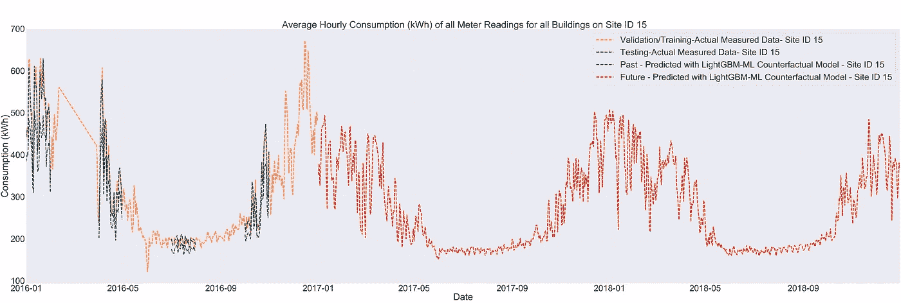

目录表

1.  摘要
2.  背景
3.  材料和方法
4.  结果和结论
5.  参考

# 1.摘要

美国供暖、制冷和空调工程师协会(ASHRAE)是世界上最大的能源效率研究协会之一。它们成立于 1894 年，拥有 54 000 多名成员，服务于 132 个国家。自 1993 年以来，他们已经举办了 3 次大型数据竞赛，旨在预测建筑能耗。最近的一次是 2019 年 10 月在 Kaggle 上举办的。在这次比赛中，前 5 名选手分享了总计 25，000 美元的奖金。第一名团队获得 10，000 美元奖金。比赛于 2019 年 12 月 19 日结束。我参加比赛较晚，但由于我的机械工程背景(ME)和对机器学习的热情(ML)，我对比赛非常感兴趣。因此，我决定在到期日之后解决这个问题，以便更好地理解 ML 以及它如何应用于我的领域，即我。**因此，本文试图根据最近 2019 年 10 月 Kaggle 的数据，调查一座建筑将消耗多少能源。为什么？因为正如竞赛状态:**

> 评估能效改进的价值可能具有挑战性，因为没有办法真正知道一座建筑在没有改进的情况下会使用多少能源。我们能做的最好的事情就是建立反事实模型。建筑物大修后，新的(较低的)能耗将与原始建筑物的模拟值进行比较，以计算改造后的节约量。更准确的模型可以支持更好的市场激励，并实现更低成本的融资。

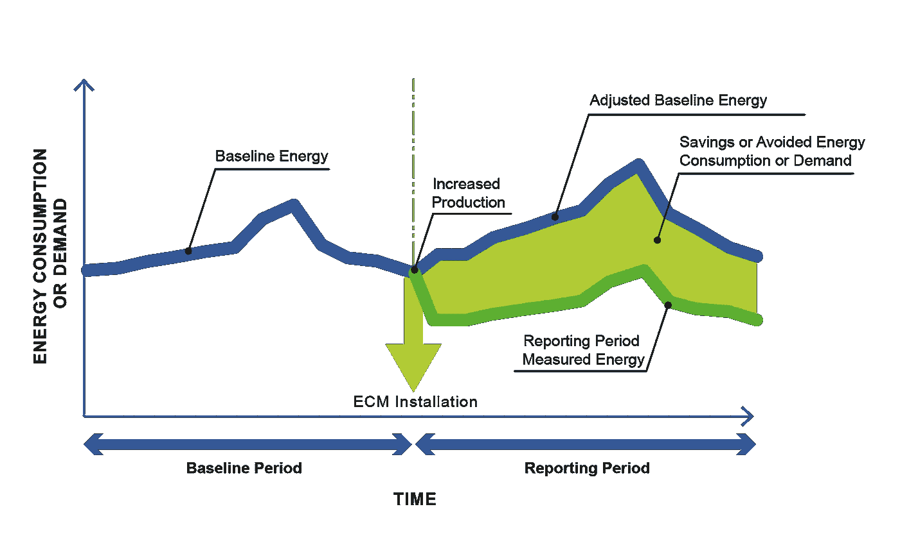

图 0.0 来自 IPMVP 的节能干预预测模型的使用。此图说明了预测模型的使用，并与长期建筑性能模型的节能进行了比较。⁴

# 2.背景

为了进行这种分析，使用来自 ASHRAE 及其贡献者的数据，用 Python 构建了四个 Jupyter 笔记本。⁴ ⁵ ⁶ ⁷

1.  [Part-1-Divide.ipynb](https://nbviewer.jupyter.org/github/stevensmiley1989/ASHRAE-for-ML/blob/master/Part-1-Divide.ipynb)
2.  [Part-2-And.ipynb](https://nbviewer.jupyter.org/github/stevensmiley1989/ASHRAE-for-ML/blob/master/Part-2-And.ipynb)
3.  [Part-3-Conquer.ipynb](https://nbviewer.jupyter.org/github/stevensmiley1989/ASHRAE-for-ML/blob/master/Part-3-Conquer.ipynb)
4.  [Part-4-all siteids . ipynb](https://nbviewer.jupyter.org/github/stevensmiley1989/ASHRAE-for-ML/blob/master/Part-4-AllSiteIds.ipynb)

原始输入数据来自 6 个不同的[文件](https://www.kaggle.com/c/ashrae-energy-prediction/data)，其中有 17 个独特的特征。

如上图，有`16`独特的`site ids`，托管`1448`独特的建筑。建筑的主要用途(`primary_use`)属于`16`的独特类别(即办公、教育等)。除此之外，还有`4`独特的仪表来测量能源使用情况(`1.chilled water`、`2.electric`、`3\. hot water`、`4\. steam`)。

此外，由于时间范围在 2015 年和 2018 年之间，因此有超过**6100 万个**唯一时间戳！这是大量的数据。事实上，那些用于训练和测试的文件的大小分别为 **~0.7 和 1.4 GBs** ，需要一种不简单的数据处理方法！

快速免责声明:出于教育目的，允许在比赛之外使用数据:

> *数据访问和使用*。您可以出于任何商业或非商业目的访问和使用竞赛数据，包括参加竞赛和 Kaggle.com 论坛，以及学术研究和教育。

这些模型的准确性基于均方根对数误差(RMSLE)进行评估:

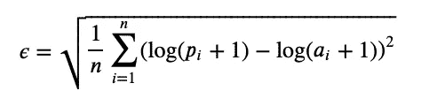

方程式 0。用于模型评估的均方根对数误差(RMSLE)。

其中:

*   `ϵ`是 RMSLE 值(分数)
*   `n`是(公共/私有)数据集中的观测值总数，
*   `pi`是你预测的目标，而
*   `ai`是`i`的实际目标。
*   `log(x)`是`x`的自然对数。

# 3.材料和方法


图 0.1 所用 Jupyter 笔记本的整体流程图。

有一件事变得很明显，那就是这个问题的“泄露”数据的来源。⁹:我不想使用“泄露”的数据，因为我想对我的模型如何在未知的未来数据上工作进行公平的评估。在我看来，这是一个更有价值的方法，尤其是因为我不是为了比赛而这样做。在比赛中，这很常见，而且似乎是获胜的唯一途径。

我的方法的独特之处在于，我用`Site_ID`分解了问题。因此，我的方法将数据分成 16 个模型，因为有 16 个唯一的`Site_ID`数字。这大大减少了一次训练的数据量。这也让我能够专注于每个`Site_ID`的独特差异。无论我在`Site_ID`中注意到什么趋势，我都能够更好地为其建模。基本的总聚集方法不会出现这种情况。

大多数人似乎聚集了所有的数据来形成预测，产生一个 ML 模型来预测未来的能源使用。一些人尝试按仪表类型分割数据，因此有 4 种不同的型号。⁸的一些人试图根据一年中训练的时间将数据一分为二。获胜的⁰团队对“泄露”的数据以及`Site_ID`、`Meter`和`Building & Meter`的组合进行了混合和堆叠。

在网上做了一些挖掘后，我找到了威廉·海登·⁵最近的一篇论文，其中描述了一些与获胜团队有相似之处的方法。他的论文不是专门针对这个问题，而是针对 187 种家庭能源使用。

“首先，每个家庭被独立地建模，产生总共 187 个模型，这些模型的预测被聚合以形成总预测。第二，将家庭汇总，开发一个单一模型，将客户群视为一个单一单元。第三种选择是根据每个家庭的平均日负荷情况对类似的家庭进行分组⁵

我们的问题有 1448 个独特的建筑，这意味着理论上我们可以制作 1448 个独特的模型，就像威廉的第一种方法一样。然而，这种方法在威廉的论文中并不是最优的。最佳方法是根据每个家庭的平均日负荷概况对数据进行聚类(选项 3)。

因此，我的方法是对每个`Site ID`使用类似于最优方法的东西，因为它们通过单向 ANOVA ( **p 值~0** )似乎具有统计上不同的平均值`meter readings`。这意味着我们可以拒绝零假设(每个站点都有相同的平均值`meter reading)`，假设异常值和杂乱的数据没有掩盖真实的平均值。

```
import pingouin as pgaov = pg.anova(data=data_train, dv=’meter_reading’, between=[‘site_id’], detailed=True)
```

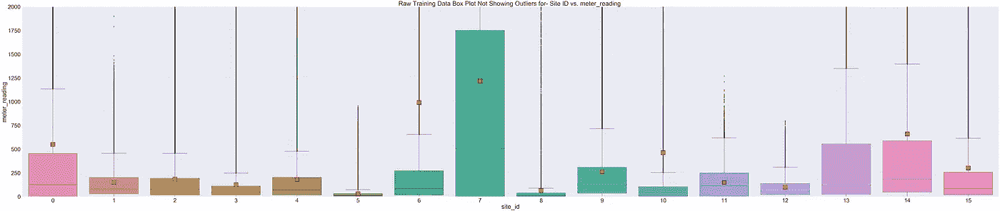

图 0.2 原始训练数据的箱线图，通过将 y 轴限制为 2000 千瓦时排除异常值。请注意，站点 13 的平均值甚至不在此范围内。

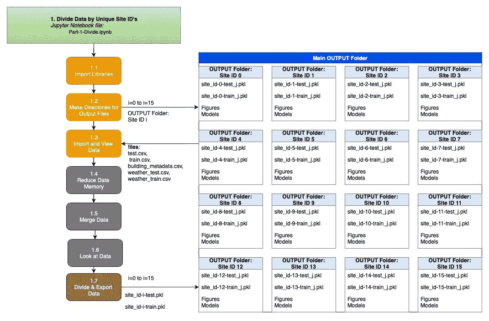

图 1.0[Part-1-divide . ipynb .](https://nbviewer.jupyter.org/github/stevensmiley1989/ASHRAE-for-ML/blob/master/Part-1-Divide.ipynb)流程图

## 第一部分。按唯一的站点 ID 划分数据

Part-1-Divide.ipynb 是一个很短的笔记本，但是非常有效。

**制作输出文件的目录。**这是我制作 16 个独特的输出文件夹的地方，如图 1 所示。为每个站点 ID 创建唯一模型时，这些文件夹是导入和导出文件的占位符。

```
Splits =['Site_ID_0',
         'Site_ID_1',
         'Site_ID_2',
         'Site_ID_3',
         'Site_ID_4',
         'Site_ID_5',
         'Site_ID_6',
         'Site_ID_7',
         'Site_ID_8',
         'Site_ID_9',
         'Site_ID_10',
         'Site_ID_11',
         'Site_ID_12',
         'Site_ID_13',
         'Site_ID_14',
         'Site_ID_15']
```

**导入和查看数据。**在用 unique `Site ID`分割数据之前，我只是确保数据如上所述在那里。我确保`Site ID`没有空值，并且我还确保我可以捕获每个时间戳的索引或引用。这对于在过程结束时将所有东西粘在一起是至关重要的。

```
building = **file_loader**(building)
weather_train_data = **file_loader**(weather_train_data)
data_train = **file_loader**(data_train)
weather_test_data = **file_loader**(weather_test_data)
data_test = **file_loader**(data_test)
```

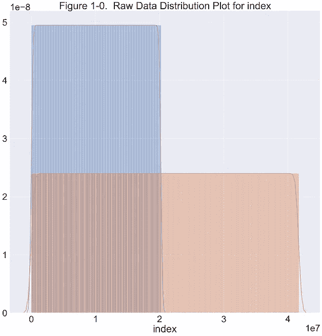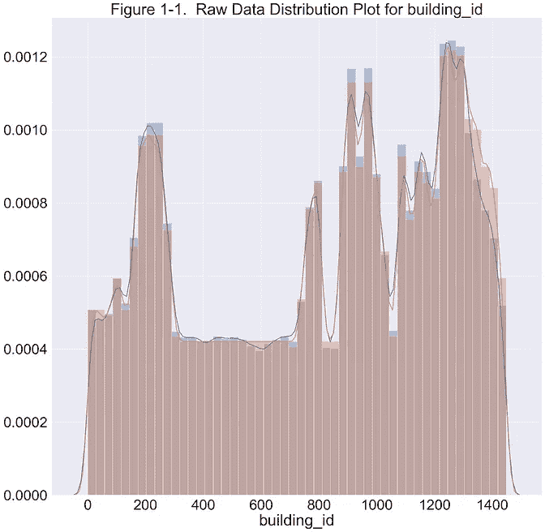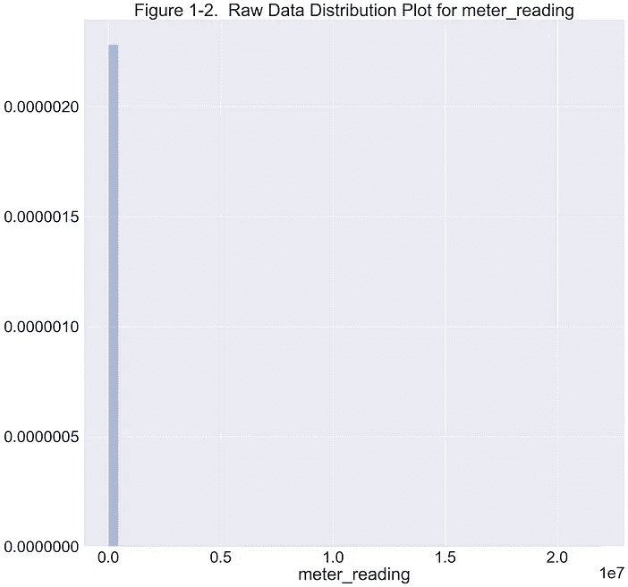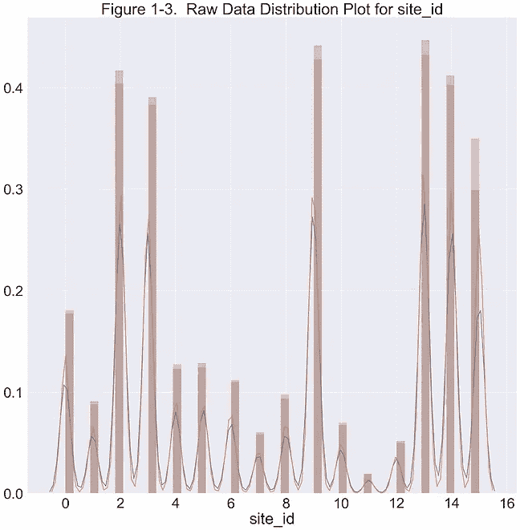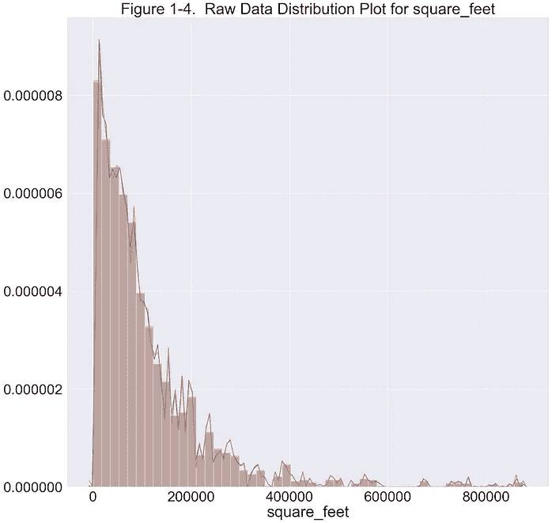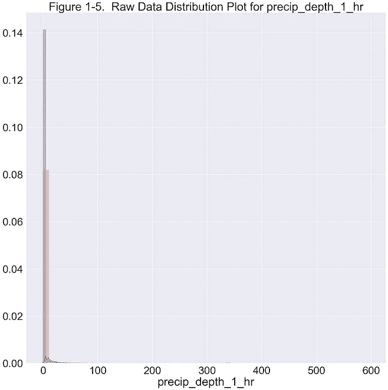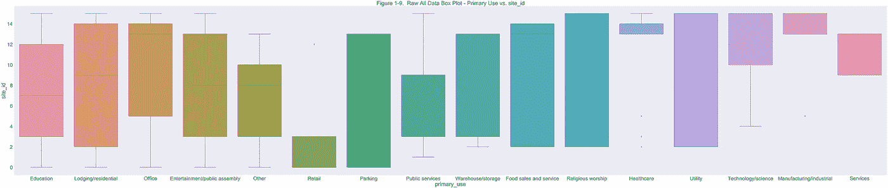

图 1.1。部分数据来自 Part-1-Divide.ipynb Jupyter 笔记本。

**减少数据内存。这些文件非常大！光是 T2 的文件就超过了 1 GB。因此，我需要找到一种方法来减少这些文件的内存，而不丢失有用的信息。我在 Kaggle 讨论板上发现了一些非常有用的数据[缩小策略](https://www.kaggle.com/kyakovlev/ashrae-data-minification)，我认为它们不仅对这个项目，而且对未来的项目都非常有用。本质上，您可以通过搜索数据类型并分别对其进行更改，将数据减少到最少的信息量。当您试图一次运行所有数据来训练 ML 模型时，为了保持脚本运行并且不使您的计算机崩溃，这是绝对必要的。我在余下的工作流程中使用了这个策略。**

```
building = **reduce_mem_usage**(building)
weather_train_data = **reduce_mem_usage**(weather_train_data)
weather_test_data = **reduce_mem_usage**(weather_test_data)
data_train = **reduce_mem_usage**(data_train)
data_test = **reduce_mem_usage**(data_test)
```

**合并数据。在我把主要文件简化成最小的有用形式后，我把它们合并在一起。**

[**merge()**](https://pandas.pydata.org/pandas-docs/stable/reference/api/pandas.DataFrame.merge.html)

```
data_train**.merge**(building, on=’building_id’, how=’left’)
data_train**.merge**(weather_train_data,
                  on=[‘site_id’,‘timestamp’], how=’left’)data_test**.merge**(building, on=’building_id’, how=’left’)
data_test**.merge**(weather_test_data,
                  on=[‘site_id’,‘timestamp’], how=’left’)
```

**划分&导出数据。**[pickle](https://pandas.pydata.org/pandas-docs/stable/reference/api/pandas.DataFrame.to_pickle.html)功能是在这些文件合并和分离后导出它们的一个很好的工具。

```
count=0
for Split_Number in list(Splits): 
    dummy = data_train[(data_train[‘site_id’]==count)]
    # OUTPUTS: Folder for storing OUTPUTS
    print(Split_Number)
    dummy.to_pickle(os.path.join(OUTPUT_split_path[count],
                    ‘site_id-{}-train.pkl’.format(count)))
count+=1
```

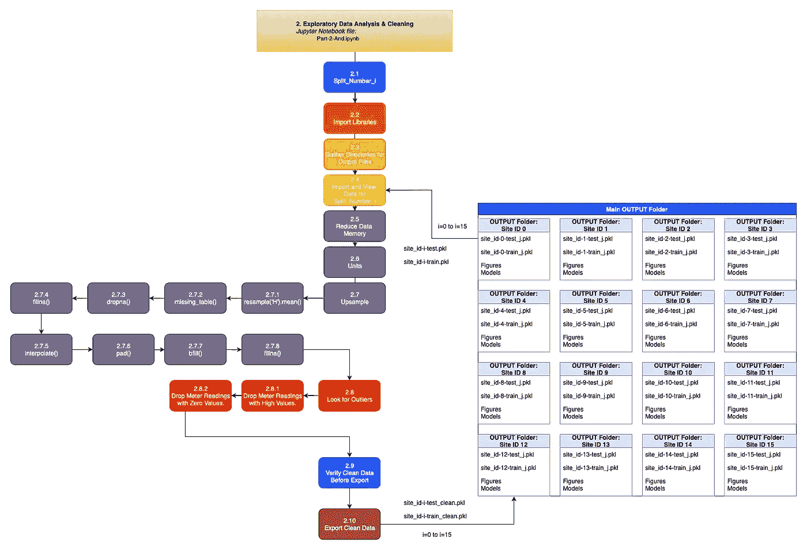

图 2.0[Part-2-and . ipynb .](https://nbviewer.jupyter.org/github/stevensmiley1989/ASHRAE-for-ML/blob/master/Part-2-And.ipynb)流程图

## 第二部分。探索性数据分析和清理

我开始盲目地研究这个问题，没有看讨论板。这让我走上了一条痛苦的道路，寻找并试图理解如何处理缺失和零值数据。然而，这并没有走多远，因为原始数据是如此的杂乱和庞大。

于是，我开始阅读人们对大量杂乱数据所做的工作，并发现了几种解决方法。人们很快指出他们发现的异常值:

1.  建造前显示电表读数的建筑物。⁰
2.  长时间的持续读数。
3.  大正负尖峰。
4.  具有在相同频率下出现仪表读数异常的建筑物的站点。
5.  一般来说，建筑物缺少数据或值为零(这是我马上注意到的一个明显的问题)。

对于缺失的数据，我做了这个小函数，`missing_table`，为了捕捉和总结。

**missing_table()**

```
**def** **missing_table(**data_name**):**
    non_null_counts = data_name.count() 
    null_counts = data_name.isnull().sum() 
    total_counts = non_null_counts+null_counts
    percent_missing= round(100*null_counts/total_counts,1)
    min_non_null = data_name.min()
    median_non_null = data_name.quantile(q=0.5)
    max_non_null = data_name.max()
    missing_data=pd.concat([total_counts,non_null_counts,
                            null_counts,percent_missing,
                            min_non_null,median_non_null,
                            max_non_null],axis=1,keys=   
                       ['Total Counts','Non-Null Counts',
                       'Null Counts','Percent Missing(%)',
                       'Non-Null Minimum','Non-Null Median',
                       'Non-Null Maximum'])
    **return** missing_data
```

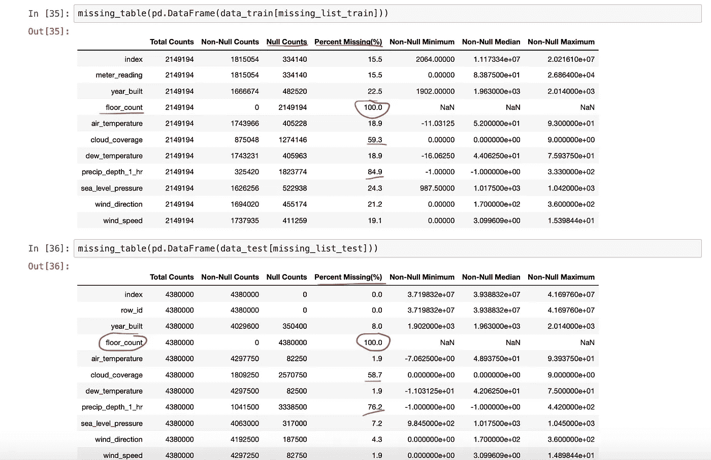

图 2.1。站点 ID 15 中缺失数据表摘要的示例。有很多数据缺失！

我是如何处理这些混乱的？良好的..我首先对数据进行了每小时一次的向上采样，因为这是数据以原始形式出现的最频繁的时间。但是这样做会增加更多的空值，因为它会为未记录的小时数创建时间戳。因此，我做了以下工作，通过一系列的删除、填充空值、插值、向前填充、向后填充以及最后再次填充空值来填充这些空白和之前缺失的大量内容。

## [**重采样(“H”)。**均值()](https://pandas.pydata.org/pandas-docs/stable/reference/api/pandas.DataFrame.resample.html)

我对数据进行了向上采样，取平均值，然后按其独特的`building_id`、`meter`、`site_id`、`primary_use`和`square feet`进行分组。这为其他项目如`air_temperature`、`dew_temperature`、`wind_speed`等留出了一些空间。不过这不是问题。插值将处理大部分这些差距。

```
pd.to_datetime(data_train["timestamp"],format='%Y-%m-%d %H')
data_train=data_train.set_index('timestamp')

pd.to_datetime(data_test["timestamp"],format='%Y-%m-%d %H')
data_test=data_test.set_index('timestamp') grouplist=['building_id','meter','site_id',
           'primary_use','square_feet']

data_train.groupby(grouplist)**.resample('H').mean()**
data_train.drop(grouplist,axis=1)

data_test.groupby(grouplist)**.resample('H').mean()**
data_test.drop(grouplist,axis=1)
```

## [**dropna()**](https://pandas.pydata.org/pandas-docs/stable/reference/api/pandas.DataFrame.dropna.html)

如果一个列有我认为太多丢失的数据，我会将其删除。因此，对于一个站点中丢失数据超过 40%的列，我执行了以下操作:

```
thresh = len(data_train)*.6
data_train**.dropna**(thresh = thresh, axis = 1, inplace = True)

thresh = len(data_test)*.6
data_test**.dropna**(thresh = thresh, axis = 1, inplace = True) 
```

## 菲尔娜()

当对数据进行上采样时，我不想失去对索引的跟踪，因此，我通过将新值设置为-1 来跟踪原始索引以供参考。

```
data_train['index']**.fillna**(-1, inplace = True)
data_test['index']**.fillna**(-1, inplace = True)
```

## [**内插()**](https://pandas.pydata.org/pandas-docs/stable/reference/api/pandas.DataFrame.interpolate.html)

以下连续参数因缺失值而被插值。

```
data_train['meter_reading']**.interpolate()**
data_train['air_temperature']**.interpolate()**
data_train['dew_temperature']**.interpolate()**
data_train['cloud_coverage']**.interpolate()**
data_train['precip_depth_1_hr']**.interpolate()**
data_train['sea_level_pressure']**.interpolate()**       data_train['wind_direction']**.interpolate()**data_test['air_temperature']**.interpolate()**
data_test['dew_temperature']**.interpolate()**
data_test['cloud_coverage']**.interpolate()**
data_test['precip_depth_1_hr']**.interpolate()**
data_test['sea_level_pressure']**.interpolate()**       data_test['wind_direction']**.interpolate()**
```

## [pad()](https://pandas.pydata.org/pandas-docs/stable/user_guide/missing_data.html)

通常在这一点上不会丢失太多数据。这个前向填充函数， **pad()** ，通常得到最后一位。它使用最后一个已知的值，如果缺少该值，则将其向前移动到下一个值。

```
grouplist=['building_id','meter','site_id',
           'primary_use','square_feet']data_train=data_train.groupby(grouplist)**.pad()**
data_test=data_test.groupby(grouplist)**.pad()**
```

## [**isnull()**](https://pandas.pydata.org/pandas-docs/stable/reference/api/pandas.isnull.html)

此时，我将使用 **isnull()** 函数来检查我是否遗漏了什么。如果是，我就用之前的 **fillna()** 带中值或者完全丢弃。此外，我还在 Jupyter 笔记本上记下了每个站点的 ID，以备不时之需。

```
data_train.isnull().sum()
data_test.isnull().sum()
```

好了，现在数据至少是完整的了。离群值呢？

我主要做了两件事:

1.  降低了超出正常值的仪表读数(峰值)。

我认为它们会使我们很难做出一个精确的 ML 模型，因为还有很多其他的假设。

```
data_train.drop((data_train.loc[data_train['meter_reading']> 1.5e+04])['meter_reading'].index)
```

2.降低了零值仪表读数。

我认为这些应该是数据，或者它们是在前面的步骤中填充的，因为那里实际上什么也没有。这在后来可能有点多余，但至少是包容性的。

```
data_train.drop((data_train.loc[data_train['meter_reading']== 0])['meter_reading'].index)
```

## 现在我们可以看到一些东西了！

很难查看混乱且缺少大量值的数据。既然数据已经清理完毕，我只想验证一下。这里有几幅图显示了几个站点的`air_temperature`分布。你可以看到这些地方有他们自己的季节，可能在地理上有不同的气候。请注意，位置 13 为左偏斜，位置 12 为正常，位置 14 为双峰分布。

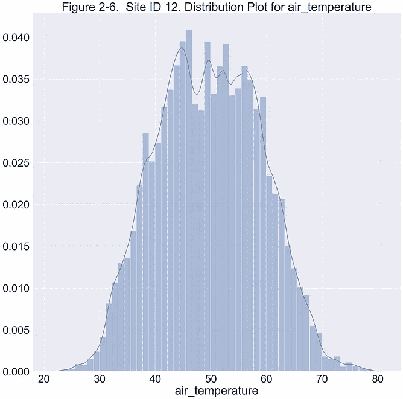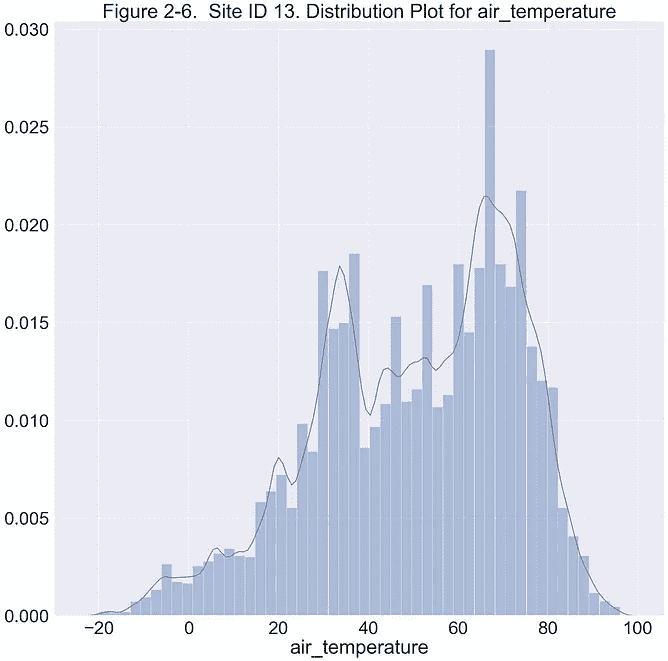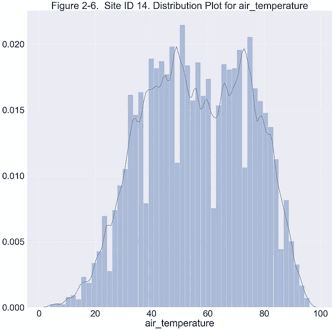

图 2.1。一些不同地点的气温数据显示了它们独特的分布。

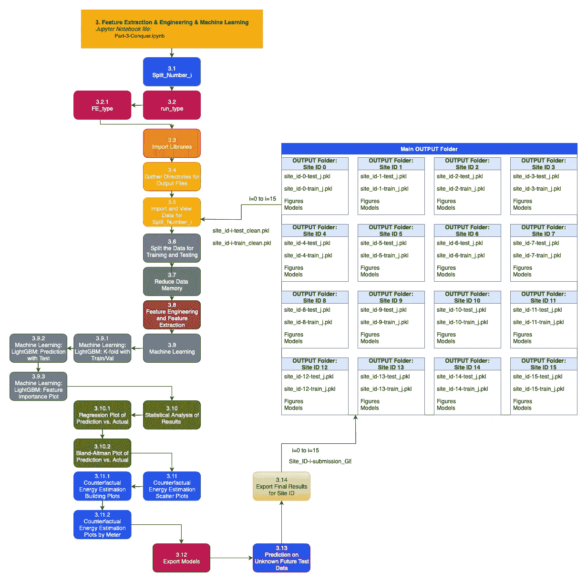

图 3.0[Part-3-convert . ipynb](https://nbviewer.jupyter.org/github/stevensmiley1989/ASHRAE-for-ML/blob/master/Part-3-Conquer.ipynb#Code_Objective_3_9)流程图。

## 第三部分。特征工程、特征提取和机器学习。

## 特征工程()

```
**def** **feature_engineering(**data**)**:
    data[**"hour"**] = data["timestamp"].dt.hour
    data[**"week"**] = data["timestamp"].dt.week
    data[**"month"**] = data["timestamp"].dt.month
    data[**"weekday"**] = data["timestamp"].dt.weekday data[**'Sensible_Heat'**] = 0.5274*(10.**
    (-4.))*data['square_feet']*(75.-data['air_temperature'])

    data[**'log_square_feet'**] = np.log(data['square_feet'])
    data[**'log_floor_count'**] = np.log(data['floor_count'])

    data[**'square_dew_temperature'**]    
    =np.square(data['dew_temperature'])

    *# Holidays*
    holidays = ["2016-01-01", "2016-01-18", "2016-02-15", "2016-05-30", "2016-07-04",
            "2016-09-05", "2016-10-10", "2016-11-11", "2016-11-24", "2016-12-26",
            "2017-01-01", "2017-01-16", "2017-02-20", "2017-05-29", "2017-07-04",
            "2017-09-04", "2017-10-09", "2017-11-10", "2017-11-23", "2017-12-25",
            "2018-01-01", "2018-01-15", "2018-02-19", "2018-05-28", "2018-07-04",
            "2018-09-03", "2018-10-08", "2018-11-12", "2018-11-22", "2018-12-25",
            "2019-01-01"]
    data["**is_holiday"**] =(data.timestamp.dt.date.astype("str").isin(holidays)).astype(int)

    **return** data
```

大多数人似乎把工程师的使用时间放在他们一边。例如，一年中的星期是与目标能量使用有很强相关性的常见特征。这是有意义的，因为一年有冬天和夏天之类的季节，而周数(即 52 周中的 51 周，冬季周)会告知你处于哪个季节。我使用了其中的一些时间策略，但是在问题的机械工程方面更深入了一些。我将所有这些基本特征视为我在日常工程生活中使用和处理的方程的输入。我想我可以设计一些可能与目标结果有关系的新功能。

因此，我钻研了热力学和暖通空调的定律。

我们希望根据建筑使用数据和环境天气数据，预测给定电表的能源使用量。了解所涉及的因素以及它们之间的关系非常重要。

*大图*观点来自*热力学第一定律:*

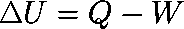

等式 1。热力学第一定律。

其中:

*   问:系统是否增加了热量
*   w 是系统做的功
*   δU 是内能的变化。

因此，这些建筑根据环境条件(即`air temperature`、`dew temperature`、`wind_speed`、`wind_direction`和`cloud_coverage`)改变它们添加或移除的热量，需要能量形式的工作(电、蒸汽等)。

每栋建筑与热力学第一定律之间的一个重要联系是建筑的*供暖、通风和空调(HVAC)* 单元。

影响这些 HVAC 装置添加或移除热量的效率的因素可能与建筑物的年龄有关(`year_built`)。由于过时的 HVAC 设备，旧建筑在添加或移除热量方面可能效率较低(除非它们被翻新！).如果暖通空调系统多年来没有得到适当的维护，那么它可能会由于制冷剂或气流问题而产生不像正常情况下那么多的冷空气。 [⁷](https://www.ashrae.org/technical-resources/free-resources/top-ten-things-consumers-should-know-about-air-conditioning)

基于房间居住者显热的排热通风率可表示为:

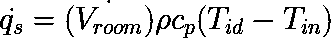

等式 2a。排热的房间通风率。

其中:

*   `q_dot`是房间的显热去除率。
*   `rho`是房间的平均空气密度。
*   `cp`是室内空气的恒定比热。
*   `Vroom`是房间的体积。
*   `Tid`是房间的室内设计温度(通常为 75 华氏度)。
*   `Tin`是进入室内空气的温度。

因此，由于*更多的人*和更大的*空气量*，更大的建筑可能需要更多的能源或 HVAC 容量。建筑物内的空气体积与房间的数量及其各自的体积成正比。因此，建筑的平方英尺(`square_feet`)与建筑空气量成正比，而建筑空气量与通风所需的显热移除量成正比。然而，所需的最小通风率取决于建筑类型和各个房间的独特要求，如 ASHRAE 标准 62.1 中所述。对于粗略的比例关系，我们可以在此基础上设计一个新变量`qs`，即每栋建筑的显热去除率，如下所示:

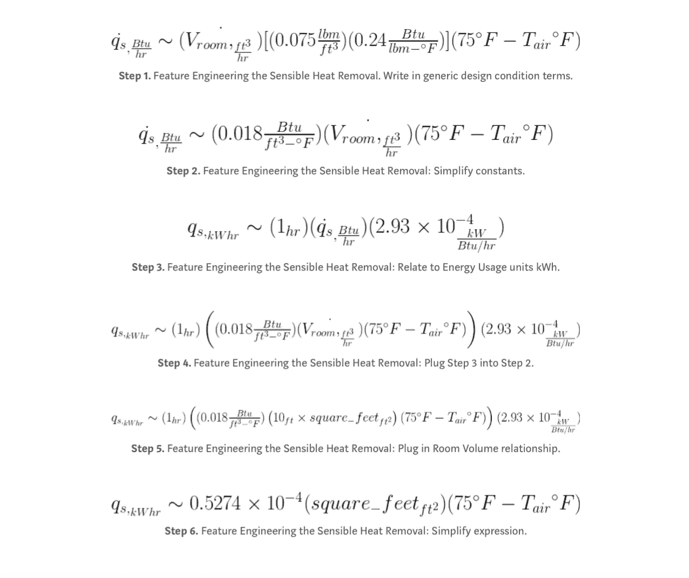

等式 2b。显热去除的特征工程步骤概要。

尽管有标准！ [ASHRAE 标准 62.1](https://www.ashrae.org/technical-resources/bookstore/standards-62-1-62-2) ，规定了所需的*呼吸区室外空气*(即呼吸区的室外通风空气)`Vbz`，作为区域占用量`Pz`和区域占地面积`Az`的函数。⁶第一项(`RpAz`)说明了占用产生的污染物，而第二项(`RaAz`)说明了建筑产生的污染物。ASHRAE 标准 62.1 要求在所有负载条件下运行期间保持以下速率:

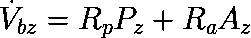

等式 3。ASHRAE 标准 62.1 最低要求呼吸区室外空气流速。⁶

其中:

*   `Vbz`是呼吸区所需的最小室外空气流量
*   `Rp`是人室外空气流速
*   `Pz`是区域占用
*   `Ra`是该区域的室外空气流速
*   `Az`为分区建筑面积。

因此，每栋建筑(`building_id`)可能都有其[自己独特的设计要求](https://www.csemag.com/articles/interpreting-ashrae-62-1/)，这是基于通用的 ASHRAE 62.1 标准。进入该标准的输入是基于占据该房间的设计人数和被占据的建筑或房间的类型。例如，一个`Educational`区域可能需要一个`10 cfm/person`，而一个`Office Building`区域可能需要该房间中的`5 cfm/person`。⁶:这意味着我们可以根据建筑类型来预测不同的能源使用组合(`primary_use`或`site_id`)。

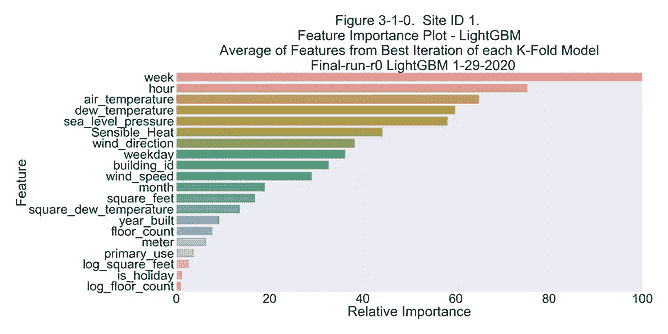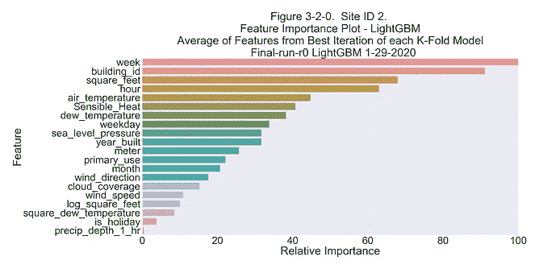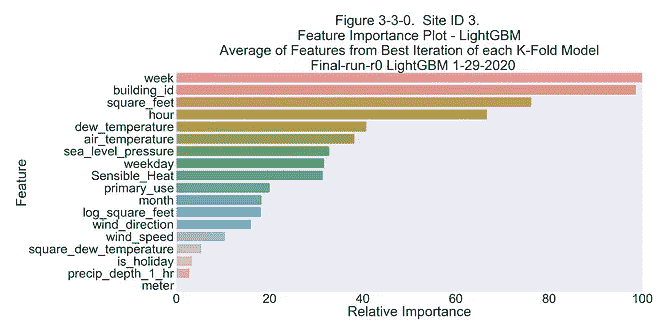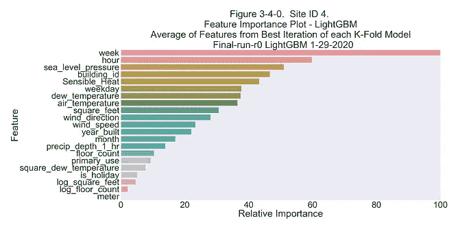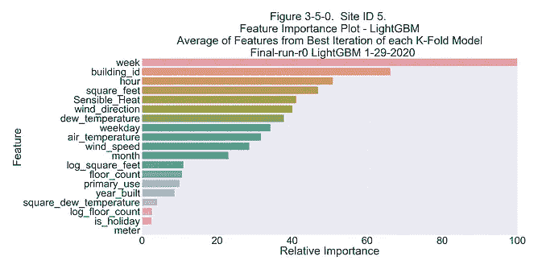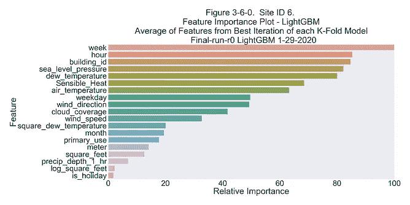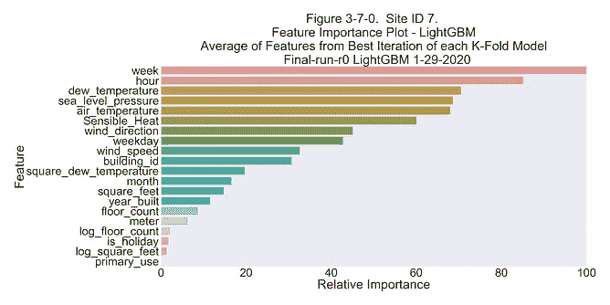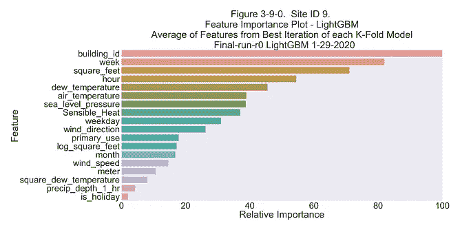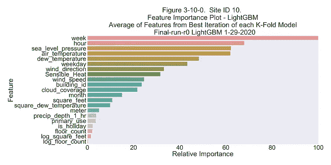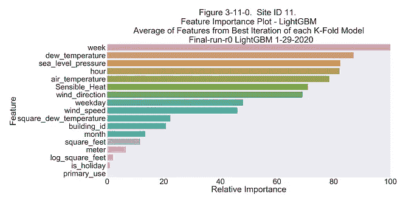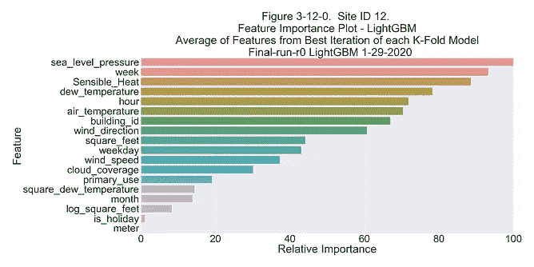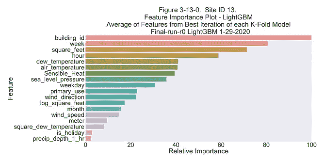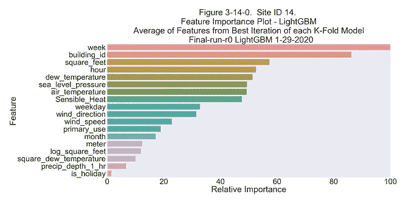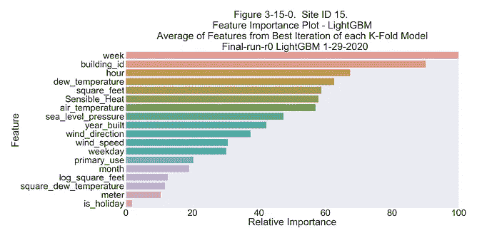

图 3.1。最终运行中不同站点 ID 结果的特征重要性图。

## 拆分数据

我对数据进行了分割，以便在每个季节捕捉一部分数据，用机器学习(ML)算法进行训练和验证。所以冬天是 1 月(1)攻陷，春天是 4 月(4)攻陷，夏天是 7 月(7)攻陷，秋天是 10 月(10)攻陷。因为我们有如此多的数据，我进一步把它分成两半。因此，其中一半的测试月被用于培训。根据`Site_ID`的不同，这在 75%到 90%的训练范围内，这在 80%的经验法则范围内。这是一个时间序列回归问题，因此重要的是不要在一个月内获得所有数据，也不要因为过度拟合而过于频繁。我相信我分割它的方式是一个公平的方法，因为只有全年的训练数据。它大致等间隔地预测未来两年。

```
final_test = test

test = train[(train['timestamp'].dt.month.isin([1,4,7,10]))]

train_w, test = train_test_split(test,test_size=.50,random_state=42)

train = train[(train['timestamp'].dt.month.isin([2,3,5,6,8,9,11,12]))]

train=pd.concat([train,train_w],axis=0)
```

## 缩放数据

我使用了[**minmax scaler()**](https://scikit-learn.org/stable/modules/generated/sklearn.preprocessing.MinMaxScaler.html)为 ML 算法获取 0 到 1 之间的值。我意识到使用[**standard scaler()**](https://scikit-learn.org/stable/modules/generated/sklearn.preprocessing.StandardScaler.html)**可能会更好，因为可能会有异常值。**

```
*#Scale Data*
scalerTrain = MinMaxScaler(feature_range=(0,1))

X_train=scalerTrain.fit_transform(X_train)
X_test=scalerTrain.transform(X_test) 
X_final_test=scalerTrain.transform(X_final_test)
```

## ****机器学习用**[**light GBM**](https://lightgbm.readthedocs.io/en/latest/)**

**在最终决定使用 LightGBM 回归器之前，我尝试使用随机森林回归和 XGBoost 回归器。从我的初步运行来看，随机森林的准确性要差得多，训练的时间也要长得多。XGBoost 不如 LightGBM 精确，而且耗时更长。针对这些问题的培训可能需要几个小时，这取决于如何设置。**

**最初，当我把所有的数据都扔给算法时，需要一夜的时间，通常我的内核会崩溃。我甚至上了谷歌云平台，开始从云端运行模型。连那些内核都崩溃了…哈哈。这是另一个原因，我决定去与 16 个不同的模型更小。这些数据对我来说是可以管理的。我可以看到我在做什么，并且在需要的时候可以修理东西。我还可以完成工作，而不会让我的计算机从所有的 RAM 分配到本地运行中变慢到停止。**

**所以我最终微调了一些超参数，但可能还不够好。主要是因为做这些事花了这么长时间。但是在我写这篇文章的时候，我看到了我的跑垒和上一次跑垒之间的巨大进步。基本上，我的基本跑的均方根对数误差(RMSLE)是 1.566，我的最终跑是 1.292(好了大约 20%)。我知道这些分数不是最大的，但这不是整件事的重点，因为这是后期比赛。这是一次学习经历。**

**我对 LightGBM 的最佳超参数是:**

```
best_params = {
    "objective": "regression",
    "boosting": "gbdt",
    "num_leaves": 1500,
    "learning_rate": 0.05,
    "feature_fraction": ([0.8]),
    "reg_lambda": 2,
    "num_boost_round": 300, 
    "metric": {"rmse"},
}
```

**我将已经像前面提到的那样分割的训练数据分割成 3 个 K 倍，用于训练/验证，如下所示:**

```
kf = KFold(n_splits=3,shuffle=**False**)
count =0
models = []
**for** params **in** list(params_total):
    print('Parms: ',count )
    **for** train_index,test_index **in** kf.split(features_for_train):
        train_features = features_for_train.loc[train_index]
        train_target = target.loc[train_index]

        test_features = features_for_train.loc[test_index]
        test_target = target.loc[test_index]

        d_training = lgb.Dataset(train_features, 
                                 label=train_target, 
                                 free_raw_data=**False**)
        d_test = lgb.Dataset(test_features, 
                             label=test_target,
                             free_raw_data=**False**)

        model = lgb.train(params, 
                          train_set=d_training, 
                          valid_sets=[d_training,d_test], 
                          verbose_eval=100, 
                          early_stopping_rounds=50)   

        models.append(model)
    count += 1
```

**然后我在测试集上预测(不是最终测试集！)，该模型的性能如何，如下所示。注意，因为有 3 个折叠，所以产生了 3 个优化的最佳模型(`best_iteration`)。因此，对我来说，最后的结果是基于这三个的平均值。**

**我在最后的测试中使用了相同的方法，这意味着在训练/验证之后，我没有改变我使用的模型。我只是看了看下面显示的数字，看看模型在我可以与之比较的数据上的表现如何，然后再扔向我无法与之比较的数据(看不见的未来测试数据，2017 年至 2019 年)。他们看起来表现很好！RMSLE 小于 1，对于大多数 all (>0.9)，相关系数很强。**

```
results = []
**for** model **in** models:
    **if**  results == []:
        results = np.expm1(model.predict(features_for_test, num_iteration=model.best_iteration)) / len(models)
    **else**:
        results += np.expm1(model.predict(features_for_test, num_iteration=model.best_iteration)) / len(models)
```

******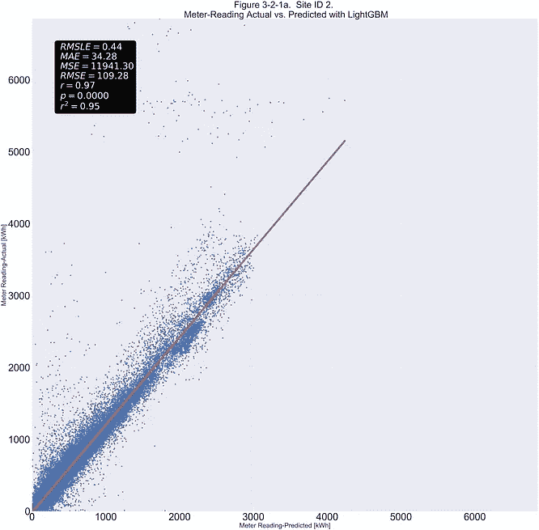****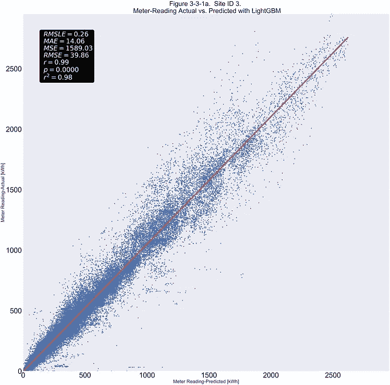****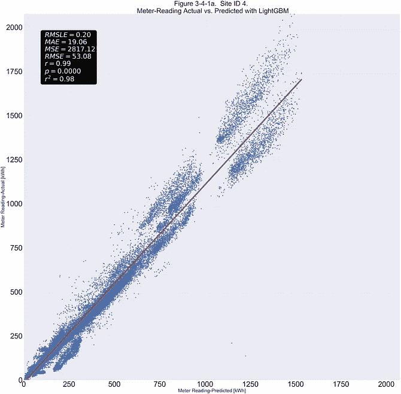****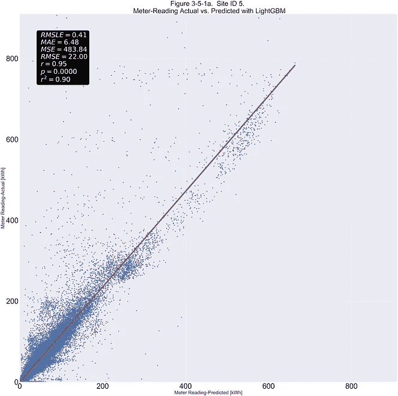****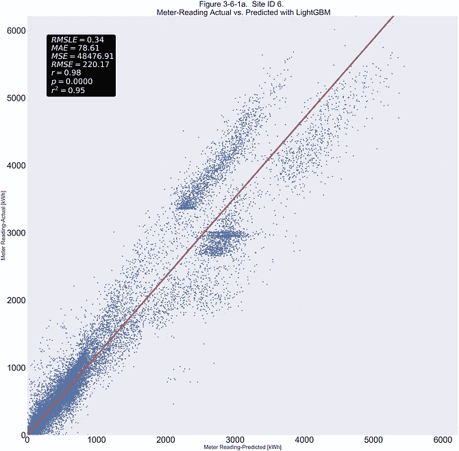****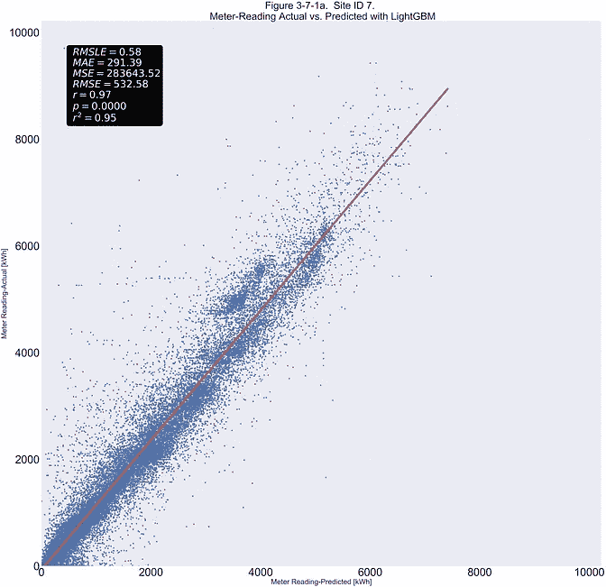****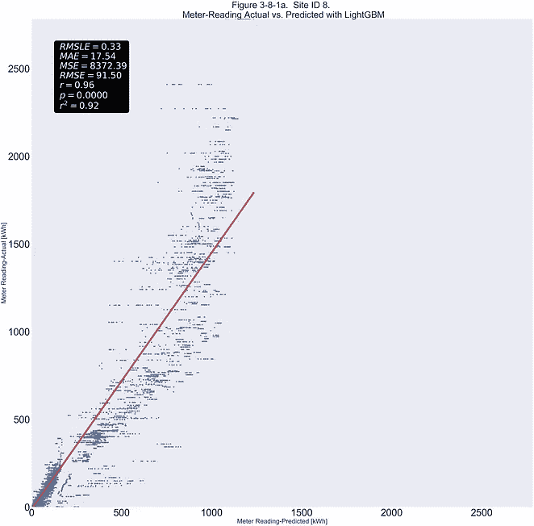****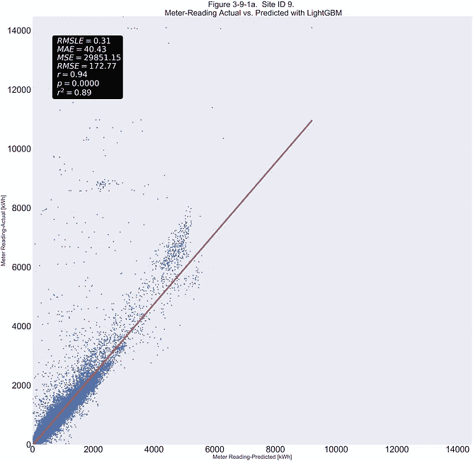****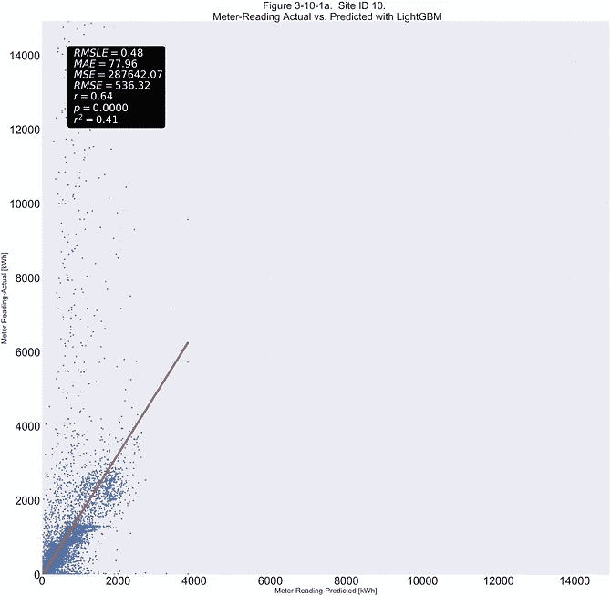****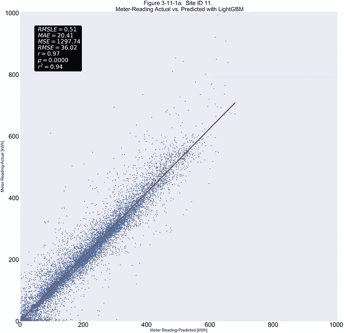********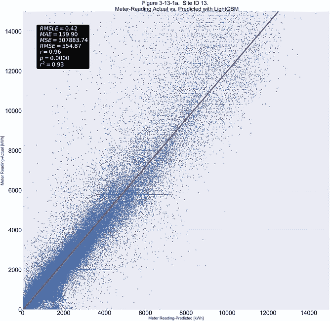****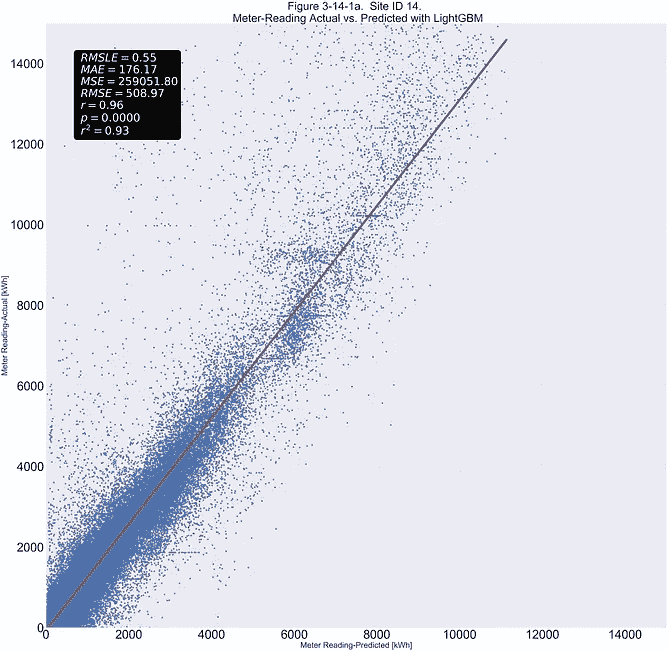****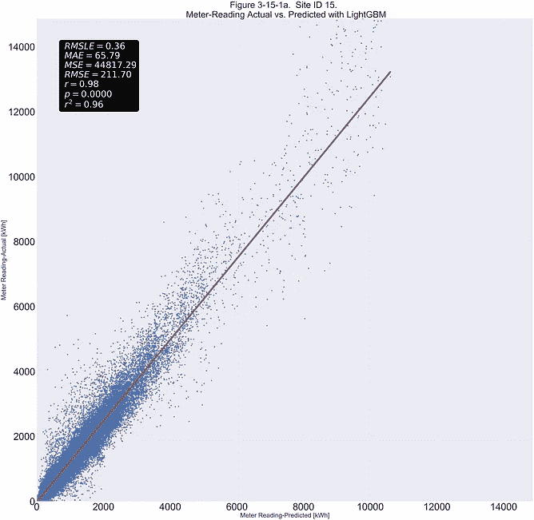**

**图 3.2。用 LightGBM 对实际目标测试数据与预测值进行线性回归比较。**

**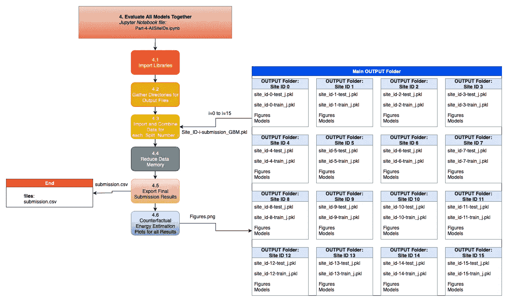**

**图 4.0[Part-4-all siteids . ipynb 流程图](https://nbviewer.jupyter.org/github/stevensmiley1989/ASHRAE-for-ML/blob/master/Part-4-AllSiteIds.ipynb)**

# **4.结果和结论**

## **第四部分。一起评估所有模型。**

**所以…现在是时候总结所有 16 个`site_id`预测的所有结果了。**

```
count=0
**for** Split_Number **in** list(Splits):  
        dummy= os.path.join(OUTPUT_split_path[count],
              "test_Combined_Site_ID_**{}**.csv".format(count)) dummy2 = pd.DataFrame(file_loader(dummy))

        **if** count == 0:
                    test_Combined = dummy2
        **else**:
                    test_Combined = 
                    pd.concat([test_Combined,dummy2],axis=0)
        count+=1
```

****

**图 4.1。显示出比跑垒有进步。**

**就像前面提到的，RMSLE 有了很大的提高，公开分数和私人分数都提高了近 20%。显然，进一步调整 ML 超参数和数据清理可能有助于获得更好的分数。我觉得印象比较深刻的是下图！**

**那么…这些数字到底是什么样子的呢？！**

****************************************************************

**图 4.2 每个站点 ID 上所有建筑物的所有仪表读数的平均每小时消耗量(kWh)。**

**嗷。我认为那看起来令人印象深刻！这是我们在训练模型时不知道的未来两年(红线)，从直觉上看，这非常合理。蓝色的线显示了我们对数据的预测，这看起来也是合理的。**我认为我们可以有把握地说，我们可以制作机器学习(ML)模型来预测建筑物未来的能源使用。**多么有趣又刺激的项目啊！在这次旅行中，我学到了很多东西，也学到了很多我不知道的东西。感谢您的阅读！**

# **5.参考**

1.  **ASHRAE。关于 ASHRAE。从 https://www.ashrae.org/about[检索到 2020 年 1 月](https://www.ashrae.org/about)**
2.  **卡格尔。ASHRAE-大能量预测三(2019)。从[https://www.kaggle.com/c/ashrae-energy-prediction/overview](https://www.kaggle.com/c/ashrae-energy-prediction/overview)检索到 2020 年 1 月**
3.  **ASHRAE。ASHRAE 技术委员会 4.7 数据驱动建模(DDM)分委员会:能量计算**
4.  **辛伯贝斯特。新加坡伯克利建筑在热带地区的效率和可持续性**
5.  **巴德实验室。建筑和城市数据科学**
6.  **德克萨斯 A&M 大学工程实验站**
7.  **ASHRAE 竞赛管理小组成员 Chris Balbach 先生**
8.  **杰夫·哈伯博士，ASHRAE 竞赛管理团队成员**
9.  **Krishnan Gowri 博士，ASHRAE 竞赛管理团队成员**
10.  **沃帕尼，卡格尔笔记本，“ASHRAE:一半一半。”从[https://www.kaggle.com/rohanrao/ashrae-half-and-half](https://www.kaggle.com/rohanrao/ashrae-half-and-half)检索到 2020 年 1 月**
11.  **凯撒勒普姆，卡格尔笔记本，“ASHRAE——从这里开始:一个温和的介绍。”2020 年 1 月检索自[https://www . ka ggle . com/caesarlupum/ASHRAE-start-here-a-gentle-introduction](https://www.kaggle.com/caesarlupum/ashrae-start-here-a-gentle-introduction)**
12.  **CeasarLupum，Kaggle 笔记本，“ASHRAE—lightgbm simple Fe。”2020 年 1 月检索自[https://www . ka ggle . com/caesarlupum/ASHRAE-ligthgbm-simple-Fe](https://www.kaggle.com/caesarlupum/ashrae-ligthgbm-simple-fe)**
13.  **罗曼，卡格尔笔记本，“埃达为 ASHRAE。”从[https://www.kaggle.com/nroman/eda-for-ashrae#meter](https://www.kaggle.com/nroman/eda-for-ashrae#meter)检索到 2020 年 1 月**
14.  **Sandeep Kumar，“ASHRAE-KFold light GBM-无泄漏(1.08)”2020 年 1 月检索自[https://www . ka ggle . com/ai tude/ASHRAE-kfold-light GBM-without-leak-1-08](https://www.kaggle.com/aitude/ashrae-kfold-lightgbm-without-leak-1-08)**
15.  **SciPy。保利·维尔塔宁、拉尔夫·戈默斯、特拉维斯·奥列芬特、马特·哈伯兰、泰勒·雷迪、戴维·库尔纳波、叶夫根尼·布罗夫斯基、皮鲁·彼得森、沃伦·韦克塞、乔纳森·布赖特、斯蒂芬·范德沃特、马修·布雷特、约书亚·威尔逊、贾罗德·米尔曼、尼古拉·马约罗夫、安德鲁·纳尔逊、埃里克·琼斯、罗伯特·克恩、埃里克·拉森、希杰·凯里、i̇lhan·波拉特、余峰、埃里克·摩尔、杰克·范德普拉斯、丹尼斯·拉克萨尔德、约瑟夫·佩尔(2019)SciPy 1.0-Python 中科学计算的基本算法。预印本 arXiv:1907.10121**
16.  **Python。特拉维斯·奥列芬特。用于科学计算的 Python,《科学与工程中的计算》, 9，10–20(2007 年 b) K. Jarrod Millman 和 Michael Aivazis。面向科学家和工程师的 Python，科学与工程中的计算，13，9–12(2011)**
17.  **NumPy。特拉维斯·奥列芬特。美国 NumPy 指南:特雷戈尔出版公司(2006 年)。(b)斯蒂芬·范德沃特、克里斯·科尔伯特和盖尔·瓦洛夸。NumPy 数组:高效数值计算的结构，科学与工程中的计算，13，22–30(2011)**
18.  **IPython。费尔南多·佩雷斯和布莱恩·格兰杰。IPython:用于交互式科学计算的系统，科学与工程中的计算，9，21–29(2007)**
19.  **Matplotlib。亨特，“Matplotlib:2D 图形环境”，《科学与工程中的计算》，第 9 卷，第 3 期，第 90–95 页，2007 年。**
20.  **熊猫。韦斯·麦金尼。Python 中统计计算的数据结构，第 9 届科学中的 Python 会议录，51–56(2010)**
21.  **sci kit-学习。法比安·佩德雷戈萨、加尔·瓦洛夸、亚历山大·格拉姆福特、文森特·米歇尔、贝特朗·蒂里翁、奥利维尔·格里塞尔、马蒂厄·布隆德尔、彼得·普雷登霍弗、罗恩·韦斯、文森特·杜伯格、杰克·范德普拉斯、亚历山大·帕索斯、戴维·库尔纳波、马蒂厄·布鲁彻、马蒂厄·佩罗特、爱德华·杜谢斯奈。sci kit-learn:Python 中的机器学习，机器学习研究杂志，12，2825–2830(2011)**
22.  **sci kit-图像。斯蒂芬·范德沃特、约翰内斯·l·舍恩伯格、胡安·努涅斯-伊格莱西亚斯、弗朗索瓦·布洛涅、约书亚·d·华纳、尼尔·雅戈、伊曼纽尔·古亚尔特、托尼·于和 scikit-image 供稿者。sci kit-Image:Python 中的图像处理，PeerJ 2:e453 (2014)**
23.  **作者:Plotly Technologies Inc .书名:协作数据科学出版社:Plotly Technologies Inc .出版地点:马萨诸塞州蒙特利尔出版日期:2015 URL: [https://plot.ly](https://plot.ly/)**
24.  **越来越多的建筑产生越来越通用的模型——基于开放电表数据的基准预测方法。马赫。学习。知道了。Extr。2019, 1, 974–993.**
25.  **W.Hedén，“使用随机森林和支持向量回归预测每小时住宅能耗:分析家庭聚类对性能准确性的影响”，学位论文，2016 年。**
26.  **林德堡，迈克尔 R. *机械工程参考手册*。第十三版。，专业出版物，2013。**
27.  **ASHRAE。技术资源，“消费者应该知道的关于空调的十大事情。”2020 年 1 月检索自[https://www . ASHRAE . org/technical-resources/free-resources/十大空调消费者须知](https://www.ashrae.org/technical-resources/free-resources/top-ten-things-consumers-should-know-about-air-conditioning)**
28.  **NZ，“按仪表类型对齐时间戳-LGBM”2020 年 1 月检索自[https://www . ka ggle . com/NZ 0722/aligned-timestamp-lgbm-by-meter-type](https://www.kaggle.com/nz0722/aligned-timestamp-lgbm-by-meter-type)**
29.  **卡格尔。ASHRAE-大能量预测三(2019)-讨论板。“对于数据泄露将采取什么措施？”检索 2020 年 1 月[https://www . ka ggle . com/c/ASHRAE-energy-prediction/discussion/116739](http://ASHRAE-Great Energy Predictor III (2019). Retrieved January, 2020)**
30.  **卡格尔。ASHRAE-大能量预测三(2019)-讨论板。"在建成之前消耗能源的建筑."检索到 2020 年 1 月。[https://www . ka ggle . com/c/ASHRAE-energy-prediction/discussion/113254](https://www.kaggle.com/c/ashrae-energy-prediction/discussion/113254)**
31.  **卡格尔。ASHRAE-大能量预测三(2019)-讨论板。“第一名解决方案团队 Isamu & Matt。”检索到 2020 年 1 月。[https://www . ka ggle . com/c/ASHRAE-energy-prediction/discussion/124709](https://www.kaggle.com/c/ashrae-energy-prediction/discussion/124709)**
32.  **康斯坦丁·雅科夫列夫。卡格尔笔记本，“ASHRAE——数据缩小”检索到 2020 年 1 月。[https://www.kaggle.com/kyakovlev/ashrae-data-minification](https://www.kaggle.com/kyakovlev/ashrae-data-minification)**
33.  **效率评估组织。国际性能测量和验证协议。可在线查询:[https://Evo-world . org/en/products-services-main menu-en/protocols/IP MVP](https://evo-world.org/en/products-services-mainmenu-en/protocols/ipmvp)(2020 年 1 月 26 日访问)。**