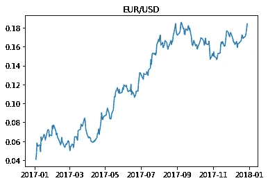
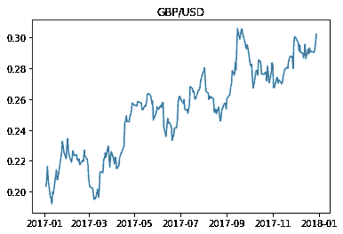
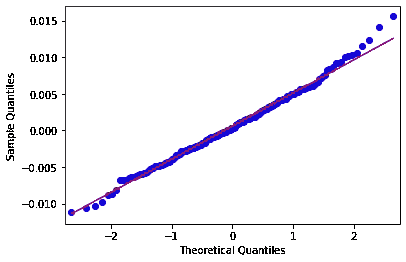
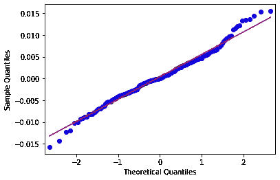
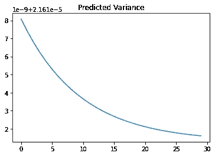
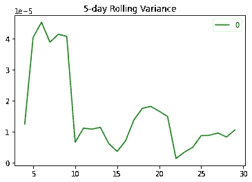
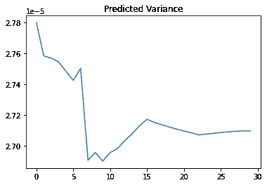
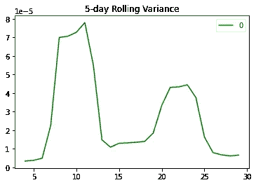

# 使用 GARCH 估计货币波动

> 原文：<https://towardsdatascience.com/estimating-currency-volatility-using-garch-e373cf82179d?source=collection_archive---------26----------------------->

## GARCH 如何用于资产价格波动建模

*免责声明:本文是在“原样”的基础上编写的，没有任何担保。它旨在提供数据科学概念的概述，不应被解释为投资建议或任何其他类型的专业建议。*

资产价格在时间序列中具有高度的随机趋势。换句话说，价格波动受很大程度的随机性影响，因此很难使用传统的时间序列模型(如 ARIMA 模型)来预测资产价格。

此外，由于今天的大部分交易都是在算法的基础上进行的——价格会在这种预测的基础上不断调整——因此很难在市场中占据优势。

例如，假设我构建了一个时间序列模型来预测一个城市未来三个月的降雨量。我的时间序列模型可能有很高的精确度，因为预测不会影响未来的降雨量。然而，如果每个人都使用 ARIMA 模型来预测未来三个月的资产价格波动——那么基于这些预测的后续交易将直接影响之前的预测——从而在许多情况下使它们无效。

# 背景

因此，通常对金融市场中资产价格的**预期波动率**建模——而不是直接预测预期价格。

让我们看看如何使用 Python 来实现这一点。GARCH 模型用于预测欧元/美元和英镑/美元货币对的波动性，使用 2017 年 1 月至 2018 年 1 月的数据。

数据来源于 FRED 使用的 Quandl 库:

```
eurusd = quandl.get("FRED/DEXUSEU", start_date='2017-01-01', end_date='2018-01-01', api_key='enter_api_key')gbpusd = quandl.get("FRED/DEXUSUK", start_date='2017-01-01', end_date='2018-01-01', api_key='enter_api_key')
```

序列被转换为对数格式以平滑时间序列:

## 欧元/美元



资料来源:Quandl

## 英镑/美元



资料来源:Quandl

然后对数据进行一阶差分，以近似高斯分布。

Dickey-Fuller 检验显示两个序列的 p 值均为 0，表明我们拒绝了单位根存在于 5%显著性水平的零假设，即模型中存在平稳性或趋势平稳性。

**欧元/美元:迪基-富勒测试结果**

```
>>> result = ts.adfuller(data, 1)
>>> result(-16.26123019770431,
 3.564065405943774e-29,
 0,
 247,
 {'1%': -3.457105309726321,
  '5%': -2.873313676101283,
  '10%': -2.5730443824681606},
 -1959.704886024891)
```

**英镑/美元:迪基-富勒测试结果**

```
>>> result = ts.adfuller(data, 1)
>>> result(-12.380335699861567,
 5.045829408723097e-23,
 1,
 246,
 {'1%': -3.457215237265747,
  '5%': -2.873361841566324,
  '10%': -2.5730700760129555},
 -1892.8308007824835)
```

此外，对 QQ 图的视觉筛选显示，该系列现在基本上遵循正态分布:

**欧元/美元:QQ 图**



来源:Jupyter 笔记本输出

**英镑/美元:QQ 图**



来源:Jupyter 笔记本输出

# GARCH 建模

构建 GARCH(1，1)模型来预测两种货币对的过去 30 天交易数据的波动性。以前的数据用作 GARCH 模型的训练集。

```
# split into train/test
n_test = 30
train, test = data[:-n_test], data[-n_test:]
# define model
model = arch_model(train, mean='Zero', vol='GARCH', p=1, q=1)
```

预测生成如下:

```
# fit model
model_fit = model.fit()
# forecast the test set
yhat = model_fit.forecast(horizon=n_test)
```

现在，让我们跨测试集比较预测的方差和实际的 5 天滚动方差。

## **欧元/美元**

*预测方差*

```
test.rolling(window=5).var().plot(style='g')
pyplot.title("5-day Rolling Variance")
```



来源:Jupyter 笔记本输出

*5 天滚动差异*

```
pyplot.plot(yhat.variance.values[-1, :])
pyplot.title("Predicted Variance")
pyplot.show()
```



来源:Jupyter 笔记本输出

我们看到，GARCH 模型预测了过去 30 天的波动性下降(以方差衡量)——这通过实际 5 天滚动方差的视觉检查得到了证实。

让我们来看看英镑/美元的对比。

## **英镑/美元**

*预测方差*



来源:Jupyter 笔记本输出

*5 天滚动差异*



来源:Jupyter 笔记本输出

我们可以看到，虽然预测的方差比实际的 5 天滚动方差小得多，但两个实例都预测在 30 天的测试期间方差会减少。

这与我们实际观察到的情况相符-相对于交易年度的其他月份，2017 年 12 月欧元/美元和英镑/美元货币对的波动很小。

# 结论

这是 GARCH 如何用于时间序列波动建模的一个例子。

希望你觉得这篇文章有用，任何问题或反馈都非常感谢。

# 参考

*   [机器学习掌握:如何在 Python 中使用 ARCH 和 GARCH 对时间序列预测的波动性建模](https://machinelearningmastery.com/develop-arch-and-garch-models-for-time-series-forecasting-in-python/)