# 从观测数据估计房室模型的参数

> 原文：<https://towardsdatascience.com/estimating-parameters-of-compartmental-models-from-observed-data-62f87966bb2b?source=collection_archive---------20----------------------->

## 非线性最小二乘最小化估计 SEIR 和塞德模型的参数

在本文中，我们将定义 SEIR 和塞德模型，并最小化非线性最小二乘法，以从冠状病毒病例的观察数据中估计它们的参数。为了表现良好，非线性优化技术，如[leven Berg–Marquardt(LM)算法](https://en.wikipedia.org/wiki/Levenberg%E2%80%93Marquardt_algorithm)需要良好的初始猜测来解决非线性最小二乘优化。我们将使用 [SEIR 和塞德模型模拟](/simulating-compartmental-models-in-epidemiology-using-python-jupyter-widgets-8d76bdaff5c2)来猜测参数估计值，并在优化中使用这些值。

> 请注意，这纯粹是一个编程和数据科学练习，因此不要根据模拟或参数估计得出结论。这最好留给流行病学和医学专家去做。

在我们深入研究之前，让我们先熟悉一下 SEIR 和塞德所属的模型类型。

但是，如果您想直接进入代码，在 SEIR 模型的[仿真&参数估计和塞德模型](https://github.com/silpara/simulators/blob/master/compartmental_models/SEIR%20Simulator%20with%20Parameter%20Estimation%20in%20Python.ipynb)的[仿真&参数估计中可以获得带有完整代码的 Jupyter 笔记本。](https://github.com/silpara/simulators/blob/master/compartmental_models/SEIRD%20Simulator%20with%20Parameter%20Estimation%20in%20Python.ipynb)

# 机械模型

机械模型用于模拟和预测疾病和感染的传播，如流感、埃博拉甚至冠状病毒。与机器学习模型相比，机械模型的一个显著特征是它们能够对疾病传播的假设因果性质进行编码。这通常涉及构建因果机制的数学公式，并使用分析工具用观测数据验证这些假设[R. Baker 等人，2018]。

简而言之，机械模型是可以解释的，而机器学习模型通常是不可以解释的。正因为如此，一个能够很好地解释这一现象的机械模型可以提供关于疾病如何传播以及可能如何应对的深刻信息。下面的表 1 列出了这两种模型提供的数据和信息类型的差异。

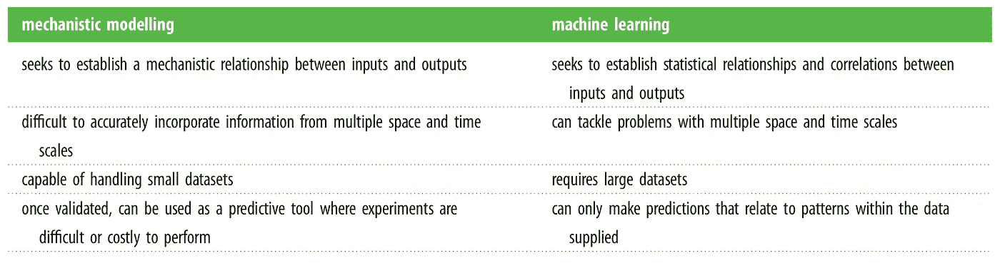

表 1: Baker RE，pea J-M，Jayamohan J 和 Jérusalem A，2018 机械论模型对机器学习，一场值得为生物界而战的战斗？生物。信件。18866 . 688686868617

## 分室模型

房室模型是一种机械模型，它将种群分成称为*房室*的组。它们基于一个常微分方程系统，该系统表达了一个群体的不同流行病学状态之间的动态。它们有助于对一种现象(如疾病)的传播进行短期和长期预测，也可用于研究不同干预措施的效果[Chowell，2017]。

## SEIRD 塞德公司

下面的图 1 和图 2 显示了 SEIR 和塞德模型中流行病学状态之间的间隔和进展。


图 1: SEIR 模型


图 2: SEIRD 模型

要查看这些模型的动力系统以及如何用 python 模拟它们的更多细节，请参考[使用 Python 模拟流行病学中的房室模型& Jupyter Widgets](/simulating-compartmental-models-in-epidemiology-using-python-jupyter-widgets-8d76bdaff5c2) 。

# 估计参数

在这一节中，我们将讨论数据，模型和最小化非线性最小二乘参数估计。

## 数据

我们将使用印度[新冠肺炎 REST API](https://api.rootnet.in/covid19-in/stats/history)提供的印度冠状病毒病例数据。从 API 返回的 JSON 的结构如下，

```
{
'success': boolean, 
'data': [
         {'day': 'YYYY-MM-DD', 
          'summary': {
                     'total': int,
                     'confirmedCasesIndian': int,
                     'confirmedCasesForeign': int,
                     'discharged': int,
                     'deaths': int,
                     'confirmedButLocationUnidentified': int
                     }, 
          'regional': [
                       {
                       'loc': string,
                       'confirmedCasesIndian': int,
                       'discharged': int,
                       'deaths': int,
                       'confirmedCasesForeign': int,
                       'totalConfirmed': int
                       }                     
                      ]
          }
         ], 
'lastRefreshed': timestamp, 
'lastOriginUpdate': timestamp
}
```

数据示例如下所示，

```
{
 'success': True,
 'data': [
          {'day': '2020-03-10',
           'summary': {
                      'total': 47,
                      'confirmedCasesIndian': 31,
                      'confirmedCasesForeign': 16,
                      'discharged': 0,
                      'deaths': 0,
                      'confirmedButLocationUnidentified': 0
                      },
           'regional': [
                        {
                        'loc': 'Delhi',
                        'confirmedCasesIndian': 4,
                        'confirmedCasesForeign': 0,
                        'discharged': 0,
                        'deaths': 0,
                        'totalConfirmed': 4},
                        {
                        'loc': 'Haryana',
                        'confirmedCasesIndian': 0,
                        'confirmedCasesForeign': 14,
                        'discharged': 0,
                        ...
                        }
                        ...
                        ]
            }
            ...
           ],
 'lastRefreshed': '2020-04-27T04:30:02.090Z', 
 'lastOriginUpdate': '2020-04-27T02:30:00.000Z'
}
```

这些数据可以很容易地转换成 pandas 数据框，我们熟悉使用下面这段代码

让我们看看下面表 2 中熊猫数据帧的前 5 行，

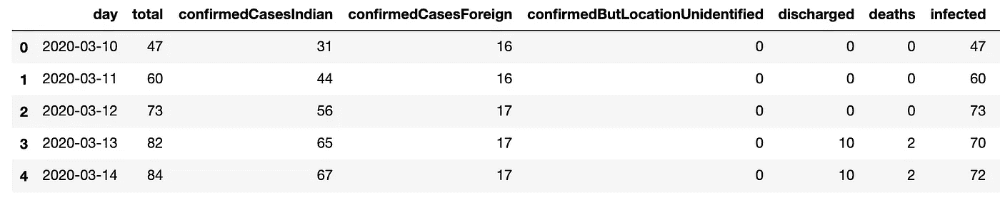

表 2:印度有新冠肺炎病例的数据帧样本

由于每天都有新的非零阳性病例，印度冠状病毒阳性病例总数仍在上升。案件趋势如下图 3 所示。

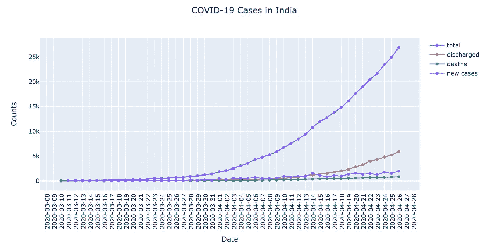

图 3:印度的新冠肺炎病例

现在，让我们用 python 来定义模型。

## 定义 SEIR 和塞德模型

SEIR 和塞德模型是由一个常微分方程系统定义的。让我们看看这些 ode 是什么，以及如何用 python 编码和求解它们，

**SEIR**

数学模型

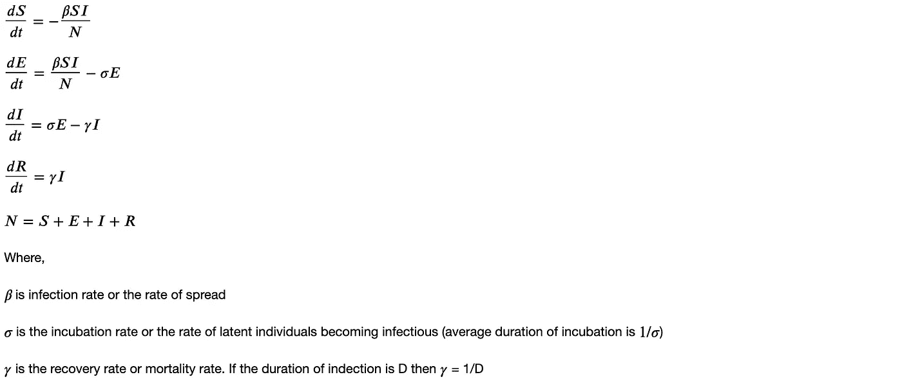

图 4: SEIR 动力系统

Python 代码

**塞德**

数学模型

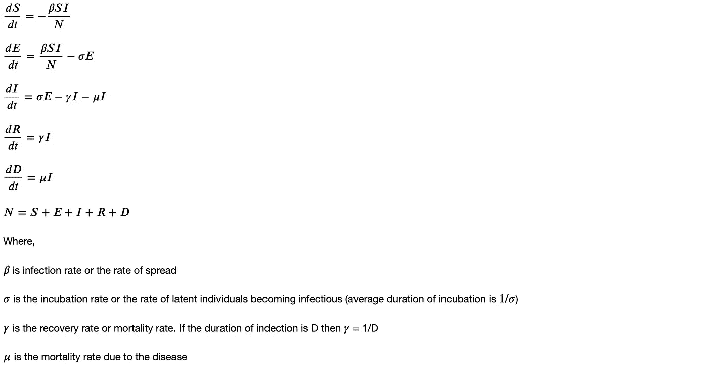

图 5: SEIRD 动力系统

Python 代码

我们将使用 scipy 中的 odeint 模块来求解这些方程组。像 ODE 的系统一样，求解 ODE 的函数也非常相似。让我们看看如何用 Python 为 SEIRD 模型编码。

要解一个常微分方程系统，你需要初始条件和描述你的方程的参数。您可以在上面的 python 代码中观察到这些。

接下来，我们使用非线性最小二乘最小化来优化 ODE 的参数。

## 非线性最小二乘最小化

## **什么是非线性最小二乘法？**

非线性模型是指输出和输入之间的关系在模型参数中不是线性的。例如

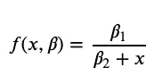

图 6:米氏–门滕酶动力学模型

[Michaelis–Menten 模型](https://en.wikipedia.org/wiki/Nonlinear_regression)不能表示为两个β的线性组合。

现在，非线性最小二乘可以定义为，*“非线性最小二乘是最小二乘分析的一种形式，用于将一组 m 个观测值与一个在 n 个未知参数(m ≥ n)中为非线性的模型进行拟合。”—维基百科*

最小化非线性最小二乘的算法(例如 LM)需要更接近最优值的良好的初始参数估计。接下来，我们将使用模型的模拟来达到一个良好的初始估计。

**模拟**

我们将使用后[中构建的 SEIR 和塞德模型的模拟器，使用 Python & Jupyter Widgets](/simulating-compartmental-models-in-epidemiology-using-python-jupyter-widgets-8d76bdaff5c2) 模拟流行病学中的房室模型，并为此进行一些修改。

在尝试了各种参数组合后，beta(感染率)= 1.14，sigma(孵化率)= 0.02，gamma(恢复率)= 0.02，mu(死亡率)= 0.01，似乎是 SEIRD 模型的合理初始估计。模拟器设置可以在下面的图 7 中看到。

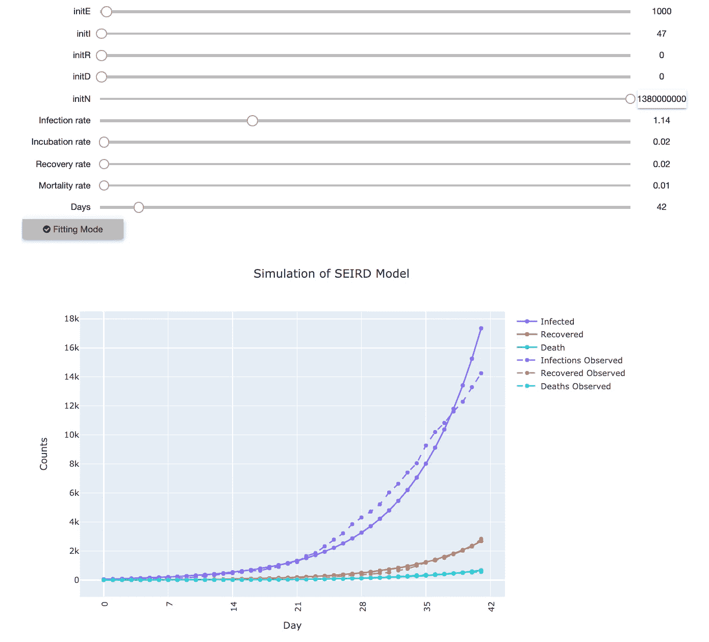

图 7:使用 SEIRD 模拟器直观拟合初始参数估计数据

类似的方法可以用于 SEIR 模型。现在，让我们使用初始猜测，使用 LM 算法进一步优化参数。

**优化**

在不涉及太多细节的情况下，在 leven Berg-Marquardt 算法(也称为阻尼最小二乘法(DLS ))中，连续时段中的权重变化由下式给出:

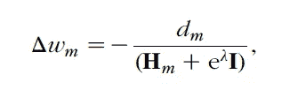

图 8:LM 算法中历元 m 的所有权重的权重变化的通用公式。应用科学与工程的神经网络。

我们将使用 python 中 *lmfit* 库中的 *minimize* 模块，使用 LM 算法实现非线性最小二乘的最小化。*最小化*需要残差以及模型的其他参数作为优化输入。让我们对残差进行编码，并将其传递给*最小化*，如下所示。

现在，用 LM 算法( *leastsq* )最小化非线性最小二乘非常简单，如下面的代码所示。

优化完成后，您可以打印优化的模型参数并可视化拟合。

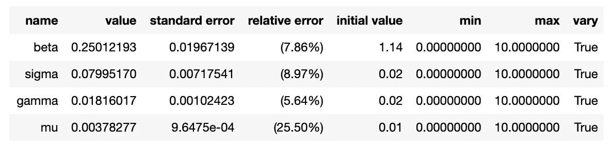

表 3:优化的模型参数

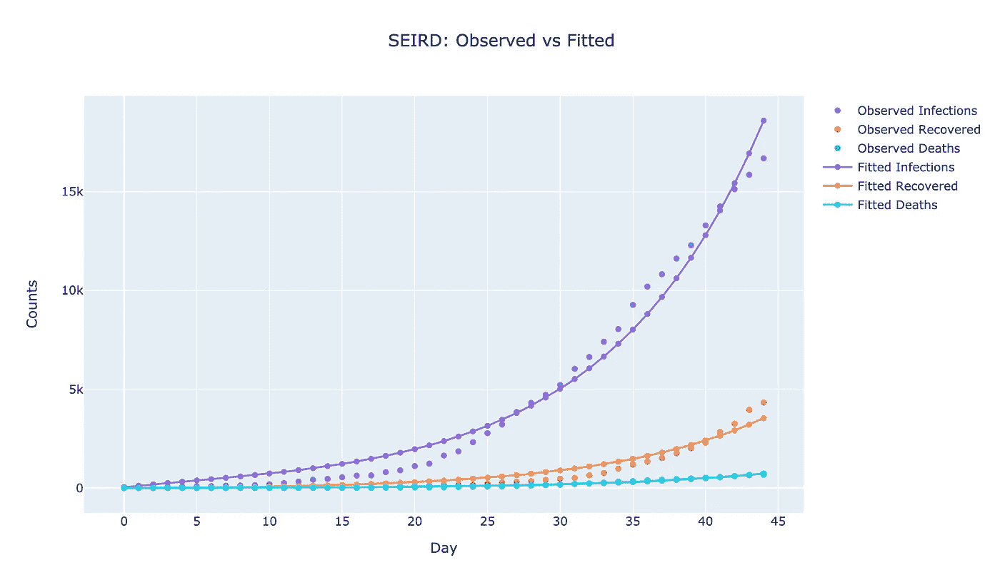

图 9:观察图与拟合图

**指标**

我们还可以通过使用优化的参数并调用上面定义的 *ode_solver* 来计算像 MAE 和 RMSE 这样的指标。在写这篇文章的时候，我发现这些价值观是，

```
Fitted MAE
Infected:  587.5587793520101
Recovered: 216.5347633701369
Dead:      21.532532235433454

Fitted RMSE
Infected:  702.1643902204037
Recovered: 284.9841911847741
Dead:      26.4463792416788
```

您还可以在模拟器中输入优化的参数值，以查看流行病学状态曲线，如图 9 所示。

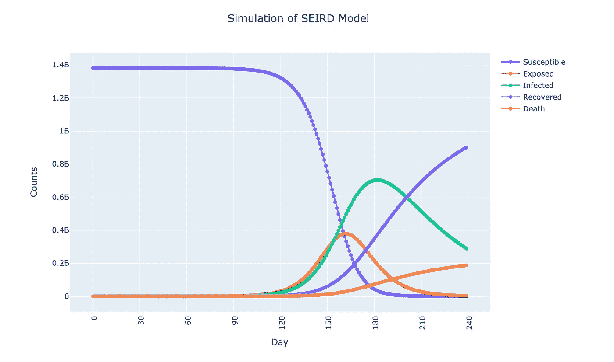

图 10:具有优化参数的 SEIRD 模型模拟

# 完全码

在 SEIR 模型的[仿真&参数估计和赛德模型](https://github.com/silpara/simulators/blob/master/compartmental_models/SEIR%20Simulator%20with%20Parameter%20Estimation%20in%20Python.ipynb)的[仿真&参数估计中可以找到完整代码的 jupyter 笔记本。](https://github.com/silpara/simulators/blob/master/compartmental_models/SEIRD%20Simulator%20with%20Parameter%20Estimation%20in%20Python.ipynb)

# 结论

在这篇文章中，我们了解到，

1.  机械模型、分室模型、SEIR 模型和塞德模型
2.  用 Python 写颂歌并解决它们
3.  非线性模型和非线性最小二乘法
4.  利用 SEIRD 塞德模拟器和 lmfit 库中的最小化模块优化 ODE 参数
5.  在模拟器中使用优化的参数来可视化流行病学状态曲线

*注意，同样的方法也可以用于编码和优化任何 ode 系统。

我们没有学到的东西(有意识的选择)

1.  如何解读这些流行病学模型的结果？
2.  曲线什么时候会变平？有多少人会感染、康复、死亡等？我们什么时候能重新启动经济？

让我们把这些重要的问题留给专家来回答。

# 参考

1.  Baker RE，pea J-M，Jayamohan J 和 Jérusalem A，2018，机械模型对机器学习，一场值得为生物界而战的战斗？生物。http://doi.org/10.1098/rsbl.2017.0660
2.  Chowell G,《用量化的不确定性拟合流行病爆发的动态模型:参数不确定性、可识别性和预测的初级读本》( 2017 年),《传染病建模》第 2 卷第 3 期，2017 年 8 月，第 379-398 页
3.  [非线性最小二乘法(维基百科)](https://en.wikipedia.org/wiki/Non-linear_least_squares)
4.  [非线性回归(维基百科)](https://en.wikipedia.org/wiki/Nonlinear_regression)
5.  萨马拉辛哈，2007，应用科学与工程的神经网络