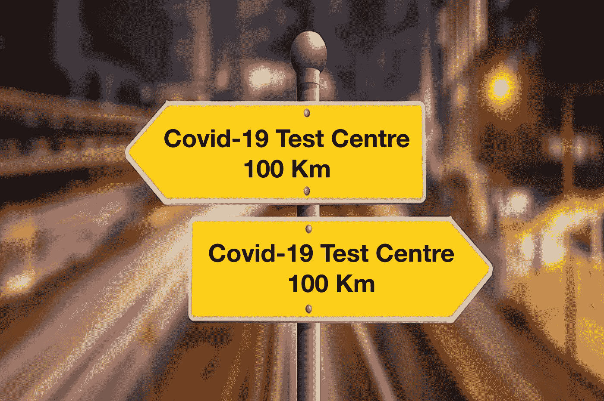
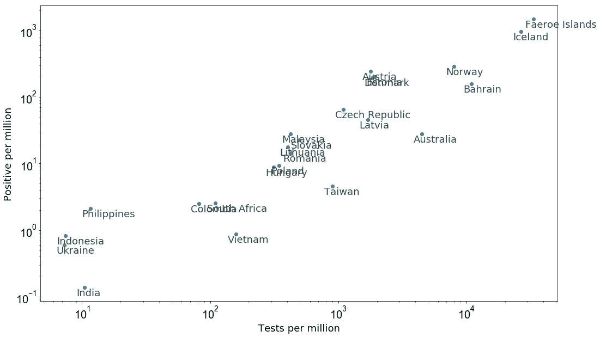
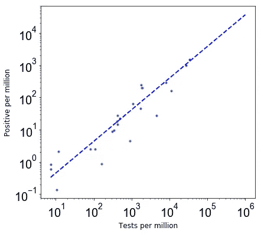
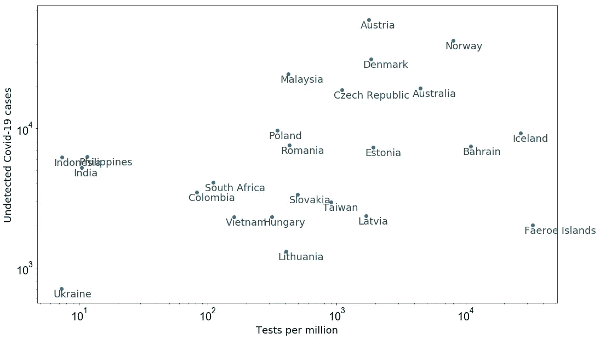
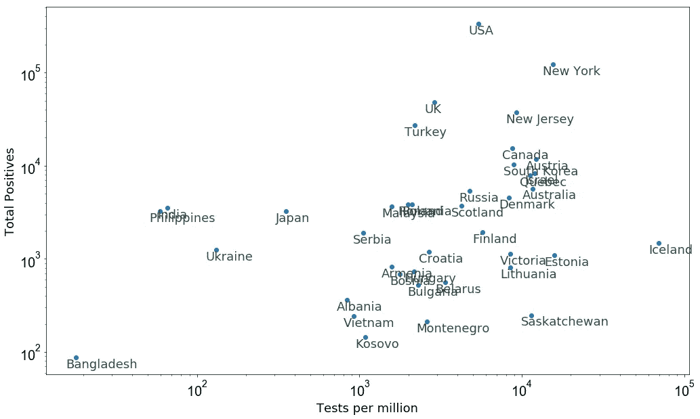
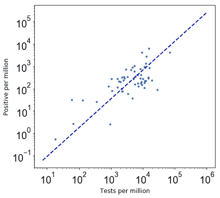
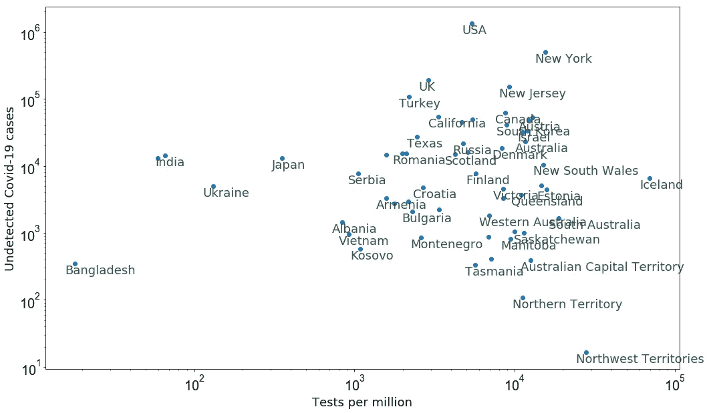

# 估计可能未被发现的新冠肺炎感染病例

> 原文：<https://towardsdatascience.com/estimating-possibly-undetected-covid-19-infection-cases-2b46a6cb8737?source=collection_archive---------12----------------------->

## 全国范围内未检出新冠肺炎病例的估计和加强检测设施的建议。

## 为什么估计未被发现的新冠肺炎病例至关重要？

对未被发现的新冠肺炎病例的估计对于当局规划经济政策、围绕封锁的不同阶段作出决策以及致力于生产重症监护病房是重要的。

*由*[*Nikhel Gupta*](https://medium.com/u/6823d82fbc3f?source=post_page-----2b46a6cb8737--------------------------------)*与参与* [*Omdena 冠状病毒 AI 挑战赛的人员合作完成的工作。*](https://omdena.com/projects/ai-pandemics)

新冠肺炎考试中心离你家有多远？(鸣谢:[链接](https://www.opengovasia.com/navigation-system-points-autonomous-cars-to-the-right-direction/))

随着我们在全球范围内跨越了 100 万新冠肺炎患者的心理关口，关于我们的卫生保健系统遏制病毒的能力出现了更多的问题。最大的担忧之一是感染该病毒的公民数量的系统性不确定性。对这种不确定性的主要贡献可能是由于正在进行的新冠肺炎试验的一小部分。

确认某人是否患有新冠肺炎病毒的主要测试是从其鼻子或喉咙的拭子中寻找病毒遗传物质的迹象。这对于大多数人来说还不具备。医务工作者在道德上被限制为医院里的重病患者保留测试仪器。

在本文中，我将展示一个简单的贝叶斯方法来估计未被发现的新冠肺炎病例。贝叶斯定理可以写成:

*P*(A | B)=*P*(B | A)×*P*(A)/*P*(B)

其中 *P* (A)为事件 A 的概率， *P* (B)为事件 B 的概率， *P* (A|B)为 B 为真时观测到事件 A 的概率， *P* (B|A)为 A 为真时观测到事件 B 的概率。

我们感兴趣的数量是 *P* (已感染|未测试)，即未测试的感染概率。这相当于感染新冠肺炎病毒但未检测的人口百分比，我们可以写成:

*P* (已感染|未检测)= *P* (未检测|已感染)× *P* (已感染)/ *P* (未检测)

这里的其他概率是:

1.  (未检测|已感染):未对已感染人群进行检测的概率或未检测但已感染人群的百分比。
2.  *P* (感染):感染的先验概率或感染人群的已知百分比。
3.  *P* (未测试):未被测试的人的概率或百分比。

下图显示了几个国家每百万人的新冠肺炎检测总数和每百万人的确诊病例总数。这表明新冠肺炎试验和确认的阳性检测之间有明显的联系。

图 1:截至 2020 年 3 月 20 日每百万人检测数与每百万人新冠肺炎阳性病例数的对比(数据来源)。

假设所有国家都遵循新冠肺炎检测和确诊病例之间的这种关系，我们可以粗略估计每个国家未检出病例的数量(我将在本文稍后回到这一假设)。

让我们以澳大利亚为例:

例如，该图显示了感染病例的先验知识

P (被感染)= 27.8/1⁰⁶，和

P (notTested) = (1⁰⁶ — 473)/1⁰⁶.)

为了估计 P*(未检测|感染)，我使用了新冠肺炎检测和确诊病例之间的关系，如上图 1 所示。这是通过拟合以下形式的幂律来实现的:y = a * x**b，其中 a 是归一化，b 是该幂律的斜率。下图显示了与上图数据点的拟合，其中最佳拟合 a = 0.060±0.008，b = 0.966±0.014。*

**

*图 2:新冠肺炎测试和确诊病例之间的关系以及幂律最佳拟合。*

*使用最佳拟合参数， *P* (未检测|已感染)=(1⁰⁶—4473)/1⁰⁶/(a *(1⁰⁶—4473)**b)/1⁰⁶.*

*对于概率 1、2 和 3，我发现 P = 0.00073%的澳大利亚人口。将这个数字乘以澳大利亚的人口表明，澳大利亚有**大约 18600 例未被发现的新冠肺炎病例的可能性**。下图显示了截至 2020 年 3 月 20 日不同国家可能未检出的新冠肺炎病例与每百万检测数的函数关系。*

**

*图 3:未检出新冠肺炎病例的估计(见文中假设)。*

*请注意，为了估计这些未检测到的情况，我们做了一些假设和考虑。例如:*

1.  *我假设所有国家都遵循相同的幂律关系来估计 P。然而，这不是一个非常好的假设，因为不同国家之间的这种关系有很大的差异。*
2.  *我们之前对感染人数的了解可能会有偏差，因为 T21 感染人数取决于截至 2020 年 3 月 20 日的检测数量。*
3.  *我还没有考虑一个国家的人口对新冠肺炎的易感性，以及发病率，即发病率的生物统计学测量值，新冠肺炎的发病率估计在 50-80%左右( [Verity 等人，2020](https://www.thelancet.com/journals/laninf/article/PIIS1473-3099(20)30243-7/fulltext) )。*
4.  *这些国家的政府政策在 3 月 20 日之前 14 天和之后 14 天的影响未被考虑。*
5.  *我还没有考虑接下来几天在不同国家检测的对象是怎样的易感人群。*

*下图 4 显示了几个国家截至 2020 年 4 月 5 日的确诊病例总数与每百万检测数的对比(数据来源)。*

> *在 4 月 5 日的 16 天后，乌克兰、印度和菲律宾等国家的确诊阳性病例与图 3 中的预测一致。截至 3 月 20 日，这些国家每百万人中进行了≤ 10 次检测。*

*请注意，截至 3 月 20 日和 4 月 5 日的估计数之间的一致性并不一定意味着截至 3 月 20 日所有未发现的病例现在都得到确认。由于 3 月 20 日至 4 月 5 日之间的传播(即使存在封锁)，截至 4 月 5 日的几例确诊病例预计将是新病例。*

*与截至 4 月 5 日的确诊病例总数(即两国均为约 1，500 例)相比，哥伦比亚和南非等国家的估计未检出病例约为两倍(图 3)。这两个国家每百万人进行了大约 100 次检测。*

*另一方面，与图 3 中的估计数字相比，台湾、澳大利亚和冰岛等国家显示了数量级的少量确诊病例。*

> *这表明，尚未将其检测效率提高到每百万人 1，000 次以上的国家，其目前确诊病例数的不确定性要大得多。*

**

*图 4:截至 2020 年 4 月 5 日，每百万人中确诊病例总数与检测数的对比。*

*根据图 4 中 2020 年 4 月 5 日的数据，我再次重复了整个过程，以估计这些国家、城市和州未被发现的新冠肺炎病例。下图显示了与图 2 相似的最佳拟合幂律和数据点，但数据截止日期为 2020 年 4 月 5 日。*

**

*图 5:截至 2020 年 4 月 5 日的数据的最佳拟合幂律。*

*图 5 中幂律关系的最佳拟合斜率(b = 1.281±0.009)与图 2 中 2- [σ](https://en.wiktionary.org/wiki/%CF%83) 置信水平下的斜率一致。这有助于我们从最佳拟合幂律关系(斜率不变)估计 *P* (未测试|感染)的假设，然而，其他警告与之前相同。*

*最后，下图显示了截至 2020 年 4 月 5 日不同国家未检测到的新冠肺炎病例的估计值。*

**

*图 6:截至 2020 年 4 月 5 日估计未检出的新冠肺炎病例(见文中假设)。*

*由于截至 3 月 20 日的未检出估计数(图 3)与截至 4 月 5 日的确诊病例数(图 4)之间的比较表明，每百万人需要更多的检测才能发现可能的未检出病例，因此现在是当局提高检测效率以减少未检出新冠肺炎病例的系统性的时候了。这似乎是降低新冠肺炎患者死亡率的唯一好方法，德国和南韩的大量新冠肺炎检测表明了这一点。*

***要做到这一点，所有国家都需要至少一个半径 20 公里内的检测中心，并尽快安排更多的驱车通过检测设施。***

*这项工作是与致力于 Omdena 冠状病毒 AI [挑战](https://omdena.com/challenges/ai-pandemics)的人员合作完成的。*