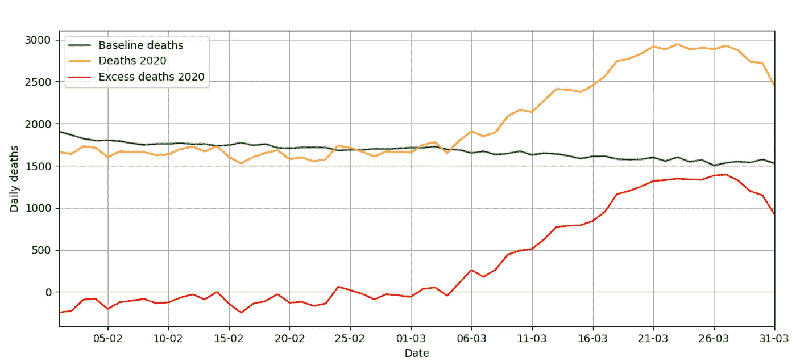
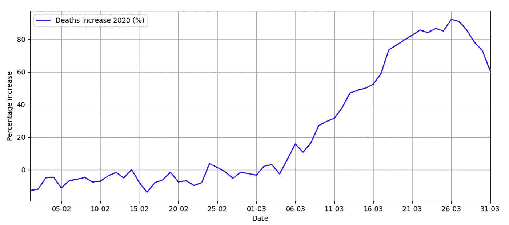
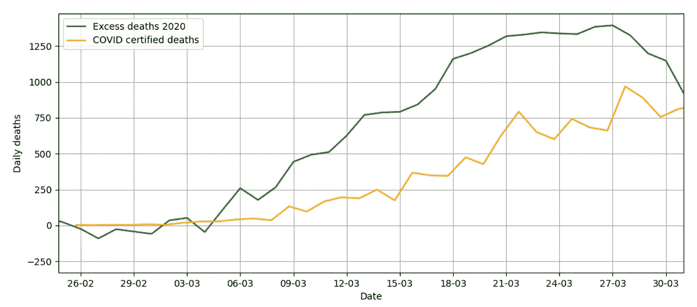
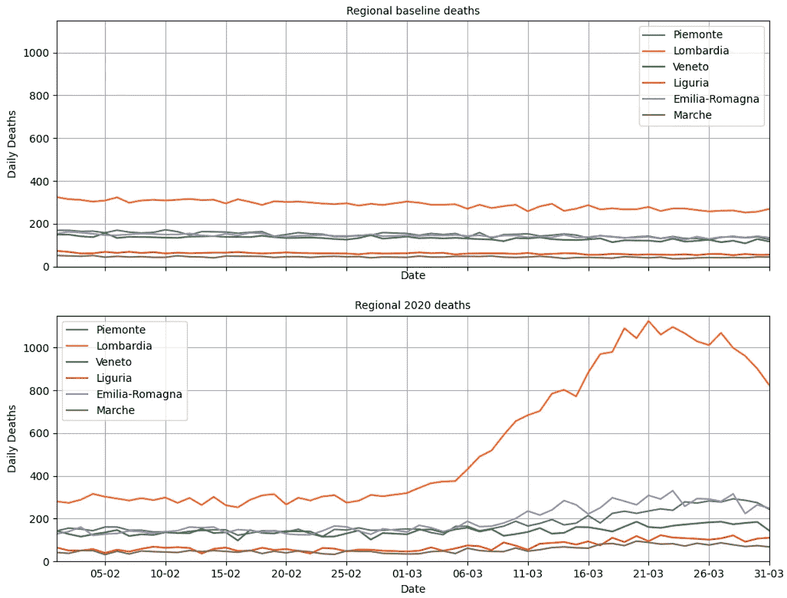
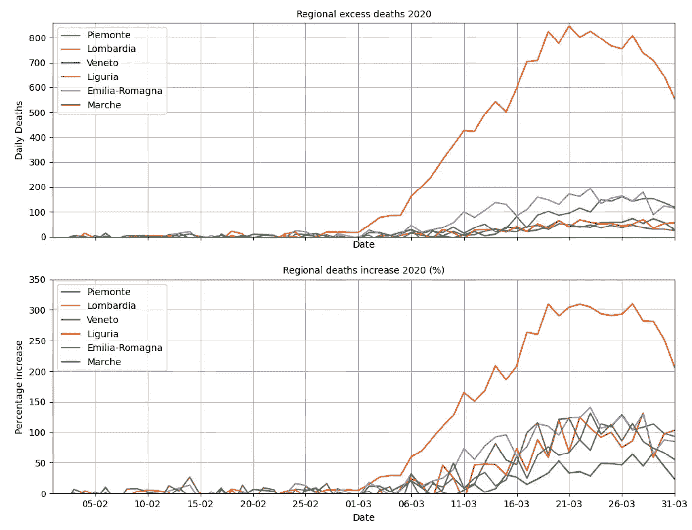
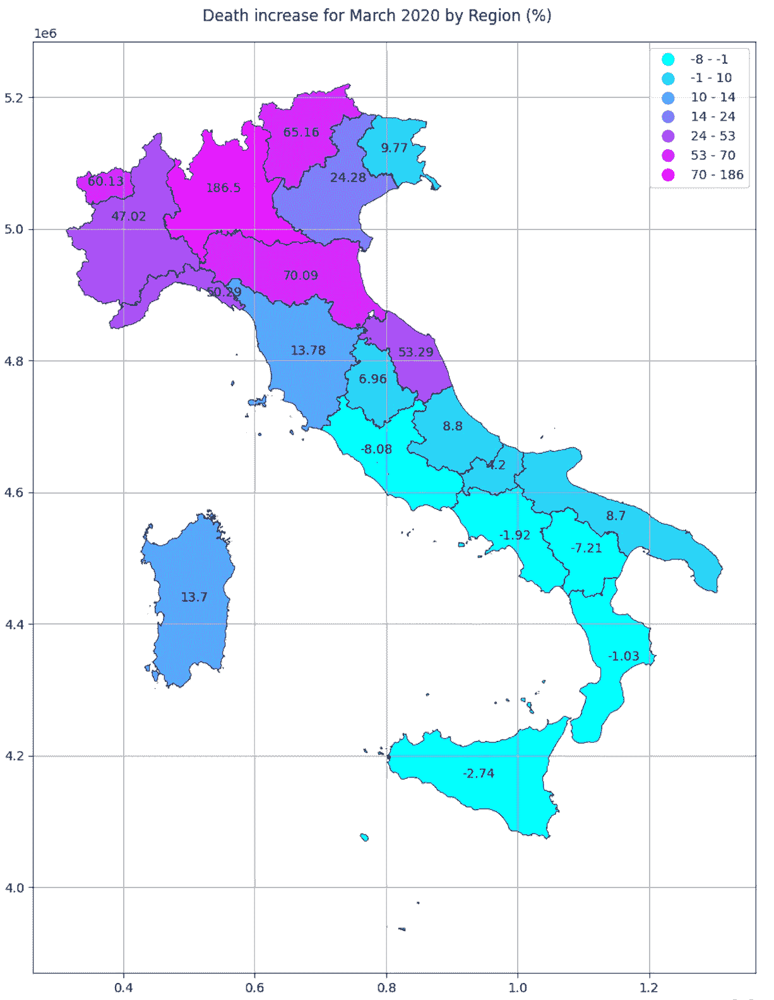
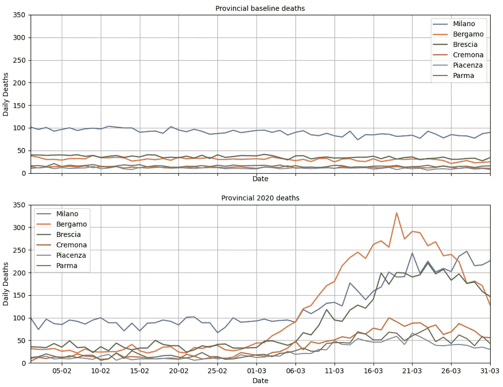
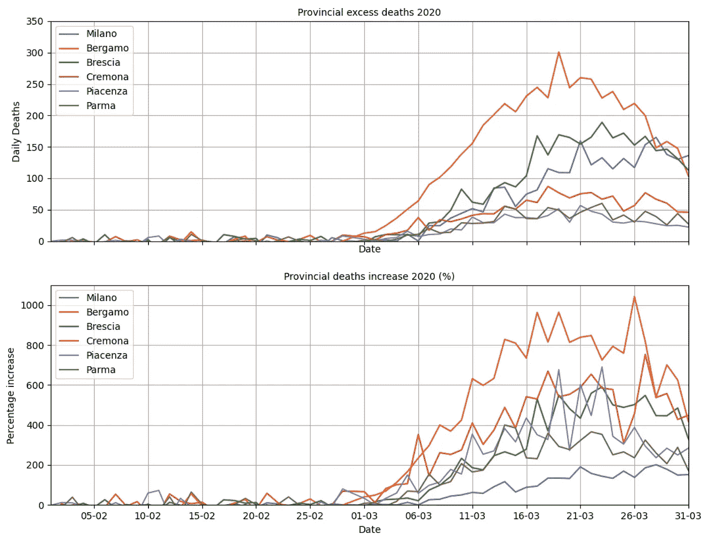
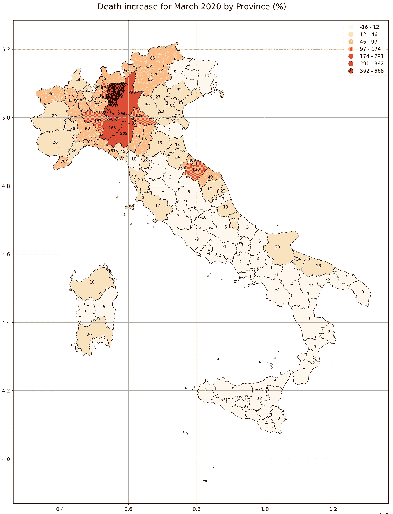

# 估计真实的新冠肺炎死亡人数

> 原文：<https://towardsdatascience.com/estimating-real-covid-19-death-toll-ef01a5eb9814?source=collection_archive---------35----------------------->

## 为什么病毒杀死的人数可能比官方数据显示的要多

毫无疑问:官方数据是错误的。无论是阳性病例、官方死亡人数、康复人数，大多数关于新冠肺炎的可用数据都具有误导性。众所周知，这只是一个数字相差多少的问题。

特别是，新冠肺炎死亡的官方数字通常来自医院。死在家中的人可能不会被计算在内，因为他们从未接受过冠状病毒检测。因此，**死亡人数** **可能被** **低估了**。然而，这种差异通常很难量化，因为政府数据往往是唯一可用的信息来源。

鉴于意大利有大量关于新冠肺炎疫情的一手和二手数据，我将研究重点放在意大利的情况上。跟踪任何流行病的演变并量化其进展是一项极具挑战性的工作，因此其他国家很可能面临同样的问题，导致巨大的低估。

就在两天前，5 月 4 日，意大利国家统计局(ISTAT) [发布了一个大型数据集](https://www.istat.it/it/files//2020/03/Dataset-decessi-comunali-giornalieri-e-tracciato-record.zip?fbclid=IwAR2F8BWx0IhNkegwRmKK3g-IuvMTP9pvM6vuOy5lso-8vAWMWjZmUIMGdoQ)报告了[发生在该国](https://translate.google.it/translate?sl=it&tl=en&u=https%3A%2F%2Fwww.istat.it%2Fit%2Farchivio%2F240401)的每一起死亡事件，死因各异，但不一定与新冠肺炎有关。死亡按日期、城市、性别和年龄组报告，包含 6，866 个城市的数据(覆盖范围为 7，904 - 87%)。数据集集中于 1 月 1 日至 3 月 31 日期间，并与最近 5 年的历史数据相关联。

**本文的主要目的是比较正常时期的平均死亡率与新冠肺炎疫情期间登记的死亡人数**。死亡人数超过无疫情年份的原因可以用新冠肺炎的直接和间接影响来解释。

我们将充分利用 *Python* 数据科学库的潜力来分析数据，识别死亡率的异常，将它们与新冠肺炎官方死亡人数进行比较，并最终绘制结果图。

## 主要发现

1.  意大利(很可能是世界各地)受新冠肺炎影响的人数远远高于政府官方数字。
2.  数据显示，与过去 5 年相比，2020 年 3 月总死亡人数出现异常增长:全国范围内 **+ 49.4%** 。
3.  在同一时期，一些地区(意大利的第一个行政级别)的死亡率急剧上升:仅举几个例子，如*伦巴第***+186%，*艾米利亚-罗马涅*****+70%， **+ 65 %特伦蒂诺上阿迪杰** 。**
4.  在地方一级，一些特定省份(第二行政级别)的疫情极为严重:例如，3 月份，佛手***省死亡人数增加了 **567.6 %，克雷莫纳***省增加了 **391.8 %，罗提***省增加了 **370.6 %。*******
5.  ***官方数据只能解释 2020 年 3 月发生的异常死亡中的 50.2 %。其余的数字很可能是由于“隐藏的”新冠肺炎病例，或由于疫情的间接影响(医院饱和、卫生服务水平较低、难以或不愿及时进入医院……)***
6.  ***ISTAT 提供的数据仅占 87%的城市。尽管这是一个统计上有代表性的样本，但我们可以假设现实情况更为戏剧性。事实上，第 5 点中提供的百分比是一个**保守估计**，它**代表总死亡数**的下限。***
7.  ***该国一些省份受到了病毒的严重打击，而另一些省份在整个危机期间相对未受影响。**这可能是因为地区和国家当局实施了及时有效的封锁措施**。***

## ***导入和清理数据***

***这项工作是在 *macOS* 上用 *Python-3.7.1* 开发的，主要利用了开源数据科学库，如`Pandas`、`Geopandas`、`Matplotlib`。***

**[**你可以在这里找到整篇文章的 Python 代码**](https://github.com/Andrampa/covid_analysis/blob/master/Calculating_real_COVID_death_toll.ipynb) **。****

**让我们开始导入必要的库。**

**现在，我们导入 ISTAT 出版的大表，报告按城市、年龄、性别和日期记录的死亡(大约 100 万个记录)。当缺少 2020 年 3 月的数据时(大约 13%的行)，我们将字段名翻译成英文，并删除城市。然后，我们只保留二月和三月的数据。**

**下一步是计算在没有疫情的一年中每个城市登记的死亡人数。我们将这个变量命名为 *baseline_deaths，*，它是通过计算 2015 年至 2019 年间登记的死亡人数的平均值而创建的。*基线 _ 死亡数*与 2020 年 3 月的死亡数之差被称为*超额 _ 死亡数*，它存在于可归因于新冠肺炎疫情的异常。**

****国家级分析****

**我们现在可以直观的看到这三个关键变量在时间上的演变:*基线 _ 死亡人数*(最近 5 年的平均死亡人数)*，死亡人数 _2020* 和*超额 _ 死亡人数。*下面的代码生成一个图表，显示国家层面的趋势*。***

****

**图表清楚地告诉我们，2020 年 3 月发生了不寻常的戏剧性事件，在 3 月 21 日到 28 日之间的几天里，意大利每天的死亡人数几乎翻了一番。现在，想象一下 2020 年死亡人数相对于平均水平的百分比增长会很有趣。**

********

**在这张图表中，峰值更加明显。事实上，2019-20 年的冬天异常温和，流感疫情导致的死亡人数低于往年的平均水平。然后，大约在 3 月 4 日，新冠肺炎疫情开始在全国范围内杀死第一批人。考虑到整个三月，**意大利的死亡率上升了 49.36 %** 。**

****现实 VS 官方数据****

**我们现在有了所有我们需要的来比较 2020 年 3 月登记的异常死亡人数和意大利公民保护局发布的官方新冠肺炎死亡人数。**

**下面的代码下载了平民保护 [GitHub 账号](https://github.com/pcm-dpc/COVID-19)的官方死亡人数，并与 2020 年登记的超额死亡人数进行对比。**

********

**意大利民防组织提供的官方新冠肺炎死亡人数并不能完全解释三月份记录的峰值。2020 年 3 月 *ISTAT* 报告的死亡人数比非疫情年平均水平增加了 24668 人。同期，民防部门报告的新冠肺炎官方死亡人数仅为 12399 人，仅为超额死亡人数的 50.26 %。**剩下的数字最有可能是由于“隐藏”的新冠肺炎病例**(没有进行病毒检测就在家中死亡的人)**或疫情的间接影响**(医院饱和、医疗服务水平较低、难以或不愿及时进入医院……)。此外，我们知道 ISTAT 只报告了 87%的城市的数字。因此，**现实可能比我们保守估计的还要糟糕。****

****区域层面分析****

**我们知道病毒并没有以同样的强度袭击整个国家。这场流行病使意大利北部陷入困境，而南部地区相对来说没有受到危机的影响。ISTAT 发布的数据集提供了与非常高的空间分辨率相关的信息，也有可能在区域和省一级检查死亡异常情况。**

**首先，让我们关注 6 个受影响最严重的地区，将它们的*基线 _ 死亡*与 2020 年登记的死亡人数进行比较。**

****

**同样，我们注意到 2020 年死亡的常规趋势，直到三月初。但是伦巴第*地区比其他地区受到的影响要大得多。现在让我们想象一下*超额死亡*的趋势以及与五年平均值相比的百分比增长。***

**

*上图显示，2020 年 3 月 23 日左右，皮埃蒙特、*利古里亚*、*马尔凯*和*艾米利亚-罗马涅*的日均死亡人数是过去 5 年的两倍。但是同样，最严重的情况发生在伦巴第，在 3 月 18 日和 28 日之间登记的死亡人数是平均每天死亡人数的 3 倍。*

***绘制地区超额死亡人数图***

*现在可以按地区绘制 2020 年 3 月整个月份登记的死亡增加地图。意大利地区的边界可以从意大利国家统计局网站[下载 *shapefile* 。](https://www4.istat.it/it/archivio/209722)*

**

*该地图清楚地显示了该国相对两侧的不同情况:虽然意大利北部的死亡率急剧上升，但有趣的是，与过去五年的平均水平相比，南部一些地区的死亡率有所下降。这可能是由于严格的封锁措施(道路和工作事故减少，季节性流感疫情减少……)和异常温和的冬季的影响，但这一假设应通过专门的分析进一步验证。*

***省级分析***

*ISTAT 数据集让我们可以更深入地分析，并在省级基础上比较*基线 _ 死亡人数*和*死亡人数 _2020* 。在下面的图表中，我们将重点关注六个受影响最严重的省份。*

**

*在 6 个受影响最严重的省份中，4 个在*伦巴第*区，2 个在*艾米利亚-罗马涅*区。特别是，图表显示了贝加莫省的一个极端峰值:三月份报告的死亡人数甚至比米兰多，米兰的总人口是它的三倍。现在让我们检查各省的超额死亡人数和死亡增加的百分比。*

**

*发生在贝加莫省的灾难程度现在更加清楚了。在本月的某些日子里(16 日至 26 日)，该省的平均死亡人数是非流行年份的 10 倍。其他省份(*皮亚琴察*、*布雷西亚*、*克雷莫纳*)也受到了严重影响，一些高峰达到了正常死亡率的 600%。*

***绘制各省超额死亡人数图***

*这项分析的最后一步是创建 2020 年 3 月死亡增长的省级地图。意大利各省的边界在 ISTAT [网站](https://www.istat.it/it/archivio/222527)上以 *shapefile* 的形式提供。*

**

*下表总结了受影响最严重省份的分析结果。*

*上表所载信息可以被视为对意大利总体死亡率的流行病影响的最准确分析。*

## *结论*

*   *在这篇文章中，我提供了意大利官方每天公布的死亡人数比实际数字低得多的证据。*
*   *在全国范围内，真实的死亡人数可能被低估了 12000 人，大约是官方总数的两倍。*
*   *上述估计包括了新冠肺炎病毒直接和间接导致的死亡:其中一些死亡人数的增加可能与卫生系统没有适当治疗的其他疾病有关，或者是因为危机导致他们找不到医院床位。*
*   ***在一些南部地区和省份，死亡率与平均水平相比已经大幅下降**。部分原因是由于意大利的封锁，道路死亡人数和工作事故减少，以及异常温和的冬季。*

***致谢***

*本文中进行的一些分析受到了[费德里科·里奇-特尔森吉](https://medium.com/u/200e3fbf123d?source=post_page-----ef01a5eb9814--------------------------------)教授发表的工作的启发，他[设法量化了](https://medium.com/@riccife/an-estimate-of-direct-and-indirect-deaths-related-to-the-covid-19-epidemic-in-italy-97a13c078df9)新冠肺炎对额外死亡的直接和间接影响之间的比率。我还要感谢格雷格·奥卡拉汉、罗希尼·斯瓦米纳森和弗吉尼亚·埃特诺审阅了本文的草稿，并提出了编辑和改进的建议。*

*我为本文中显示的分析和地图开发的所有代码都可以在我的 GitHub 库中找到[。](https://github.com/Andrampa/covid_analysis/blob/master/Calculating_real_COVID_death_toll.ipynb)*

## *感谢您的阅读！如果你喜欢这篇文章，不要犹豫，评论或分享它。*

*我每天都在学习，如果你发现任何错误，请随时纠正我，并在评论区写下你的建议。*

***作者注:我不是流行病学家，本文中的分析仅基于应用于公开数据的纯数学。***

****编者注:*** [*迈向数据科学*](http://towardsdatascience.com/) *是一份以数据科学和机器学习研究为主的中型刊物。我们不是健康专家或流行病学家，本文的观点不应被解释为专业建议。想了解更多关于疫情冠状病毒的信息，可以点击* [*这里*](https://www.who.int/emergencies/diseases/novel-coronavirus-2019/situation-reports) *。**