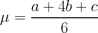
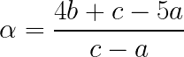
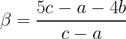
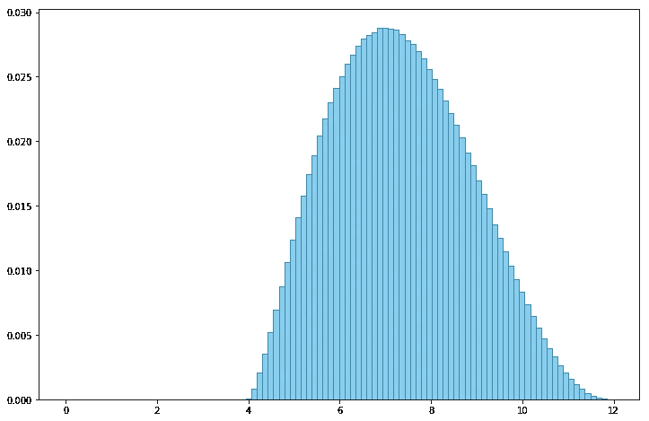
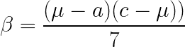
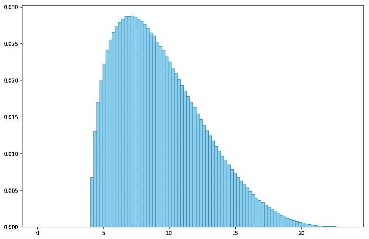
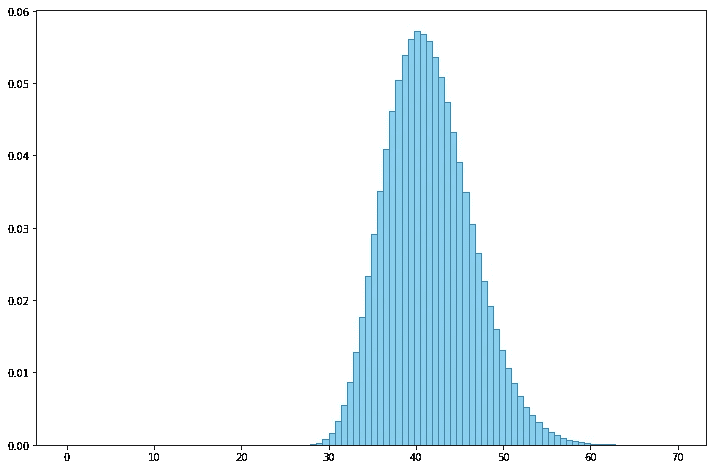

# 使用 Python 通过统计和模拟来评估任务

> 原文：<https://towardsdatascience.com/estimating-tasks-with-statistics-and-simulations-using-python-ddd1df3c7ce1?source=collection_archive---------16----------------------->

## 用 PERT 和蒙特卡罗模拟模拟任务估算

几个月前，当世界还是一个非常不同的地方时，我写了关于待办事项列表任务的战略。我想知道，给定你的待办事项列表中的一堆任务，你应该使用什么策略来选择首先处理的任务？根据我实际想要达到的目标，我的做法可能会大不相同。

我的假设是，任务的复杂性是固定的，也就是说，完成任务所需的时间是预先确定的。这通常是不正确的(统计笑话提醒！).即使在疫情带来不确定性之前，大多数任务的复杂性和持续时间也很难准确预测。

如果我们关注待办事项清单之外的任务，例如项目任务，情况会变得更糟。项目任务的复杂性不仅影响持续时间，还影响工作和成本，因此能够确定复杂性是非常重要的。


由[威廉·沃比](https://unsplash.com/@wwarby?utm_source=unsplash&utm_medium=referral&utm_content=creditCopyText)在 [Unsplash](https://unsplash.com/s/photos/measure-and-plan?utm_source=unsplash&utm_medium=referral&utm_content=creditCopyText) 上拍摄的照片

然而，众所周知，项目任务很难估计，这可能意味着延迟和成本上升。

柏林的新勃兰登堡机场在 2006 年开工前规划了 15 年，预计于 2011 年 10 月开放。然而，该项目仍在进行中，也面临着预算暴涨。最近的开放日期是 2020 年 11 月，但鉴于目前的形势，它似乎有可能再次移动。

美国宇航局的太空发射系统(SLS)是一种发射火箭，将为载人月球飞行和人类火星任务提供基础，始于 2010 年，截至 2020 年已耗资 186 亿美元。2020 年初[宣布成本将超支 20 亿美元，并至少推迟 2 年](https://techcrunch.com/2020/03/11/nasas-sls-moon-rocket-is-2-years-behind-and-billions-over-budget-internal-report-finds/)。

这不是什么新鲜事，NASA 因过分乐观和低估项目而臭名昭著。詹姆斯·韦伯太空望远镜(JWST)原本应该在 2007 年发射，耗资 5 亿美元，但截至今天，已经推迟到 2021 年，预计耗资 100 亿美元。它的前身哈勃太空望远镜原本应该在 1983 年发射，但最终在 1990 年发射，成本从最初的 4 亿美元下滑到最终的 47 亿美元。然而，国际空间站是最棒的——它以 367.5 亿美元的预算开始，推迟了 6 年才完工，最终耗资 1050 亿美元。

建筑项目并不是唯一被延迟的项目类型，软件开发项目通常也是罪魁祸首。在一个相当[臭名昭著的开发昆士兰州健康工资系统](https://www.smh.com.au/technology/worst-failure-of-public-administration-in-this-nation-payroll-system-20130807-hv1cw.html)的案例中，该项目于 2007 年 12 月被 IBM 招标并以 9800 万美元中标，本应于 2008 年 7 月推出。最终于 2010 年交付，有 bug，耗资 12 亿美元。

# 估计项目任务

当然，项目失败的原因有很多。由于各种无法预测的原因，完全正确估计的项目可能遭受灾难性的结果。你可以肯定的是，无论项目任务估计得有多好，都不会增加我们现在面临的疫情，也不会增加它的后果。尽管如此，良好的评估对于保持项目顺利进行是至关重要的。


由著名的西班牙/加泰罗尼亚建筑师[安东尼·高迪](https://en.wikipedia.org/wiki/Antoni_Gaud%C3%AD)设计的[圣家族大教堂](https://en.wikipedia.org/wiki/Sagrada_Fam%C3%ADlia)于 1882 年动工，预计在高迪于 1926 年去世 100 年后的今天于 2026 年完工

有多种方法可以进行评估。在敏捷方法中(大部分是软件开发项目)，我们有计划 pokers，affinity groups，t-shirt sizing，bucketing 等等。在估算单位方面，有 t 恤尺寸(S，M，L，XL 等)，斐波那契故事点，点投票和许多其他非常有创意的方式来表示工作的大小。

对于更传统的项目管理方法，评估技术包括自下而上、自上而下、参数化、类比、三分法等等。有许多其他类型的评估技术，尤其是在软件开发中，包括 COCOMO、SEER-SEM、Putnam、PERT 和许多其他技术。我们绝对不缺乏评估技术。

无论我们使用哪种技术和单位，项目最终关心的是按时交付(时间)，在成本范围内交付(预算)，以及做它应该做的事情(质量)，无论是太空望远镜还是医疗工资系统。


由 [SpaceX](https://unsplash.com/@spacex?utm_source=unsplash&utm_medium=referral&utm_content=creditCopyText) 在 [Unsplash](https://unsplash.com/s/photos/project?utm_source=unsplash&utm_medium=referral&utm_content=creditCopyText) 拍摄的照片

任务估计很难。它主要是基于判断，利用评估者(通常是做任务的人)的经验。此外，大多数估计往往过于乐观。事实上，有一个由心理学家丹尼尔·卡内曼和阿莫斯·特沃斯基在 1979 年创造的术语，叫做[计划谬误](https://en.wikipedia.org/wiki/Planning_fallacy),[准确地描述了这个](https://apps.dtic.mil/dtic/tr/fulltext/u2/a047747.pdf?utm_source=zapier.com&utm_medium=referral&utm_campaign=zapier)。卡尼曼和特沃斯基发现，我们倾向于忽视过去在类似任务中所学到的东西，并且对潜在问题甚至我们自己完成任务的能力过于乐观(乐观偏见)。这个主题非常吸引人，如果你想了解更多，你可以多读读他们的书，《思考的[、*、快与慢的*、。](https://www.amazon.com/Thinking-Fast-Slow-Daniel-Kahneman/dp/0374533555)

## 三点估计

其中一个方法是使用三点估算法。诀窍是为每个估计产生 3 个数据点(因此得名):

*   `a` —最佳情况估计
*   `b` —最有可能的估计
*   `c` —最坏的情况估计

这迫使评估者每次都要考虑最好、最坏和最有可能的情况。虽然这不是克服规划谬误的灵丹妙药，但它给了我们一些有趣的数据。

# 活泼性感的

[项目评估和评审技术(PERT)](https://en.wikipedia.org/wiki/Program_evaluation_and_review_technique) 是项目管理中用来分析和表示项目任务的工具。它是在 1957 年为美国海军开发的，用于管理[美国海军北极星核潜艇导弹项目](https://en.wikipedia.org/wiki/UGM-27_Polaris)，但它也有许多其他用途，包括早期用于规划 1968 年格勒诺布尔冬季奥运会。


潜艇首次发射北极星(部分视频片段)(公共领域来自[https://commons . wikimedia . org/wiki/File:1960-07-21 _ First _ Polaris _ fireing _ By _ Submerged _ U-boat . ogv](https://commons.wikimedia.org/wiki/File:1960-07-21_First_Polaris_Firing_By_Submerged_U-Boat.ogv))

PERT 是一种大规模、一次性计划和安排的工具，关注事件和时间。PERT 本身产生了相关的工具和概念，如工作分解结构、关键路径和关键路径分析(CPA)。

PERT 也引起了做三点估计，事实上它给了一个连续概率分布族的名字，叫做 PERT 分布。

## PERT 分布

[PERT 分布](https://en.wikipedia.org/wiki/PERT_distribution)是由最小值(`a`)、最大可能值(`b`)和最大值(`c`)定义的连续概率分布，其平均值(或期望值)为:



PERT 分布实际上是一个转换的四参数[贝塔分布](https://en.wikipedia.org/wiki/Beta_distribution)。贝塔分布有两个定义在区间[0，1]上的参数 *α* 和 *β* ，这使得它对概率和随机变量建模很有用。贝塔分布的四参数版本使区间为[a，c],其中 a 是最小值，c 是最大值。

你可以看到这是怎么回事。通过使用 PERT 分布来绘制估计值，我们可以近似估计值本身的概率！

也就是说，当我们要求评估者提供乐观、悲观和最有可能的评估值时，实际的期望值可能与最有可能的值不同，我们可以计算出任务在持续时间或预算内完成的可能性有多大。

然而，这实际上只是一个单一的任务。当然，在一个项目中，我们有很多很多任务，每个任务可能有不同的分布参数 a、b 和 c。如果你是项目经理，你如何计算出总体估计值和概率？

嗯，我们也可以尝试做数学，但我们是程序员，不是数学家(我这么说是出于好意)，所以我们寄希望于我们的老朋友蒙特卡洛。

# 蒙特卡洛

当然，我说的蒙特卡洛指的是蒙特卡洛模拟，而不是赌场。蒙特卡罗是一种流行的模拟技术，它使用许多重复的随机抽样来产生数字数据。这就像进行大量的实验，并从所有的数据中找出真知灼见。


摩纳哥蒙特卡洛赌场(图片来自[https://Commons . wikimedia . org/wiki/File % 3a casin % C3 % B2 _-_ panoramio . jpg](https://commons.wikimedia.org/wiki/File%3ACasin%C3%B2_-_panoramio.jpg))

[1947 年，斯坦尼斯劳·乌拉姆(Stanislaw Ulam)在疾病康复期间想出了这个主意。当时他正在洛斯阿拉莫斯国家实验室从事一个核武器项目，并把这个想法告诉了约翰·冯·诺依曼，他看到了这个想法的重要性，并编写了第一个蒙特卡罗模拟程序。由于他们工作的秘密性，他们必须想出一个代号。他们的一个同事建议，](https://en.wikipedia.org/wiki/Stanislaw_Ulam)[蒙特卡洛，摩纳哥著名的赌场](https://en.wikipedia.org/wiki/Monte_Carlo_Casino)乌兰的叔叔曾经在那里向亲戚借钱赌博，剩下的就是历史了。*(你可能会从我之前写的一篇*[](https://medium.com/swlh/building-simulations-with-a-go-cellular-automata-framework-89b2bb1246d3)**)中认出乌兰和冯·诺依曼，他们都是才华横溢的数学家、科学家，也是计算机科学的早期先驱*。*

*蒙特卡罗模拟可以用来解决任何概率问题。使用[大数定律](https://en.wikipedia.org/wiki/Law_of_large_numbers)，我们可以通过自己创造的经验数据来近似计算结果。当然，没有计算机我们无法理智地做到这一点，因为这项技术需要运行大量的重复实验。蒙特卡洛字面蛮力的结果！*

*那么，我们究竟如何使用蒙特卡罗来计算出许多项目任务的总体估计呢？其实很简单。对于每个任务，我们使用给定的`a`(悲观)、`b`(最有可能)和`c`(乐观)值创建一个 PERT 分布，并从该分布中提取一个值。我们得到的是对每项任务的模拟评估。当我们把这些评估加在一起时，我们得到了整个项目的模拟评估。*

*冲洗，重复。*

*我们最终会得到很多很多的项目评估，这也是某种概率分布。实际上，我们将会以另一个 PERT 分布结束，但是让我们稍后看看如何证明它。一旦我们有了数据，我们就可以计算出我们估计的各种概率。*

*让我们试一试！为此，我将在 Jupyter Notebook 上使用 Python3，使用常见的怀疑对象——numpy、pandas、scipy 和 matplotlib。*

# *估计单个任务*

*我们从一个单一的任务开始，对它进行 1000 万次实验。这并不像听起来那么疯狂，运行这个脚本只需要 2 秒钟。*

*让我们看一下剧本。`no_of_experiments`和`num_bins`是我们想要运行的实验的数量，以及我们用于直方图的箱的数量。*

*`tasks`是一个只有 1 个键值对的字典。我用这个是因为很自然地我们以后会有更多的任务，所以提前做好准备。关键是任务的名称，而值是 3 个元素的列表，第一个是乐观值`a`，第二个是最可能值`b`，最后一个是悲观值`c`。*

*还记得我之前说过的 PERT 分布是一种变形的四参数 beta 分布吗？我这么说是因为`numpy`和`scipy`都没有 PERT 分布，相反它们有 beta 分布。因此，要使用 PERT 分布，我们需要将 a、b 和 c 转换为 *α* 和 *β。*转换公式非常简单，如果你不想自己算，你可以从维基百科关于 PERT 分布的条目[中找到。](https://en.wikipedia.org/wiki/PERT_distribution)*

**

*和*

**

*一旦我们有了 *α* 和 *β* ，我们就可以使用`numpy`(或者`scipy`，随便你选，但我在这里使用了`numpy`)从分布中随机抽取一些随机变量。这里我们画了 1000 万个随机变量。*

*接下来我们需要将随机变量转换回我们想要的实际值，它在`a`和`c`之间。最后，我们有一个额外的步骤，将它添加到一个全 0 的`points`列表中，这对于一个单一的任务来说并不真正有用，但是当我们有更多的任务时，就需要它了。`points`列表现在是从 PERT 分布中随机抽取的 1000 万个数字的列表。*

*现在我们有了数据，我们将使用`matplotlib`的`hist`函数来绘制它。我们稍微改变一下 x 轴，从 0 开始，也改变点来表示一个概率。*

*运行它，这就是我们得到的。*

**

*任务[4，7，12]的概率分布*

*这是一个很好的曲线，但它意味着什么呢？让我们使用`scipy.stats`对其进行一些统计分析。*

*我们做的第一件事是简单地显示任务，如果我们有一个以上的任务，我们把乐观的，最有可能的和悲观的值加起来。*

*然后使用`stats.describe`函数，我们得到最小值、最大值、平均值、方差、偏度、峰度以及标准偏差值。仅仅几行代码就包含了大量内容！*

*最后，我们打印出标准差为 0.5、1、2 和 3 的概率。*

*现在让我们来看看结果。*

```
*Tasks
-----
        optimistic  likely  pessimistic
Task 1           4       7           12
Total            4       7           12

Statistics
----------
minimum: 4.0 maximum: 12.0
mean: 7.3
standard deviation: 1.5
skewness: 0.22
kurtosis: -0.60

Probabilities
-------------
* between 7.0 and 7.7 : 36.0% (within 0.5σ)
* between 6.6 and 8.1 : 64.7% (within 1σ)
* between 5.8 and 8.8 : 97.3% (within 2σ)
* between 5.1 and 9.6 : 100.0% (within 3σ)*
```

*这些任务非常简单明了，包括最小值和最大值。平均值很有意思，如果我们用前面的等式计算 PERT 分布的平均值，我们得到 7.333，这证明了我们的答案。使用 PERT 分布的方差，即:*

**

*我们将得到方差 2.222，标准差，即方差的平方根，将是 1.49，这再次验证了我们的答案。*

*对于概率，我们简单地取均值和均值两侧标准差σ的倍数之间的曲线下面积，这就是概率(因为曲线下面积的总和为 1.0 或 100%)。*

*我们说这项任务在 5.1 到 9.6 之间结束的概率是 100%，这似乎令人吃惊，也是错误的，但这是因为我将结果截断到了小数点后 1 位。如果我们允许更多的小数点，它将是 99.9994%。尽管如此，让我们看看几个有趣的点。*

*期望值或平均值和最可能值(由估计器提供)接近但不相同。*

*[*偏斜度*](https://en.wikipedia.org/wiki/Skewness) 为 0.22，这意味着估计倾向于更乐观。如果它是一个负数，这意味着它倾向于更加悲观。对称分布的偏斜度为 0。*

*[*峰度*](https://en.wikipedia.org/wiki/Kurtosis) 为-0.6 表示峰值有点平坦，更分散。一般来说，数字越低(正态分布的峰度为 0)，曲线越平坦，数字越高，曲线越多峰。较平坦的曲线意味着乐观值和悲观值彼此远离，而峰值曲线意味着乐观值和悲观值彼此靠近。*

*这个任务有 99.9994%的可能性在 5.1 到 9.6 之间。现在比较一下乐观值 4 和悲观值 12。如果你乐观地认为任务是 4，悲观地认为是 12，然后被统计数据告知这两个值的概率只有 0.0006%，这似乎是错误的！*

*从数字上看，这似乎违反直觉，但你可以从不同的角度来解释它。如果悲观值的概率只有 0.0006%，那么悲观值估计可能是错误的，应该更大。您可以快速尝试一下，并将任务更改为:*

```
*tasks = {
    "Task 1": [4,7, 24],
}*
```

*再次运行它将得到以下结果:*

**

*任务[4，7，24]的概率分布*

```
*Tasks
-----
        optimistic  likely  pessimistic
Task 1           4       7           24
Total            4       7           24

Statistics
----------
minimum: 4.0 maximum: 23.5
mean: 9.3
standard deviation: 3.3
skewness: 0.70
kurtosis: -0.02

Probabilities
-------------
* between 8.5 and 10.2 : 33.7% (within 0.5σ)
* between 7.7 and 11.0 : 65.0% (within 1σ)
* between 6.0 and 12.7 : 96.3% (within 2σ)
* between 4.3 and 14.3 : 99.6% (within 3σ)*
```

*您可以立即看到，对于值 12，它落在 2σ范围内。你可能会想——这是不对的，统计数据告诉你现在它是一个更大的值，但是它是怎么知道的呢？*

*答案是没有。作为估计者，你更清楚值 12 的可能性。如果你认为这是极不可能的，并且有非常非常小的可能是正确的，那么值 12 可能是正确的。如果你认为它不太可能是 12，但它很可能会大于 0.0006%，那么你应该选择一个更大的值。*

*换句话说，数字就是数字，但是对乐观值、最可能值和悲观值的判断取决于估计者。*

# *评估多项任务*

*我们之前做的只是热身。我们真正想要的是估计多个任务。虽然我们可以根据 PERT 分布或多或少地计算出单个任务的值，但是如果你有 100 个任务，那么这样做就很麻烦了。*

*几乎所有的代码都是一样的，除了我们有更多的任务，所以我不会在这里重复。*

```
*tasks = {
    "Task 1": [4,7, 12],
    "Task 2": [2, 3, 9],
    "Task 3": [3, 5, 16],
    "Task 4": [6, 7, 23],
    "Task 5": [10, 12, 28],
}*
```

*有了这个任务列表，让我们再次运行脚本。*

**

*5 项任务的概率分布*

*现在我们再做一次统计分析。*

```
*Tasks
-----
        optimistic  likely  pessimistic
Task 1           4       7           12
Task 2           2       3            9
Task 3           3       5           16
Task 4           6       7           23
Task 5          10      12           28
Total           25      34           88

Statistics
----------
minimum: 26.3 maximum: 69.7
mean: 41.5
standard deviation: 4.8
skewness: 0.40
kurtosis: 0.06

Probabilities
-------------
* between 40.3 and 42.7 : 32.2% (within 0.5σ)
* between 39.1 and 43.9 : 67.6% (within 1σ)
* between 36.6 and 46.3 : 96.1% (within 2σ)
* between 34.2 and 48.8 : 99.7% (within 3σ)*
```

*因为我们现在有多个任务，所以不能看单个任务的乐观、最有可能、悲观值。我们还需要考虑任务是否相互依赖。简单来说，任务都是相互依赖的，也就是说任务 5 依赖于任务 4，任务 4 依赖于任务 3，如此循环直到任务 1。*

*所以从逻辑上来说，对于项目来说，任务估计应该是乐观、可能和悲观三栏的总和。作为一个项目，我们看到乐观的总数是 25，最可能的总数是 34，悲观的总数是 88。但是有多准确呢？让我们深入了解一下。*

*从数字中，我们看到平均值 41.5 与最可能的值相差甚远，而平均值实际上是该分布的最可能值！这意味着通过把最有可能的值加起来，我们最终会有一个更乐观的观点，正如数字所显示的那样。*

*最小值仅略高于乐观值，而最大值比悲观值小很多。这再次意味着，通过累加悲观值，我们确实太悲观了，而我们只是比数字显示的稍微乐观一些。*

*分布的偏斜度非常正，因此 over 项目往往更乐观，而峰度稍微为正(实际上非常接近 0)，因此该项目在乐观值和悲观值之间的范围内相当平衡。*

*现在让我们看看概率。您会注意到一些有趣的事情——大约有 67%的可能性项目值在平均值的 1σ以内，96%的可能性在 2σ以内，99.7%的可能性在 3σ以内。这些数字看起来熟悉吗？*

*如果是的话，那么恭喜你，你在统计学课上没有睡觉，至少在你的讲师给你讲正态分布的时候没有。[经验法则](https://en.wikipedia.org/wiki/68–95–99.7_rule)指出，对于正态分布，68%的值在平均值的 1σ以内，95%在 2σ以内，99%在 3σ以内。虽然经验法则适用于正态分布，但大多数钟形分布(就像我们得到的这个)多少都遵循这个法则，尽管数字略有不同(这也被称为*三西格马法则*)。这也是为什么单个任务的早期运行也遵循大致相同的数字的原因。*

*现在再来看一看概率。数字显示，项目价值有 99.7%的可能性在 34.2 到 48.8 之间。请记住，如果我们将各个列中的所有值相加，乐观值是 25，该项目的最可能值是 34，悲观值是 88！乐观和悲观的价值都不是真实的，最有可能的价值也可能是错误的。*

*把这些列加起来终究不能说明真实的情况。如果你思考它的含义，它实际上应该是这样的。对于悲观值或乐观值相加，这意味着每个任务都需要全部悲观或全部乐观，这是极不可能的。*

*那么统计数字实际上意味着什么呢？我们在这里得出的统计数据基本上意味着，如果我们所有的估计都是准确的，那么项目值将有 99.7%可能在 34.2 和 48.8 之间。*

# *理解评估*

*项目任务的评估是困难的，所有之前显示的统计分析并没有减少对专家判断的需求。最终，无论技术多么强大，如果评估数据完全错误，没有什么能够使它正确。*

*然而，通过这样的技术分析数据允许我们检测任务估计的潜在问题。它还将帮助我们理解评估，不仅从个人的基础上(正如你从上面看到的，这是有帮助的)，而且从项目或其他方面的群体上。*

**

*米卡·鲍梅斯特在 [Unsplash](https://unsplash.com/s/photos/numbers?utm_source=unsplash&utm_medium=referral&utm_content=creditCopyText) 上的照片*

*我们之前所做的练习中，一个任务与前一个任务之间存在简单的依赖关系，但是在更现实的场景中，我们会有多个依赖关系的任务，相互依赖甚至交叉依赖的任务组。*

*一旦复杂性增加，将项目作为一个整体来看就变得更加困难，并且它的评估很容易出错。使用统计工具可以帮助我们发现潜在的问题，并指导我们做出更好的估计。*

*这种统计分析还有助于我们更好地指导成本和及时性的预测。随着任务的完成，我们还可以使用分析来与实际值进行比较，然后更新和修改未来任务的估计，以获得更高的准确性。*

## *度量单位*

*在前面的练习中，我讨论了任务价值和项目价值，但是我对度量单位本身并不清楚。我指的是持续时间吗？我指的是完成任务和项目所需的时间吗？是几天、几周还是几个月？或者我看的是工作量，以人工日或人工周或人工月计算？成本如何，以美元和美分计算？还是复杂？*

*实际上，我们可以用这个来衡量上面的任何一个，只要我们想要衡量的东西有数值。如前所述，在一些敏捷方法中，团队提出了他们自己的任务度量单位(有人提出了坚果或模糊的时间单位，scrum 甚至完全取消了单位),这很好。*

*然而，我们也应该明白，在一天结束时，项目成功通常是根据它是否按时、在成本范围内和高质量来衡量的。*

## *用微软 Excel？*

*我在这里用 Python 和 Jupyter Notebook 做了所有的工作。对于许多项目经理来说，这不是一个自然的使用工具——大多数人更喜欢用 Microsoft Excel 来做所有这些计算。*

*好消息是，Excel 是一个优秀的工具，拥有所有必要的统计计算功能。坏消息是 Excel 每张工作表最多有 1，048，576 行和 16，384 列。所以，如果你想做 1000 万次蒙特卡洛模拟，你可能无法做到每行一次模拟。*

*事实上，我们每个任务做了 1000 万次模拟，如果你有大量的任务，你就要倒霉了。此外，即使这不是问题，处理 100 万行对于 Excel 来说也需要相当长的时间，而我们在 Jupyter Notebook 中运行的 Python 脚本对于单个任务只需要 2 秒，对于 5 个任务大约需要 7 秒。*

# *一些最后的想法*

*Ulam 和 von Neumann 在曼哈顿项目工作时，他们提出了蒙特卡罗模拟的想法，PERT 是为了支持美国海军的潜艇核导弹项目北极星而创建的。具有讽刺意味的是，这两种技术都是出于军事需要而发明的，都与核武器研究有关。*

*战争和军事野心一直是历史上创新的最强驱动力之一。虽然这些野心给数百万人带来了痛苦，但令人欣慰的是，从这种恐惧中诞生了如此出色的工具，也可以帮助我们的生活变得更加轻松。*