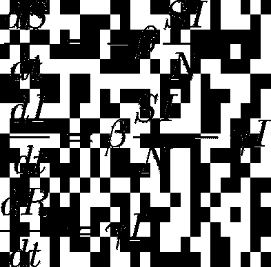
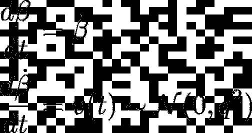
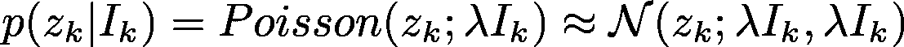
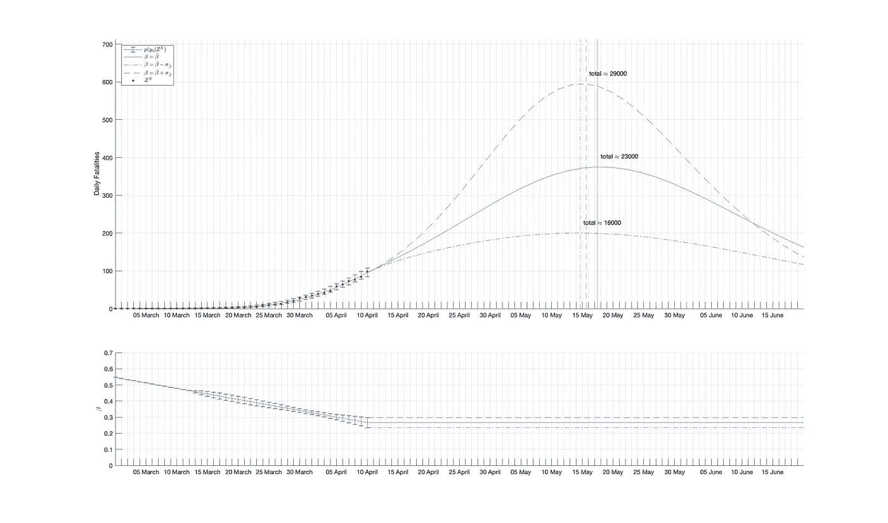
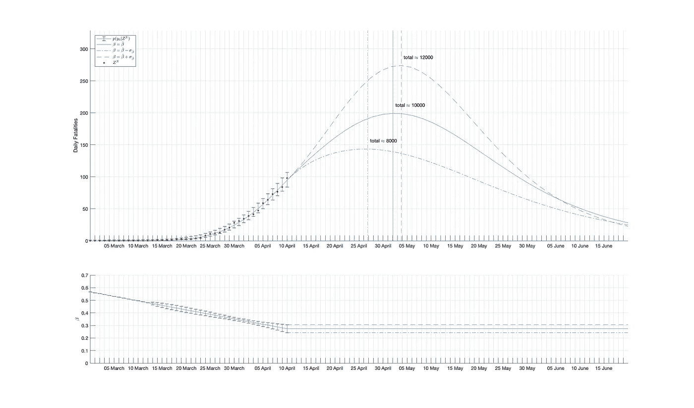
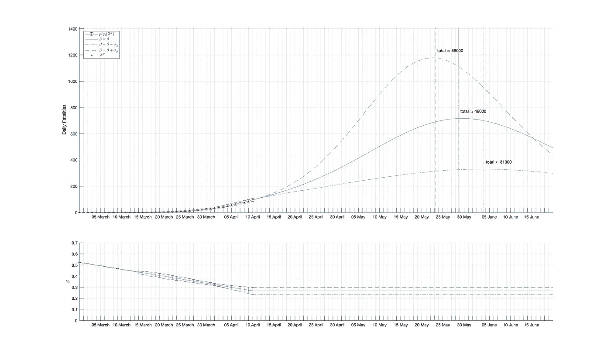

# 估计社会距离的影响

> 原文：<https://towardsdatascience.com/estimating-the-effect-of-social-distancing-in-sweden-c6c1e606c8f9?source=collection_archive---------43----------------------->

## 估计疫情动力学参数的贝叶斯方法

在我的上一篇帖子中，我创建了一个 GUI，使用确定性 SIR 模型来模拟新冠肺炎疫情的动态。然后我提到了一些关于创建一个奇特的方法来估计模型中随着时间推移的感染率*β**。*今天我将 *β，*作为一种状态添加到 SIR 模型中，将其建模为随机过程，从而创建了一个**随机 SIR 模型**。然后，我使用了一种名为**无迹卡尔曼滤波**的奇特方法，以及一种更为奇特的叫做**无迹 Rauch-Tung-Striebel 平滑法**的方法，来估计整个过程的状态，特别是 *β* 来看看数据中是否有任何证据表明社交距离确实有效。

那些对数学不感兴趣的人可以跳过技术细节，看看漂亮的图片。如果你对数学感兴趣，尤其是贝叶斯估计，请原谅我所做的任何愚蠢的近似。每次我假装某个东西是高斯的或者近似线性的，那只是我想应付过去。但是如果你有更好的近似或方法，请在这里加入进来。

由[安东](https://unsplash.com/@uniqueton?utm_source=unsplash&utm_medium=referral&utm_content=creditCopyText)在 [Unsplash](https://unsplash.com/s/photos/statistics?utm_source=unsplash&utm_medium=referral&utm_content=creditCopyText) 上拍摄

在我的上一篇文章中，我使用了报告的病例数，因为当时瑞典的死亡人数并不多。现在看一下数据，报告的病例似乎不是一个非常可靠的指标，因为它会受到政策和行为变化的影响。不幸的是，现在每天都有相当多的死亡人数，而这些数据并不受制于相同的时间环境，因此我选择使用这些数据进行这项研究。

上次我还忽略了 SIR 模型背后的实际数学运算，这实际上非常简单。三个组 **S** 可接收、 **I** 感染和 **R** 不可接收按照下面的微分方程描述进行耦合:

另外值得一提的是，N ≡ S + I + R 是常数。因此，目前我们有一个确定性模型，其中**感染率β** 和**回收率γ** 是常数。我也将坚持我的可疑主张，γ=0.2，但现在我们将β放入模型状态，并添加两个方程:

所以我们说，我们不能确定性地模拟β，但我们说，它随着某个速度而变化，该速度的时间导数是**白色**和**通常**分布在零附近，有一些标准偏差 *q* 。与我们所说的β及其时间导数 [**马尔可夫**](https://en.wikipedia.org/wiki/Markov_chain) 相反，术语“白色”在此上下文中意味着过程 *v(t)* 没有记忆，意味着在预测任何未来状态时，关于某一时刻状态的任何知识都不会添加任何信息。这意味着该过程具有记忆，并且当前状态足以描述前进的过程，关于该过程的任何先前信息都是多余的。

好了，现在我们有了一个随机 SIR 模型，非常酷。但是我们该拿它怎么办呢？嗯，这个模型为我们提供了一些关于疫情动态的信息，现在我们想要**融合**这些数据来估计疫情当前的**状态**。也就是说，人群中目前有多少易感者、感染者和耐药者，以及感染率是多少。最终，我们也希望回到过去，回顾疫情爆发的情况。

事实证明，假设您有一个带有**白高斯过程噪声**的**线性**过程模型，并且我们可以用一个带有**白高斯测量误差**的线性模型来描述测量结果，那么就有一种使用测量数据来估计过程状态的经典方法。高斯意味着正态分布，正态分布的白色过程噪声我们有-检查。我们的模型并不完全是线性的，但是我们将不得不在以后解决它。首先，我们必须提出一个测量模型。现在有一个:

所以第 *k* 天的死亡人数是**泊松分布**，其比率与感染人数成比例，乘以λ，即**死亡率**。如果死亡人数足够多，比如说> 30，那么正态分布就是一个相当好的近似值。对于死亡人数为 *< 30* 的情况，我们只需假设近似值是可以的。虽然这个模型中的测量误差是白色的，但如果你使用任何随时间聚合的数字，这是开始玩卡尔曼滤波器时常见的错误。

现在，如果我们的模型是线性的，我们基本上已经使用了卡尔曼滤波器，但情况并非如此，所以我们必须做些什么。如果模型是相当线性的，可以选择每次使用估计值将其线性化(这被称为**扩展卡尔曼滤波器**)，但这个模型并不那么好，事实证明。对于所有好奇想知道我是怎么知道的数学书呆子来说，这是因为时间导数的雅可比不是[幂零的](https://en.wikipedia.org/wiki/Nilpotent)。🤓

因此，我们使用一种叫做**无迹变换**的东西，这实质上意味着将分布离散化成许多点。这些点然后可以使用非线性模型传播，然后可以用于计算预测的分布和称为**卡尔曼增益**的非常重要的矩阵。这个版本的卡尔曼滤波器被称为 [**无迹卡尔曼滤波器**](https://en.wikipedia.org/wiki/Kalman_filter#Unscented_Kalman_filter) ，由于许多其他原因，它非常好。它不需要大量的分析计算，该模型的工作原理非常简单。它通常还具有比扩展卡尔曼滤波器更好的数值稳定性。

现在，我们所要做的就是为我们的零日爆发参数制定一个**无信息先验**分布。这意味着我们将状态参数的知识描述为多元正态分布，其中一些初始猜测为平均值，一些非常夸张的方差反映出我们在这一点上对系统了解不多。然后，我们可以预测第一天的先验分布，使用卡尔曼增益更新数据，预测第二天的先验分布，等等。在某一点上，我们到了我们拥有数据的最后一天 *N* ，在这一点上，我们将有一个那天的**无偏最优估计**…假设我们不记得我们在这一过程中所做的任何欺骗和近似。🤔

现在的问题是，所有早期的估计都已经过时，但是我们希望利用所有信息来估计由于政府法规和建议的增加而发生的β变化。幸运的是，洛克希德导弹公司的三名聪明的德裔美国火箭科学家想出了卡尔曼滤波器的扩展，可以回到过去，并解释“来自未来”的信息。这些家伙被称为 Rauch，Tung 和 Striebel，因此这种方法被称为 [**Rauch-Tung-Striebel 平滑**](https://en.wikipedia.org/wiki/Kalman_filter#Rauch%E2%80%93Tung%E2%80%93Striebel) 。

然而，另一个问题是，这种方法并不适用于无迹卡尔曼滤波器。但是不到十年前，一位名叫 Simo srkk 的芬兰研究人员提出了一个解决方案。现在我们有了模型，有了数据，我们可以断言一些初始猜测，使用无迹卡尔曼滤波器估计每天的状态，当我们到达终点时，我们使用无迹 Rauch-Tung-Striebel 平滑器返回。👌

在得出结果之前，我还应该提到，我对数据做了一些预平滑处理，原因有两个。主要是为了缓解由于卫生保健当局报告死亡日期的方式存在缺陷，一些工作日的死亡人数一直较低或较高，以及总体而言较高的可变性。还因为高斯假设对低死亡率数字并不完全适用。有更好的方法来处理这个问题，但现在必须这样做。

我还应该提到，我实际上通过在 SIR 模型中添加另一组感染者，使事情变得有点复杂。被感染的个体被转移到第一组，在那里他们可以影响其他人，之后他们转移到第二组，在那里他们为死亡预测做出贡献。我做了这个选择，因为在报告的病例和死亡之间似乎存在延迟，这在标准 SIR 模型中没有反映出来。此外，我工作了一段时间，将报告的病例和死亡的数据结合起来，在这种情况下，这是必要的，然后碰巧我没有从模型中删除它。这些组之间的转换率与示例中的回收率γ相同。

此外，死亡率λ未知，也没有可靠的估计值，因此我将提供死亡率为 0.5%、0.2%和 1%的例子。死亡率λ可以从总死亡率和假定的恢复率γ计算出来。这些示例包含β随时间变化的标准偏差估计值，以及从 4 月 10 日开始的预测值，其中最佳猜测显示为实线和虚线，代表β估计值的一个标准偏差。

死亡率= 0.5%

死亡率= 0.2%

死亡率= 1%

这些结果至少表明，社会距离政策对感染率β产生了影响，在一个月的时间里，感染率β似乎从 0.5 下降到 0.27±0.03。鉴于实际死亡率约为 *0.2%* ，感染率保持在接近*0.2%*，在这种情况下，只有大约 **8.000** 瑞典人将失去生命，死亡高峰似乎将在 4 月**末**到来。

另一方面，如果实际死亡率接近 1%，高峰将出现在从 5 月到 6 月的**转折时期**和**30.000 到 60.000**之间，瑞典人将失去他们的生命，这取决于社会距离的持续成功。

这是一个微妙的平衡之举，当局必须用有限的数据和生硬的工具进行干预。而且赌注显然很高。