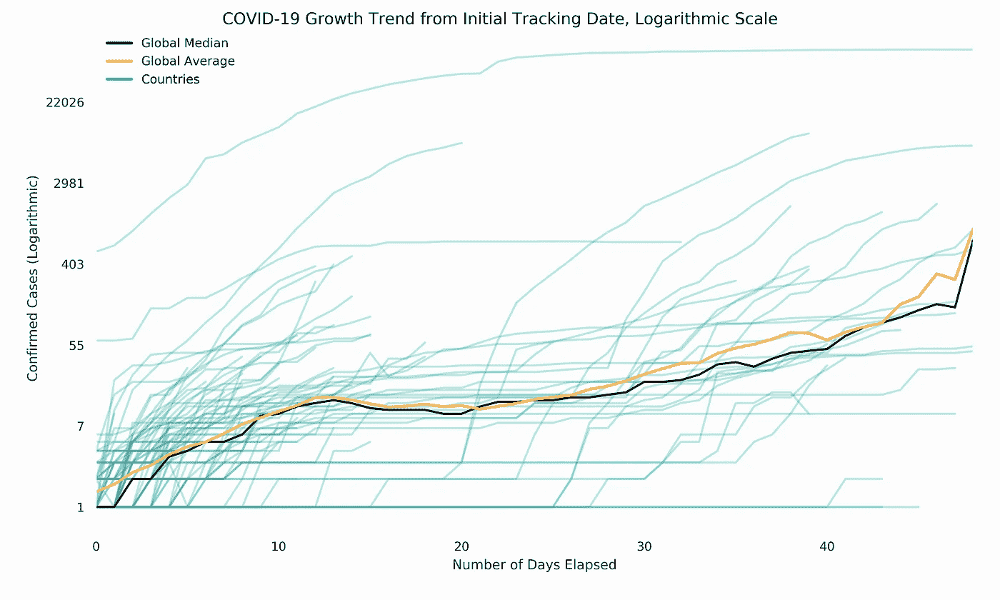
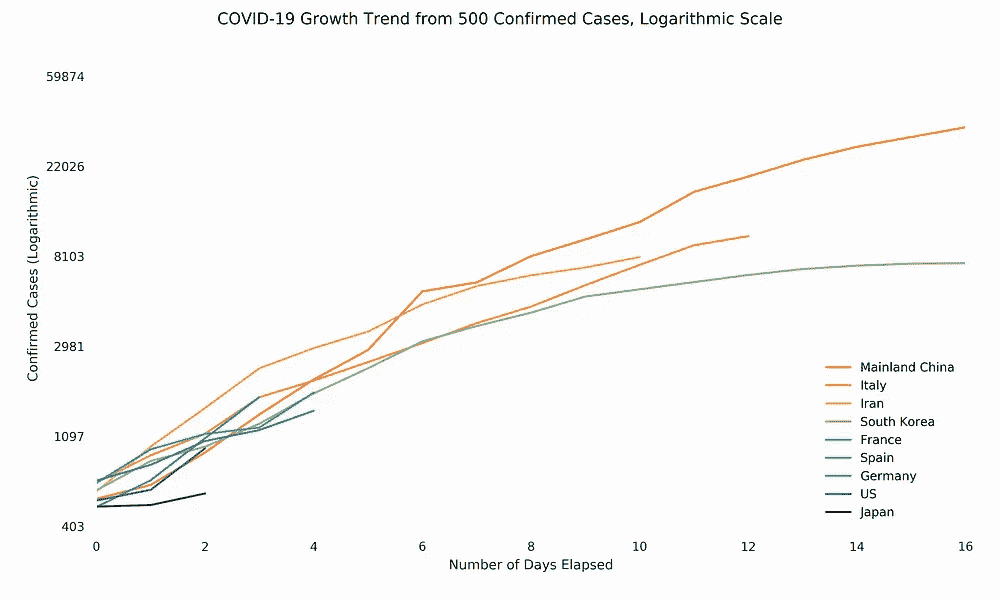
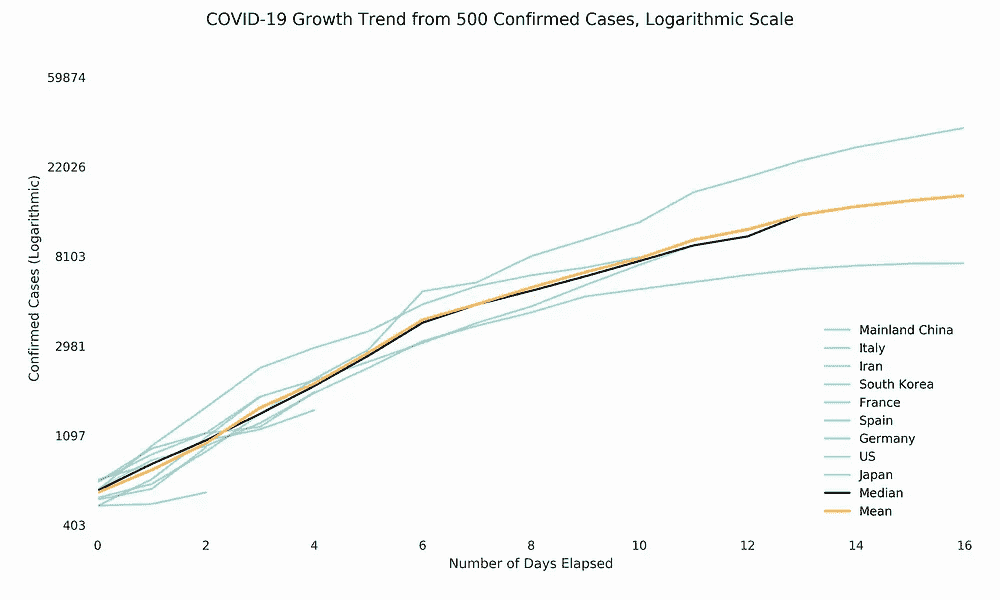
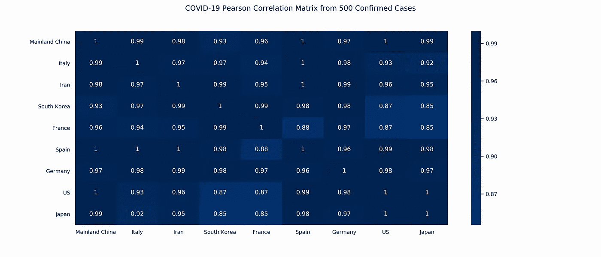
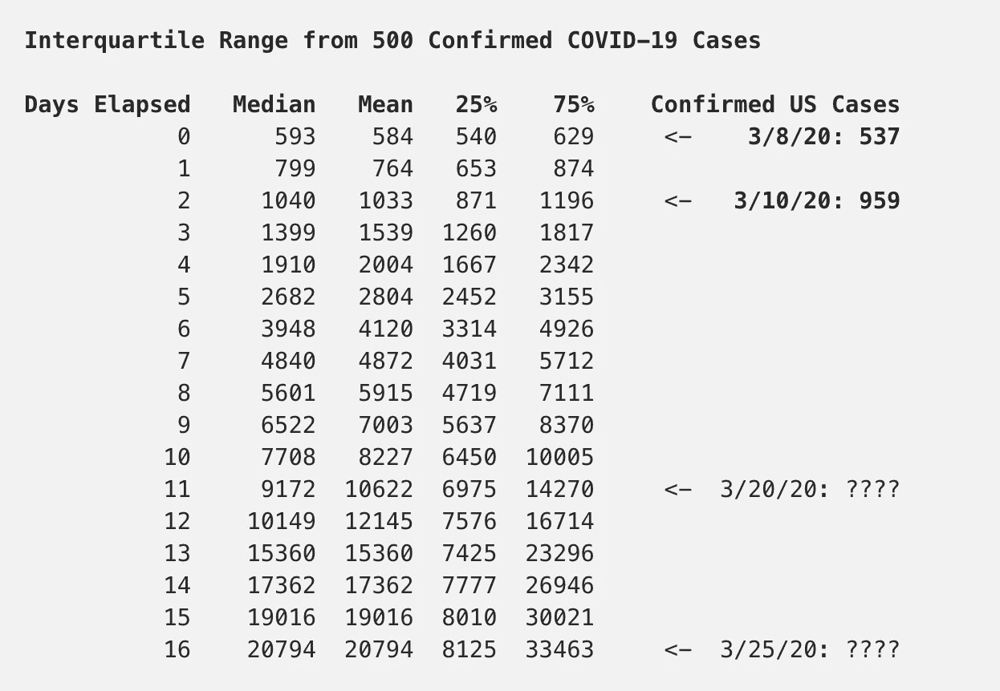
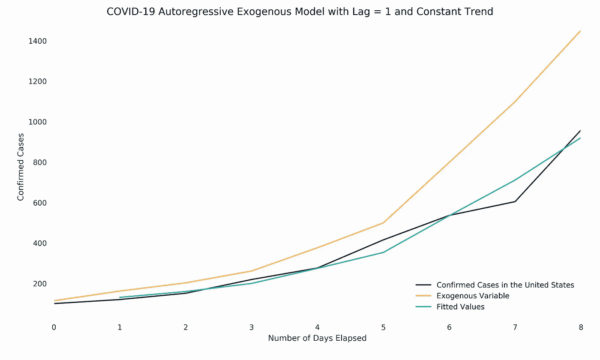
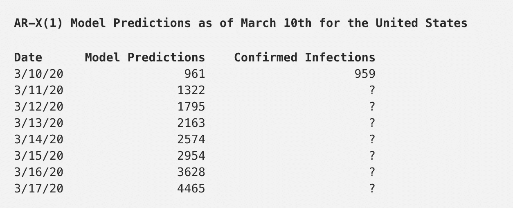

# 估计美国未来冠状病毒病例的数量

> 原文：<https://towardsdatascience.com/estimating-the-number-of-future-coronavirus-cases-in-the-united-states-a0ce17df029a?source=collection_archive---------4----------------------->

> ***更新 3/14/2020*** *:本文底部的模型预测在 3/11 到 3/14 之间的平均绝对误差(MAE)为 86。这意味着到目前为止，本文中概述的 AR-X(1)模型在平均 86 个冠状病毒确认中是准确的。* ***2020 年 3 月 18 日*** *:更新统计数据见* [*后续文章*](/estimating-the-global-growth-of-coronavirus-33ca3c28f066) *。* ***2020 年 4 月 10 日更新*** *:* [*最近的数据表明*](https://medium.com/@quinterojs/too-little-too-late-covid-19-is-on-track-to-be-more-severe-in-the-united-states-4fc90c659e82) *美国正走在一条悲惨的道路上，比地球上任何其他发达国家都要经历更多的冠状病毒感染和死亡。*

 [## 太少，太晚。在美国，新冠肺炎将变得更加严厉

### 仍然大部分是坏消息，但是隧道的尽头有一线光明。

medium.com](https://medium.com/@quinterojs/too-little-too-late-covid-19-is-on-track-to-be-more-severe-in-the-united-states-4fc90c659e82) 

随着疾病预防控制中心和美国当局争先恐后地为公众准备足够多的冠状病毒测试，如果我们能够每天估计美国未来的新冠肺炎病例数量，将会有所帮助。我们可以通过评估该疾病在其他国家的传播速度来做到这一点。虽然这篇文章的标题指定美国为目标受众，但下面概述的模型可能适用于大多数确诊冠状病毒感染超过 500 例的国家。

这项工作建立在我上一篇文章的背景之上，在这篇文章中，我评估了冠状病毒的全球死亡率的可变性，研究了滞后死亡率，并使用一些简单的数学方法估计了当时美国未确认的新冠肺炎病例总数。

 [## 新冠肺炎感染增长率、滞后死亡率和其他有趣的统计数据

### 约翰·霍普斯金大学系统科学与工程中心最近发布了一个非常有用的仪表板…

link.medium.com](https://link.medium.com/aPNhU635C4) 

和以前一样——如果你在寻找关于新型冠状病毒的最新指导和新闻，请参考[疾病控制中心](https://www.cdc.gov/coronavirus/2019-ncov/index.html)或你的国家公共卫生研究所。以下是对约翰·霍普斯金·CSSE 截至 2020 年 3 月 10 日收集的冠状病毒数据的分析，并严格出于教育和研究目的向公众提供。

## 这种疾病传播有多快？

上图显示了自约翰·霍普斯金数据的第一个追踪日期以来，各个国家的新冠肺炎确诊病例数是如何增长的。初始追踪日期要么是第一个输入的可用数据点，如中国的情况，要么是该国记录的第一个感染病例。在图表中，我们看到新型冠状病毒在对数尺度上以大体一致的方式传播。

在国家达到 500 例确诊病例后评估数据，我们看到这一趋势持续到数千例。这些数据描绘了一幅相当黯淡的画面。这表明，美国正在经历与那些报告称医院不堪重负的国家相同的感染水平，例如意大利、T2、南韩和 T4。

上面的皮尔森相关矩阵和时间序列图表明，在 500 例确诊病例后，疾病在世界各地的传播惊人地相似。几乎在所有情况下，我们都看到感染人数开始缓慢增长，然后迅速呈指数增长。根据我们目前掌握的数据，很明显，这个问题的估算方法既不复杂也不复杂。

## 新冠肺炎汇总统计

我们可以利用上述数据的四分位数范围来创建一个参考表，该表概述了一个国家出现 500 例确诊感染病例后几天内预计的新增病例数。这可能是最简单但也是最天真的方法，我们可以用它来估算感染人数如何在各国间增长。然而，由于它不是特定于任何一个国家，这也意味着任何阅读本文的人都可以将其应用于自己的国家，以模拟该疾病在自己国家内的传播。

从 3 月 8 日到 3 月 10 日，我们看到美国确诊病例数量的增长与其他国家超过 500 例确诊感染病例的数据一致。如果这种疾病继续以类似的方式在美国传播，那么到 3 月 20 日，可能会有 6975 至 14270 例确诊冠状病毒病例，到 3 月 25 日，可能会有 8125 至 33463 例确诊病例。也就是说，应该注意的是，随着时间的推移，观测值会减少-中国、日本、意大利和韩国是数据中仅有的拥有超过 15 天数据的国家-因此，预期误差会随着未来的推移而增加。

还有一个额外的缺点——上表假设了测试中的等价性，我们知道这不是真的。鉴于缺乏测试，美国的官方统计数据可能会长期漏报，因此我们需要更具体的东西来模拟美国确诊的冠状病毒感染。

## 参数估计

用技术术语来说，我们建立了一个自回归外生模型(AR-X(1))，其中我们根据前一天的值以及来自外生但统计上相关的趋势的输入来估计每一天新增病例的平均值。在这种情况下，我们的外生变量是该组中其他国家确诊病例数的中位数。我通过以下方式计算模型:( 1)选取所有至少有 100 例确诊感染的国家,( 2)使用样本中每天的病例数中位数,( 3)估计美国到目前为止的预期病例数。该模型符合 Python 的 [statsmodels](https://www.statsmodels.org/stable/generated/statsmodels.tsa.ar_model.AutoReg.html) 包(|AIC|: 3.70，|BIC|: 3.66，RSS: 0.43)，看起来如下:

上述自回归模型目前预测未来 7 天美国确诊病例数如下:

鉴于美国缺乏测试，目前的模型有可能是向下偏的。一旦测试增加，我们可能会看到案例数量的显著变化，这将需要我们重新训练模型。

美国的结果会有什么不同呢？据推测，美国人民可以通过在局势失控之前主动采取措施来实践社交距离来改变他们的未来。

[取消一切](https://www.theatlantic.com/ideas/archive/2020/03/coronavirus-cancel-everything/607675/)。