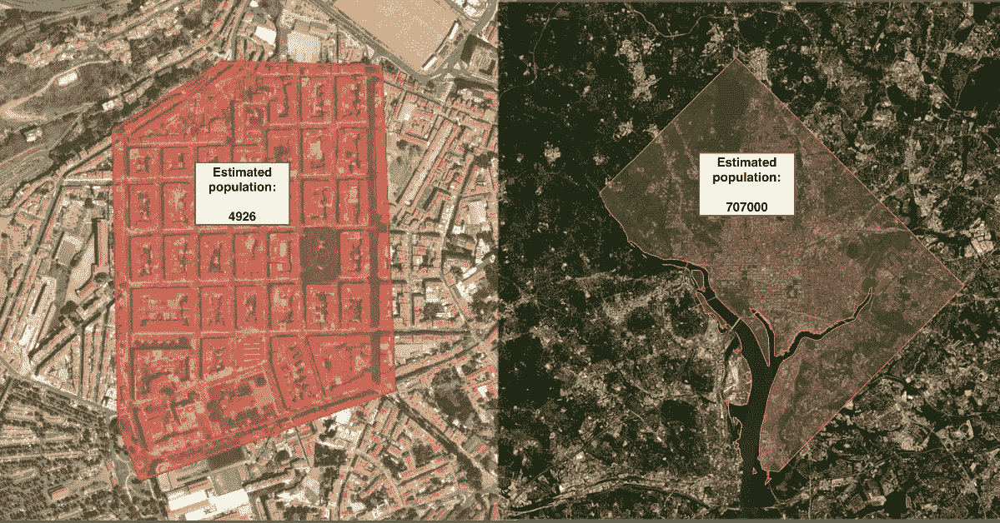
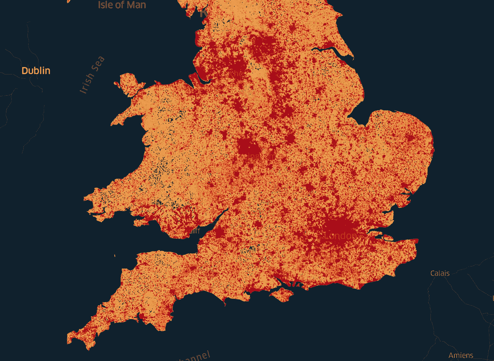
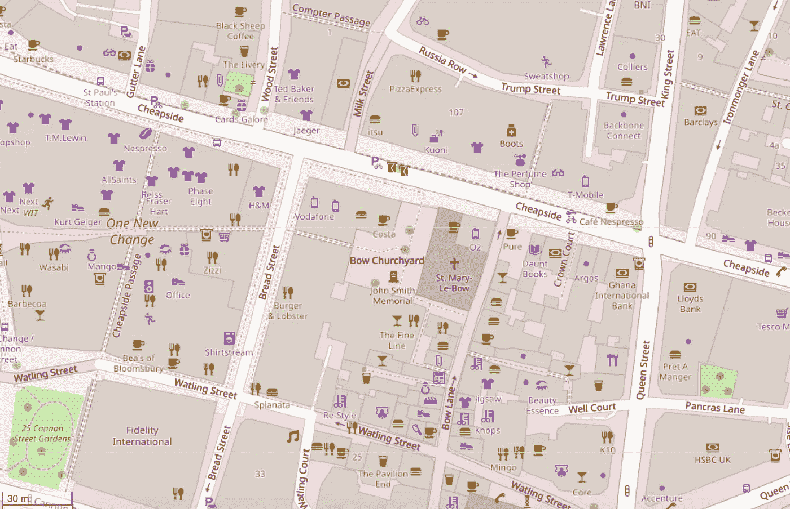
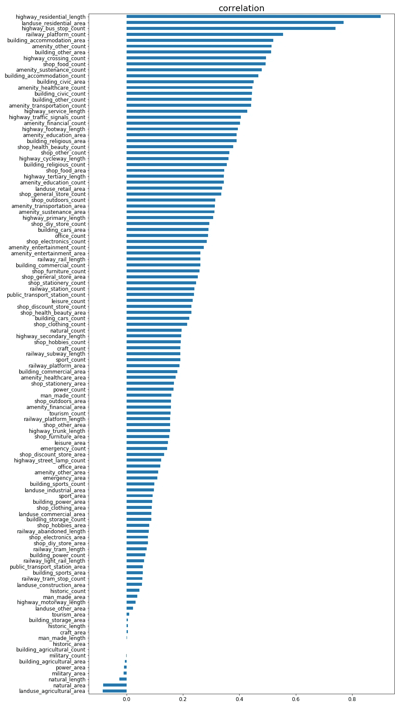
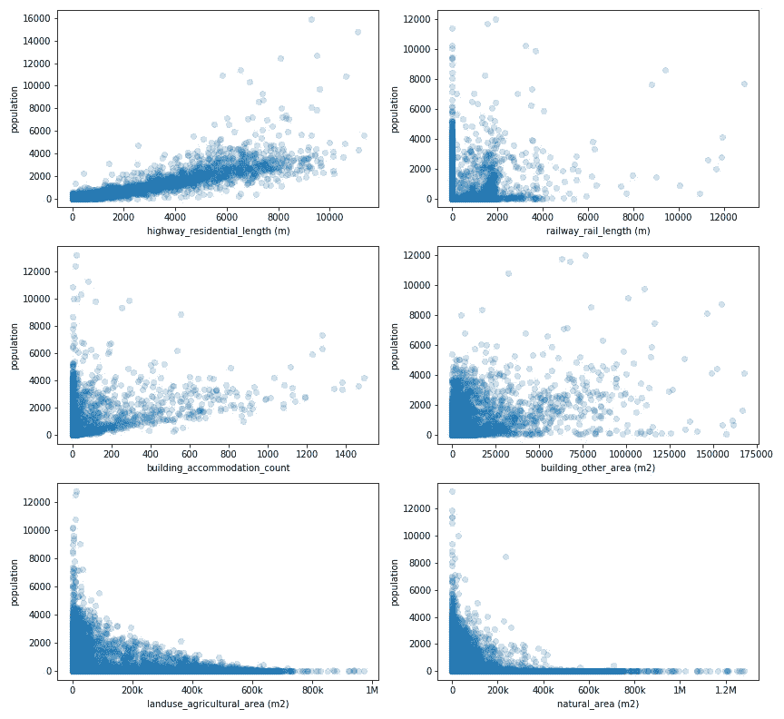
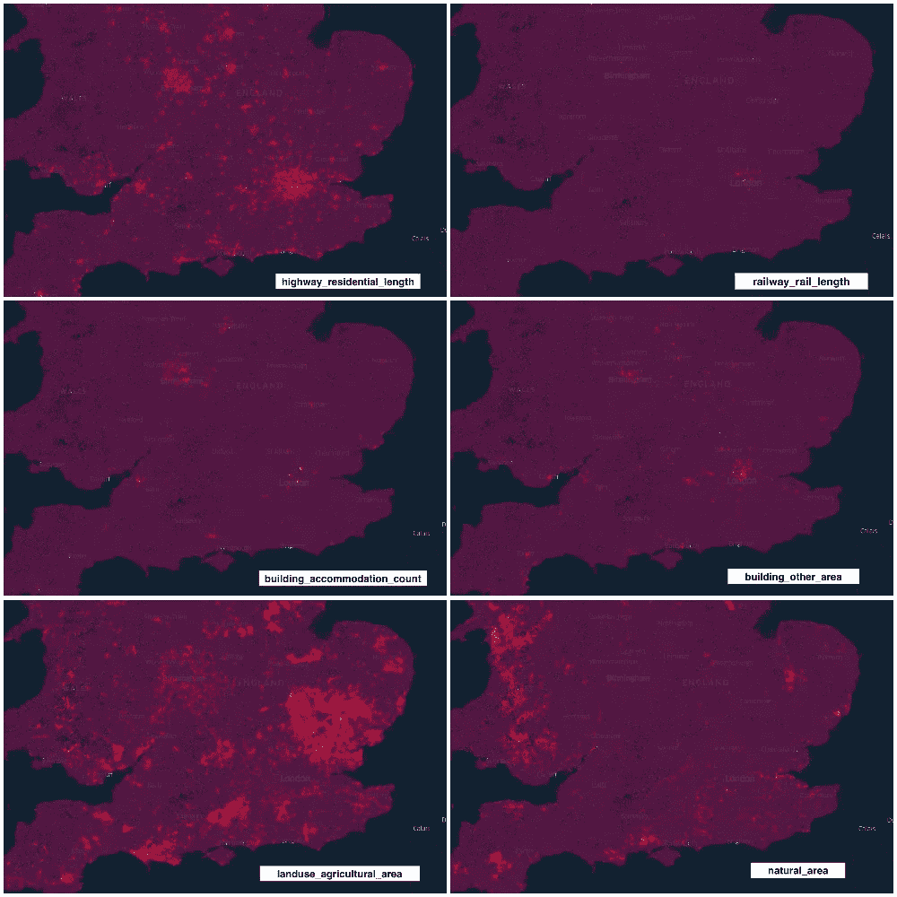
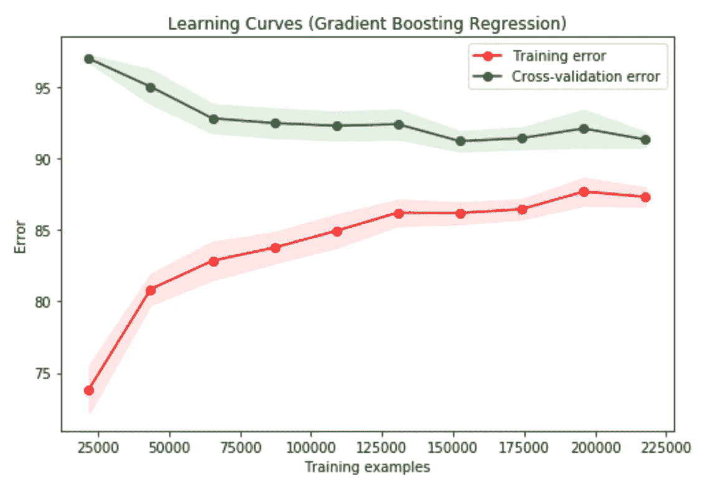
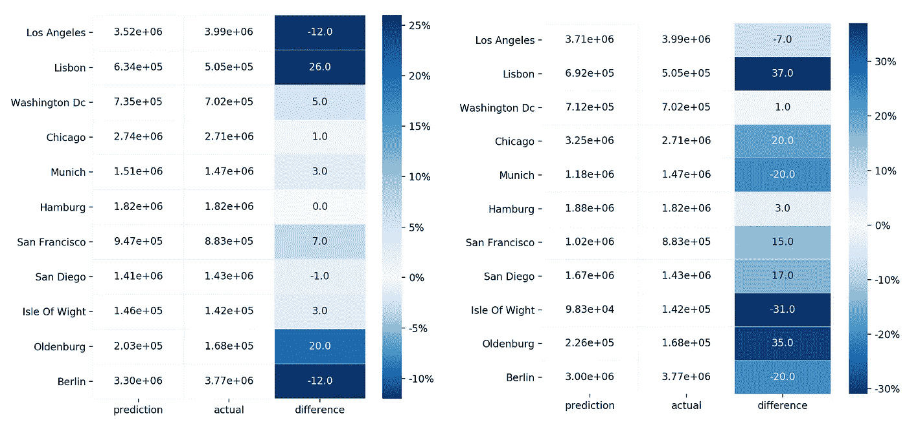

# 估计任意选择地区的人口

> 原文：<https://towardsdatascience.com/estimating-the-population-of-arbitrarily-chosen-areas-533e81c2104e?source=collection_archive---------51----------------------->

## 仅使用 OpenStreetMap (OSM)功能

使用本帖中描述的模型进行人口估计的例子

# 介绍

自古以来，人们就一直在寻找关于一个特定地方或国家人口数量的信息。旧帝国和国家会不遗余力地粗略估计其领域的居民人数，以确定可以招募的军事力量或可以征税的人数。

在近代，估计人口的方法有了很大的改进，变得更加精确，现在大多数政府都定期进行人口普查，并辅以出生、死亡和移民记录，以及上学人数、税收清单、选民登记册等。尽管如此，许多国家和地区仍然缺乏关于其人口的准确信息，即使在这些信息已知的地方，也缺乏细粒度的公开可用信息，通常只有相对较大的行政级别(如村庄、议会等)的数据是已知的或可访问的。

记住这一点，在这篇文章中，我们将研究一种通用的方法来估计世界上任何给定地区的人口，只使用世界上最大和最容易访问的公共数据集之一的要素:[**OpenStreetMap**](https://www.openstreetmap.org/#map=18/51.48934/-0.13251&layers=D)**【OSM】**。

OSM 是一个主要由志愿者构建和维护的大规模协作世界地图，它拥有关于各种事物的丰富信息，如**道路**(高速公路、小学、住宅等)**建筑**(住宿、商业、宗教等)**便利设施**(餐馆、酒吧、娱乐、交通等)**商店****休闲区**、**运动场所**， 以及大量的其他特性，这些特性可以通过使用 API(例如[over](https://dev.overpass-api.de/overpass-doc/en/)API)提取，或者像本项目中的情况一样，通过使用工具(例如 [PyOsmium](https://osmcode.org/pyosmium/) )直接从 OSM 文件中提取。

我们在该项目中使用的人口训练数据(间接)来自脸书的[高分辨率定居层](https://research.fb.com/downloads/high-resolution-settlement-layer-hrsl/)，它使用卫星图像估计给定区域的人口。虽然也许所述模型可以实现更高的精度，但是对新的用户定义的区域执行预测可能意味着能够使用首先使用的图像处理算法，这很可能不是公开可用的，更不用说该任务所需的可能很高的计算资源了。

因此，拥有一个仅基于公开可用数据、使用相对较少的特征集进行同类预测的模型有明显的优势(OSM)。这个[项目的](https://github.com/diogomatoschaves/osm-population-predictor)主要目标是提供这样一个模型作为最终结果。

# 方法学

这个[项目](https://github.com/diogomatoschaves/osm-population-predictor)由三个不同但密切相关的主要步骤组成:*数据收集、数据分析*和*模型训练*。

*注意:正如您将看到的，执行了两个有些独立的工作流，一个使用一组更基本的 OSM 要素(是原始源数据集的一部分)，另一个使用一组扩展的 OSM 要素(添加到原始数据中)。后者将是本次分析的主要焦点，但我们也将讨论前者。*

**数据收集**

我们从一个现有的数据集**【1】**开始，它由多个六边形组成，边长 400 米，横跨整个地球(减去一些阴影区域)。其中包含来自脸书[高分辨率定居图层](https://research.fb.com/downloads/high-resolution-settlement-layer-hrsl/)的关于人口数据的聚合数据，并结合了一些 OSM 要素，如 OSM 对象的数量、建筑物的数量、绘制该区域地图的 OSM 用户的数量、道路的总长度等。

从这个庞大的数据集中，选择了包含大不列颠(英格兰、苏格兰和威尔士)的一个较小的子集区域，并对该模型进行了过滤，结果得到了一个由大约 300k 个六边形组成的数据集。选择该地区是因为其在高密度城市地区和低密度农村地区之间相对较大的分布，以及相对较好的地图绘制。生成的数据集的快照如下所示。

红色区域表示人口较多的区域

由于该数据中存在的 OSM 要素不足以解释足够的差异(正如我们将在**结果**部分中看到的)，我们投入了大量精力来构建一个[应用程序](https://github.com/diogomatoschaves/osm-feature-extractor)，该应用程序在给定一个基本 OSM 文件和一个定义研究区域的 GeoJSON 多边形的情况下，可以自动检索多个要素并将这些要素映射到所提供的多边形。

OSM 数据模型是这样的，有**节点**、**路**和**区**。节点是所有其他更复杂结构的基本构建块，当它们具有相关联的标签时，它们被包括在*计数中。*路代表表示线的节点的集合，例如用于绘制道路。因此，它们被映射为一个*长度。*最后，区域是在相同位置开始和结束的节点的集合，用于绘制建筑物或任何其他结构，因此，被绘制为*区域。*

因此，最终这相当于大约 120 个提取的特征，这基本上对应于可以从 OSM 地图中提取的大部分信息。例如，在下图中，所有紫色标签对应于商店，然后按类别划分(如食品、服装、美容等)，而暗黄色标签对应于娱乐设施，再按类别划分(食物、娱乐、交通等)。

*要深入了解特性集合背后的基本原理，请访问相应的* [*项目*](https://github.com/diogomatoschaves/osm-feature-extractor) *和* [*OSM 维基*](https://wiki.openstreetmap.org/wiki/Map_Features) *。*

OSM 标签示例

收集完数据后，执行了一些数据清理，包括删除只有一个值的列和离群值。因为没有分类变量，所以不需要一次性编码。在此之后，数据就可以进行分析并构建模型了。

**数据分析**

在数据收集和准备步骤之后，进行探索性分析，以便了解数据以及目标变量*群体*和其他独立变量之间的关系。因为我们在构建回归模型，所以数据最重要的特征之一是因变量(目标变量)和自变量(特征变量)之间的相关性。也许不出所料，发现变量`highway_residential_length` *、* `landuse_residential_area`和`highway_bus_stop_count`具有最高的相关性，因为这些变量与住宅区相关联，因此与人口密集的地方相关联。相反，负相关性最高的变量是`natural_area`和`landuse_agricultural_area`，这也是意料之中的，因为这些类型的特征与低人口密度相关。下图显示了完整的关联结果。

所有特征和总体之间的相关性

仔细看看这些变量之间的关系*，*，`highway_residential_length`，*，*，*，*，*，*之间的相关性很强，但*，`building_accommodation_count`，*，`population`，*之间的相关性较弱。*对于负相关的变量，我们可以观察到关系不是线性的，而是抛物线的，这已经给了我们一个指示，或许变量的多项式项将提供更好的数据拟合。**

对数据进行空间可视化也带来了一个有趣的视角，证实了我们在散点图中看到的相关性。不出所料，城市中心的住宅道路、铁路和建筑较为集中，而农业用地较多的地区或标记为自然的地区在远离城市中心的地方较为集中。

所选要素的空间分布。较红的区域表示较高的值

**模特培训**

在分析数据后，将机器学习管道放在一起，以便对数据执行一些预处理和转换，然后将训练数据拟合到模型中，测试-训练分为 20-80%。

管道中的一个转换是通过与每个训练示例相对应的*区域*来标准化所有特征和目标变量，因为这被证明是使结果对更大的区域更通用的更好的解决方案。下面简要描述流水线的步骤:

1.  *计算面积*:该步骤计算输入数据的*面积*，如果还没有计算的话。
2.  *特征选择器*:该步骤选择模型特征+区域*，后者将在下一步使用。*
3.  **面积归一化器*:该步骤通过对应于该训练示例的面积来归一化每个特征。*
4.  **删除列*:该步骤删除不需要的列；在本例中为*区域。**
5.  **特征映射*:该步骤将输入特征的多项式项添加到指定次数(如果为 1，则不添加多项式项)。可以选择只包含指数项，也可以包含变量之间的相互作用项。*
6.  **特性缩放*:该步骤通过减去平均值并除以标准偏差，使特性值都处于同一比例。*
7.  **回归器*:这一步是实际应用回归算法，将数据拟合到模型中。*

# *结果*

*如前所述，构建了两种不同的模型:第一种方法使用包含少量 OSM 要素的源数据集，第二种方法使用通过定制的[应用](https://github.com/diogomatoschaves/osm-feature-extractor)增加了更多要素的数据集。为了测试模型的性能，选择了两个不同的指标:r*r*得分，它为我们提供了模型所解释的数据中方差比率的度量，以及*平均绝对误差*，它为我们提供了模型在可测量的数量上表现如何的指示，在我们的情况下是*居民/公里。**

*对于建立模型的第一种方法，尝试了线性(**套索**和**山脊**和集合(**随机** **森林**和**梯度** **推进**)回归器的组合。在执行超参数调整后，可以看到使用高达三次多项式项和**梯度** **提升**回归量的组合获得了最佳结果，相应的 *r* *得分*约为 0.67，而*平均绝对误差*约为 158 *居民/ km。*为了了解我们在偏差-方差方面的表现，我们分析了学习曲线，正如我们所怀疑的那样，我们可以观察到，即使使用多项式来构建变量之间更复杂的关系，模型也存在高偏差，其中训练和交叉验证误差都收敛于相对较高的值。因此，为了建立一个性能更好的模型，我们不需要添加更多的训练数据，但要包括一个更大的特征集，一个可以解释目标变量中更多变化的特征集。*

**

*因此，在这些学习的激励下，获得了更多的数据(详见*数据收集*)，使我们准备好将机器学习管道应用于这个丰富的数据集。与前面的方法一样，再次尝试了线性(**套索**和**山脊**)和集合(**随机** **森林**和**梯度** **推进**)回归元的组合。在超参数优化之后，高达二次多项式项和**梯度** **提升**回归量的组合再次获得了最佳结果，其 *r* *得分*约为 0.9，而*平均绝对误差*约为 91.8 *居民/公里。与第一种方法相比，这是一个巨大的进步！这证明了获取更多功能的努力是值得的。再看一下学习曲线，我们看到训练和交叉验证误差仍在收敛(表明模型中存在一定的偏差)，但其值要小得多。**

**

*不过，在这种情况下，对一些地方/城市*的实际人口值和估计人口值进行了比较。完成后，可以看到使用正则化值为 1 的**套索**回归变量获得了最佳结果(实际和预测之间的平均误差较低)，这表明当使用**梯度推进**回归变量时，我们可能在某种程度上过度拟合了数据。*

** *为了计算自定义地点的人口，首先需要使用*[*osm-feature-extractor*](https://github.com/diogomatoschaves/osm-feature-extractor)*并绘制所提供区域的 osm 特征。然后，可以将这个中间步骤输入模型，该模型将输出人口密度(居民/公里)。最后，将结果乘以面积，就得到总人口。**

**

*Lasso(左)和梯度增强(右)模型在几个地方的模型结果比较*

*进一步检查模型，该模型的特征重要性表明，实际上迄今为止最重要的特征是`highway_residential_length`，而不是 Lasso 回归的更为分散的系数值。这表明了这样一个事实，即 **Lasso** 回归模型可能更善于概括未知的情况，因为它考虑了更多的特征，因此不容易过度拟合。*

**

*Lasso(左)和梯度增强(右)模型之间的系数/特征重要性比较*

# *结论*

*在这个项目中，我们着手建立一个模型，仅基于从 OSM 数据中提取的特征，该模型可以准确预测给定区域的人口。为此，我们首先从取自**【1】**的数据集开始，该数据集的特点是特征很少，因此产生了高偏差模型。基于此，我们使用定制的[应用程序](https://github.com/diogomatoschaves/osm-feature-extractor)从 OSM 文件中提取特征来扩展基础数据。*

*我们看到，添加更多的特征，尽管有给模型增加一些噪声的风险，但提供了更好的预测能力，并使我们能够大大降低平均绝对误差。此外，通过这种方法，我们可以从 OSM 文件中确定性地提取所有需要的模型输入特征，而不是仅使用初始数据，我们没有现成的方法来确定新区域的特征，而不必执行某种逆向工程。*

*我们看到，尽管**梯度推进**回归器模型在测试数据上表现更好，但**拉索**回归器在几个地方/城市的实际人口估计上表现更好，实现了 26%的最大差异。*

*在这个模型中，我们使用了遍布英国的数据点，这些数据点跨越了人口密度非常高的地区(如伦敦)，以及人口密度较低的地区和农田。这应该使模型能够很好地扩展到大多数情况，虽然如果我们在人口密度非常高的地区使用它，可能不是那么好。此外，该模型还取决于研究中该区域的地图绘制程度。在西方世界的大部分地区，OSM 提取的地图绘制得相当好，但在欠发达地区就不那么好了——尽管总的来说，主要的人口中心往往都绘制得很好。*

*尽管存在这些事实，但我们看到该模型对实际地点和城市人口的估计误差相对较低，并且我们现在有了一个模型，可以仅根据 OSM 特征对任何给定区域的人口进行粗略估计。*

**查看更详细的分析请查看 Github 资源库***。***

# **参考**

****【1】-**[Kontur 人口:全球人口密度为 4 亿 H3 六边形](https://data.humdata.org/dataset/kontur-population-dataset)**

****【2】-**[巴斯特，汉娜，2015。精细的人口估计](http://ad-publications.informatik.uni-freiburg.de/GIS_population_BSW_2015.pdf)**