# 用有限混合模型和 EM 算法估计经济状态

> 原文：<https://towardsdatascience.com/estimating-the-state-of-the-economy-with-finite-mixture-models-and-the-em-algorithm-d975d280dbc6?source=collection_archive---------48----------------------->


**有限混合模型假设存在一个潜在的、不可观察的变量，该变量会影响生成数据的分布。这个想法有许多实际应用:例如，股票价格可能根据一些假设的模型而变化，但是这个模型的参数在牛市和熊市期间可能是不同的。在这种情况下，潜在变量是经济状况，这是一个有点不确定的术语，但却非常有影响力。**

将有限混合物拟合到数据包括估计数据可能来自的分布的参数，以及来自每个分布的概率。**这使我们能够量化和估计重要但未定义和不可观察的变量，例如已经提到的经济状况！**然而，使用标准的最大似然法并不容易。幸运的是，聪明的期望最大化(EM)算法拯救了我们。

本文分为三个部分，讨论以下主题:

1.  EM 算法是什么，它是如何工作的，以及如何用 Python 实现它。
2.  如何在实践中应用它来估计经济状况。
3.  附录:为好奇的读者提供 EM 算法背后的数学知识。

让我们直入主题吧！


# 期望值最大化算法

我们将首先使用一些随机生成的数据来讨论 EM 算法。让我们从数据生成过程开始。假设我们的数据可能来自两个不同的正态分布。一个用平均值-4 和标准差 2 来描述。对于另一个，参数分别是 11 和 3。

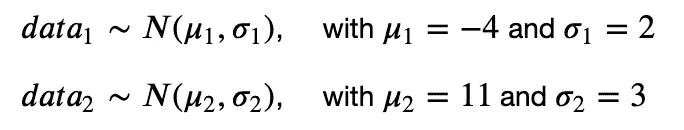

我们实际观察到的数据是上述两者的混合，定义为

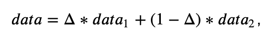

其中δ∑{ 0，1}，概率𝑝为 1。在我们的例子中，让我们设置𝑝为 0.65。因此，如果对于给定的数据点δ= 1，它来自分布𝑑𝑎𝑡𝑎1，如果δ= 0，它来自𝑑𝑎𝑡𝑎2.这里，δ是我们在现实中不会观察到的影响数据生成过程的潜在变量。让我们根据这个过程生成一些数据，并绘制它们的直方图。

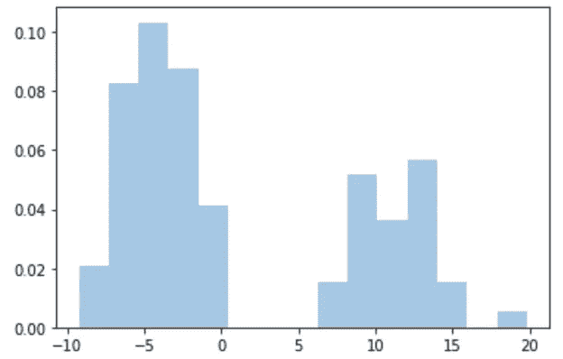

快速浏览该图表明，数据可能是在两条法线混合的情况下产生的。因此，两个高斯函数的有限混合似乎是这些数据的合适模型。请记住:我们观察的只是数据，我们需要估计的是参数:𝜇1、𝜎1、𝜇2、𝜎2 和𝑝，称为混合概率，是数据来自其中一个分布的概率——比如第一个。

这种数据的可能性很难通过分析最大化。如果你想知道为什么会这样，向下滚动到数学附录。但是还有另一种方法——EM 算法。这是一种使用迭代两步程序提供对数似然函数最大值(可能是局部最大值)的方法:

*   期望(E)步骤，
*   最大化(M)步骤。

在 E 步骤中，我们基于数据和潜在变量δ的联合密度计算所谓的*完全数据似然函数*。在 M 步中，我们最大化这个函数的期望值。我们迭代地重复这两个步骤，直到参数估计不再改变。所有的数学推导都归入下面的附录中；现在，让我给你提供现成的公式。

在我们的两个高斯混合的情况下，e 步骤包括计算𝑝=1 给出其他参数的概率，表示为𝑝𝑝1:

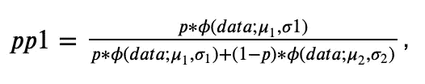

𝜙(𝑑𝑎𝑡𝑎在哪里；𝜇1,𝜎1)是第一个分布下数据的概率密度，一个具有均值𝜇1 和标准差𝜎1.的高斯分布让我们把它编码下来:

M 步骤中应用的最大化公式如下(滚动到底部查看推导过程):

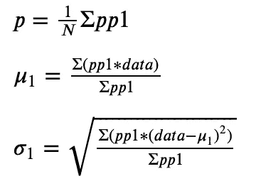

𝜇2 和𝜎2 的公式是相同的，只是它们用(1−𝑝𝑝1)代替了𝑝𝑝1.让我们把它翻译成 Python:

如您所见，E-step 对参数𝜇1、𝜎1、𝜇2、𝜎2 和𝑝进行条件化，M-step 对其进行更新。为了开始，我们需要在运行第一个 E-step 迭代之前初始化这些参数。一个普遍的选择是将均值𝜇设置为从数据中抽取的任意随机数据点，将标准差𝜎设置为数据的标准差，将𝑝设置为 0.5:

我们现在已经编码了整个 EM 算法！让我们将所有这些代码放入一个名为`TwoGaussiansMixture()`的类中，使用一个`fit()`方法，该方法将`data`和`num_iter`作为参数，初始化参数，并通过 E 和 M 步骤迭代`num_iter`迭代。该类还将有其他三个实用程序方法:

*   `predict()`，它获取一些数据`x`，并为这些数据生成我们拟合的高斯混合的预测 PDF，
*   `get_mixing_probability()`，它获取一些数据`x`，并返回每个数据点来自其中一个分布的概率，
*   `plot_predictions_on_data()`，将`predict()`生成的 PDF 绘制在原始数据直方图的顶部。

现在，让我们用 100 次迭代来拟合我们的模型，并绘制预测的 PDF。

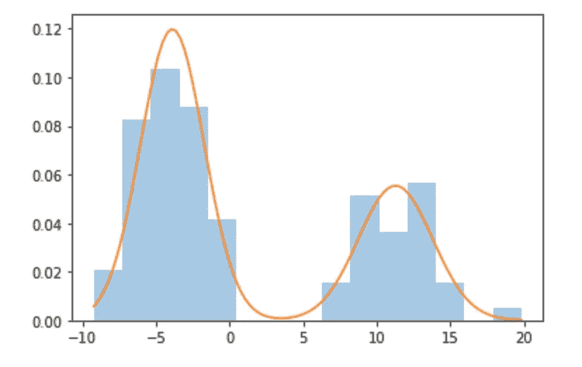

蓝色直方图和上面的一模一样，描绘的是原始数据。橙色线是我们拟合的高斯混合的概率密度，或 PDF。它非常符合数据！我们也可以在上面的图上画出混合概率。

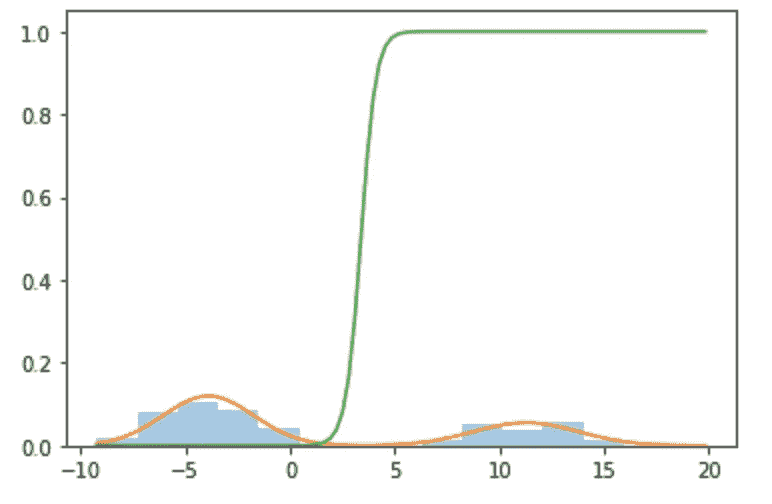

在图的左侧，混合概率接近于零，这意味着模型确定 x 轴上的值来自左侧分布。我们越向右走，模型就越确定数据来自另一个模型。

最后，我们来看参数。他们正确估计了。

```
print(model.mu_1, model.mu_2, model.sigma_1, model.sigma_2, p)11.263067573735341 -3.893589091692746 2.5184757384087786 2.162510874493102 0.2999296508820708
```

回想一下，真实均值是-4 和 11，标准差是 2 和 3，𝑝是 0.65(因此 1−𝑝是 0.35，该模型不关心哪个分布是哪个)。参数估计值似乎接近真实值！


# 评估经济状况

现在我们已经看到了 EM 算法如何处理一些随机生成的数据，让我们将这些知识付诸实践吧！下图显示了美国从 1967 年到 2019 年的季度 GDP 增长率。红色条纹是美联储宣布为衰退的时间段。我们可以看到，衰退与 GDP 增长率的大幅下降相关联。

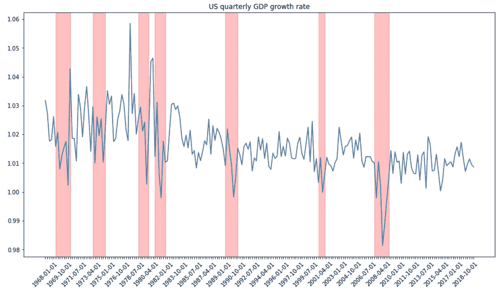

数据来源:弗雷德

让我们比较一下衰退时期和非衰退时期的 GDP 增长率直方图。

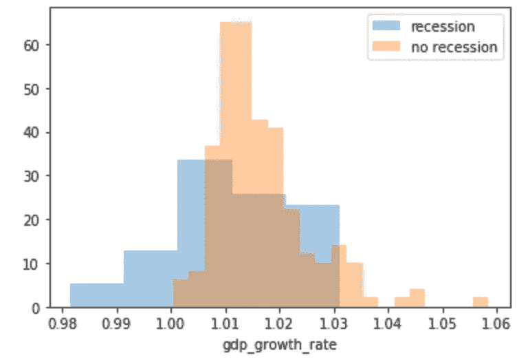

看起来像两个高斯人？这是我们`TwoGaussiansMixture()`模型的一个很好的用例！在这种情况下，我们假设 GPD 增长率具有正态分布，参数取决于潜在变量δ，δ要么为 1，要么为 0:衰退或不衰退。在这种情况下，参数𝑝可以被解读为衰退的概率，对经济状况的一个很好的估计。

我们将重用我们的`TwoGaussiansMixture()`类，并使用`get_mixing_probability()`方法来计算每个原始数据点的𝑝。由于原始概率𝑝非常嘈杂，我们将使用滚动平均来平滑它们。

现在，让我们画出我们估计的衰退概率和美联储宣布的衰退概率。

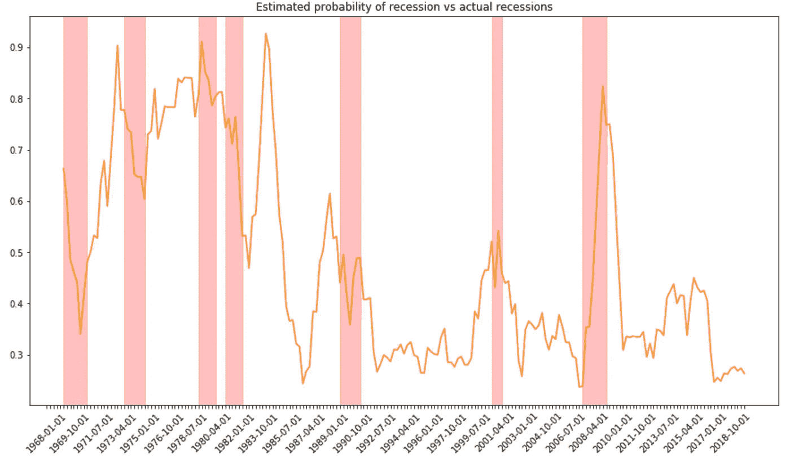

在过去的三次衰退中:2007 年的房地产泡沫、21 世纪初的互联网泡沫和 1990 年的油价冲击，我们的估计都达到了峰值，表明衰退的概率很高，而事实也确实发生了。一些早期的衰退也被很好地捕捉到了，尽管模型显示 1983 年有 90%的可能性出现衰退，但实际上并没有出现。

也许这个模型并不完美，但请记住，它能看到的唯一数据是 GPD 增长率，并且它输出了对经济状况的概率估计——可能是 1983 年预测的峰值捕捉到了经济几乎崩溃的危险吗？


感谢阅读！如果你对 EM 方程的来源感到好奇，请随意阅读下面的数学附录。不然就自己抓点数据建个有限混合模型！所有的代码，包括产生情节的代码，都可以在[这里](https://github.com/MichalOleszak/KnowledgeBank/tree/master/blog_posts/em_algorithm)找到。

如果你喜欢这篇文章，试试我的其他文章。不能选择？从这些中选择一个:

[](/boost-your-grasp-on-boosting-acf239694b1) [## 增强你对助推的把握

### 揭秘著名的竞赛获奖算法。

towardsdatascience.com](/boost-your-grasp-on-boosting-acf239694b1) [](/a-comparison-of-shrinkage-and-selection-methods-for-linear-regression-ee4dd3a71f16) [## 线性回归中收缩法和选择法的比较

### 详细介绍 7 种流行的收缩和选择方法。

towardsdatascience.com](/a-comparison-of-shrinkage-and-selection-methods-for-linear-regression-ee4dd3a71f16) [](/model-selection-assessment-bb2d74229172) [## 模型选择和评估

### 超越火车价值测试分裂

towardsdatascience.com](/model-selection-assessment-bb2d74229172) 

# 附录:EM 算法的数学

在这个可选部分，我们将展示为什么我们必须使用 EM 算法来估计混合模型。我们还将推导出之前应用过的公式。

回想一下数据生成过程如下:

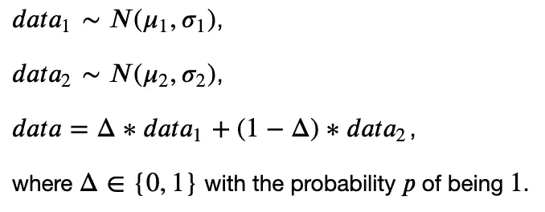

让我们将所有的模型参数共同表示为𝜃={𝜇1,𝜎1,𝜇2,𝜎2,𝑝}.

由于*数据*是两个高斯混合，并且数据点是独立的，因此数据的似然函数是每个数据点的高斯混合的乘积:

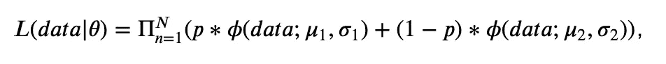

其中𝜙表示高斯分布的 PDF。如果我们取似然性的对数，以便更容易地最大化它，请注意，高斯 pdf 上的和将出现在对数内，这一点也不容易。我们可以尝试数值方法，但这对于更多的高斯混合来说很难。最后，我们还想知道在给定参数(即概率𝑃(δ=1|𝜃).)的情况下，哪个分布与每个数据点相关

## 可能性

这是电磁魔法的切入点！即使δ未被观察到，我们也可以认为它是数据集的一部分。这被称为*数据增强*(不要与这个术语的机器学习含义混淆，它表示基于真实的观察人为地创建更多的数据)。然后我们考虑所谓的*完全数据似然函数*，基于*数据*和δ的联合密度。

根据条件概率定律，我们可以推导出*数据*和δ的联合密度:

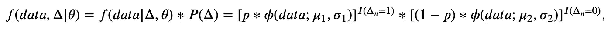

其中，𝐼是指示函数，如果其自变量为真，则为 1，否则为 0。*完全数据似然函数*是上述跨观察的产物:

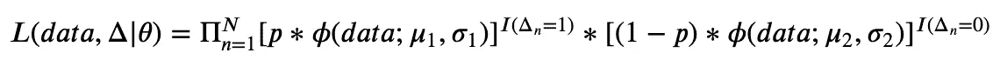

当我们对其取对数时，乘积的对数变成对数的和，我们得到下面的*对数完全数据似然函数*:

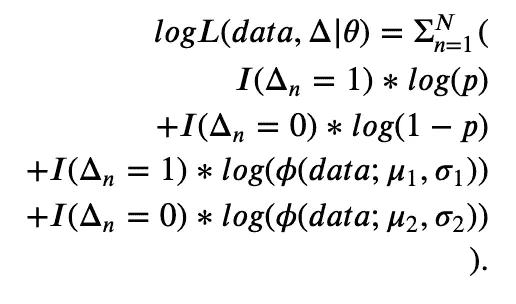

## 电子步骤

上面的对数似然是需要最大化的。然而，我们没有观察到它的𝐼(δ𝑛=1 部分。因此，我们简单地取δ的期望值。这需要我们计算期望𝐸[𝐼(δ𝑛=1]，这就是𝑃(δ=1|𝜃).在上面的代码中，这个量被表示为𝑝𝑝1，可以计算如下:

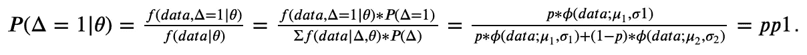

完成后，我们可以将上述内容代入𝑙𝑜𝑔𝐿的公式，计算出*预期对数似然*:

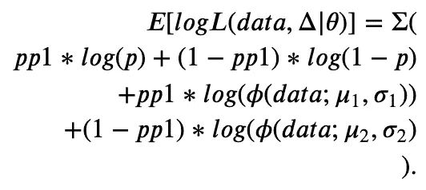

## m 步

艰苦的工作完成了！最大化上述内容实际上很简单，因为有三个独立的相加部分，它们中的每一个都可以单独最大化。第一部分提供了𝑝作为𝑝𝑝1.平均值的新估计第二个可以使用普通的 PDF 公式重写为:

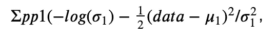

其在将一阶导数设置为零并求解最大值后，提供了用于更新𝜇1 和𝜎1:的公式

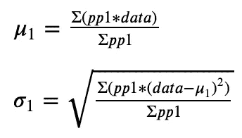

可以相应地推导出更新𝜇2 和𝜎2 的公式。这些是我们在前面的代码中使用的精确公式。