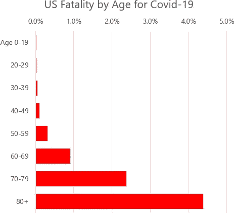
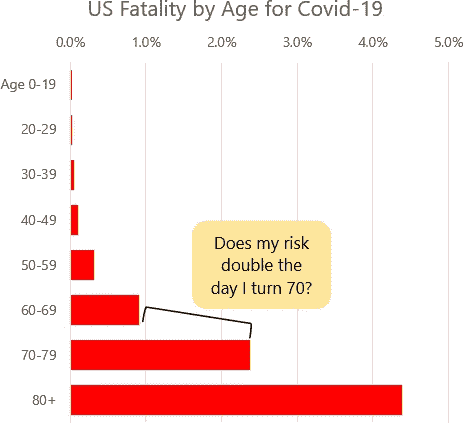
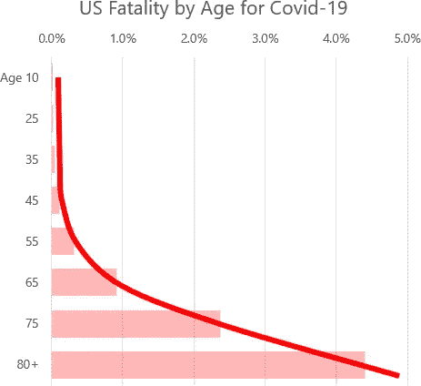
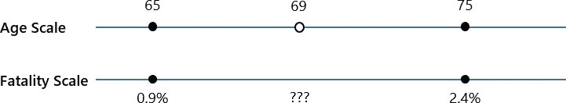
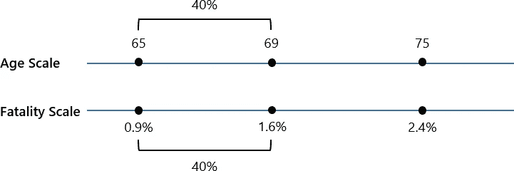
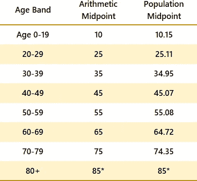
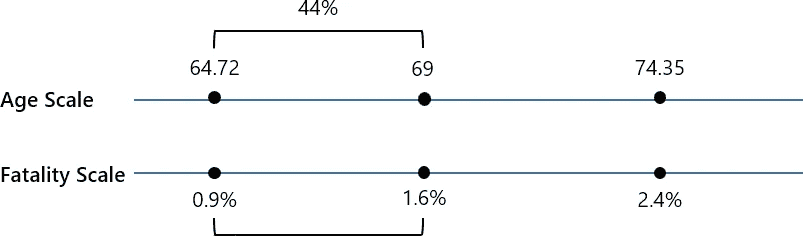
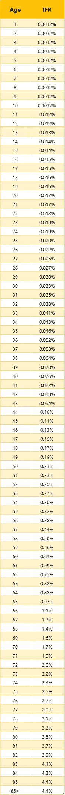

# 新冠肺炎在个别年份的特定年龄风险

> 原文：<https://towardsdatascience.com/estimating-year-of-age-specific-risks-for-covid-19-328ceba7cd4d?source=collection_archive---------30----------------------->

## 据报道，10-20 岁年龄段人群中存在新冠肺炎的年龄风险因素。我们可以做得更好。很容易估计特定年龄的个体年风险，这使得人们能够更准确地评估他们的个人风险水平。

# TL；速度三角形定位法(dead reckoning)

我们现在已经有了相当好的关于新冠肺炎相关风险的数据，但这些数据并没有以让人们容易理解或使用的方式呈现出来。这一系列的目的是帮助人们更清楚地评估新冠肺炎对他们自己和他们所关心的人的风险。

查看文章底部的图 8，了解特定年龄的风险水平。

裘德·贝克在 [Unsplash](https://unsplash.com/s/photos/family?utm_source=unsplash&utm_medium=referral&utm_content=creditCopyText) 上的照片

# 谁会以 10 年为一个年龄段来描述自己的年龄？

你可能见过许多类似图 1 所示的图表，它显示了年龄如何影响新冠肺炎风险。

图 1-新冠肺炎基于年龄的死亡率。具体数字摘自本系列[第二部](/the-uncanny-consistency-of-covid-19-age-based-fatality-data-e2abe37b570)。

这些图表有助于传达风险随年龄增长的一般概念。但是他们不太擅长传达任何特定年龄的风险水平。如图 2 所示，我 70 岁那天会发生什么？我的风险是否在一天内从 0.9%增加到 2.4%？

图 2——像这样的图表不能精确地传达特定年龄的风险。

你的风险当然不会在一天内增加。在你 60 多岁的时候，它一直在增加，在你 70 多岁的时候，它还会继续增加。图 1 和图 2 中的图表实际上是稳步增长的风险水平的粗略近似值，如图 3 所示。

图 3——显示风险的条形图实际上显示了年龄段中点的风险水平。

条形图上的每一条实际上显示了每个年龄段的平均风险水平。或者，换句话说，它显示了每个年龄段中点的风险。

在每个年龄段的低端，你的风险比显示的要低，在每个年龄段的高端，你的风险比显示的要高。61 岁时，你的风险低于 0.9%。69 岁时，你的风险高于 0.9%。只有当你接近年龄段的中间值，也就是接近 65 岁时，你的风险才是 0.9%。

# 使用内插法估计年龄风险因素

据我所知，没有政府机构或研究人员发表过新冠肺炎的年龄特异性风险。然而，使用*插值*的数学技术，更具体的风险水平很容易从可用数据中估算出来。

让我们看一个例子。假设我们想估计 69 岁老人的死亡率。我们从我们知道的开始。如图 4 所示，我们知道 65 岁时的死亡率为 0.9%，75 岁时的死亡率为 2.4%。我们想知道的是 69 岁时的死亡率是多少。

图 4

我们知道另外一个可能不太明显的事实，那就是 69 是 65 到 75 的 40%。

插值是这样的假设，如果你有两个相关的标度，并且其中一个标度上的一个因子是从一端到另一端的 40%,那么相关标度上的相关因子也必须是从一端到另一端的 40%。这种假设不一定 100%正确，但除非我们相信一个人的风险因素确实在他们的生日那天突然增加，否则这是一个合理的近似值。

如图 5 所示，当我们计算时，这意味着 69 岁的人的死亡率为 1.6%。

图 5

# 一个小问题

图 3-5 中使用的中点是年龄组的直接算术中点。例如，我显示 65 岁是 60-69 岁年龄段的中点，因为它是 60-69.999 的中点。(真正的年龄段不是 60–69，是 60–69.999。)

每个年龄段更准确的中点应该使用每个年龄段实际人数的加权平均值来计算。直到 60 岁，这种人口加权中点和算术中点之间的差异是最小的*，但对于 60-69 岁年龄段，这种差异是一年的四分之一，而对于 70-79 岁年龄段，这种差异是一年的三分之二。*

*每个年龄段的具体差异如图 6 所示。*

**

*图 6-每个年龄段的算术和人口中点。80 岁以上年龄段的中间点是以不同的方式确定的，将在本文后面解释。*

*现在我们有了更准确的年龄组中点，我们应该修改图 5 所示的插值，以使用更准确的中点。该修订如图 7 所示。*

**

*图 7*

*从图 7 中可以看出，在这种特殊情况下，69 岁的风险系数 1.6%保持不变。然而，其他年龄段的风险因素确实会发生变化。*

# *真正的特定年龄风险因素*

*我们可以对所有其他年龄进行与图 7 中相同的过程，使用年龄组的人口加权中点，并为每隔一个年龄创建一个特定年龄的风险因素表。这些计算的结果如图 8 所示。*

**

*图 8*

# *限制和注意事项*

*以这种方式插值是一种近似的练习。图 8 中的数字并非基于死亡数据本身；它们相当于可以从粗略数据中近似推断出的额外精度。*

*这种方法还有一些额外的限制。*

*第一个限制是，我们不能插值超过最年轻和最年长年龄带的中点。*

*在低年龄方面，我们知道年龄范围的中点是 10.15，我们知道风险系数是 0.0012%。但是由于我们没有 10.15 岁以下人群的风险数据，我们没有在更年轻的年龄插入风险因素的基础。这意味着 10.15 岁以下的所有因素都是一样的。由于四舍五入，11 岁和 12 岁的附加因素看起来是一样的。*

*在高年龄方面，死亡率数据停留在 80+。我们知道下面年龄段的中点是 74.35，我们知道它的风险系数是 2.4%。我们知道下一个年龄段的风险系数是 4.4%，但我们不知道它的中点，因为它被描述为“80+”。对于这个最高范围，我将中点定义为 85 岁。美国人口普查数据显示，80-84 岁的人口有 610 万，85 岁以上的人口有 650 万。根据这些数据，真正的中点一定在 85 岁以内。*

*由于我们没有 85 岁以上人群的死亡率数据，我们无法对 85 岁以上人群进行插值，因此每个更大的年龄都有相同的风险因素。*

# *为什么特定年龄的危险因素很重要？*

*图 8 中的风险因素允许一个人比 10 年年龄段的人更准确地评估他们的个人风险。如果你快 50 岁了，感觉非常好，因为从 50 岁到 59 岁的平均风险系数只有 0.30%，查一下表格。58 岁时，你的风险系数是 0.50%，当你 59 岁时，它攀升至 0.56%，这几乎是你年龄段中点风险系数的两倍。*

*在文章的开始，我指出一个 70 岁的人在他们 70 岁的那天死亡风险不会从 0.9%增加到 2.4%。事实上，从表中可以看出，他们的风险从 1.6%增加到 1.7%，当然这也不是一天之内发生的。*

*尽管这篇文章比其他地方更准确地介绍了新冠肺炎风险，但仍然缺少一点，即有无共病。我将在本系列的下一篇文章中展示共病是如何影响个人风险的。*

**这是关于新冠肺炎死亡率的 5 集系列报道的第 4 集:**

*   *[*第一部分*](/new-data-shows-a-lower-covid-19-fatality-rate-1d69361a50af) *:为美国建立一个总体基础 IFR**
*   *[*第二部分*](/the-uncanny-consistency-of-covid-19-age-based-fatality-data-e2abe37b570) *:基于年龄的 IFRs**
*   *[*第 3 部分*](https://medium.com/@stevemcc/why-comparisons-of-covid-19-fatality-rates-are-meaningless-db509d21e4fc) *:基于人口统计的各州和各国 IFRs 的变化**
*   **第 4 部分:按个别年份分列的 IFRs**
*   **第 5 部分:有无共病的 IFRs】**

# *更多详情请访问新冠肺炎信息网站*

*更多美国和州级数据，请查看我的新冠肺炎信息网站。*

**

# *我的背景*

*20 年来，我一直专注于理解软件开发的数据分析，包括质量、生产率和评估。我从处理噪音数据、坏数据、不确定性和预测中学到的技术都适用于新冠肺炎。*