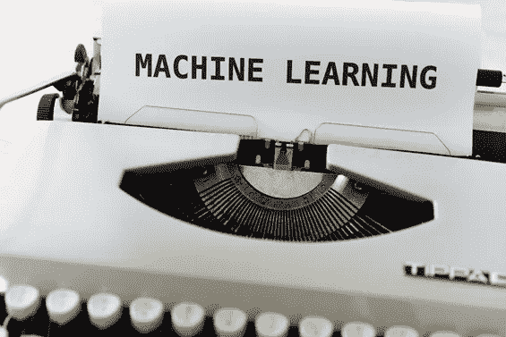
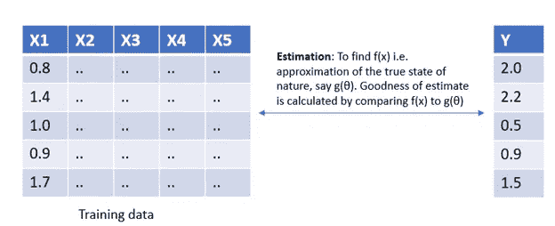
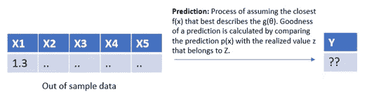

# 估计、预测和预报

> 原文：<https://towardsdatascience.com/estimation-prediction-and-forecasting-40c56a5be0c9?source=collection_archive---------15----------------------->

## 估计与预测。预测对预测。请跟着读，以便快速区分

马库斯·温克勒在 [Unsplash](https://unsplash.com/s/photos/future-prediction?utm_source=unsplash&utm_medium=referral&utm_content=creditCopyText) 上的照片

估计意味着使用历史数据找到最佳的**参数**，而预测使用这些数据来计算未知数据的**随机值**。

在我们继续下一步之前，上面陈述中突出显示的单词需要一些上下文设置:

> 我们需要大量的历史数据来学习机器学习和建模的依赖性。数据通常涉及多个观察值，其中每个观察值由多个变量组成。这个多变量观察值 X 属于随机变量 X，其分布位于被称为**‘自然状态’**的可能分布的有限集合的范围内。

**估算是优化自然界真实状态的过程**。粗略地说，估计与模型构建有关，即**找到最合适的参数，该参数最好地描述了历史数据的多元分布**，例如，如果我们有五个独立变量，X1、X2……X5 和 Y 作为目标变量。然后，估计包括寻找 f(x)的过程，f(x)是由 g(θ)表示的自然的真实状态的最接近的近似值。

训练数据的参数估计

然而，预测利用已经建立的模型来计算样本外的值。它是计算另一个随机变量 Z 的值的过程，这个随机变量的分布与自然界的真实状态有关(这个性质在任何机器学习算法中都起着举足轻重的作用)。平均而言，当所有可能的 Z 值都一致时，预测被认为是好的。

对未知数据的预测

有多种方法可以解释这两者的区别，让我们也来探索一下**贝叶斯直觉**:

估计是在事件发生之后，即后验概率。预测是事件发生前的一种估计，即先验概率。

让我们总结一下我们对估计和预测的理解:为了对看不见的数据进行预测，我们在训练数据集上拟合一个模型，该模型学习估计器 f(x)，该估计器用于对新数据进行预测。

现在，我们了解了预测是什么，让我们看看它与预测有什么不同。

**预测问题是预测问题**的子集，其中两者都使用历史数据并谈论未来事件。**预测和预报的唯一区别是在预报中明确增加了时间维度。**

**预测是基于时间的预测**，即在处理时间序列数据时更合适。另一方面，预测不需要仅仅基于时间，它可以基于影响目标变量的多个因果因素。

我偶然发现了一个非常新鲜的视角，用单词本身的起源来解释预测和预报之间的差异。

我将在本帖中简要介绍这个创新的插图，但是你可以在原帖[这里](https://blueridgeglobal.com/difference-forecasting-predictive-analytics-anyway/)阅读更多关于它的内容。

预测更多的是面向过程，遵循一定的做事方法论。在某种程度上，它假设过去的行为是未来将要发生的事情的足够好的指示器。

预测考虑所有的历史过程，影响变量和相互作用来揭示未来。

> **总之，所有预测都是预测，但并非所有预测都是预测。**

希望你现在已经清楚了估计和预测之间的区别。这篇文章还强调了预测和预报之间的区别。

快乐阅读！！！

参考资料:[https://stats . stack exchange . com/questions/17773/what ' s-difference-of-estimation-and-prediction/17789 # 17789](https://stats.stackexchange.com/questions/17773/what-is-the-difference-between-estimation-and-prediction/17789#17789)