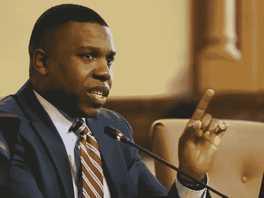

# 对抗带有种族偏见的警察算法的伦理障碍

> 原文：<https://towardsdatascience.com/ethical-hurdles-of-combating-racially-biased-police-algorithms-5d8fc454b15a?source=collection_archive---------37----------------------->

## 调整用于刑事司法的算法的变量权重可能是有希望的，也可能是有问题的。

辛辛那提市议员杰夫·帕斯托尔*(摄影:卡里姆·埃尔加扎/The Enquirer，原载于 cincinnati.com)*

在 2019 年日历年结束时，俄亥俄州辛辛那提市议员杰夫·帕斯托尔(Jeff Pastor)呼吁对该市警务工作中的种族差异进行[全面审查](https://www.cincinnati.com/story/news/2019/12/27/jeff-pastor-proposes-study-racial-disparities-traffic-stops-police-cpd/2742645001/)。斯坦福开放警务项目进行了一次广泛宣传的报告后，帕斯特恳求纽约市进行评估。该报告发现了该市交通拦截的显著差异，包括一项发现“辛辛那提警察在黑人占主导地位的社区比白人多拦截了 120%的居民。”

要求进行审查的呼吁重新激起了警察问责活动家和公共政策界的辩论。随着[预测性警务](https://www.futurity.org/predictive-policing-data-2003012-2/)和[其他数据驱动策略](https://www.themarshallproject.org/2019/07/01/can-racist-algorithms-be-fixed)变得越来越普遍，一个持续发展的主要问题是潜在的有偏见的警察数据会变成什么样？如果警方的互动有偏差，这些数据一旦输入预测模型，就可能导致有偏差的输出，引导警方采取有偏差的行为，即使在警官不知情或不服从的情况下。正如现在的老话所说，“垃圾进来，垃圾出去”。

**修复并不简单**

学者、活动家和爱好者已经在将算法公平性问题带到主流关注的前沿方面取得了长足的进步。面部识别扩散已经在[多个地方](https://www.usatoday.com/story/tech/2019/12/17/face-recognition-ban-some-cities-states-and-lawmakers-push-one/2680483001/)被停止，直到可以开发出合理的安全措施。这发生在种族差异被公开之后，部分原因是人工智能在同质数据集上接受训练，该数据集不包括肤色较深的人。

但是，创建包容性数据集作为一种解决方案并不总是适用的，特别是当涉及到基于历史警方数据的预测性警务时。创建一个道德框架[是困难的](https://www.technologyreview.com/s/612318/establishing-an-ai-code-of-ethics-will-be-harder-than-people-think/)。有了预测性政策，就不是数据科学家创建数据集了。这不仅仅是一个过于同质的集合的问题，而是可用的历史数据在被输入任何预测模型之前可能被污染。一个统计模型可以遵循科学审查的最高标准，但当地面上的个人可以引入有偏见的数据时，这可能无关紧要。

**内建预期**

这就产生了一个问题:可以说，科学家应该用多少数据来进行“先发制人的防御”。

几个月前，公共政策中的有色人种学生研讨会在加州大学伯克利分校高盛公共政策学院举行，人工智能中的种族问题是其中一个主题。该小组由政策专家组成，调查算法不公平的潜在危害，以及活动人士为使政府系统更加透明而正在进行的努力。

该小组讨论了 2017 年斯坦福大学关于奥克兰警官使用语言的种族差异的研究。这项研究中的研究人员使用计算语言学模型来识别语音模式。关键的一点是，该模型可以相当准确地检测出一名官员是否在与一名黑人或白人居民交谈，完全基于对话的文字记录。

小组中的一位数据科学家表示，这样的研究是乐观的理由。她的论点是，如果我们能够确定种族偏见的比率，就像这项研究似乎做的那样，那么你就可以使用调整函数来降低受歧视人口统计数据的得分。

有[个缺点](/is-your-machine-learning-model-biased-94f9ee176b67)，但是统计奇偶性、真阳性率比较和其他“公平指标”中的流行技术在识别偏倚方面显示出希望。然而在实践中，这是有问题的。

**引入体重是种族主义的借口吗？**

想象一下，警察正在使用一个给定的“热点”软件，该软件使用犯罪的时间、位置和历史报告作为变量来预测未来犯罪的风险。一个可能的策略是首先确定有偏见的政策倾向。假设确定了某个城市的特定网格具有相对高密度的少数种族，并且被过度政策化。因此，人们可能会低估与城市网格相关的变量，这表明数据集中的这些观察结果“不太可信”。

在使用许多预测变量的场景中，类似于当代风险地形预测(与“什么？在哪里？什么时候？”热点模型)，可以给变量分配不同的权重。虽然目前没有犯罪前预测性警务的例子旨在为特定人口统计的成员建立预测，但像调整可变权重这样的想法似乎在解决累犯分数的偏见方面受到欢迎。

多年来，美国越来越多的司法管辖区采用“风险评估分数”来帮助确定再次犯罪的可能性。主要用于假释或保释听证会，2016 年 [ProPublica 调查](https://www.propublica.org/article/machine-bias-risk-assessments-in-criminal-sentencing)发现:

> 在预测谁会再次犯罪时,[风险评估]算法对黑人和白人被告犯错误的几率大致相同，但方式非常不同。
> 
> 这个公式很可能错误地将黑人被告标记为未来的罪犯，错误地将他们标记为白人被告的比例几乎是白人被告的两倍。
> 
> 白人被告比黑人被告更容易被误贴上低风险的标签。

当看到这一点时，从上述小组成员的证词中可以推断出一个巨大的诱惑:“如果*人口统计 X*以已知的*偏差率 Y*受到歧视，并且我们有一个包括人口统计信息的预测模型，我们可以调整 T10 人口统计 X 的变量权重，以补偿已知的 T12 偏差率 Y。”

尽管初衷是好的，但这种改革很有可能隐含着接受一定程度的种族主义。在这两种情况下，城市网格的权重或特定人口统计数据的权重都有所降低，一定程度的偏差被接受并纳入模型中。

这可能会造成偏见问题已经“解决”的错觉。这可能会导致不太重视偏见训练。执法部门或州政府可能觉得有必要纠正模型中的问题。如果参与司法系统的个人认为，最终，该模型会纠正他们的行为，他们可能会感到不那么负责。

此外，这带来了新的伦理问题。在犯罪前预测警务的情况下，如果执法中的情绪变化超过了预测算法的能力，该怎么办？预测模型可能不擅长解释剧烈的新变化。假设在一个特定的例子中，执法比分配的权重更有偏向性。在这种情况下，趋势是不是会因为不符合规范而低估这种程度的偏差？假设执法比体重偏差小。在这种情况下，对偏见的内在补偿会成为特定人群的不道德特权吗？

简单地说，偏差率也可能是错误的。这些算法使用历史数据，在某些情况下可以追溯到十年前。偏差率在时间和地点上是静态的吗？这似乎令人怀疑。这是否要求每个在司法事务中使用算法的司法管辖区也量化他们的数据有多大的偏差？如果是，应该多久审计一次这个数字？

我们应该还是不应该包括人口统计信息？

作为对延续种族偏见指控的回应，PredPol，预测警务软件的最大供应商之一，强调他们不使用某些人口统计信息，如种族(尽管这并不能满足因[其他原因](https://medium.com/swlh/cities-should-look-at-los-angeles-history-of-big-data-policing-and-avoid-its-mistakes-e64d96760e15)潜在种族差异的投诉)。这可能是更好的，但陪审团仍然没有出来。

用数据来识别种族差异已经被证明是有用的。但是，正如许多活动家和学者所争论的那样，福柯关于政府统治工作传统的那些人其中最重要的是，人口统计数据也有将个人放入历史盒子并将他们归入官僚类别的风险。例如，人口普查数据在美国[被用于拘留日本人](https://www.npr.org/2018/12/26/636107892/some-japanese-americans-wrongfully-imprisoned-during-wwii-oppose-census-question)，在纳粹德国，它被用于[追踪犹太人口](https://encyclopedia.ushmm.org/content/en/article/locating-the-victims)。即使没有明显的恶意目的，人口统计数据仍然可以加强分离。它巩固了“他者”的存在。

接下来的问题是，如果偏见持续存在，即使没有人口统计数据，通过消除这些数据，我们已经不可挽回地损害了我们识别偏见的集体能力，该怎么办？

**结论**

在执法中使用算法似乎不是一种衰落的时尚。随着犯罪前和风险评估中的预测性警务持续增长，数据科学和社会科学领域必须保持警惕。不能忘记，模型的另一边也有人类。应该查询数据，遵循最佳做法，分享对话。