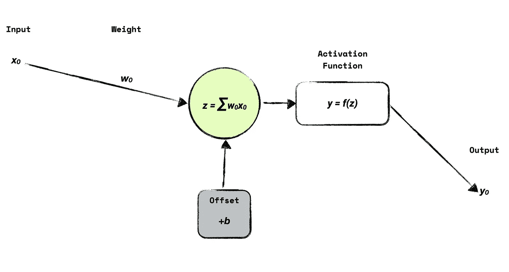
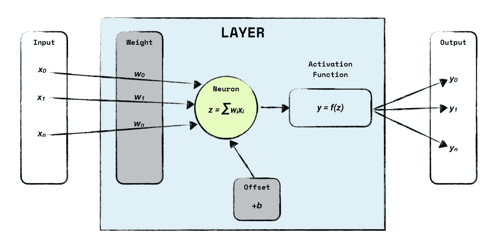
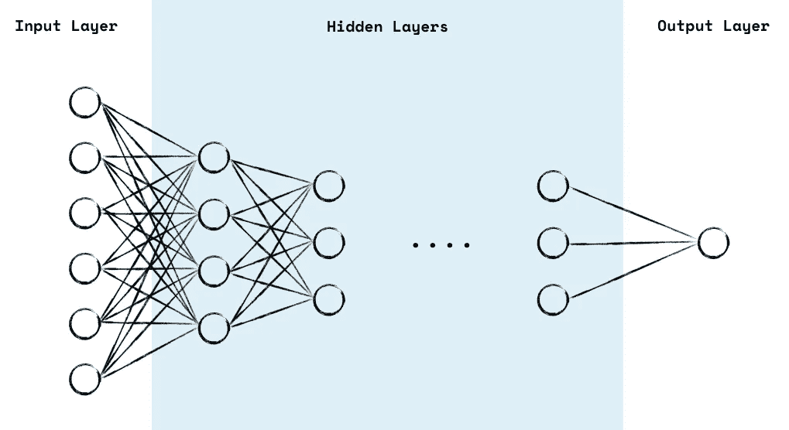

# 伦理和(可解释的)人工智能

> 原文：<https://towardsdatascience.com/ethics-and-explainable-ai-e13664d50b4e?source=collection_archive---------78----------------------->

## 基于 AI 的系统必须负责任。直到现在，它们中的许多都是黑匣子。道德和无偏见的训练数据比以往任何时候都更重要。

马库斯·温克勒在 [Unsplash](https://unsplash.com?utm_source=medium&utm_medium=referral) 上的照片

大多数人更信任计算机算法，而不是其他人。不幸的是，与算法相比，当专家做出有充分根据的陈述时，情况也是如此。大多数人不知道计算机做出决定的依据是什么。许多人认为他们是无条件的。但这只是部分真实。算法是人类开发的。有些人可能会说，有了机器学习，人类开发人员的偏见被消除了。让我们简单看一下机器学习和深度神经网络。

好的机器学习模型需要好的数据。在监督学习中，你需要一组好的分类训练数据。如果你的训练集有偏差，模型也会有偏差。那是什么意思？让我们来看看一些有偏差的训练数据的案例以及使用它们的后果。

## 你会得到这份工作吗？

如果在招聘过程中消除人类的偏见，那不是很好吗？如果某人来自外国，种族背景和性别并不重要。只有技能很重要。算法的完美工作，不是吗？这是亚马逊在 2014 年的想法。使用了一种算法来预筛选空缺职位的候选人。2015 年，他们意识到他们的算法偏好男性。即使女性候选人有更好的资格，系统也不会推荐她们。原因:训练集有偏差！在一个男性主导的领域，该模型得出的结论是，女性相当不适合。[2015 年，亚马逊停止使用其算法](https://www.reuters.com/article/us-amazon-com-jobs-automation-insight-idUSKCN1MK08G)。

## 我知道你会做什么，你会再做一次！

一个名为 COMPAS 的 AI 承诺预测犯罪的累犯率。美国的许多州都在使用 COMPAS。通过一组约 137 个问题，这些算法计算出某人是否会再次犯罪。基于此，人们将面临更高的刑期。后果是，法官不看犯罪记录。他们正在使用 COMPAS 返回的分数。这导致了一个危险的反馈循环，因为 COMPAS 没有得到关于错误指控的反馈。训练集可能会有偏差，因为它是基于过去的案例。[准确性值得怀疑。](https://www.theatlantic.com/technology/archive/2018/01/equivant-compas-algorithm/550646/)你可以从 Pro Publica 获得[更深刻的见解，包括一个](https://www.propublica.org/article/how-we-analyzed-the-compas-recidivism-algorithm) [GitHub 知识库](https://github.com/propublica/compas-analysis)和一个漂亮的 Jupyter 笔记本。

## 拉屎进去，拉屎出来。

由来源(WP:NFCC#4)，合理使用，[https://en.wikipedia.org/w/index.php?curid=49953711](https://en.wikipedia.org/w/index.php?curid=49953711)

这是泰。微软在 2016 年创建的聊天机器人。这个想法是创造一个机器人，从 Twitter 上与其他用户的互动中学习。Tay 学得很快。不到 24 小时(确切地说是 16 小时)， [Tay 变成了一个种族主义者、法西斯主义者和歧视者。微软试图修复他们的机器人，但没有成功:Tay 离线了。问题是:用户已经明确地将与 Tay 的对话引向这个方向。拉屎进去——拉屎出来。](https://www.theverge.com/2016/3/24/11297050/tay-microsoft-chatbot-racist)

上面的每个故事都有一个共同点:有偏见的数据被用来训练模型。在模型中，一个黑盒决定如何对一些输入做出反应。想想亚马逊的雇佣人工智能。没有一个申请者知道什么参数是重要的。我怀疑人力资源部的员工不知道他们是如何被评估的。这同样适用于 COMPAS 和 Tay。为了理解黑盒，我们对深度神经网络进行一点小小的探索。

## 简而言之，深度神经网络

**免责声明**:这是一个*高层*的解释。整个话题比较复杂，但是你会明白的。

让我们从一个简单的感知器开始:

简单的感知器。(图片由卡斯滕·桑德特纳提供)

一些输入被加权，放入一个函数，一个激活函数决定感知器是否激活。你的任务是调整权重并定义一个偏差(当输入为 0 时会发生什么？)对训练集中的每个输入数据进行处理，直到它最适合为止。

机器学习的意思是:使用训练数据来确定最适合所有数据的权重。对于简单的感知器，它可以是一个如下的等式

> y = mx + b

在大多数情况下，输入更复杂，我们得到某种线性回归。

一个简单的神经元—(图片由卡斯滕·桑德纳提供)

同样，我们必须找出我们的线性回归最适合所有训练数据的最佳参数。

今天，我们已经有足够的计算能力来毫不费力地训练一个拥有数百万个数据点的模型。而且这么简单的模型，人类还是可以理解的。

现在让我们来看看一个神经网络。

一个简单神经网络的结构(图片由 Carsten Sandtner 提供)

神经网络有一个输入层、几个隐藏层和一个输出层。如你所见，神经元*的每一个输出都可以成为下一层中每一个神经元的输入。为每个神经元确定权重和偏差。它变得越来越复杂，人类将有更多的问题来解释这个网络中发生的事情。深度神经网络可以有两个以上的隐藏层。想象一个有 50-100 个输入和 5 个隐藏层的神经网络。经过训练的模型正在成为人类的黑匣子。*

想想 COMPAS 案例:没有人知道使用了什么参数，模型是如何被训练的？训练集来自哪里？这同样适用于亚马逊案例。神经网络变得越来越复杂。

## 可解释的 AI 解决这些问题？

这就是为什么[可解释 AI](https://en.wikipedia.org/wiki/Explainable_artificial_intelligence) 被要求和鼓励的原因。想法:它描述了神经网络做什么，它如何被训练等。2017 年 [DARPA 资助了几项可解释人工智能的努力](https://www.technologyreview.com/2017/03/14/243295/the-us-military-wants-its-autonomous-machines-to-explain-themselves/)。埃森哲正在宣传负责任的人工智能，可解释的人工智能是其中的一个主要部分。

但是这不仅仅是神经网络可以解释的。基于人工智能的系统不能产生负反馈循环。一个基于数据的算法需要*更多的数据*才能更好。如果像 COMPAS 这样的系统预测累犯率很高，有人因此被判处更长的刑期，重新融入社会就变得更加困难。这里开始了负反馈循环。找工作的机会更差，绝望并可能为了生存而再次犯罪。人工智能系统知道！还是体制造成的？很难回答。

即使不是罪犯，人工智能也能让你深陷困境。例如，斯蒂夫·泰利被错误地指控为罪犯，并被残酷逮捕。他的错？图像识别错误地将他与犯罪联系在一起。

使用的训练数据集必须对所有人开放。如果一个训练集有偏差，人们应该知道。大多数系统，无论是招聘人员还是维持治安，都是作为黑箱工作的。他们也没有一个好的反馈回路。人们仍然更相信计算机算法而不是专家。我们都必须对基于人工智能的系统负责。数据科学家负责负责。由于种族和性别偏见的批评，IBM 最近退出了面部识别业务。这是朝着负责任行动的正确方向迈出的一步。[亚马逊](https://www.washingtonpost.com/technology/2020/06/10/amazon-rekognition-police/)和[微软](https://www.washingtonpost.com/technology/2020/06/11/microsoft-facial-recognition/)也采取了类似的举措。

AI 很棒。我喜欢这项技术的可能性。有很多很好的例子。但是我们需要负责任地使用它。并不是每个问题都可以用人工智能来解决。我们需要时刻牢记这一点。