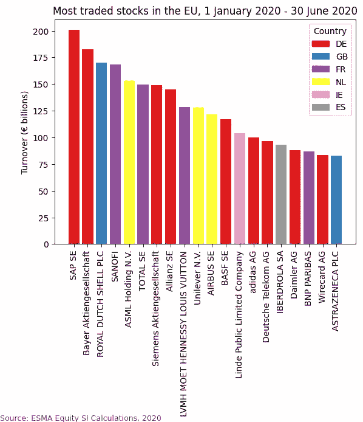
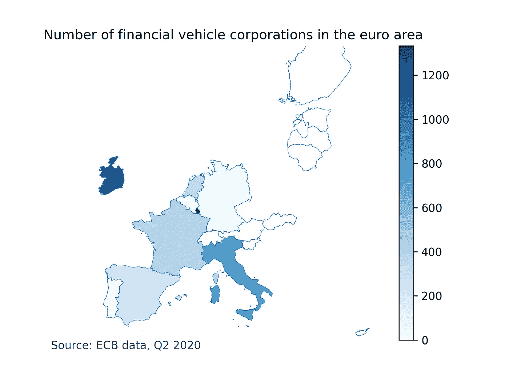

# 欧洲金融监管数据

> 原文：<https://towardsdatascience.com/european-financial-regulatory-data-7b85144f5191?source=collection_archive---------35----------------------->

## 关于如何访问与欧盟金融市场相关的公共数据源的指南


芬恩·普罗茨曼在 [Unsplash](https://unsplash.com?utm_source=medium&utm_medium=referral) 上的照片

***来自《走向数据科学》编辑的提示:*** *虽然我们允许独立作者根据我们的* [*规则和指导方针*](/questions-96667b06af5) *发表文章，但我们并不认可每个作者的贡献。你不应该在没有寻求专业建议的情况下依赖一个作者的作品。详见我们的* [*读者术语*](/readers-terms-b5d780a700a4) *。*

# **简介**

在欧盟，金融市场的参与者——包括银行、保险公司、投资基金、贸易公司和证券化特殊目的载体(SPV)——都受到广泛的规则和监管。许多法规要求市场参与者向监管者提供关于他们自己及其活动的数据，如欧洲中央银行或欧洲证券和市场管理局(ESMA)。监管机构主要使用这些数据来监控金融系统，并(有希望)检测和应对可能导致问题的事态发展。然而，这些数据的一个子集也向公众开放，可能会引起希望更清晰地描绘欧洲金融市场图景的数据侦探的兴趣。

在本文中，我将概述一些公共数据源，解释它们是什么以及如何访问和使用它们。我将使用 Python 编程语言提供几个说明性的代码示例来获取和解析数据，但除此之外，不需要了解任何编程语言。对 API 和 XML，当然还有金融市场本身有一个基本的了解会很有帮助。所有示例代码都可以在下面的 GitHub 资源库中找到:

[](https://github.com/bunburya/eu_finreg_data) [## bunburya/eu_finreg_data

### 此时您不能执行该操作。您已使用另一个标签页或窗口登录。您已在另一个选项卡中注销，或者…

github.com](https://github.com/bunburya/eu_finreg_data) 

我将在本文中引用(并链接)各种法规，但值得注意的是，这些法规中的许多(如果不是全部的话)自最初发布以来已经过修改。我在这里提到的大多数法规都由欧盟和国家监管机构的各种监管技术标准、实施标准和指南进行补充，在许多情况下，这些标准和指南将规定主要法规所规定义务的实施细节。最后，当然，你在这里读到的任何东西都不应该被认为是法律建议！

# **金融工具参考数据**

根据[金融工具市场条例](https://eur-lex.europa.eu/legal-content/EN/TXT/?uri=CELEX%3A32014R0600) (MiFIR)和[市场滥用条例](https://eur-lex.europa.eu/legal-content/EN/TXT/?uri=celex%3A32014R0596) (MAR)，交易场所(如证券交易所)和系统内部机构(如在内部结算客户提交的交易，而不是在交易所结算这些交易的投资公司)必须向 ESMA 提交有关相关金融工具(股票、债券等)的参考数据。然后，ESMA 在其网站上公布这些数据。该数据库被称为金融工具参考数据系统(FIRDS)，可通过 [ESMA 注册网站](https://registers.esma.europa.eu/publication/)访问。

FIRDS 数据集的大小和它包含的信息使它可能非常有趣，因此值得花一些时间讨论如何使用它。数据可以通过用户界面[访问，但对我们的目的来说更重要的是，它也可以通过 API 批量下载。](https://registers.esma.europa.eu/publication/searchRegister?core=esma_registers_firds)

ESMA 发布的[下载说明中规定了下载 FIRDS 文件的流程。首先，您需要查询给定的 URL，指定您想要的数据的日期(以](https://www.esma.europa.eu/sites/default/files/library/esma65-8-5014_firds_-_instructions_for_download_of_full_and_delta_reference_files_0.pdf) [ISO 8601](https://en.wikipedia.org/wiki/ISO_8601) 格式)。然后，您将获得一个 XML 对象(或者一个 JSON 对象，如果您在请求中指定了该格式的话)，其中包含相关文件的下载链接。例如，以下 URL 查询将返回一个 XML 对象，其中包含 2020 年 9 月 11 日到 2020 年 9 月 18 日之间发布的所有文件的链接:

```
[https://registers.esma.europa.eu/solr/esma_registers_firds_files/select?q=*&fq=publication_date:%5B2020-09-11T00:00:00Z+TO+2020-09-18T23:59:59Z%5D&wt=xml&indent=true&start=0&rows=100](https://registers.esma.europa.eu/solr/esma_registers_firds_files/select?q=*&fq=publication_date:%5B2017-08-25T00:00:00Z+TO+2017-08-25T23:59:59Z%5D&wt=xml&indent=true&start=0&rows=100)
```

上面链接的下载说明告诉你如何根据日期和数据类型找出你要找的文件的名称。例如，文件`FULINS_D_20200912_02of03.zip`包含与 2020 年 9 月 12 日发布的债务证券相关的数据(并且是三个此类文件中的第二个)。每个`download_link`元素指定了下载相关文件(作为 zip 存档文件)所需查询的 URL。

zip 存档应包含一个 XML 文件，其内容在 ESMA 出版的[报告说明](https://www.esma.europa.eu/sites/default/files/library/esma65-11-1193_firds_reference_data_reporting_instructions_v2.1.pdf)中有描述。简而言之，XML 树的根元素是一个`BizData`元素，它应该有两个直接子元素；报头(`Hdr`)元素和有效载荷(`Pyld`)元素。`Pyld`元素有一个名为`Document`的子元素，它又有一个名为`FinInstrmRptgRefDataRpt`的子元素。`FinInstrmRptgRefDataRpt`的第一个子节点是表头`RptHdr`；其余的子元素是`RefData`元素，每个描述一种安全。`RefData`元素的各个子元素包含您正在寻找的信息。

到底存在什么样的子元素将取决于您正在查看的安全性类型，为了完全理解您正在查看的内容，您应该结合上面链接的报告说明自己探索 XML。举例来说，下面是 RefData 元素的一些子元素，它们包含一些关于债务证券的有用信息:

*   **Issr** :债务证券发行人的 LEI 代码(见下文“法人实体标识符”一节)。
*   **DebtInstrmAttrbts**->**TtlIssdNmnlAmt**:债务证券的总发行票面金额。
*   **DebtInstrmAttrbts**->**MtrtyDt**:债务证券的到期日(格式为 YYYYMMDD)。
*   **DebtInstrmAttrbts**->-**intrstrade**:适用于债务证券的利率(如果证券支付浮动利率，此元素将有描述相关基准利率和利差的子元素)。
*   **FinInstrmGnlAttrbts**->-**Id**:债务证券的 ISIN。
*   **FinInstrmGnlAttrbts**->**NtnlCcy**:证券名义金额所用的货币。
*   **TradgVnRltdAttrbts**->**Id**:该证券上市或交易的交易场所的[市场识别码](https://www.iso20022.org/market-identifier-codes)。

这只是一个小例子；FIRDS 的数据包含了更多关于债务证券的信息。当然，关于其他类型证券(股票、衍生品等)的第一批数据将包含与这些类型证券相关的不同数据。

使用 FIRDS 数据时，有几件事需要记住:

*   它相当大——例如，`FULINS_D_20200912_02of03.xml`未经压缩大约有 417MB，只是那天发布的许多 FIRDS 文件中的一个。根据您的系统，一次将多个这样的文件加载到内存中会很快耗尽您所有的 RAM。如果您使用 Python 来解析 XML，那么您可以考虑使用 [iterparse](https://docs.python.org/3.4/library/xml.etree.elementtree.html#xml.etree.ElementTree.iterparse) 函数，该函数允许您在遇到元素时进行处理，而不是等待整个树被读入内存。
*   FIRDS 数据似乎包含每个报告交易场所的每个证券*的一个`RefData`元素。也就是说，如果同一种证券在三个不同的场所交易(例如)，它将在数据中出现三次。如果想避免重复数据，应该跟踪已经处理过的 isin，并跳过引用相同 isin 的`RefData`元素。*
*   数据并不总是以完全一致的方式记录。例如，如果您试图寻找基于 EURIBOR 支付浮动利率的证券，您会发现基准利率可能被描述为“EURIBOR”、“EURI”、“欧元银行同业拆放利率”或许多其他变体之一。其中一些变体可能是拼写错误——例如，我在数据中看到过“EUROBOR”和“EURIOBOR”。或者，基准利率可以用 ISIN 来描述，而不是用名称来描述。

[在这里](https://github.com/bunburya/eu_finreg_data/blob/master/firds.py)您将看到一个脚本，其中包含许多函数，用于下载特定日期和证券类型的 FIRDS 数据，并使用该数据创建一个基本的 SQLite 表，将证券 ISINs 映射到发行人 lei。

# 法人主体标识符

受欧盟(和其他地方)监管的公司和其他法律实体通常需要获得唯一的[法律实体标识符](https://www.gleif.org/en/about-lei/introducing-the-legal-entity-identifier-lei) (LEI)并将其提供给相关监管机构。LEI 的授予和管理由[全球法律实体标识符基金会](https://www.gleif.org/en/about/this-is-gleif) (GLEIF)监督，该基金会还维护着[全球 LEI 指数](https://www.gleif.org/en/lei-data/global-lei-index)，这是一个关于 LEI 及其持有者的综合数据来源。除了在 GLEIF 网站上手动搜索，还有两种方法可以访问关于 lei 的数据:

*   下载[串接文件](https://www.gleif.org/en/lei-data/gleif-concatenated-file/download-the-concatenated-file)。GLEIF 每天发布一个包含所有 lei 数据的链接文件。截至 2020 年 10 月 26 日，连接的 LEI 文件中有 170 多万个条目，解压缩后的大小约为 3.6GB(压缩后约为 224MB)。数据是 XML(具体来说， [LEI-Common Data File](https://www.gleif.org/en/about-lei/common-data-file-format/lei-cdf-format) )格式。GLEIF 还发布带有其他辅助信息的连接文件，如“关系记录”，描述了实体与 LEI 的直接和间接所有权，以及关于 [ISIN 与 LEI 关系的信息](https://www.gleif.org/en/lei-data/lei-mapping/download-isin-to-lei-relationship-files#)。
*   访问 API，此处[记录了该 API](https://documenter.getpostman.com/view/7679680/SVYrrxuU?version=latest)。这里还有一个演示应用程序可以让你探索 API。该 API 允许您通过实体名称或 LEI 进行搜索，并以 JSON 对象的形式提供结果。举例来说，[这个](https://api.gleif.org/api/v1/lei-records?page[size]=10&page[number]=1&filter[lei]=7ZW8QJWVPR4P1J1KQY45)就是你搜索 LEI 7 zw8 qjwvpr 4 P1 j 1k QY 45(Google LLC)会找到的。

您可以从全球 LEI 索引中获得的信息包括相关法律实体的名称、地址、国家和(在某些情况下)所有者。这非常有帮助，因为您从其他来源获得的数据(例如，FIRDS 或 STS 数据)通常是指公司的 lei，而不是全称。请注意，虽然您可以使用 GLEIF 数据找到证券发行人的详细信息，但根据我的经验，并不是所有的 using 雷关系都出现在 GLEIF 数据中，我在使用上述 FIRDS 数据时运气更好。

举例来说，[这里的](https://github.com/bunburya/eu_finreg_data/blob/master/gleif.py)是一个基本函数，用于查询 API 并返回每个提供的 LEI 的发行者名称和权限。

# **总交易量和成交笔数**

根据 MiFID II，当投资公司在“*有组织的、频繁的、系统的和实质性的基础上*”通过柜台执行客户指令时，自营交易受某些附加规则的约束。每个投资公司，为了确定其是否满足特定证券的测试，需要将其执行的交易数量和交易量与市场上该证券的交易总数和交易量进行比较。为了帮助企业进行比较，ESMA 每季度计算并公布在欧盟执行的交易总量和数量，并按证券进行细分。当前和历史数据可以在 ESMA 的网站上找到。

当前和历史数据都可用。数据可以 Excel 格式下载。xlsx)文件，股票、债券和其他非股票证券(主要是衍生品)有单独的文件。股票和债券档案是指证券的 ISIN，而非股票档案是由“子类识别”来细分的。每个 Excel 文件都有一个“解释性说明”作为单独的工作表，非股票文件的解释性说明解释了如何解释衍生产品的“子类识别”。

例如，[这里的](https://github.com/bunburya/eu_finreg_data/blob/master/si_calcs.py)是一些代码，用于解析一个 Excel 文件并生成一个描述欧盟中交易最多的股票的条形图，以便调用具有以下参数的脚本(来自与股票 Excel 文件相同的目录):

```
$ python si_calcs.py equity_si_calculations_-_publication_file_august_2020.xlsx most_traded_stocks.png
```

…将生成下图:



本文件是使用从 ESMA 网站下载的材料起草的。ESMA 不认可本出版物，也不对本出版物侵犯版权或其他知识产权或对第三方造成的任何损害承担任何责任。

# 简单、透明和标准化的证券化

欧洲的证券化受[证券化法规](https://eur-lex.europa.eu/legal-content/EN/TXT/?uri=CELEX:32017R2402)监管。《证券化条例》规定，如果某些证券化符合该条例规定的要求和标准，则这些证券化可以被指定为“简单、透明和标准化”(STS)证券化。这一想法是确定和促进(通过优惠监管资本待遇)被认为对投资者风险特别低的证券化。

希望获得 STS 称号的证券的详细信息必须通知 ESMA，ESMA 在其网站上公布了某些详细信息。目前，它们以定期更新的[电子表格](https://www.esma.europa.eu/sites/default/files/library/esma33-128-760_securitisations_designated_as_sts_as_from_01_01_2019_regulation_2402_2017.xlsx)的形式发布，尽管计划是它们最终将作为一个单独的登记册发布在 ESMA 注册局的网站上。

STS 证券化分为公共证券化(根据招股说明书条例就其起草招股说明书)和私人证券化。只有非常有限的私人证券化细节是公开的，例如被证券化的基础资产的资产类别，以及证券化是否是资产支持商业票据(ABCP)交易。对于公开证券化，可以获得更多详细信息，例如基础资产的发起人和票据的 ISINs 的详细信息(可以对照 FIRDS 数据进行交叉引用，以找到有关票据和发行 SPV 的更多信息)。

关于可以用这些数据做什么的基本示例，请参见[本网页](http://bunburya.eu/dataviz/stss/)，该网页也利用了上面讨论的 FIRDS 和 LEI 数据。

# 欧元区金融机构

欧洲中央银行(ECB)保存着欧元区各类金融机构的名单。金融机构的类型如下:

*   **货币金融机构**(MFI)，包括中央银行、信贷机构、其他存款公司和货币市场基金(MMF)。
*   **投资基金** (IF)，不包括养老基金和 MMF。
*   **金融工具公司**(FVC)，广义而言，是参与证券化的特殊目的公司。
*   **支付统计相关机构** (PSRIs)，即支付服务提供商和支付系统运营商。
*   保险公司。

您可以按如下方式下载列表:

*   **psri 和 ICs** : 点击上面的链接，点击相关类型的金融机构，将出现附加文本(包括多个链接)。下载金融机构名单的链接将采用“关于[psri/ICs]名单的已公布详细信息，包括历史数据”的形式。该链接指向一个 zip 文件，其中包含一个 Excel(.xlsx)表示有数据的每一年。
*   **IFs 和 FVC**:点击上面的链接，点击相关类型的金融机构。下载金融机构列表的链接将采用“[IFs/FVCs]概述[时间段]”的形式(例如，“FVCs 概述 2019–2020”)。该链接指向一个 zip 文件，其中包含相关时间段内每个季度的可用数据的 Excel 文件。
*   **MFIs** :转到[该页面](https://www.ecb.europa.eu/stats/financial_corporations/list_of_financial_institutions/html/elegass.en.html)将允许您搜索或下载数据集。数据集是 CSV 格式的(注意，值由制表符而不是逗号分隔)。

当您下载某个季度或某年的列表时，请注意该列表将包含该季度末相关类型的所有注册机构，而不仅仅是该季度注册的机构。例如，文件 FVC_2020_Q1.xlsx 是 Q1 2020 年的 FVC 列表，将包含 Q1 2020 年底仍注册为 FVC 的所有实体的完整列表。

一般来说，金融机构的名单将包括(除其他外)每个机构的列伊、法定名称和地址以及注册国。每类金融机构的列表还将包括与该类金融机构相关的一些附加数据。例如，FVC 数据将包括负责每个的管理公司的详细信息(包括 LEI、名称和国家),以及每个发行的债务证券的 ISINs。

与金融机构相关的其他数据，如资产负债表总额，可以在欧洲央行的[统计数据仓库网站](https://sdw.ecb.europa.eu/)上找到(以及许多其他有趣的统计数据和数据集)。

应该注意的是，尽管欧洲央行收集的数据主要与 T2 欧元区国家相关，但一些非欧元区国家的中央银行也选择收集数据并发送给欧洲央行。例如，Q2 2020 年的 FVC 数据包括了来自保加利亚、瑞典和丹麦的数据。

[这段](https://github.com/bunburya/eu_finreg_data/blob/master/fvc.py)代码使用 FVC 的数据生成一个“choropleth”地图，向您展示欧元区哪些国家拥有最多的金融工具公司。如下调用脚本(假设所有数据文件都在同一个目录中):

```
$ python fvc.py CNTR_RG_20M_2020_3857.shp FVC_2020_Q2.xlsx fvcs_in_euro_area.png
```

…将生成这样的图像:



行政边界的欧洲地理

# 衍生品—埃米尔报告

欧盟的衍生产品受[欧洲市场基础设施法规](https://ec.europa.eu/info/law/derivatives-emir-regulation-eu-no-648-2012_en) (EMIR)监管，该法规要求欧盟交易对手签订的所有衍生产品的详细信息必须报告给交易库。贸易报告本身并不公开。然而，交易存储库有义务向公众提供按衍生产品类别细分的某些汇总衍生产品数据，具体来说，就是汇总未平仓头寸、汇总交易量和汇总价值。汇总的数据必须公布在公众易于访问的网站或在线门户上，并且必须至少每周更新一次。

不幸的是，据我所知，没有一个中央来源(如 ESMA 网站)可以访问这些数据；每个交易库都在其网站上发布自己的数据。因此，似乎获得完整集合数据的唯一方法是检查 [ESMA 的贸易库列表](https://www.esma.europa.eu/sites/default/files/library/esma_register_emir_art59_3.xlsx)，进入每个注册贸易库的网站，导航到适当的部分(它可能被称为类似“埃米尔公共数据”)并访问和下载相关日期的数据。例如，[这里的](https://www.dtcc.com/repository-otc-data/emir-public-reports)是 DTCC 访问数据的页面。

更重要的是，尽管大多数交易存储库似乎允许你以文件的形式下载数据，但是格式之间并不一致；有些以逗号分隔值的形式提供数据，有些以 Excel 电子表格的形式提供数据，有些以 XML 的形式提供数据。因此，不仅需要一些手动工作来访问所有数据，还需要根据需要整合数据。

# 证券融资交易— SFTR 报告

[证券融资交易法规](https://ec.europa.eu/info/law/securities-financing-transactions-sftr-regulation-2015-2365_en) (SFTR)要求将“证券融资交易”(sft)的详细信息报告给交易存储库。sft 包括[回购交易](https://en.wikipedia.org/wiki/Repurchase_agreement)、[证券借贷交易](https://en.wikipedia.org/wiki/Securities_lending)和融资融券交易等。

SFTR 报告义务与埃米尔报告义务非常相似，公开数据(以及获取数据的方式)也很相似。这里的是 DTCC 的 SFTR 数据页面。SFTR 报告义务相当新，仍在逐步实施中，因此并非所有市场参与者都需要报告。

# 简介

根据[招股说明书条例](https://eur-lex.europa.eu/legal-content/EN/ALL/?uri=CELEX%3A32017R1129)，向公众发行证券(如债券或股票)的公司，或者将被允许在受监管市场交易的公司，必须为这些证券起草招股说明书，招股说明书必须符合招股说明书条例的要求，并且必须得到有关主管当局的批准。ESMA 在其网站上维护着一份当前已获批准的招股说明书的注册记录，并通过 API 提供机器对机器的访问。关于如何使用 API 的详细说明可以在[这里](https://registers.esma.europa.eu/publication/helpApp)找到(特别参见第 1、2 和 5 节)。

# 处理数据

在使用我上面讨论的任何数据集时，下面是一些你应该记住的事情。

## 了解数据的范围

在处理任何这些数据集之前，准确了解谁需要提供相关数据、他们需要提供什么以及何时需要提供这些数据非常重要。否则，你可能会发现你的数据并不像你想象的那样准确或全面。上面讨论的 SFTR 数据就是一个例子，它现在还不能给出欧盟 SFT 市场的全貌，因为并非所有的市场参与者都需要报告他们的 sft。

理解这些数据集的精确范围不可避免地涉及到对基本规则及其应用的一些理解。这并不容易，而且(远远)超出了本文的范围。ESMA 和其他监管机构发布了各种问答和其他形式的指导，旨在帮助市场参与者了解适用于他们的报告要求的范围，这可能有助于您了解您可以获得的数据中包含和不包含的内容。

了解英国退出欧盟将如何影响这些数据集也很重要。英国的大多数市场参与者将继续遵守金融行为监管局(FCA)制定的同等或类似的报告要求。然而，在后英国退出欧盟时代，大多数情况下，英国实体报告的数据将与 EU-实体提供的数据分开发布。英国的新规定在某些方面也可能不同于欧盟的规定。FCA 的[网站](https://www.fca.org.uk/)有更多关于英国退出欧盟过渡的信息——特别参见“市场”标签下的“市场政策”标题。

## 了解数据的局限性

所有数据集都容易出现错误、漏洞和不一致，我们在这里讨论的数据集也不例外。您可能会在需要清理的数据中遇到错误。

除了错误导致数据不正确的可能性之外，您还应该意识到数据报告方式不一致的可能性。例如，正如我们在上面看到的，有许多不同的方法来描述基准利率，如 EURIBOR。还有许多不同的方式来书写公司的名称，例如，取决于什么是资本以及公司的法律形式(如“公共有限公司”)是如何显示或缩写的。这就是为什么，如果可能的话，最好用雷或而不是公司名称来搜索和排序数据。

遵守我们讨论的法规并不总是完美的，这可能会影响数据的质量。一个例子是 2012 年首次引入的埃米尔报告义务。在引入该义务后的最初几年，行业遵守该义务的水平相当低，结果是当时的数据并没有描绘出欧盟衍生品市场的一幅非常全面的画面。随着时间的推移，合规性有所改善，但仍远非完美。

您还应该知道使用我所讨论的各种数据集所附带的法律限制和条件。对于欧盟监管机构直接发布的数据，通常允许免费使用。然而，通常需要包括某种形式的归属或通知。各种数据发布实体(ESMA、欧洲央行、GLEIF、贸易资料库等)的网站将规定具体的限制和条件。

## 补充数据来源

下面是一些其他的数据来源，当你试图分析或可视化我在这篇文章中讨论的数据集时，你可能会觉得有帮助。例如，在下面的链接中，你可以找到每个欧盟成员国的人口规模、经济规模和债务水平的数据。

*   **世界银行数据**:世界银行的[数据库](https://databank.worldbank.org/home.aspx)包含了世界上大多数国家的广泛数据，包括人口、GDP、债务等等。
*   **欧盟统计局数据**:欧盟统计局是欧盟的统计机构，其[数据库](https://ec.europa.eu/eurostat/data/database)包含了许多与欧盟及其成员国相关的有趣数据集。您还可以找到描述国家和其他行政区域的位置和边界的[地理数据](https://ec.europa.eu/eurostat/web/gisco/geodata/reference-data/administrative-units-statistical-units/countries)。这有助于创建基于地图的可视化。
*   **欧洲晴雨表数据**:[欧洲晴雨表](https://ec.europa.eu/COMMFrontOffice/publicopinion/index.cfm)是代表欧盟定期进行的一系列调查，旨在评估欧洲人对广泛话题的看法。“标准欧洲晴雨表”调查是定期进行的，每次都倾向于问大致相似的问题，而“特别欧洲晴雨表”和“快速欧洲晴雨表”调查的频率较低(有时是一次性的)，侧重于特定的主题。欧盟根据欧洲晴雨表调查的回复发布报告，但也可以下载[原始数据](https://www.gesis.org/en/eurobarometer-data-service/search-data-access/data-access)(SPSS 或 STATA 格式)进行分析。

# 结论

这是对一小部分公开的监管数据的简要概述。还有很多其他的数据来源，我们没有时间去研究——例如，可以在 [ESMA 注册网站](https://registers.esma.europa.eu/publication/)上找到的其他注册。然而，希望这篇文章为您指明了正确的方向，您会发现一些解释和示例对您自己的项目有所帮助。如果你用我们在这里讨论的数据创造了什么，请在评论中分享！