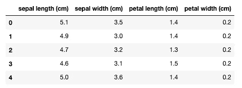

# 使用 Python 中的统计假设检验评估 ML 分类器性能

> 原文：<https://towardsdatascience.com/evaluate-ml-classifier-performance-using-statistical-hypothesis-testing-in-python-e4b90eb27dce?source=collection_archive---------12----------------------->

## 有一个强有力的论据，为什么选择一个分类算法，而不是基于性能的重要性水平


Alexis Fauvet 在 [Unsplash](https://unsplash.com/s/photos/difference?utm_source=unsplash&utm_medium=referral&utm_content=creditCopyText) 上拍摄的照片

# 介绍

选择正确的机器学习算法是决定性的，它决定了模型的性能。选择模型时最主要的因素是性能，它采用 KFold-cross-validation 技术来实现独立性。

所选择的模型通常具有较高的平均性能。然而，有时它起源于统计上的侥幸。有许多**统计假设检验**方法来评估交叉验证产生的平均性能差异，以解决这一问题。如果差异高于显著性水平“ **p 值**”,我们可以拒绝两个算法相同且差异不显著的零假设。

在开发新的分类模型或参加 [Kaggle 的](https://www.kaggle.com/competitions)比赛时，我通常会在我的管道中包含这样一个步骤。

# 教程目标

1.  理解统计假设检验之间的区别。
2.  基于平均性能分数的模型选择可能会产生误导。
3.  为什么使用配对学生的 t 检验而不是原始学生的 t 检验。
4.  利用 [**MLxtend**](http://rasbt.github.io/mlxtend/) 库应用 **5X2 折叠**的高级技术来比较基于 **p 值**的算法

# 目录

1.  统计显著性检验是什么意思？
2.  常用统计假设检验的类型
3.  根据性能提取最佳的两个模型。
4.  对最好的两个进行假设检验的步骤
5.  应用 5X2 折叠的步骤
6.  比较分类器算法
7.  摘要
8.  参考

# 统计假设检验是什么意思？

考虑到两个数据样本具有相同的分布，统计假设检验量化了它们的似是而非程度。描述了无效假设。我们可以通过应用一些统计计算来检验这个无效假设。

*   如果测试结果推断**没有足够的证据**来拒绝零假设，那么任何观察到的模型分数差异都是偶然发生的。
*   如果测试结果推断**有足够的证据**拒绝零假设，那么任何观察到的模型分数差异都是真实的。

# 统计假设检验的类型

通过统计显著性测试检查机器学习模型需要一些预期，这些预期将影响所使用的统计测试。这种比较最稳健的方式被称为 [**成对设计**](http://paired design of experiments) ，它在相同的数据上比较两种模型(或算法)的性能。这样，两种模型(或算法)都必须处理相同的困难。

在下文中，每个测试都有一些优点和缺点，您应该在选择时加以考虑。

还有其他用于比较分类器的统计测试，但这是最值得推荐的一种。

1.  **独立数据样本**:有无限数据集时使用。您为训练收集 **n 个** **样本**，并测试数据集。然后为每种方法计算十个独立的模型分数。最后，应用 t 检验来比较模型。然而，这种方法并不实际，因为现实中没有无限的数据。

**2。十重交叉验证**:使用普通配对 t 检验。相对于其他方法，该方法具有良好的可重复性，以及体面的**类型 II 误差**。但是，它有很高的**I 型误差**；这就是不推荐的原因。

通过交叉验证比较**训练**算法比比较特定(完全训练)模型的**预测性能**做出更强的假设。其中重采样验证(交叉验证属于)不能完全估计算法比较的方差不确定性。

**3。麦克内马测试**:

> 在统计学中，**麦克内马检验**是一种用于成对名义数据的统计检验。它应用于具有二分特征的 2 × 2 列联表，具有匹配的受试者对，以确定行和列的边际频率是否相等(即是否存在“边际同质性”)。— [维基百科](https://en.wikipedia.org/wiki/McNemar%27s_test#:~:text=In%20statistics%2C%20McNemar%27s%20test%20is,is%20%22marginal%20homogeneity%22%29.)

这是最近二十年推荐的。然而，这种方法的挑战在于，您要么需要构建自己的函数来实现它，要么使用第三方库，在您使用的工具中通常不会为您打包它。

**4。非参数配对检验**:这种方法包括做一些假设。例如，假设模型精度的分布具有正态分布(高斯)。

[Wilcoxon 符号秩检验](https://en.wikipedia.org/wiki/Wilcoxon_signed-rank_test)是配对学生 t 检验的非参数版本。尽管检验是非参数的，但它仍然假设每个样本内部的观察值是独立的。尽管使用 k 倍交叉验证会打破这个假设。

**5。估计统计**:一种数据分析框架，使用效应大小、置信区间、精度规划和元分析的组合来规划实验、分析数据和解释结果— [维基百科](https://en.wikipedia.org/wiki/Estimation_statistics#:~:text=Estimation%20statistics%20is%20a%20data,considered%20to%20be%20less%20informative.)。然而，当使用重采样方法评估模型时，独立性假设被打破。作为替代，其他统计重采样方法，如自举。Bootstrapping 可以估计稳健的非参数置信区间。因此，我们可以解释结果并比较分类器。

# 5X2 折叠方法背后的直觉

一种在数据的相同 k 倍交叉验证分割上评估每个模型并计算每个分割分数的方法。这将为十倍交叉验证提供十个分数的样本。然后，我们可以使用配对统计检验来比较这些分数。

由于多次使用相同的数据行来训练模型，因此违反了独立性假设；因此，测试会有偏差。

这种统计测试可以调整，以克服缺乏独立性。此外，可以配置该方法的折叠和重复次数，以实现模型性能的更好采样。

> Thomas Dietterich 在[“用于比较监督分类学习算法的近似统计测试”中提出了这种方法](https://sci2s.ugr.es/keel/pdf/algorithm/articulo/dietterich1998.pdf) — 1998 年

# 正在加载数据集

对于本教程，我将使用`sklearn`库中的`load_iris`数据集。然而，对于任何 ML 问题，步骤都是相同的。



窥视虹膜数据集

# 提取最佳两个模型的步骤

在这一步中，我将根据性能准确度分数对四种不同的算法进行比较。然后将选择得分最高的两个模型在它们之间进行假设检验。

```
# Spot-Check Algorithms
models = []
models.append(('LR', LogisticRegression(max_iter=1000))) 
models.append(('LDA', LinearDiscriminantAnalysis())) 
models.append(('KNN', KNeighborsClassifier()))
models.append(('DSC', DecisionTreeClassifier(random_state = 1, max_depth=2)))
models.append(('SVM', SVC()))
# evaluate each model in turn
results = []
names = []
for name, model in models:
    kfold = RepeatedStratifiedKFold(n_splits=10, n_repeats = 3, random_state=1)
    cv_results = cross_val_score(model, X, y, cv=kfold, scoring='accuracy') 
    results.append(cv_results)
    names.append(name)
    msg = "%s: %.2f (%.3f)" % (name, cv_results.mean(), cv_results.std())
    print(msg)
```

结果:

```
LR: 0.96 (0.041)
LDA: 0.98 (0.031)
KNN: 0.96 (0.037)
DSC: 0.94 (0.051)
SVM: 0.96 (0.045)
```

看来`LR,` `KNN`和`SVM`的均值相同，标准差略有不同。然而，`LDA`表现出较高的性能，而`DTC`表现出最低的性能。让我们在`KNN`、`DTC,`和`LDA`之间建立一个箱线图，作为更多解释的可视化。

```
import matplotlib.pyplot as pltplt.figure(figsize = (15, 10))
plt.grid(False)
plt.title("Mean accuracies between the best two selected algorithms", fontsize = 25, fontweight = 'bold')
```


算法间的平均精确度

好像 LDA 和 DTC 表现差不多，就挑那两个吧。

> 对于这个分类问题，您可以实现逻辑回归。然而，我选择了更复杂的分类算法来展示假设检验的思想。

# 假设检验的步骤

第一步是陈述零假设。

> H0:两个模型在数据集上都有相同的表现。
> 
> H1:两个模型在数据集上的表现不尽相同。
> 
> 显著性水平为 0.05

假设显著性阈值为 **α=0.05** ，用于拒绝两种算法在数据集上表现相同的零假设，并进行 5x2_cv _t_test。

```
# evaluate model 1
model1 = LinearDiscriminantAnalysis()
cv1 = RepeatedStratifiedKFold(n_splits = 10, n_repeats = 3, random_state = 1)
scores1 = cross_val_score(model1, X, y, scoring = 'accuracy', cv = cv1, n_jobs = -1)
print('LDA Mean Accuracy: %.1f%% +/-(%.3f)' % (mean(scores1*100), std(scores1)))# evaluate model 2
model3 = DecisionTreeClassifier(random_state = 1, max_depth=2)
cv2 = RepeatedStratifiedKFold(n_splits = 10, n_repeats = 3, random_state = 1)
scores3 = cross_val_score(model2, X, y, scoring = 'accuracy', cv = cv2, n_jobs = -1)
print('DecisionTreeClassifier Mean Accuracy: %.1f%% +/-(%.3f)' % (mean(scores3*100), std(scores3)))# plot the results
plt.boxplot([scores1, scores2], labels=['LDA', 'DTC'], showmeans=True)
plt.show()
```

结果

```
LDA Mean Accuracy: 98.0% +/-(0.031)
DecisionTreeClassifier Mean Accuracy: 96.4% +/-(0.037)
```

看来`LDA`比`DTC`有更好的性能，而`LDA`的精度更高。

# 使用 MLxtend 封装的 5 乘 2 CV

您可以从头开始实现 5X2 CV 折叠；但是，有一个很好的软件包可以节省您很多时间，它叫做 MLxtend。我将使用评估模块中的 paired_ttest_5x2cv 函数来计算两个模型的 t 和 p 值。

```
from mlxtend.evaluate import paired_ttest_5x2cv
# check if difference between algorithms is real
t, p = paired_ttest_5x2cv(estimator1=model1, 
                          estimator2=model2, 
                          X=X, 
                          y=y, 
                          scoring='accuracy', 
                          random_seed=1)
# summarize
print(f'The P-value is = {p:.3f}')
print(f'The t-statistics is = {t:.3f}')
# interpret the result
if p <= 0.05:
    print('Since p<0.05, We can reject the null-hypothesis that both models perform equally well on this dataset. We may conclude that the two algorithms are significantly different.')
else:
    print('Since p>0.05, we cannot reject the null hypothesis and may conclude that the performance of the two algorithms is not significantly different.')
```

结果:

```
The P-value is = 0.027
The t-statistics is = 3.101
Since p<0.05, We can reject the null-hypothesis that both models perform equally well on this dataset. We may conclude that the two algorithms are significantly different
```

现在你有一个强有力的理由来解释为什么选择 LDA 而不是 DTC。

# 摘要

最后，我希望这篇教程很好地说明了如何使用假设检验来开发一个更有意义的模型。我的建议是在你的分类管道中加入算法比较。尝试迭代以及尝试不同的算法性能比较。

感谢阅读！

# 参考

*   [赛车比赛](https://www.kaggle.com/competitions)
*   [MLxtend 库](http://rasbt.github.io/mlxtend/)
*   [比较监督分类学习算法的近似统计检验](https://sci2s.ugr.es/keel/pdf/algorithm/articulo/dietterich1998.pdf) — Thomas Dietterich，1998
*   [MLxtend.evaluate.5X2cv 配对 t 测试 API](http://rasbt.github.io/mlxtend/user_guide/evaluate/paired_ttest_5x2cv/)
*   [Sklearn 通用数据集 API](https://scikit-learn.org/stable/datasets/index.html#general-dataset-api)
*   [可执行 kaggle 笔记本](https://www.kaggle.com/salmaeng/use-hypothesis-test-to-compare-algorithms/edit)