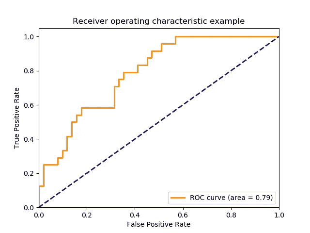
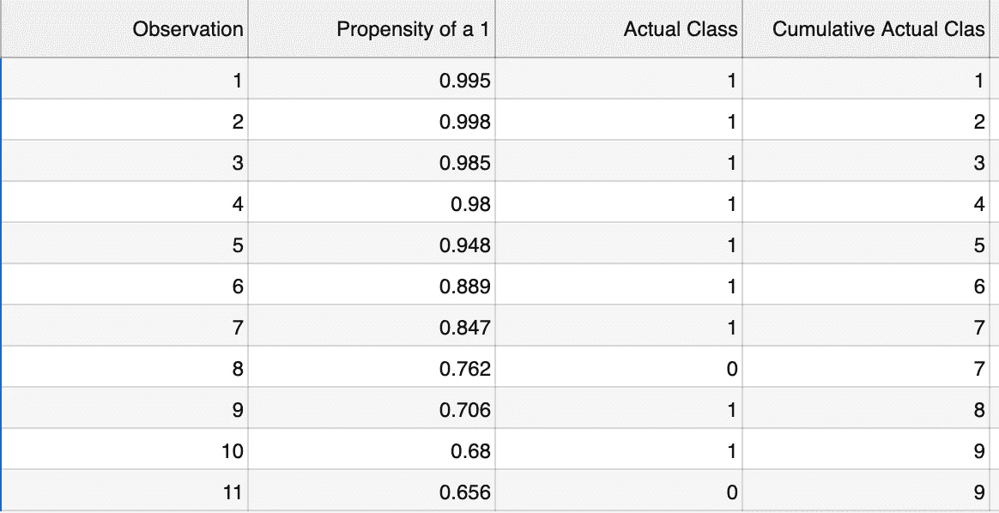
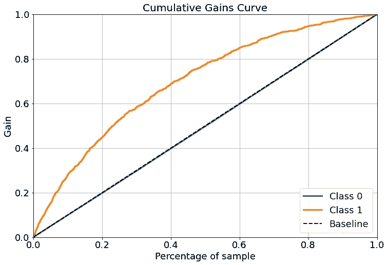
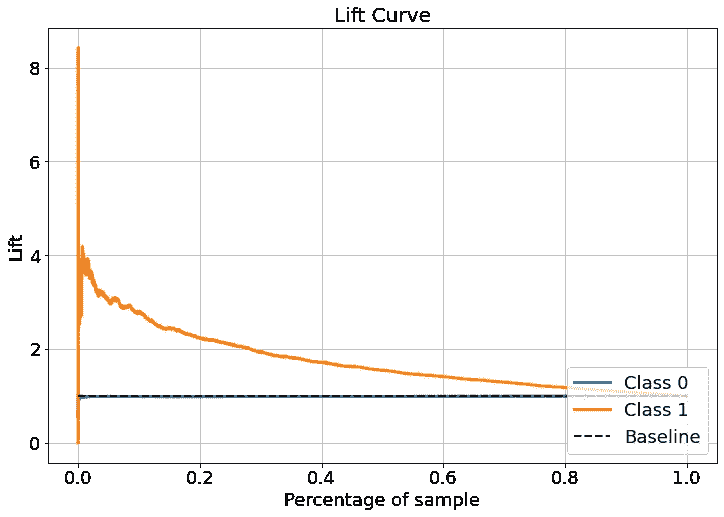

# 如何使用累积增益、提升曲线和 Python 评估分类模型性能

> 原文：<https://towardsdatascience.com/evaluate-model-performance-with-cumulative-gains-and-lift-curves-1f3f8f79da01?source=collection_archive---------5----------------------->

马修·奇里科在 [Unsplash](https://unsplash.com?utm_source=medium&utm_medium=referral) 上的照片

累积增益和提升曲线是两个密切相关的视觉辅助工具，用于测量预测分类模型的有效性。当您需要向业务涉众解释模型，并展示使用模型如何影响业务决策和策略时，与其他评估模型性能的方法相比，它们有几个很大的好处。

为了了解如何从中受益，让我们看看人们通常会遇到的第一个模型评估工具。在二元分类模型上评估预测模型性能的一种流行且有效的方法是使用受试者操作特征曲线(ROC)。ROC 曲线在纵轴上绘制了模型的灵敏度，也称为真阳性率，在 x 轴上绘制了 1 减特异性或假阳性率。最靠近左上角的曲线性能更好。比较曲线是一条对角线，它表示在不使用模型的情况下，通过使用简单规则对不同的情况进行分类，所有的预测信息都被忽略，每个记录都被简单地标记为多数类的成员。希望使用预测信息可以帮助创建一个比这个基准更好的模型。通常用来总结 ROC 的指标是曲线下面积(AUC ),它提供了一种综合的方法来评估所有可能的分类阈值的模型性能。

# 理解你的目标

如果您的唯一目标是预测您想要评估的每个新记录的类成员，并且您想要比较不同模型在这方面的性能，ROC 和 AUC 将是一个很大的帮助。但是，很多时候情况并非如此。业务问题通常会涉及检查一组新记录的预测目标，以检测哪些记录最有可能属于您感兴趣的特定类别，因此开始评估分类模型对新记录进行排序的效率不是很好吗？有许多业务问题可以归结为计算出一个模型在多大程度上帮助我们选择相对较少的记录，这些记录包含了问题上下文中相对较大比例的重要内容。也许这就是找出哪些客户最有可能流失，或者对营销提议作出回应，或者实施欺诈，或者点燃他们租赁的汽车。与坐在二楼休息厅咖啡桌上的神奇八号球相比，你的模型在帮助利益相关者定位这些案例方面会有多好？那就是心态的转变。从所考虑的下一个新观察值被分类的准确程度，到该模型创建分级观察值的层次结构的能力。

如果你带着 ROC AUC 数字参加会议来解释工作，你可能会让每个人坐半个小时的幻灯片来解释敏感性、特异性、AUC 代表什么，如何解释它，以及 ROC 曲线带来的所有警告。最后，你还是给他们一个数字，这个数字对他们来说一点也不直观，也不可行。AUC 不会帮助任何试图弄清楚他们是否想使用你的模型的人决定如何或在哪里应用你的工作。这就是累积收益和提升的来源。

让我们想象一下，你在大公司工作，监管营销的残酷上司通过设定预算来扼杀他们的活动推广，预算只允许他们从 25，000 名有新线索的客户中锁定 5，000 名客户。他们要求您建立一个模型，预测哪些客户最有可能对营销活动报价做出响应。他们不想浪费宝贵的资源去寻找几乎没有成功机会的线索。完成后，他们希望您参加一个会议，在会上您将解释为什么您的模型优于仅使用会计部经过战斗考验的 magic eight ball 随机选择线索，如果您还可以估计在预算限制允许的 5，000 个联系人中有多少个响应线索，那就太好了。

您决定建立一个分类模型，使用例如逻辑回归来输出潜在客户对营销促销的反应倾向。累积收益和提升不依赖于任何一个模型，它们可以像这样用于任何能够输出记录属于感兴趣类别的预测概率的模型。需要注意的是，它们不能很好地与多类分类器一起工作，除非您将一个类定义为最重要的类来识别，并将其他所有的类合并到一个组合其他所有类的类中。二元分类就是你要找的。但在这种情况下，你只对回应者和非回应者感兴趣，你就可以走了。因此，您需要在记录的选择或子集上训练模型参数，在验证集上测试性能，检查 ROC 曲线和 AUC 值等性能指标以帮助优化模型，并检查它是否过度拟合或拟合不足，直到得到您满意的模型。

# 具体细节

累积增益和升力图都是使用相同的输入构建的。您需要模型输出的每条记录属于目标类的预测概率，以及该记录属于验证数据集中的实际类。如果你要绘制这个图而不使用某个包中的函数，那么所有的观察值都需要根据模型的输出按降序排列。然后，对于每一行，添加到当前行为止(包括当前行)的实际感兴趣的类成员的累积数量。这个结果累积列是根据记录数绘制的。它看起来会像这样。

累积增益和提升图的 x 轴左侧将从根据模型属于感兴趣类别的概率最高的观察值开始。这些概率沿着轴向右方向递减。x 轴告诉我们被考虑的观察值的百分比。y 轴表示作为感兴趣类别的所有潜在观察值的累积量，占当前正在考虑的观察值的百分比。现在，您可以通过该图提出和回答的问题是，当模型应用于数据时，选择了最有可能的 X %的记录，您希望找到的实际记录的百分比是多少？

# 我们怎么知道自己什么时候很牛逼？

为了了解这个模型有多好，需要与我们已经有的东西进行比较，而我们已经没有什么东西了。一个很好的比较基准是由某个人随机分配每个观察结果的倾向所产生的结果。平均而言，使用该方法的累积列将增加，增加量为感兴趣的类的总数除以每行中的观察总数。例如，如果您的数据集有 26 个观察值，其中 13 个实际上是您感兴趣的类，那么您会期望随机选择属于感兴趣的类的单个记录的概率为 13/26 = 0.5。如果随机选择 10 条记录，则预期 10 X 0.5 = 5 条记录属于该类别。基线累积总量图将是一条从点(0，0)到点(总观测值，感兴趣类别的数量)的对角线。在这个例子中，从(0，0)到(26，13)。

scikitplot 模块使构建累积增益曲线变得相对容易，而不必手动排序和计算累积总量，然后绘制曲线。您可以使用名为 plot_cumulative_gain 的方法，它有两个参数。第一个是包含目标的真实值的数组。第二个是对模型观测结果的预测。预测应该包括类或目标的输出。以下代码使用虚拟数据构建了一个快速逻辑回归模型，无需任何预处理、验证或优化，以尝试确定最有可能响应营销活动的销售线索。我不打算做任何验证或调整，只要足以让我们可以开始解释结果图。predict_log_proba 的输出返回两个类的估计值，这两个类在一个 numpy 数组中成对出现，该数组可以传递到绘图函数中，无需进一步处理。

现在可以与业务利益相关者分享一些有意义的陈述，这些陈述直观地揭示了这种模型为什么有用以及如何有用。业务限制是新营销活动只能瞄准 5，000 个新销售线索，这是 25，000 个可用销售线索的 20%。我们可以从标记为 1 级的兴趣类别的累积收益曲线中看到，选择最有可能响应营销要约的前 20%的销售线索将只包含大约 45%的实际响应者。您可以使用类似于`df[“target"].value_counts()` 的东西来查看训练数据中有 1187 个实际响应者，因此在营销给模型排序为最有可能响应的 5，000 个销售线索后，可以预期有 1187 X 0.45 = 534.15 个响应。在不使用该模型的情况下，预期的基线数字将仅为 1187 名实际回应者的 20%，或者 1187 X 0.2 = 237.4 名针对这 5，000 名销售线索的营销回应者。当应用于新数据时，使用该模型可能会产生比随机选择好 534.15 / 237.4 = 2.25 倍的结果。反之亦然。如果业务目标是达到 60%的最有可能响应的销售线索，那么您可以在 y 轴上找到该数量，并确定大约只需要使用大约 30%的最有可能的销售线索来实现这一目标。

提升图提供了一种简单的方法，可以直观地显示应用模型比随机选择任何百分比的排名记录好多少倍。它只是自动执行我们之前所做的计算，得出结论:当选择 x 轴所有可能值中的前 20%时，使用该模型会产生 2.25 倍的更好结果。scikitplot 包还提供了一个升力曲线的实现。相同的`y`和`X`变量可以作为`plot_lift_curve`函数的输入循环使用。

让我们检查一下我们早期的工作。等级 1 在 20%时的升力曲线在 y 轴上的值大约为 2.25，这与之前计算的模型在完全没有模型的情况下的有效性一致。用于比较的基线是 1.0 处的水平虚线。随着要添加的实际上是感兴趣的类的记录越来越少，曲线逐渐减小，并且模型提供优势的机会也越来越少。

一个真正工作良好的分类器将为相对小百分比的排序数据的选择产生高“提升”。现在，当你展示你的模型时，你有了一个优雅的指标来分享，它不需要任何人在对它有一个直观的理解之前经历三个不同的 Coursera 课程。现在，您可以像这样提供输入:该模型的性能应该是随机选择销售线索的两倍多，我们可以估计，我们营销的 5000 个销售线索中，大约有 535 个会对该提议做出响应。这是一个可操作的声明。采取行动，修改决策，或为追求商业目标部署更多或更少的资源，多少提升才算足够，没有任何正确的答案。将一个模型作为比随机决策更好的选择，无疑会增加它被使用和欣赏的机会。当可以估计分类成功和错误的成本和收益时，提升图甚至可以更加强大和提供更多信息。我将在下一篇文章中讨论这个问题！