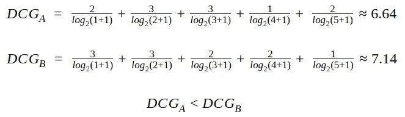
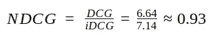

# 使用 NDCG 评估你的推荐引擎

> 原文：<https://towardsdatascience.com/evaluate-your-recommendation-engine-using-ndcg-759a851452d1?source=collection_archive---------0----------------------->

## 如何最好地评价一个推荐系统是一个有争议的话题。让我们看看如何使用 NDCG 度量来评估推荐引擎。

> 对此类机器学习主题感兴趣或需要一些帮助？
> 
> **取得联系—**[**【https://linktr.ee/pranaychandekar】**](https://linktr.ee/pranaychandekar)

我们处在一个个性化的时代。用户想要个性化的内容，企业也在利用这一点。通常使用机器学习技术构建的推荐引擎已经成为满足这种需求的重要工具之一。然而，开发一个推荐引擎有其挑战性。

演职员表:[蓝钻画廊的尼克·扬森](https://www.thebluediamondgallery.com/wooden-tile/e/evaluate.html)

开发或增强推荐引擎的关键挑战之一是评估其影响。虽然我们对积极影响有把握，但有必要对其进行量化。 ***这种量化不仅有助于利益相关方的沟通，还可以作为未来改进的基准。***

在探索了一些方法后，我决定采用**归一化贴现累计收益**或简称为 **NDCG** 。

> NDCG 是衡量排名质量的一个标准。

在信息检索中，这些措施**评估文档检索算法**。

在本文中，我们将涵盖以下内容:

1.  使用质量排名方法评估推荐引擎的理由。
2.  潜在的假设。
3.  累积增益
4.  贴现累计收益(DCG)
5.  标准化贴现累积收益(NDCG)

# 是不是一个有效的措施！？

读完这篇文章后，我想到的第一个问题是*如何衡量排名质量适合评估推荐引擎？*

推荐引擎从该引擎发现与用户最相关的超集中推荐一组文档。从这个意义上说，推荐引擎只是执行文档检索的任务。因此，我们可以使用 NDCG 来评估推荐引擎。

让我们看看 NDCG 的理论，以及我们如何使用它来评估一个推荐引擎。

要了解 NDCG，我们需要了解它的前辈:**累积收益(CG)** 和**贴现累积收益(DCG)。同样，我们需要记住以下假设:**

> 高度相关的文档比中度相关的文档更有用，中度相关的文档又比不相关的文档更有用。

# 累积增益

每个推荐都有一个关联的相关性分数。累积增益是推荐集中所有相关性分数的总和。

因此，具有文档相关性分数的有序推荐集 A 的 CG 将是:

# 贴现累计收益(DCG)

累积增益有一个缺点。考虑下面两个具有各个文档的相关性分数的有序推荐集。

我们知道集合 B 比集合 A 更好，因为它是按照相关性递减的顺序推荐的，但是根据累积收益，两个集合都同样好。真正缺乏的是位置和相关性分数的使用。DCG 填补了这一空白。该计算包括通过将相关性分数除以相应位置的对数来贴现相关性分数。

或者，也可以使用下面的表达式来计算。

如果具有较高相关性的文档排名较低，则与第一个表达式相比，第二个表达式的惩罚较重。根据应用，您可以选择任一表达式来计算 DCG 和 NDCG。

> 如果相关性分数是二进制的，即 0 或 1，那么两个表达式产生相同的结果。

让我们使用第一个表达式计算两个有序集的 DCG。

上述例子的 DCG 结果与我们的直觉一致。B 组比 a 组好。

# 标准化贴现累积收益(NDCG)

DCG 似乎是一个很好的衡量标准，因为它考虑了职位的重要性。然而，它仍然不完整。根据各种因素，为每个用户提供的推荐数量可能有所不同。因此，DCG 会相应地变化。我们需要一个有适当上限和下限的分数，这样我们就可以取所有推荐分数的平均值来报告一个最终分数。NDCG 带来了这种正常化。

对于每个建议集，为了计算 NDCG，我们需要计算:

1.  推荐订单的 DCG
2.  理想秩序的 DCG(**iDCG**)。

那么 NDCG 就是*推荐阶的 DCG 与理想阶的 DCG 之比*。

该比率将始终在[0，1]范围内。

考虑以下提供给其中一个用户的有序推荐集。

此建议集的理想顺序是:

相应的 DCG 分数使用第一个表达式:

因此，此建议集的 NDCG 将为:

> 为了评估推荐引擎，计算提供给用户测试集的推荐的 NDCG 平均值。

# 结论

在本文中，我们介绍了 NDCG 理论及其作为推荐引擎评估指标的用途。

还有其他度量，如平均精度等。然而，对于我建立的推荐引擎类型，我发现 NDCG 是一个更好的衡量标准。

NDCG 可能不是评估所有推荐引擎的最佳指标，但它对许多推荐引擎都适用。

> 对此类话题感兴趣或需要一些帮助？
> 
> **取得联系—**[**【https://linktr.ee/pranaychandekar】**](https://linktr.ee/pranaychandekar)