# 在 R/Python 中评估贝叶斯混合模型

> 原文：<https://towardsdatascience.com/evaluating-bayesian-mixed-models-in-r-python-27d344a03016?source=collection_archive---------8----------------------->

## 了解“后验预测检查”的含义以及如何直观地评估模型性能

我能说什么呢，模型检查和评估只是你在模型开发过程中不能(也不应该)避免的事情之一(好像这还不够明显)。然而，我认为在很多情况下，我们最终会*追逐性能指标，比如*RMSE、错误分类等。—而不是理解我们的模型对数据的表现有多好。这可能会导致接下来的问题。

因此，无论您使用什么样的框架和指标，我都建议您记住以下问题:

1.  我的模型没有捕捉到我们的数据和对问题的理解的哪些方面？
2.  哪种模式表现最好，它能在多大程度上*推广*(即在未来的工作中)？

> 避免*追逐性能指标(例如* RMSE、错误分类等)。).理解我们的模型如何很好地代表数据和我们的知识也是至关重要的。

**在本文中，我的目标是引导您通过一些有用的模型检查和评估*可视化方法*来检查 R 和 Python 中的贝叶斯模型(不是典型的 RMSE)。**我将基于我上一篇文章中提到的一个例子和一组模型，所以我建议你在继续之前快速浏览一下。

[](/a-bayesian-approach-to-linear-mixed-models-lmm-in-r-python-b2f1378c3ac8) [## R/Python 中线性混合模型(LMM)的贝叶斯方法

### 实现这些比你想象的要简单

towardsdatascience.com](/a-bayesian-approach-to-linear-mixed-models-lmm-in-r-python-b2f1378c3ac8) 

# 一眼

以下是我将介绍的内容:

1.  如何通过*后验预测检查* (PPCs)检查模型拟合
2.  如何通过交叉验证评估绩效(LOOCV，贝叶斯设置)
3.  使用这两个概念的应用模型选择示例

事不宜迟，让我们穿越不确定性的沙丘，来到贝叶斯的土地上。(抱歉不是抱歉这个俗气的比喻。😉)


Andrew DesLauriers 在 [Unsplash](https://unsplash.com?utm_source=medium&utm_medium=referral) 上拍摄的照片

# 从我们离开的地方继续

在[我之前的帖子](/a-bayesian-approach-to-linear-mixed-models-lmm-in-r-python-b2f1378c3ac8)中，我们的 EDA 建议我们探索三种贝叶斯模型——简单线性回归(基础模型)、随机截距模型和随机截距、随机斜率模型——模拟网站反弹时间，总体目标是**确定各地年轻人在网站上花费的时间是否比老年人多。**同样，我们运行了一些 MCMC 视觉诊断，以检查我们是否可以信任从`brms`和`pymc3`中的采样方法生成的样本。

因此，我们的模型开发流程的下一步应该是评估每个模型与给定上下文的数据的拟合度，以及衡量它们的预测性能，最终目标是选择最佳模型。

> **注意:**之前的帖子只包含代码片段。所有模型拟合和 MCMC 诊断代码都是在 Github 上找到的[。](https://github.com/ecoronado92/towards_data_science/tree/master/hierarchical_models/bayes_lmm)

# 步骤 3.b 后验预测检查(PPP)

后验预测检验只是贝叶斯术语中模型检验的一种花哨说法。该名称源自用于评估拟合优度的方法(解释如下)。一旦你拟合了一个模型，并且 MCMC 诊断显示没有危险信号，你可能想要**直观地探索**模型与数据的拟合程度。在非贝叶斯设置中，你可能会看残差或正态 Q-Q 图(你仍然可以对贝叶斯模型这样做)。但是，请注意，贝叶斯残差图不会捕捉我们推论的不确定性，因为它们是基于单参数绘制的。

> 贝叶斯模型是可生成的，因此我们可以模拟模型下的值，并检查这些值是否与原始数据中的值相似。

贝叶斯模型本质上是可生成的，它允许我们在模型下模拟数据集，并将这些数据集与观察到的数据集进行比较。如果模型拟合得很好，我们希望模拟值看起来与我们观察到的数据相似。相反，如果我们的模拟数据与观察到的数据不相似，那么我们就错误地指定了模型，应该警惕我们的参数推断。

> 如果模拟值与观测值不相似，那么我们可以说“不合适”或“模型设定错误”。

**因此，检查模型拟合的最常见技术是模拟来自后验预测分布的数据集—** 因此术语*后验预测检查—* 定义如下


我们基本上是对我们的后验推断进行边缘化(整合)以获得给定我们的观察数据 y 的预测值ỹ。**您可以将此过程视为首先模拟来自您的联合后验(例如均值和方差)的一些参数值，然后使用这些参数值作为似然函数(例如正态分布)的输入来生成预测样本。**

> 因此，我们后验推断的质量将影响后验预测样本代表观察数据的能力。

让我们来看一些编码的例子。

## 比较后验密度

首先，让我们探索一下模拟数据集的密度与观测数据的密度相比有多好。

In R `bayesplot`提供了很好的内置函数`ppc_dense_overlay`来生成这些可视化效果。

**在 Python 中，** PyMC3 也有通过`arviz`生成的内置函数`plot_ppc`。

下面我们看到，随机截距模型生成的模拟数据与观察到的数据非常吻合(即具有相似的模式)。

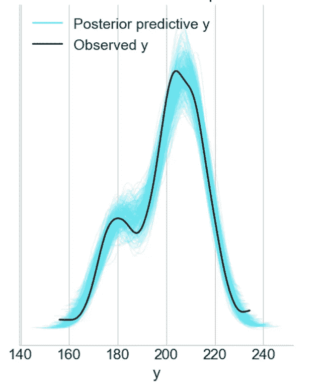

R(左)和 Python(右)中模拟数据(浅色)与观测数据(深色)的密度对比

## 比较后验检验统计

好的，我们的模拟数据在视觉上似乎类似于观察到的密度，但是我们可能也想知道模拟汇总统计数据与观察到的数据有多大的可比性。从你良好的 101 天统计中，你可能会想起典型的测试统计是均值、方差等。你可能会想使用它们。让我们看看当我们对基本线性回归的样本使用平均值时会发生什么。

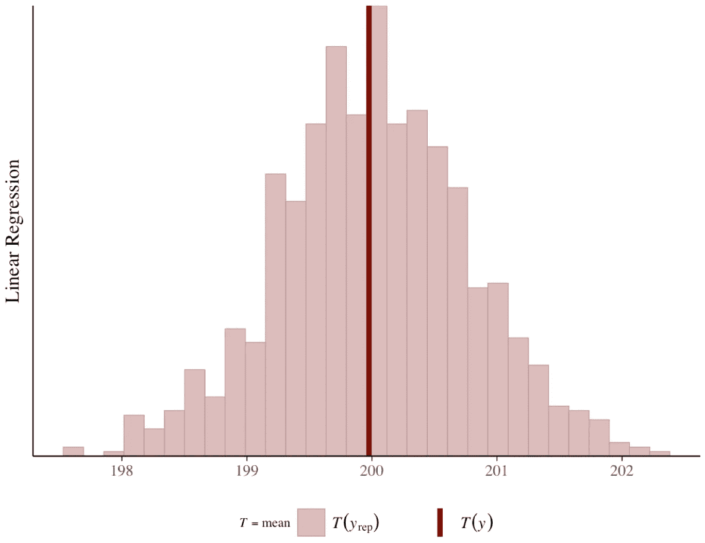

太好了！后验样本的平均值似乎也符合数据——所以我们应该继续，对吗？嗯，等一下。再来看另一个汇总统计:**偏斜度。**

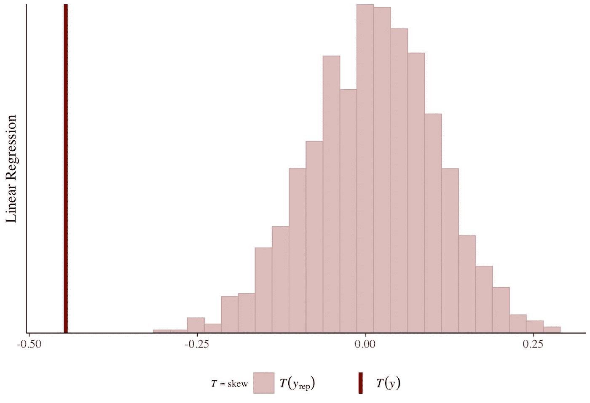

嗯，什么？发生了什么事？！嗯，这是一个**警示故事**，它说明了**检查不仅仅是后验预测样本的均值和方差**的重要性。如果我们只是这样做，我们可能会错误地得出结论，我们的模型不缺乏拟合，它正确地表示了数据，但它显然没有捕捉到它的偏斜度。

事实上，[建议](https://arxiv.org/pdf/1709.01449.pdf)查看与您正在更新的任何参数无关(也称为*正交*)的汇总统计数据。

> 与我们的模型参数相关的测试统计可能无法捕捉数据和我们的模型之间的潜在问题。

在我们的案例中，我们的模型假设为高斯分布，我们正在更新均值和方差参数。因此，我们可以探索的不相关的度量标准是**偏斜度和中值**——前者在群体层面，后者在群体层面。

在 R 中，我们可以使用两个`bayesplot`函数来生成这些图:`ppc_stat`和`ppc_stat_grouped`。

**在 Python** 中，这并不简单，但是可以通过使用`pandas`、`matplotlib`和`plotly`的一些定制代码来实现，如下所示。

现在，我们可以看到随机截距模型捕获了观察数据的行为。首先，基于**偏斜度**

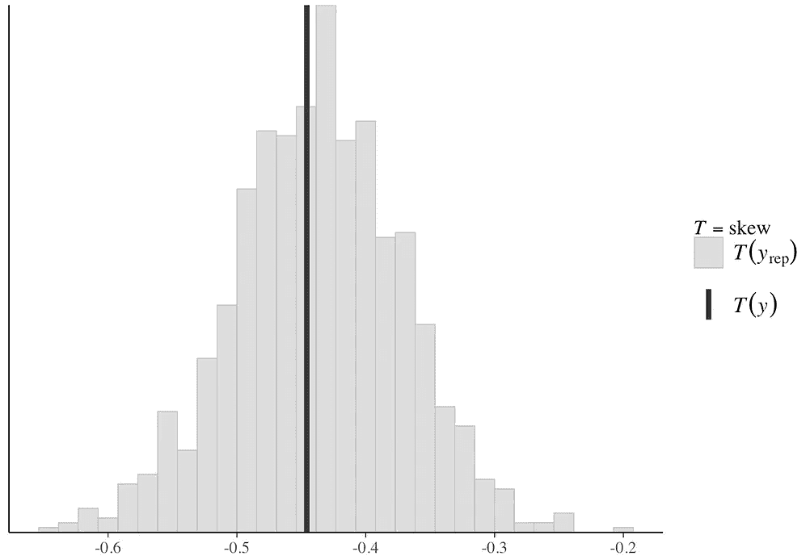

R(左)和 Python(右)中模拟的(直方图)与观察到的(黑线)偏斜度统计

其次基于**县级中值。**

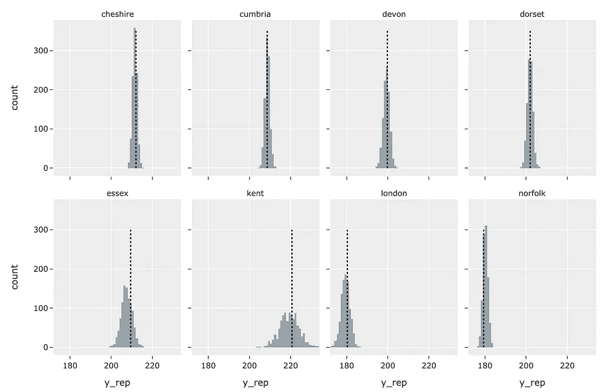

# 步骤 3.c 边缘(逐点)后验预测检查

在上一节中，我们介绍了使用*联合*后验预测密度(即考虑所有数据)的模型检查。然而，如果我们也对检测异常的观察值感兴趣，比如异常值和有影响的点，或者检查我们的模型在观察值之间指定得有多好呢？使用联合分布使这一点变得非常困难。相反，我们可以基于*边际*(即单变量)后验预测分布，将我们的模型检查提升到更细粒度的水平。获得这些*边缘*样本的一种方法是通过留一交叉验证(LOO CV)预测密度。


“等等，但那太没效率了！”我知道，我知道。计算这些需要我们改装模型 *n* 次(！！)，但不要担心亲爱的读者，有办法不用所有的改装就能接近这些密度。聪明的人想出了一个优雅的近似方法，叫做[帕累托平滑重要性抽样](https://mc-stan.org/loo/reference/psis.html) (PSIS)，我称之为洛-PSIS。

> **边际预测检查对于检测异常值和影响点，或检查整体模型校准(即模型的指定程度)特别有用。**

## 模型校准—识别模型规格错误

在贝叶斯设置中，我们使用一些概率论来测试这一点——具体来说，一个称为[概率积分变换](https://en.wikipedia.org/wiki/Probability_integral_transform) (PIT)的概念，它基本上使用 CDF 属性来*将*连续随机变量转换为均匀分布的变量。**然而，只有当用于生成连续随机变量的分布是真实分布时,*才是正确的。***

这对我们意味着什么？在我们的例子中，拟合模型是产生连续随机变量的原因，因此，如果它是*真实反弹时间生成分布、*的良好近似，那么我们为每个 LOO 边缘密度计算的一组经验 CDF 值将近似一致。也就是说，对于一个遗漏点的每个单变量密度 **p( ỹ_i | y_-i )** ，我们将计算一个 CDF 值[***p _ I =*pr(ỹ_i≤y _ I | y _-I)**，然后绘制这些`***p_i***`以查看它们看起来是否均匀分布。

> 如果我们的拟合模型是真实数据生成分布的良好近似，那么矿坑转换值将近似遵循均匀分布。

对一些人来说，这听起来像是“巫毒魔法”,所以我写了一个不错的附带教程，你可以回顾一下，以获得更多关于为什么这是真的直觉。您可以随意摆弄代码和数据。

 [## 高级贝叶斯模型检查:校准

### 关于如何使用 LOO-CV 概率积分变换(PIT)获得如何修改模型以提高拟合度的提示的直观示例

htmlpreview.github.io](https://htmlpreview.github.io/?https://github.com/ecoronado92/towards_data_science/blob/master/hierarchical_models/bayes_lmm/loo_pit_example/loo_pit.html) 

耶！如果你还在这里，这意味着我要么没有完全失去你的解释，要么我已经重新获得了你的信任(希望)与该教程。好了，让我们深入一个例子，看看如何使用这个诊断。作为提醒，我将把经验 CDF 值称为 LOO-PIT。

**在 R，**中，我们可以使用`loo`包生成 LOO-PSIS 样本，并使用 bayesplot `ppc_loo_pit_overlay`函数将 PIT 应用于这些值，并将它们与来自 Uniform[0，1]的样本进行比较。

**在 Python** 中，可以如下使用 PyMC3 内置函数`plot_loo_pit`

下面我们可以看到，我们的模型中的 LOO-PIT 值(粗曲线)是根据标准制服的随机样本(细曲线)绘制的。无需深入细节，以下是解读这些情节的一般方法:

1.  集中在 0 或 1 附近的 LOO-PIT 值暗示模型分散不足(即我们的逐点预测密度**太窄**，预期变化小于数据中发现的变化)
2.  集中在 0.5 附近的 LOO-PIT 值暗示模型过度分散(即，我们的逐点预测密度**过于宽泛**，预期变化大于数据中发现的变化)

查看我们的模型，没有任何明显的不适合，因为 LOO-PIT 值遵循看似合理的统一样本。然而，在 0.6 附近似乎有一个粘滞点，这暗示了轻微的过度分散(即，一些边缘密度与数据相比太宽)，并在[教程中讨论，该教程链接在](https://htmlpreview.github.io/?https://github.com/ecoronado92/towards_data_science/blob/master/hierarchical_models/bayes_lmm/loo_pit_example/loo_pit.html)上方。相反，如果厕所线不在统一样本附近，那么您应该将此解释为不合适，并探索进一步的建模。

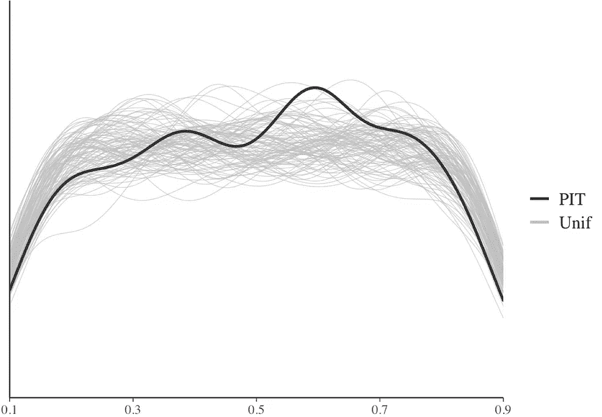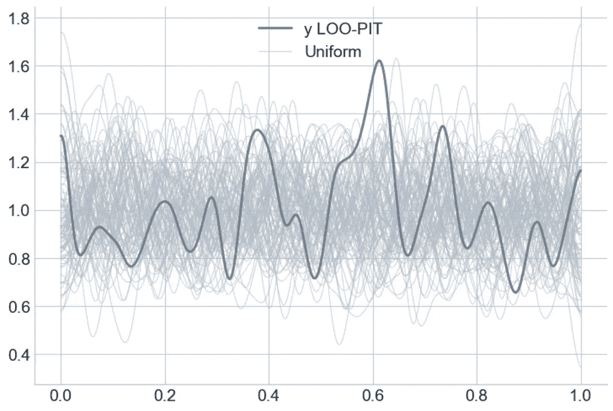

R(左)和 Python(右)中随机截距模型的 LOO-PIT 示例。

(要了解更多信息，我建议你阅读《贝叶斯数据分析 3 的第[152–153 页)。](http://www.stat.columbia.edu/~gelman/book/)

## 使用 Pareto-k 诊断识别异常值和影响点

在任何建模场景中，我们感兴趣的是潜在的有影响的数据点或异常值可能对我们的模型产生的影响——即，如果我们忽略有影响的点，它们会极大地改变我们的后验预测密度吗？查看与这些点相关的观察提供了关于我们是否以及如何想要修改我们的建模策略的提示。传统上，我们比较全部数据后验预测密度和每个 100 CV 预测密度来识别这些点，但是这可能在计算上是昂贵的。

幸运的是，LOO-PSIS 方法已经计算了这种比较的经验估计:采样器中使用的[广义帕累托分布](https://en.wikipedia.org/wiki/Generalized_Pareto_distribution)的尾部形状参数( *k̂ )* 。直观地说，如果一个被忽略点的边际预测密度有一个大的 k̂，那么它表明这个点有很大的影响。实际上，具有 *k̂* 值的观测值:

*   小于 0.7 被认为是对 LOO 预测密度具有可靠 PSIS 估计的非影响点
*   介于 0.7 和 1 之间的被认为是有影响的和不太可靠的
*   大于 1 被认为是高度有影响的，并且模型估计不可靠

> Pareto-k 诊断有助于识别模型中的问题点(甚至跨模型！).

让我们通过一个例子来获得一些关于如何使用这个 *k̂* 来识别这些不寻常点的直觉。

**在 R** 中，您可以使用`loo`函数来计算和提取帕累托形状估计值 *k̂* ，并使用`ggplot`可视化这些估计值。

**在 Python** 中，你可以使用 PyMC3 内置函数`loo`来生成逐点样本，使用`plot_khat`函数来可视化这些形状估计。

由于所有的观察值都有一个 0.5 的 *k̂ <* ，那么没有一个被认为对后验有影响，因为我们的模型能够正确地描述它们。换句话说，我们模型的卢-PSIS 估计是可靠的。

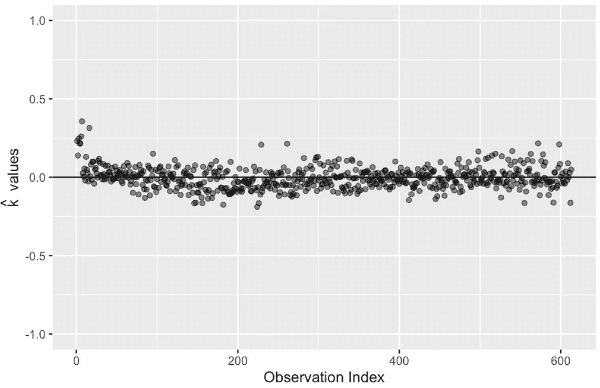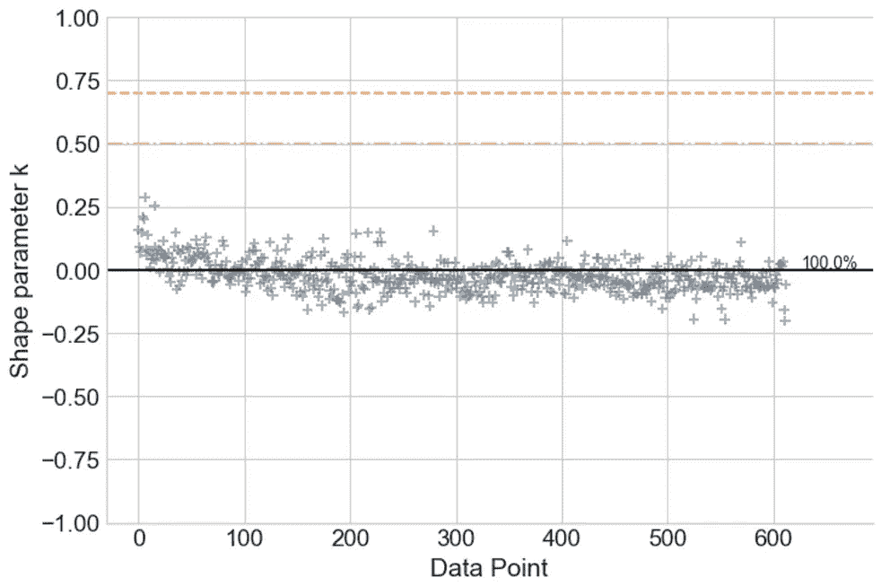

R(左)和 Python(右)中的 Pareto-k 诊断图

# 步骤 4:模型评估和比较

像往常一样，我们希望知道给定一些样本外(未知)数据时我们的模型的预测准确性。估计这种误差的一种常见方法是使用某种类型的交叉验证。除了典型的 RMSE 度量，线性贝叶斯模型的性能可以用一些额外的度量进行[评估。例如，预期测井预测密度 **(ELPD)** 或**Watanabe–Akaike 信息标准**(WAIC)**哪个 ELPD 更快且计算成本更低。在这里，我将重点介绍 ELPD 标准。**](https://arxiv.org/pdf/1307.5928.pdf)

**直观地说， **ELPD 指的是模型在*未知数据*** 分布上的平均预测性能(如上所述，我们可以用交叉验证来近似)。不管我们选择的交叉验证方式是 K-fold 还是 LOO，我们都可以为每个样本外数据点 获得一个*预期* *测井预测密度(ELPD)值* **(参见[此处](https://modernstatisticalworkflow.blogspot.com/2017/05/model-checking-with-log-posterior.html)的直观示例)。一般来说，ELPD 值越高，模型性能越好。****

> **虽然这听起来可能违反直觉，但在贝叶斯设置中，计算 K 倍 CV 可能比 LOO CV 效率更低、更复杂。**

**现在，与 LOO 相比，使用 K-fold 似乎是显而易见的，因为它通常会导致更低的方差(尤其是当数据相关时)，并且计算成本更低。然而，在贝叶斯设置中，我们有办法近似 100 值，而不必多次重新调整模型(例如，上面讨论的 PSIS 方法)。**

**此外，LOO ELPD 估计值比 K 倍 ELDP 值更有优势。它们允许我们识别难以预测的点，甚至可以用于模型比较，以识别哪个模型最好地捕捉每个样本外观察。**

**让我们通过一个示例来了解如何使用整体 LOO ELPD 值和点态 LOO ELPD 值来比较预测性能模型。**

****在 R** 中，我们可以使用`loo`和`loo_compare`函数来比较多个模型的整体性能，以及一对模型之间的逐点差异。(*注:* `*loo*` *还提供了* `*kfold*` *功能。*)**

****在 Python** 中，我们可以使用 PyMC `compare`和`loo`函数来获得相同的整体和逐点模型比较。**

**下面是上面代码的输出。总体性能最佳的型号通常列在最前面，有最小的(`d_loo`)和最大的(`elpd_loo`)。在我们的例子中，随机截距模型具有最好的整体性能。**

********

**R(左)和 Python(右)中整体模型性能输出的比较**

**现在，正如我上面提到的，我们可以获得逐点 ELPD 估计，而不管我们选择的 CV 方法，这允许我们更精细地比较模型。下面标绘的值是来自随机截距模型的 ELPD 值减去线性回归的 ELPD 值之间的差。**在这里，我们看到随机截距模型具有更好的整体性能(即大多数值> 0)** ，但是，请注意在**某些点上，线性回归的性能更好。****

**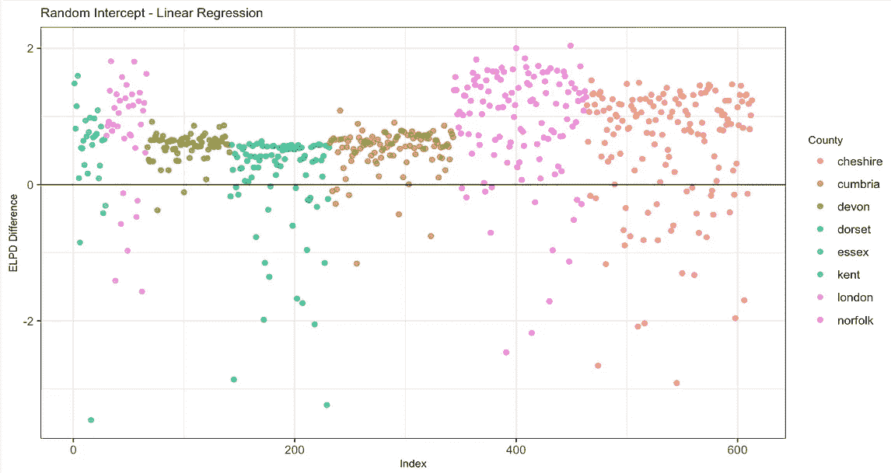******

**R(左)和 Python(右)中的逐点模型比较**

> ****ELPD 逐点图与上述 Pareto-k 诊断图配对有助于识别异常点。****

# **把所有的放在一起**

**既然我们已经讨论了评估贝叶斯模型的所有细节，让我们将这些技术应用到我上一篇文章中的三个模型中。**

## **模型检查**

**首先，我们比较模型的后验预测密度。在这里，我们观察到线性混合模型倾向于更好地拟合观察到的数据。**

**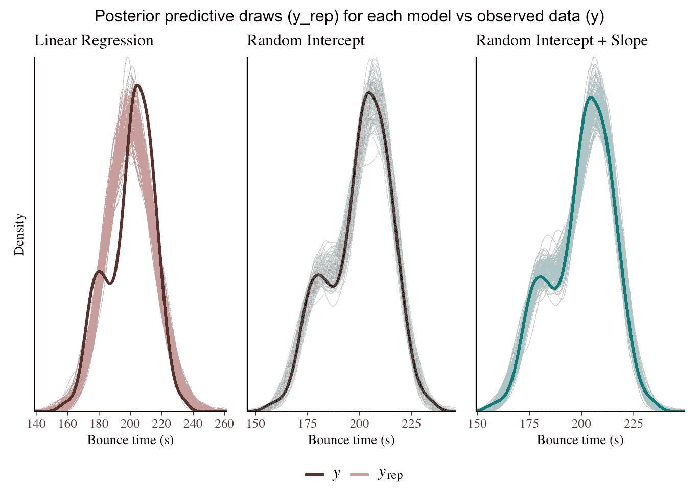**

**类似地，我们想要查看一些后验检验统计数据，记住与我们的模型参数相关的统计数据可能对检测模型的错误设定没有用处。下面，观察**均值如何未能捕捉到线性回归的拟合缺失，而偏度系数清楚地显示了一个错误设定**。**

****

**我们还可以查看特定于县的测试统计数据，以确定潜在的不适合性。下面我们观察到，混合模型比线性回归模型更容易捕捉到县的中位数(粗线)。**

****

**接下来，查看 LOO-PIT 诊断**我们发现，在所有 PIT 值(粗线)遵循可能的随机均匀样本(细线)**的情况下，我们的任何模型都不存在拟合不足。然而，如上所述，似乎所有模型都有一些棘手的问题。**

**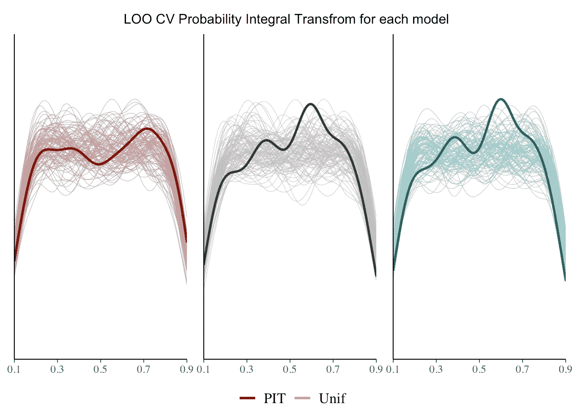**

**线性回归似乎呈现出分散不足(即值集中于 1)，而混合模型呈现出一些过度分散(即值集中于 0.5)。这提示进一步的建模工作可以集中在缩小混合模型中的单变量后验预测分布，以更好地捕捉不确定性。**

## **模型比较**

**现在，查看使用 ELPD 信息标准的模型之间的预测性能，我们看到随机截距模型似乎是最好的模型(即`elpd_diff = 0.0`)。**

```
##                  elpd_diff se_diff
## bayes_rintercept    0.0       0.0 
## bayes_rslope       -1.3       0.3 
## lin_reg          -347.8      18.8
```

**我们可以看看随机截距模型和其他两个模型之间的逐点差异，看看它在哪里表现得更好(即`ELPD_rand_int_i — ELDP_other_model_i`)。顶部图表显示，对于大多数点来说，随机截距模型比线性回归(`ELPD Pointwise Diff > 0`)表现更好，因此模型性能存在较大差异。混合模型之间的类似比较证明了它们的类似性能，但是我们也可以使用这种分析来识别更难预测的观察结果(例如多塞特郡的观察结果)。**

**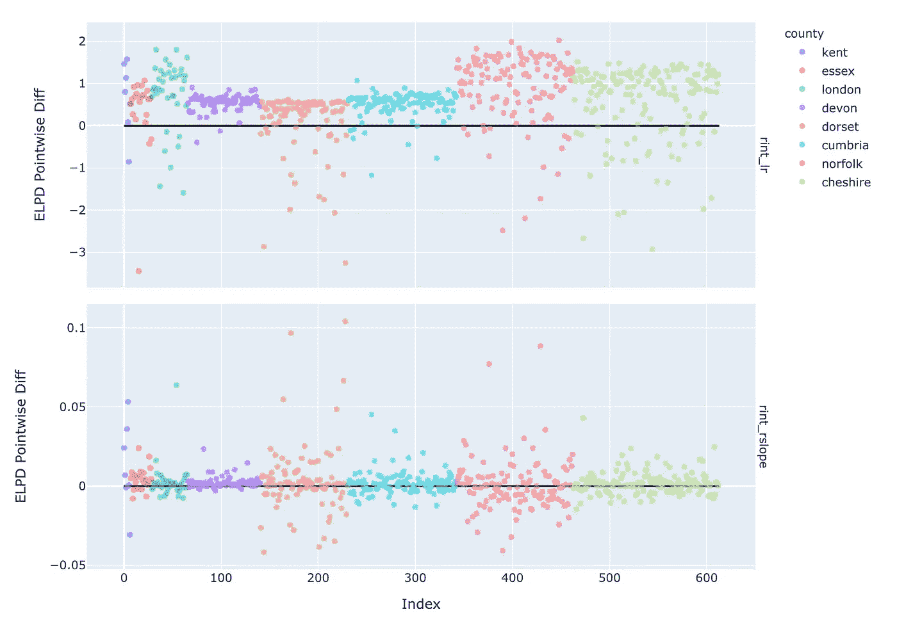**

**最后，查看帕累托-k 诊断中那些难以预测的观察值的指数，我们可以看到随机截距模型能够更好地解析这些观察值(即，更小的 *k̂* 值)。**

****

## **最终模型**

**恭喜你，你已经到达贝叶斯土地！在这一点上你应该为自己感到骄傲。浏览所有这些材料可能会令人望而生畏，但希望你已经对如何评估贝叶斯模型有了更好的理解和一些直觉。**

**从上面的分析中，我们看到这个数据的最佳模型是随机截距模型。它不仅显示了良好的预测性能，还显示了与我们数据的良好拟合。所以作为最后一步，让我们看看我们的推论，回答我们最初的问题:“年龄如何影响弹跳时间？”**

**下表总结了一些固定效应和组内/组间方差估计值，其可信区间为[95](https://easystats.github.io/bayestestR/articles/credible_interval.html)。这里需要注意两件重要的事情:**

*   **假设 95%的区间不包含 0，我们确信所有这些估计都是非零的**
*   **和我们原来的问题相关，年龄对弹跳时间的影响在 1.8 左右。由于**我们对我们的变量进行了中心缩放，因此相对于我们是否考虑高于或低于平均年龄的偏差，效果将是积极的或消极的。****

> **你可以使用 **R** 中的`tidybayes`或者 **Python 中 PyMC3 的`pm.summary()`函数来实现这样的汇总表。****

****

**理解群体间估计差异的一个非常有用的方法是可视化随机效应。下面我们看到`cheshire, cumbria, essex, and kent`的平均反弹时间更长，而`london and norfolk`的平均反弹时间更短。我们不能对`dorset`和`devon`这样说，因为他们 95%的区间包含零，因此我们不能确定这些县的跳出率偏离了人口平均水平。需要注意的一点是，我们的贝叶斯框架即使在样本规模较小的县(即`kent`和`essex`)也能够捕捉不确定性。**

> **使用 **R** 中的`*tidybayes*`或 **Python** 中 PyMC3 的`*pm.foresplot()*`函数，你可以实现这些非常漂亮的视觉效果**

**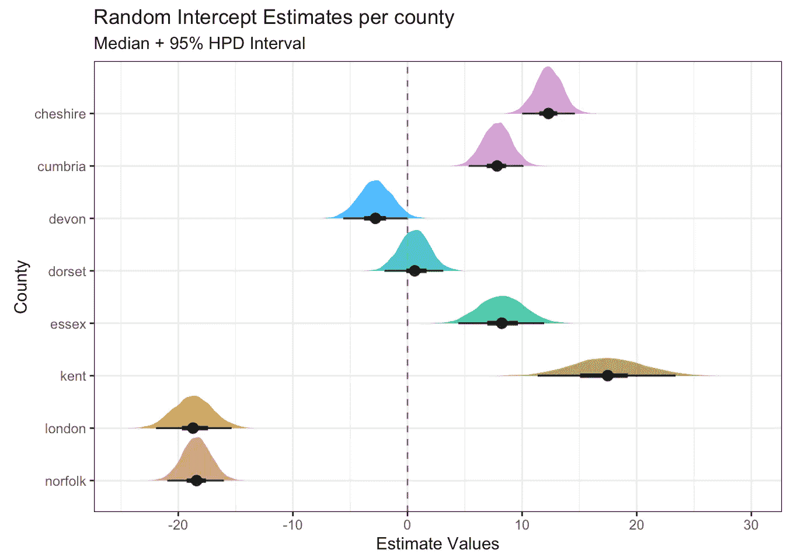**

**我们观察到，样本量较大的县拟合区间较窄(如`cheshire`)，而样本量较小的县拟合区间较宽(如`kent`)。最后，我们可以根据数据检查拟合度。**

> **在 **R** 中使用`*tidybayes*`你可以很容易地实现这些非常**漂亮的视觉效果**，在 **Python** 中使用`seaborn`和`pandas`可能会**更加繁琐，但仍然是可能的**。**

****

# **结论**

**评估贝叶斯模型遵循许多与您遇到的任何其他模型相同的拟合优度测试和性能比较步骤。然而，有一些工具和概念对于评估贝叶斯模型特别有用。有些非常复杂，如果你不熟悉它们的输出意味着什么，使用它们会让人感到畏惧。(没有什么比看不懂一个模型的输出汇总更让人苦恼的了。)**

> **幸运的是，有可视化的方法来诊断模型的适合度，评估性能，甚至解释贝叶斯模型的结果。**

**我希望关于贝叶斯混合模型的第 2 部分能够继续增强您对贝叶斯建模的直觉，从而使它成为您工具集中的一种强大方法。**

**[](/a-bayesian-approach-to-linear-mixed-models-lmm-in-r-python-b2f1378c3ac8) [## R/Python 中线性混合模型(LMM)的贝叶斯方法

### 实现这些比你想象的要简单

towardsdatascience.com](/a-bayesian-approach-to-linear-mixed-models-lmm-in-r-python-b2f1378c3ac8) [](/when-mixed-effects-hierarchical-models-fail-pooling-and-uncertainty-77e667823ae8) [## 当混合效应(分层)模型失败时:汇集和不确定性

### 一个直观和可视化的指南，其中部分池变得麻烦，贝叶斯方法可以帮助量化…

towardsdatascience.com](/when-mixed-effects-hierarchical-models-fail-pooling-and-uncertainty-77e667823ae8) 

# 参考

1.  Gelman，a .，Carlin，J. B .，Stern，H. S .，Dunson，D. B .，Vehtari，a .，和 Rubin，D. B. (2013 年)。贝叶斯数据分析。CRC 出版社。
2.  盖布里、乔纳等人，《贝叶斯工作流程中的可视化》*《英国皇家统计学会杂志:A 辑(社会中的统计学)*182.2(2019):389–402。
3.  吉尔曼，安德鲁，杰西卡黄，和阿基维塔里。"理解贝叶斯模型的预测信息标准."*统计与计算*24.6(2014):997–1016。
4.  维塔里，阿基，安德鲁·盖尔曼和乔纳·盖布里。“使用留一交叉验证和 WAIC 的实用贝叶斯模型评估。”*统计与计算*27.5(2017):1413–1432。

如果你喜欢这篇文章，请随意分享！如果您有任何问题，或者您看到任何不正确/有问题的内容，请发表评论或发推文( [@ecoronado92](https://twitter.com/ecoronado92) )。

所有的 R 代码都可以在[这里找到](https://htmlpreview.github.io/?https://github.com/ecoronado92/towards_data_science/blob/master/hierarchical_models/bayes_lmm/R/bayesian_linear_mixed_model.html)

所有 Python 代码都可以在[这里找到](https://github.com/ecoronado92/towards_data_science/blob/master/hierarchical_models/bayes_lmm/python/bayesian_linear_mixed_effects.ipynb)

[](https://github.com/ecoronado92/towards_data_science/tree/master/hierarchical_models/bayes_lmm) [## ecoronado 92/走向 _ 数据 _ 科学

### 报告包含的材料和例子实施贝叶斯线性混合效应(层次模型)模拟…

github.com](https://github.com/ecoronado92/towards_data_science/tree/master/hierarchical_models/bayes_lmm)**