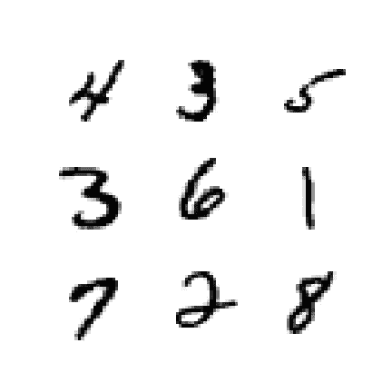
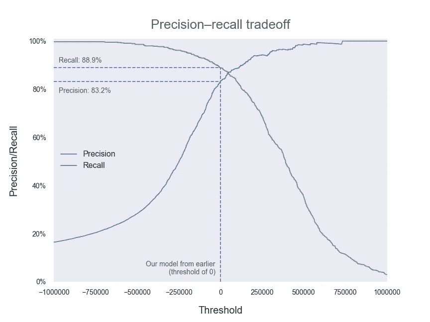
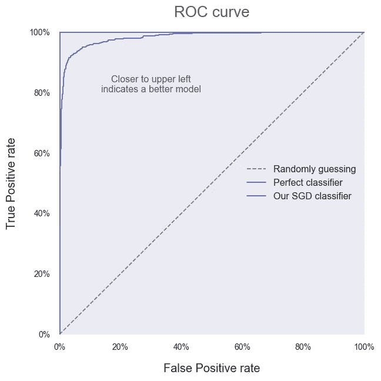

# 评估分类器模型性能

> 原文：<https://towardsdatascience.com/evaluating-classifier-model-performance-6403577c1010?source=collection_archive---------19----------------------->

## 精确度、召回率、AUC 等——去神秘化


由 [Unsplash](https://unsplash.com/s/photos/classified?utm_source=unsplash&utm_medium=referral&utm_content=creditCopyText) 上的[absolute vision](https://unsplash.com/@freegraphictoday?utm_source=unsplash&utm_medium=referral&utm_content=creditCopyText)拍摄

*现在是凌晨 4 点，你正在喝第七杯咖啡。你已经在论坛里搜寻了你能找到的最复杂的模型。您已经设置了预处理管道，并选择了超参数。现在，是时候评估你的模型的性能了。*

你兴奋得发抖(也可能是咖啡因过量)。这是你在卡格尔世界舞台上的首次亮相。当你的预测被提交时，你的想法会转向你将如何处理奖金。兰博基尼还是法拉利？什么颜色的？红色最适合奶油色的室内装潢，但同时…

屏幕上弹出排行榜，好像在宣布什么。

*你的模特表现变差了。你静静地坐着，似乎过了很久。*

最终，你叹了口气，合上笔记本电脑的盖子，上床睡觉。

如果你以前尝试过建立一个模型，你会知道这是一个迭代的过程。进步不是线性的——可能会有很长一段时间，你看起来没有更接近你的目标，甚至在倒退——直到出现突破，你向前冲……并进入下一个问题。

在验证集上监控模型性能是一种很好的方式，可以获得关于您所做的工作是否有效的反馈。它也是比较两种不同模型的一个很好的工具——最终，我们的目标是建立更好、更准确的模型，帮助我们在实际应用中做出更好的决策。当我们试图向特定情况下的利益相关者传达一个模型的价值时，他们会想知道为什么他们应该关心:对他们有什么好处？这将如何让他们的生活变得更轻松？我们需要能够将我们已经建立的系统与已经存在的系统进行比较。

评估模型性能可以告诉我们我们的方法是否有效——这被证明是有帮助的。我们可以继续探索，看看我们能把我们正在研究的问题的现有概念推进到什么程度。它还可以告诉我们我们的方法是否不起作用——这被证明*甚至更有帮助，因为如果我们的调整使模型在它应该做的事情上变得更糟，那么它表明我们可能误解了我们的数据或正在建模的情况。*

所以模型性能的评估是有用的——但是具体怎么做呢？

# 通过示例的方式进行探索

目前，我们将专注于一类特殊的模型——分类器。这些模型用于将看不见的数据实例归入特定的类别——例如，我们可以建立一个*二元分类器*(两个类别)来区分给定图像是狗还是猫。更实际地，可以使用二元分类器来决定传入的电子邮件是否应该被分类为垃圾邮件，特定的金融交易是否是欺诈性的，或者是否应该基于在线商店的特定客户的购物历史来向他们发送促销电子邮件。

用于评估分类器性能的技术和指标将不同于用于*回归器*的技术和指标，后者是一种试图从连续范围预测值的模型。这两种类型的模型都很常见，但是现在，让我们将分析局限于分类器。

为了说明一些重要的概念，我们将建立一个简单的分类器来预测特定图像的图像是否是 7。让我们使用著名的 NMIST 数据集来训练和测试我们的模型。

(如果你想看完整的 Python 代码或者在家跟着看，可以在 GitHub 上查看[制作这部作品的笔记本](https://github.com/andrewhetherington/python-projects/blob/master/Blog%E2%80%94Evaluating%20Classifier%20Model%20Performance/Evaluating%20Classifier%20Model%20Performance.ipynb)！)

下面，我们使用 Scikit-Learn 下载我们的数据并构建我们的分类器。首先，为数学导入 NumPy，为绘图导入 Matplotlib:

```
# Import modules for maths and plotting
import numpy as np
import matplotlib.pyplot as plt
import matplotlib.style as style
style.use(‘seaborn’)
```

然后，使用 scikit-learn 内置的 helper 函数下载数据。数据以字典的形式出现——我们可以使用“数据”键来访问训练和测试数据的实例(数字的图像),使用“目标”键来访问标签(数字被手工标记为什么)。

```
# Fetch and load data
from sklearn.datasets import fetch_openmlmnist = fetch_openml(“mnist_784”, version=1)
mnist.keys()# dict_keys(['data', 'target', 'frame', 'categories', 'feature_names', 'target_names', 'DESCR', 'details', 'url'])
```

完整的数据集包含多达 70，000 张图像，让我们选取 10%的数据子集，以便更容易地快速训练和测试我们的模型。

```
# Extract features and labels
data, labels = mnist[“data”], mnist[“target”].astype(np.uint8)# Split into train and test datasets
train_data, test_data, train_labels, test_labels = data[:6000], data[60000:61000], labels[:6000], labels[60000:61000]
```

现在，让我们简单检查一下我们训练数据中的前几个数字。每个数字实际上由从 0 到 255 的 784 个值表示，这些值表示 28 乘 28 网格中每个像素应该有多暗。我们可以轻松地将数据重新形成网格，并使用 matplotlib 的 imshow()函数绘制数据:

```
# Plot a selection of digits from the dataset
example_digits = train_data[9:18]# Set up plotting area
fig = plt.figure(figsize=(6,6))# Set up subplots for each digit — we’ll plot each one side by side to illustrate the variation
ax1, ax2, ax3 = fig.add_subplot(331), fig.add_subplot(332), fig.add_subplot(333)
ax4, ax5, ax6 = fig.add_subplot(334), fig.add_subplot(335), fig.add_subplot(336)
ax7, ax8, ax9 = fig.add_subplot(337), fig.add_subplot(338), fig.add_subplot(339)
axs = [ax1, ax2, ax3, ax4, ax5, ax6, ax7, ax8, ax9]# Plot the digits
for i in range(9):

 ax = axs[i]
 ax.imshow(example_digits[i].reshape(28, 28), cmap=”binary”)
 ax.set_xticks([], []) 
 ax.set_yticks([], [])
```



我们数据集中的九个数字样本

现在，让我们创建一组新的标签——我们目前只对是否是 7 感兴趣。一旦完成，我们就可以训练一个模型，希望它能挑选出构成数字“7-y”的特征:

```
# Create new labels based on whether a digit is a 7 or not
train_labels_7 = (train_labels == 7) 
test_labels_7 = (test_labels == 7)# Import, instantiate and fit model
from sklearn.linear_model import SGDClassifiersgd_clf_7 = SGDClassifier(random_state=0) 
sgd_clf_7.fit(train_data, train_labels_7)# Make predictions using our model for the nine digits shown above
sgd_clf_7.predict(example_digits)# array([False, False, False, False, False, False,  True, False, False])
```

对于我们的模型，我们使用了一个 *SGD* (或*随机梯度下降*)分类器。对于我们的九个示例数字阵列，看起来我们的模型正在做正确的事情——它已经正确地从其他八个非七中识别出一个七。让我们使用三重交叉验证对我们的数据进行预测:

```
from sklearn.model_selection import cross_val_predict# Use 3-fold cross-validation to make “clean” predictions on our training data
train_data_predictions = cross_val_predict(sgd_clf_7, train_data, train_labels_7, cv=3)train_data_predictions# array([False, False, False, ..., False, False, False])
```

好了，现在我们对训练集中的每个实例都有了一组预测。听起来可能很奇怪，我们正在对我们的*训练数据*进行*预测*，但是我们通过使用[交叉验证](https://machinelearningmastery.com/k-fold-cross-validation/)来避免对模型已经训练过的数据进行预测——请点击链接了解更多信息。

## 真/假阳性/阴性

在这一点上，让我们后退一步，想想对于给定的模型预测，我们可能会发现自己处于不同的情况。

*   模型可能预测的是 7，图像实际上是 7(真正)；
*   模型可能预测的是 7，图像实际上不是 7(假阳性)；
*   模型可能预测的不是 7，图像实际上是 7(假阴性)；和
*   模型可能预测不是 7，而图像实际上不是 7(真阴性)。

我们使用真/假阳性(TP/FP)和真/假阴性(TN/FN)来描述上面列出的四种可能的结果。对/错部分指的是模型是否正确。肯定/否定部分是指被分类的实例实际上是否是我们想要识别的实例。

一个好的模型将会有高水平的真阳性和真阴性，因为这些结果表明模型在哪里得到了正确的答案。一个好的模型也会有低水平的假阳性和假阴性，这表明模型在哪里犯了错误。

这四个数字可以告诉我们很多关于模型做得如何以及我们可以做些什么来帮助的信息。通常，将它们表示为一个*混淆矩阵是有帮助的。*

## 混淆矩阵

我们可以使用 sklearn 轻松提取混淆矩阵:

```
from sklearn.metrics import confusion_matrix# Show confusion matrix for our SGD classifier’s predictions
confusion_matrix(train_labels_7, train_data_predictions)# array([[5232,  117],
         [  72,  579]], dtype=int64)
```

这个矩阵的列代表了我们的模型所预测的，而不是左边的-7 和右边的 7。这些行表示模型预测的每个实例的实际情况，而不是顶部的-7 和底部的 7。当比较我们的预测和实际结果时，每个位置的数字告诉我们观察到的每个情况的数量。

总之，在 6，000 个测试案例中，我们观察到(将“正面”结果视为 7，将“负面”结果视为其他数字):

*   579 个预测的 7 实际上是 7(TPs)；
*   72 个预测的非 7 实际上是 7(fn)；
*   117 个预测的 7 实际上不是-7(FPs)；和
*   5232 个预测的非 7 实际上不是 7(TN)。

你可能已经注意到，理想情况下，我们的混淆矩阵应该是*对角线—* 也就是说，只包含真阳性和真阴性。事实上，我们的分类器似乎更多地与假阳性而不是假阴性作斗争，这给我们提供了有用的信息，以决定我们应该如何进一步改进我们的模型。

## 精确度和召回率


由[马库斯·斯皮斯克](https://unsplash.com/@markusspiske?utm_source=unsplash&utm_medium=referral&utm_content=creditCopyText)在 [Unsplash](https://unsplash.com/s/photos/scope?utm_source=unsplash&utm_medium=referral&utm_content=creditCopyText) 上拍摄的照片

我们可以使用混淆矩阵中编码的信息来计算一些更有用的量。*精度*定义为真阳性的数量占所有(真和假)阳性的比例。实际上，这个数字代表了有多少模型的正面预测实际上是正确的。

对于我们上面的模型，精度是 579 / (579 + 117) = 83.2%。这意味着在我们的数据集中，所有我们预测为 7 的数字中，只有 83.2%实际上是 7。

但是，精确度也必须与*召回一起考虑。*召回被定义为真阳性的数量占真阳性和假阴性的比例。记住，真阳性和假阴性都与被考虑的数字*实际上是*7 的情况有关。所以总而言之，回忆代表了这个模型在正确识别正面事例方面有多好。

对于我们上面的模型，召回率是 579 / (579 + 72) = 88.9%。换句话说，我们的模型*只捕捉到了实际上是 7 的数字的 88.9%。*

我们还可以直接从我们的模型中获取这些量，从而避免手动计算这些量:

```
from sklearn.metrics import precision_score, recall_score# Calculate and print precision and recall as percentages
print(“Precision: “ + str(round(precision_score(train_labels_7, train_data_predictions)*100,1))+”%”)print(“Recall: “ + str(round(recall_score(train_labels_7, train_data_predictions)*100,1))+”%”)# Precision: 83.2%
# Recall: 88.9%
```

我们可以通过调整模型的*阈值*来设置*期望的精度水平或回忆*。在后台，我们的 SGD 分类器已经为数据中的每个数字得出了一个*决策分数*，它对应于一个数字的“七-y”程度。看起来非常像 7-y 的数字会有较高的分数。模型认为看起来根本不像 7 的数字会有较低的分数。模棱两可的情况(可能是画得很差的七，看起来有点像七)会在中间。决策分数高于模型阈值的所有数字将被预测为 7，而分数低于阈值的所有数字将被预测为非-7。因此，如果我们想提高我们的回忆(并增加我们成功识别的 7 的数量)，我们可以降低阈值。通过这样做，我们实际上是在对模型说，“降低你识别 7 的标准一点”。然后我们会捕捉到更多的模糊的 7，我们正确识别的数据中实际的 7 的比例会增加，我们的回忆会增加。除了增加 TP 的数量，我们还将减少 fn 的数量——之前被错误识别为非 7 的 7 将开始被正确识别。

但是，您可能已经注意到，在降低阈值的过程中，我们现在很可能会将更多的非 7 人错误分类。画得有点像 7 的那个现在可能被错误地预测为 7。因此，我们将开始得到越来越多的假阳性结果，并且*随着召回率的增加，我们的精确度将呈下降趋势。*这是*精确-召回的权衡。鱼与熊掌不可兼得。最好的模型将能够在两者之间取得良好的平衡，从而使精确度和召回率都处于可接受的水平。*

什么样的精确度和召回率才算“可接受”？这取决于该模型将如何应用。如果未能识别出阳性实例的后果很严重，例如，如果你是一名旨在检测威胁生命的疾病的医生，你可能愿意承受更多的假阳性(并让一些没有患病的人做一些不必要的进一步检查)以减少假阴性(在这种情况下，有人不会接受他们需要的救命治疗)。同样，如果你有一种情况，在这种情况下，你有必要对你的积极预测非常有信心，例如，如果你正在选择一个要购买的财产或选择一个新油井的位置，如果这意味着你不太可能因为一个假阳性而投入时间和金钱，你可能会很高兴放弃一些机会(即让你的模型预测更多的假阴性)。

## 将精确度可视化——回忆权衡

我们可以观察精度和召回率如何随着决策阈值而变化(对于上面我们的指标的计算，scikit-learn 使用了零阈值):

```
# Use cross_val_predict to get our model’s decision scores for each digit it has predicted
train_data_decision_scores = cross_val_predict(sgd_clf_7, train_data, train_labels_7, cv=3,
 method=”decision_function”)from sklearn.metrics import precision_recall_curve# Obtain possible combinations of precisions, recalls, and thresholds
precisions, recalls, thresholds = precision_recall_curve(train_labels_7, train_data_decision_scores)# Set up plotting area
fig, ax = plt.subplots(figsize=(12,9))# Plot decision and recall curves
ax.plot(thresholds, precisions[:-1], label=”Precision”)
ax.plot(thresholds, recalls[:-1], label=”Recall”)[...] # Plot formatting
```



正如你所看到的，精确和召回是一个硬币的两面。一般来说(也就是说，如果没有特定的理由以牺牲另一个为代价来寻找更多的一个)，我们会希望调整我们的模型，以便我们的决策阈值设置在精确度和召回率都很高的区域。

随着决策阈值的变化，我们还可以绘制精确度和召回率之间的直接对比图:

```
# Set up plotting area
fig, ax = plt.subplots(figsize=(12,9))# Plot pairs of precision and recall for differing thresholds
ax.plot(recalls, precisions, linewidth=2)[...] # Plot formatting
```


我们还包括了曲线上当前模型(决策阈值为零)所在的点。在理想情况下，我们应该有一个既能达到 100%准确率又能达到 100%召回率的模型，也就是说，我们应该有一条通过上图右上角的准确率-召回率曲线。因此，我们对模型所做的任何调整，将我们的曲线向外推向右上方，都可以被视为改进。

## F1 分数

对于精确度和召回率同样重要的应用，将它们组合成一个称为 *F1 分数的量通常是方便的。*F1 分数被定义为精确度和召回分数的调和平均值。直观地解释 F1 分数比分别解释精确度和回忆要困难一些，但是将这两个量总结成一个易于比较的指标可能是可取的。

为了获得高 F1 分数，模型需要同时具有高精度和高召回率。这是因为当取调和平均值时，如果精确度或召回率中的一个较低，F1 分数会被显著拉低。

```
from sklearn.metrics import f1_score# Obtain and print F1 score as a percentage
print(“F1 score: “ + str(round(f1_score(train_labels_7, train_data_predictions)*100,1))+”%”)# F1 score: 86.0%
```

## ROC(受试者操作特征)和 AUC(曲线下面积)

评估(和可视化)模型性能的另一种常用方法是使用 ROC 曲线。从历史上看，它起源于信号检测理论，并在第二次世界大战中首次用于探测敌机，其中雷达接收机操作员根据输入信号进行检测和决策的能力被称为接收机工作特性。尽管今天人们使用它的准确语境已经发生了变化，但这个名字却一直沿用下来。


由[马拉·吉利亚季诺夫](https://unsplash.com/@m3design?utm_source=unsplash&utm_medium=referral&utm_content=creditCopyText)在 [Unsplash](https://unsplash.com/s/photos/radar?utm_source=unsplash&utm_medium=referral&utm_content=creditCopyText) 上拍摄的照片

ROC 曲线描绘了*真阳性率*和*假阳性率*如何随着模型阈值的变化而变化。真正的阳性率只是被正确识别的阳性实例的百分比(即我们正确预测的 7 的数量)。相应地，假阳性率是被错误地识别为阳性的阴性实例的数量(即被错误地预测为 7 的非 7 的数量)。你可能已经注意到，真实肯定率的定义等同于回忆。您可能是对的——这些只是相同指标的不同名称。

为了对好的和坏的 ROC 曲线有一点直觉(因为思考这些更抽象的量实际上意味着什么通常有点棘手)，让我们考虑一下极端情况——我们可能拥有的最好和最差的分类器。

*最坏可能分类器*基本上是随机的，50/50 猜测一个给定的数字是 7 还是不是 7——它没有尝试去了解这两个类别的区别。每个实例的决策分数基本上是随机分布的。假设我们最初将决策阈值设置为一个非常高的值，这样所有的实例都被分类为否定的。我们将不会识别出任何阳性实例——真或假——因此真阳性和假阳性率都为零。随着我们降低决策阈值，我们将逐渐开始将相同数量的阳性和阴性实例分类为阳性，以便真阳性率和假阳性率以相同的速度增加。这种情况一直持续到我们的阈值处于某个非常低的值，此时我们遇到了与开始时相反的情况——正确地分类了所有阳性实例(因此真实阳性率等于 1 ),但也错误地分类了所有阴性实例(假阳性率也是 1)。因此，*随机的 50/50 分类器的 ROC 曲线是从(0，0)到(1，1)的对角线。*

(你可能认为有可能有比这更糟糕的分类器——也许是一个每次都预测相反的数字而把每个数字都弄错的分类器。但在这种情况下，分类器本质上将是一个完美的分类器——如果*错了，*模型将需要完美地学习分类，然后在做出预测之前切换输出！)

*最佳可能分类器*将能够以 100%的准确度正确预测每个给定的实例是正面的还是负面的。所有正面实例的决策得分将是某个高值，以表示该模型对其预测具有极高的信心，并且对其给出的每个数字也是如此。所有否定的实例都有一些低的决策分数，因为模型再次非常有把握地认为所有这些实例都是否定的。如果我们以非常高的值开始决策阈值，使得所有实例都被分类为阴性，我们会遇到与 50/50 分类器所描述的相同的情况——真阳性率和假阳性率都为零，因为我们没有预测到任何阳性实例。同样，当决策阈值非常低时，我们将预测所有实例都是阳性的，因此真阳性率和假阳性率的值都是 1。因此，对于 50/50 分类器，ROC 曲线将从(0，0)开始，到(1，1)结束。*然而，*当决策阈值被设置在识别阳性和阴性实例的高和低决策分数之间的任何水平时，分类器将以 100%的真阳性率和 0%的假阳性率完美地操作。太神奇了！上面的结果是，我们的完美分类器的 ROC 曲线是*连接(0，0)，(0，1)和(1，1)的曲线——一条包围图的左上角的曲线。*

大多数真实世界的分类器将介于这两个极端之间。理想情况下，我们希望我们的分类器的 ROC 曲线看起来更像一个完美的分类器，而不是随机猜测的——因此*ROC 曲线越靠近图的左上角(越接近完美分类器的行为)就代表着一个更好的模型。*

有了这些新知识，让我们画一些 ROC 曲线。

```
from sklearn.metrics import roc_curve# Set up plotting area
fig, ax = plt.subplots(figsize=(9,9))# Obtain possible combinations of true/false positive rates and thresholds
fpr, tpr, thresholds = roc_curve(train_labels_7, train_data_decision_scores)# Plot random guess, 50/50 classifier
ax.plot([0,1], [0,1], “k — “, alpha=0.5, label=”Randomly guessing”)# Plot perfect, omniscient classifier
ax.plot([0.002,0.002], [0,0.998], “slateblue”, label=”Perfect classifier”)
ax.plot([0.001,1], [0.998,0.998], “slateblue”)# Plot our SGD classifier with threshold of zero
ax.plot(fpr, tpr, label=”Our SGD classifier”)[...] # Plot formatting
```



很明显，我们的 SGD 分类器比随机猜测的要好！毕竟所有的工作都是值得的。我们可以通过计算模型的 ROC 曲线下的面积(称为 *AUC)来量化模型性能，而不是依赖于“越靠近左上角越好”这种模糊的说法。*

如果您还记得计算三角形面积的公式，您应该能够看到随机分类器的 AUC 是 0.5。您还应该能够看到完美分类器的 AUC 是 1。因此，AUC 越高越好，我们希望 AUC 尽可能接近 1。我们的 SGD 分类器的 AUC 可以如下获得:

```
from sklearn.metrics import roc_auc_score# Obtain and print AUC
print(“Area Under Curve (AUC): “ + str(round(roc_auc_score(train_labels_7, train_data_predictions),3)))# Area Under Curve (AUC): 0.934
```

孤立来看，很难准确说出我们的 AUC 0.934 意味着什么。正如之前看到的基于精度和召回的指标一样，这些是标准的*比较*工具。我们应该有目的地使用它们来开发和调整我们当前的模型，并将我们的模型与其他算法进行比较，以在我们的特定任务中寻求最佳性能。

# 结论

我们今天走了很多路，所以如果你一路过关斩将，恭喜你！当第一次处理一个问题时，人们很容易被大量的算法、方法和参数所淹没，这些算法、方法和参数可以作为解决问题的方法的一部分。模型性能度量可以作为指引我们穿越这片荒野的指南针——只要我们分解一个问题，决定一个初始方法(如果需要，我们可以在以后改变),并使用像上面解释的那些明智的工具来评估我们是否正在取得进展，我们将朝着我们需要去的地方前进。尽管看不到某个特定绩效指标的改善反映了数小时的研究和模型修补令人心碎，但知道我们是在前进还是后退总是更好。

所以坚持下去——如果数据显示某个方法不起作用，不要太投入。冷静地回顾和比较模型和方法。如果你能做到这一点，你马上就能坐上那辆配有奶油色内饰的法拉利。

# 学分和更多信息

**Andrew Hetherington** 是英国伦敦的一名见习精算师和数据爱好者。

*   查看我的[网站](https://www.andrewhetherington.com/)。
*   在 [LinkedIn](https://www.linkedin.com/in/andrewmhetherington/) 上和我联系。
*   看看我在 [GitHub](https://github.com/andrewhetherington/python-projects) 上鼓捣什么。
*   用于制作本文作品的笔记本可以在[这里](https://github.com/andrewhetherington/python-projects/blob/master/Blog%E2%80%94Evaluating%20Classifier%20Model%20Performance/Evaluating%20Classifier%20Model%20Performance.ipynb)找到。

本文中的代码块改编自 [A. Géron 的 2019 年著作](https://www.amazon.co.uk/Hands-Machine-Learning-Scikit-Learn-TensorFlow/dp/1492032646/ref=pd_lpo_14_t_0/257-3076774-3184456?_encoding=UTF8&pd_rd_i=1492032646&pd_rd_r=dfb4d6ef-830b-45b4-a51e-655f75eb07c5&pd_rd_w=2JphL&pd_rd_wg=NXcYK&pf_rd_p=7b8e3b03-1439-4489-abd4-4a138cf4eca6&pf_rd_r=WR7PA4BFNEHM2DCHCMYC&psc=1&refRID=WR7PA4BFNEHM2DCHCMYC)、*使用 Scikit-Learn、Keras 和 TensorFlow 进行机器学习的实践*第二版，作者为 Aurélien Géron (O'Reilly)。版权所有 2019 凯维软件有限公司，978–1–492–03264–9。

由[absolute vision、](https://unsplash.com/@freegraphictoday?utm_source=unsplash&utm_medium=referral&utm_content=creditCopyText) [Markus Spiske](https://unsplash.com/@markusspiske?utm_source=unsplash&utm_medium=referral&utm_content=creditCopyText) 和 [Marat Gilyadzinov](https://unsplash.com/@m3design?utm_source=unsplash&utm_medium=referral&utm_content=creditCopyText) 拍摄的照片。