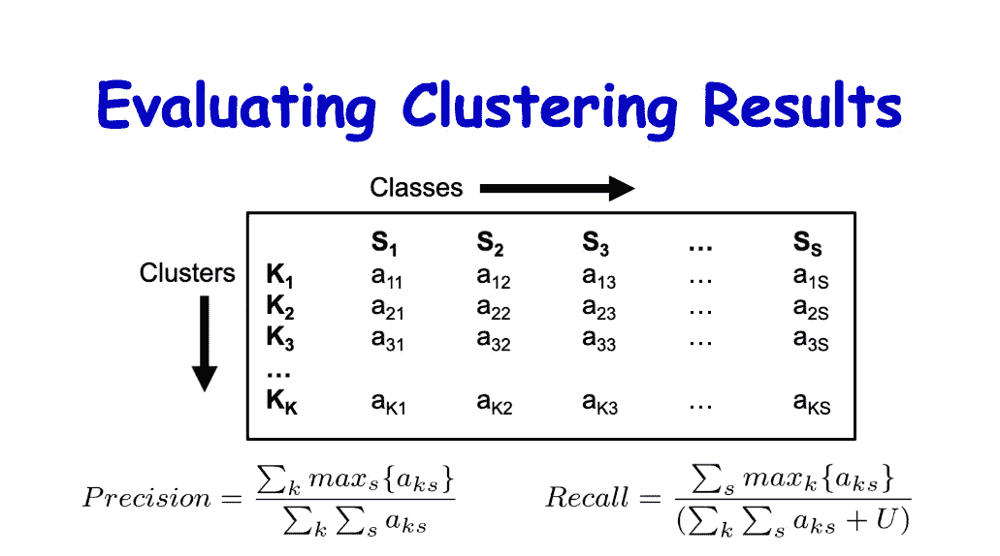
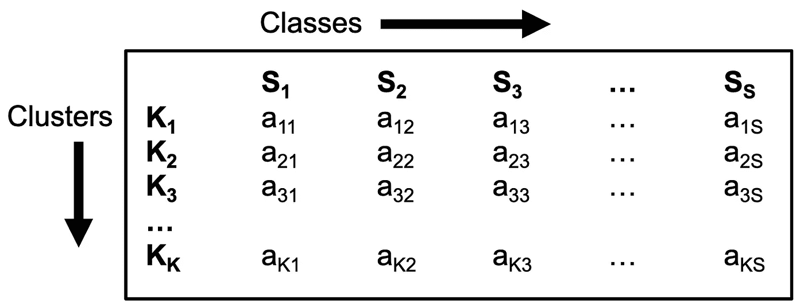
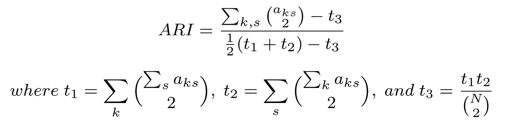
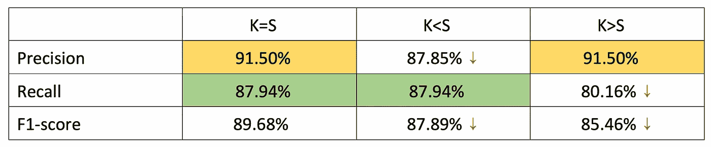

# 评估聚类结果

> 原文：<https://towardsdatascience.com/evaluating-clustering-results-f13552ee7603?source=collection_archive---------21----------------------->

## 用于评估聚类结果的标准



作者图片

聚类方法的主要目标是获得高的类内相似性和低的类间相似性(同一类中的对象比不同类中的对象更相似)。在我关于[宏基因组学](/metagenomics-who-is-there-and-what-are-they-doing-9f204342eed9)宁滨分析的工作中，我一直在使用不同的聚类方法，在这篇文章中，我想分享一些我的想法和我使用的技术。

# 聚类分析(聚类)

根据[维基百科](https://en.wikipedia.org/wiki/Cluster_analysis)，

> **聚类分析**或**聚类**是对一组对象进行分组的任务，使同一组中的对象(称为**聚类**)比其他组(聚类)中的对象彼此更加相似(在某种意义上)。

我希望你熟悉分类中使用的术语，如 TP、TN、FP、FN、准确度、精确度、召回率和 F1 分数。我不会深入这些条款的细节。如果你想回顾一下，我发现下面的文章非常有用。

1.  [准确度、召回率、精确度、F 值&特异性，在](/accuracy-recall-precision-f-score-specificity-which-to-optimize-on-867d3f11124)上进行优化
2.  [准确度、精密度、召回率还是 F1？](/accuracy-precision-recall-or-f1-331fb37c5cb9)
3.  [超越准确度:精确度和召回率](/beyond-accuracy-precision-and-recall-3da06bea9f6c)

# 评估聚类结果时遇到的问题

在我分析的一些案例中，聚类方法无法找到黄金标准中的正确聚类数。一些方法高估了聚类的数量，而另一些方法低估了聚类的数量。在这种情况下，我们不能使用用于分析分类结果的标准标准，因为分类结果的数量与黄金标准中的分类数量相同。

在浏览了我所在领域的相关文献后，我发现了一些标准，这些标准适用于我之前讨论过的情况。让我们看看如何继续我们的评估。

# 评定标准



图一。K x S 矩阵(图片由作者提供)

聚类结果表示为一个`K x S`矩阵，如图 1 所示，其中`K`是聚类方法预测的聚类数，`S`是黄金标准中存在的类数。

这里，元素 **aₖₛ** 表示聚集到 **kᵗʰ** 集群的对象总数，并且属于黄金标准中的 **sᵗʰ** 类。

在理想情况下，`K = S`其中通过聚类方法预测的类的数量与黄金标准中存在的类的数量相同。但是，在某些情况下，`K < S`或`K > S`聚类方法预测的聚类数不等于黄金标准中存在的类别数。

使用这个矩阵，我们可以找到以下标准。

1.  精确
2.  回忆
3.  f1-分数
4.  调整后的兰德指数

## 精确

对于每个集群，我们都获得了分配了最大数量对象的黄金标准类。然后，我们对每个集群的最大对象数求和，并除以集群对象的总数。得到的值是 ***精度*** 并使用`K x S`矩阵，其计算如图 2 所示。


图二。精度方程(图片由作者提供)

## 回忆

对于每个黄金标准类，我们获得分配了最大数量对象的聚类。然后，我们对每个黄金标准类的最大对象数求和，并除以集群对象和非集群对象的总数。得到的值就是*(也叫*)并利用`K x S`矩阵，计算出来如图 3 所示。**

****

**图 3。回忆方程式(图片由作者提供)**

**这里`U`表示未聚类对象的数量。**

## **f1-分数**

*****-得分*** 是 ***精度*******召回*** 的调和平均值，计算方法如图 4 所示。***

****

**图 4。F1 分数等式(图片由作者提供)**

## **调整后的兰德指数**

***调整后的兰德指数(ARI)* 是 ***兰德指数(RI)*** 的机会修正版。这是对聚类结果与其黄金标准分组相似程度的度量。使用`K x S`矩阵，ARI 的计算如图 5 所示。**

****

**图 5。ARI 方程(图片由作者提供)**

**这里`N`表示聚类对象的总数，并且`(N 2)`(二项式系数)被计算为`N(N-1)/2`。**

# **示例演练**

**让我们看一个例子，我们将为给定的聚类结果计算不同的评估标准。假设金本位中有 **257** 个对象，我们知道每个对象的类别。**

## **情况 1: K=S**

**让我们假设一个理想的情况，其中我们在黄金标准中有 5 个类别，并且通过聚类方法预测了 5 个聚类。我们可以得到一个如下图所示的`K x S`矩阵。**

```
**64, 4, 1, 5, 0
2, 37, 1, 6, 0
0, 0, 44, 0, 0
1, 1, 0, 72, 0
0, 0, 0, 0, 9**
```

**如果我们参照图 1，行代表集群，列代表类。聚类到第一个聚类并属于黄金标准中的第一类(第一行和第一列的交叉点)的对象的数量是 64。类似地，聚类到第一聚类并属于黄金标准中的第二类(第一行和第二列的交叉点)的对象的数量是 4。**

**请注意，每行和每列(64、37、44、72 和 9)的最大值可以在对角线中找到，这告诉我们第一个聚类对应于黄金标准中的第一类，第二个聚类对应于黄金标准中的第二类，依此类推。**

**聚集的对象总数将是 **247** 。**

```
**Total number of objects clustered 
=64+4+1+5+2+37+1+6+44+1+1+72+9
=247**
```

**未聚类对象的数量将为 **10** 。**

```
**Total number of unclustered objects
=257-247
=10**
```

**现在，让我们使用这个矩阵来计算精确度、召回率和 F1 值。**

```
**Precision
=(64+37+44+72+9)/(64+4+1+5+2+37+1+6+44+1+1+72+9)
=91.50%Recall
=(64+37+44+72+9)/(64+4+1+5+2+37+1+6+44+1+1+72+9+10)
=87.94%F1-score
=2*(91.50*87.94)/(91.50+87.94)
=89.68%**
```

## **案例 2: K**

**~~Let us assume a case where we have 5 classes in the gold standard and 4 clusters are predicted by the clustering method. We can see that two clusters have been combined (the third row with 44 and 9).~~**

```
**~~64, 4, 1, 5, 0
2, 37, 1, 6, 0
0, 0, 44, 0, 9
1, 1, 0, 72, 0Total number clustered = 64+4+1+5+2+37+1+6+44+9+1+1+72 = 247
Total number unclustered = 257-247 = 10~~**
```

**~~Now, let us calculate the precision, recall and F1-score using this matrix.~~**

```
**~~Precision
=(64+37+44+72)/(64+4+1+5+2+37+1+6+44+9+1+1+72)
=87.85%Recall
=(64+37+44+72+9)/(64+4+1+5+2+37+1+6+44+9+1+1+72+10)
=87.94%F1-score
=2*(87.85*87.94)/(87.85+87.94)
=87.89%~~**
```

## **~~Case 3: K> S~~**

**~~让我们假设一种情况，其中我们在黄金标准中有 5 个类别，并且通过聚类方法预测了 6 个聚类。我们可以看到一个集群被拆分(第三行和第四行分别为 24 和 20)。~~**

```
**~~64, 4, 1, 5, 0
2, 37, 1, 6, 0
0, 0, 24, 0, 0
0, 0, 20, 0, 0
1, 1, 0, 72, 0
0, 0, 0, 0, 9Total number clustered = 64+4+1+5+2+37+1+6+24+20+1+1+72+9 = 247
Total number unclustered = 257-247 = 10~~**
```

**~~现在，让我们使用这个矩阵来计算精确度、召回率和 F1 值。~~**

```
**~~Precision
=(64+37+24+20+72+9)/(64+4+1+5+2+37+1+6+24+20+1+1+72+9)
=91.50%Recall
=(64+37+24+72+9)/(64+4+1+5+2+37+1+6+24+20+1+1+72+9+10)
=80.16%F1-score
=2*(91.50*80.16)/(91.50+80.16)
=85.46%~~**
```

# **~~分析~~**

**~~让我们仔细检查一下从每个示例案例中获得的值，如图 6 所示。~~**

**~~~~**

**~~图 6。精确度、召回率和 F1 分数值(图片由作者提供)~~**

**~~我们可以看到，如果聚类方法低估了聚类的数量(情况`K<S`)，即将聚类组合在一起，并且这些聚类将包含多个黄金标准类，则精度会降低，但召回率仍与理想情况相同。这是因为，对于组合仓，在行(44)中将只考虑最大值。~~**

**~~类似地，如果聚类方法高估了聚类的数量(案例`K>S`)，即分割实际聚类，黄金标准类由多个聚类表示，则召回率会降低，但精度仍与理想情况相同。这是因为，对于分离的箱，在列(24)中将只考虑最大值。~~**

**~~在`K<S`和`K>S`两种情况下，F1 分数随着精确度或召回率的降低而降低。~~**

**~~总的来说，我们可以看到，随着聚类方法预测的聚类数的增加，精确度增加，而召回率减少。~~**

# **~~结束想法~~**

**~~我希望这篇文章对你的学习或研究工作有用。~~**

**~~我在下面附上了一个简单的脚本，你可以输入聚类结果和黄金标准，并获得精度，召回，F1 分数和 ARI 值。这个脚本接收 2 个`.csv`文件；一个用于聚类结果，另一个用于金标准。~~**

**~~您可以使用命令运行这个脚本，~~**

```
**~~python evaluate.py --clustered clustering_result.csv --goldstandard gold_standard.csv~~**
```

**~~这里 clustering_result.csv 和 gold_standard.csv 应该是`object_id,cluster_id`的格式。将打印精确度、召回率、F1 分数和 ARI 值。~~**

**~~感谢您的阅读！~~**

**~~干杯！~~**

# **~~参考~~**

**~~[1] MetaCluster 5.0:一种用于噪声样本中低丰度物种的宏基因组数据的两轮宁滨方法。王*等人。al* 。生物信息学，第 28 卷，第 18 期，2012 年 9 月 15 日，i356–i362 页，DOI:[https://doi.org/10.1093/bioinformatics/bts397](https://doi.org/10.1093/bioinformatics/bts397)~~**

**~~[2]宁滨宏基因组重叠群的覆盖范围和组成。阿尔内贝格 *et。艾尔。*《自然方法》2014 年第 11 卷，第 1144-1146 页，土井:[https://doi.org/10.1038/nmeth.3103](https://doi.org/10.1038/nmeth.3103)~~**

**~~[3]使用 dS2 寡核苷酸频率相异度改善宏基因组数据的重叠群宁滨。王等人。艾尔。 BMC 生物信息学 18(425)，2017，DOI:[https://doi.org/10.1186/s12859-017-1835-1](https://doi.org/10.1186/s12859-017-1835-1)~~**

**~~[4] GraphBin:使用组装图的宏基因组重叠群的精细宁滨。Mallawaarachchi 等人。艾尔。生物信息学，第 36 卷，第 11 期，2020 年 6 月，第 3307-3313 页，DOI:[https://doi.org/10.1093/bioinformatics/btaa180](https://doi.org/10.1093/bioinformatics/btaa180)~~**