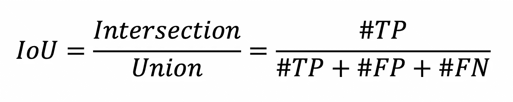

# 评估图像分割模型

> 原文：<https://towardsdatascience.com/evaluating-image-segmentation-models-1e9bb89a001b?source=collection_archive---------15----------------------->

## 不同评价方法的比较和对比

克里斯托夫·高尔在 [Unsplash](https://unsplash.com/s/photos/software-coding?utm_source=unsplash&utm_medium=referral&utm_content=creditCopyText) 上拍摄的照片

# 什么是图像分割？

图像分割是将数字图像划分成不同图像类别或对象的过程。这是自动驾驶汽车非常重要的一部分，因为正确检测汽车前方的物体以及它们的位置是自动驾驶算法的关键输入。

图像分割程序的输出示例。

图像分割模型是通过一个接受给定事实的神经网络创建的。基础事实是正确标记的图像，它告诉神经网络预期的输出是什么。

地面真实 vs .人物形象类的预测[ [站点](https://www.jeremyjordan.me/evaluating-image-segmentation-models/)

在图像分割被训练并输出预测之后，我们需要评估该模型执行得有多好。这通常是通过两种方式完成的，**像素精度**和**交集超过并集** **(或 IoU)** 。

# 像素精度

这是评估图像分割模型性能的最简单方法。为此，我们必须首先计算真正值、真负值、假正值和假负值。要了解这些术语的更多含义，你可以阅读这篇文章。

在这种情况下，对于给定的类 X:

*   **真阳性(TP):** 像素被正确分类为 X
*   **假阳性(FP):** 像素被错误分类为 X
*   **真阴性(TN):** 像素被正确分类为非 X
*   **假阴性(FN):** 像素被错误分类为非 X

计算像素精度的公式为:

像素精度公式。

假设我们正在尝试计算以下 3x3 图像的像素精度。

在这种情况下， **R** 表示对应于**道路**等级的像素，而 **S** 对应于**人行道**等级。根据地面实况，我们在地面实况中有 3 个道路像素，所以 **TP = 3** 。没有任何人行道像素被标记为道路，因此 **FP = 0** 。对于顶部的两个角，模型将像素标记为人行道，而它应该是道路，因此 **FN = 2** 。最后，地面真相底部的 4 个人行道像素都被正确标记，因此 **TN = 4** 。

这种方法也可以在评估每一类的像素精度时全局使用。

## 出现了一个问题

像素精度存在问题，下图可以说明这一点:

照片由 [Rowan Heuvel](https://unsplash.com/@insolitus?utm_source=unsplash&utm_medium=referral&utm_content=creditCopyText) 在 [Unsplash](https://unsplash.com/s/photos/bird?utm_source=unsplash&utm_medium=referral&utm_content=creditCopyText) 上拍摄

如果我们想要计算鸟类的像素精度，即使我们完全错误地预测了鸟类的像素，因为我们图像中的大多数像素是天空，我们的 TN 值会非常高，从而使我们的像素精度非常高。

# 并集上的交集

这是评估来自图像分割模型的预测的另一种方法。该方法通过计算基础事实和预测之间的交集和并集来计算性能。

例如，让我们使用之前的图像:

事实与预测[ [地点](https://www.jeremyjordan.me/evaluating-image-segmentation-models/)

因此，现在我们要确定基本事实和预测之间的交集和联合，如下所示:

交叉点对联合[ [站点](https://www.jeremyjordan.me/evaluating-image-segmentation-models/)

然后，我们可以通过以下公式计算 IoU 值:

在实践中，如果我们想找到一个特定类的 IoU，我们必须首先计算所有正在验证的图像的#TP、#FP、#FN 的总和，然后用总和计算 IoU。

## 平均欠条(百万)

这也是一个度量标准，它采用所有类别的 IoU，并取其平均值。这是图像分割模型在该模型想要检测的所有类别上表现如何的良好指标。

# 结论

像素精度和 mIoU 是用于评估图像分割模型性能的最常见的两种方法。虽然像素精度是一种非常简单的编码方法，但它也会受到占用大部分图像的类的严重影响。mIoU 解决了这个问题，但在某些情况下，mIoU 的运行成本更高，或者编码更复杂。