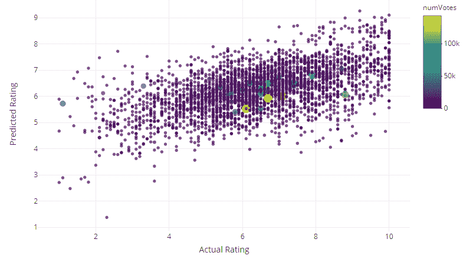
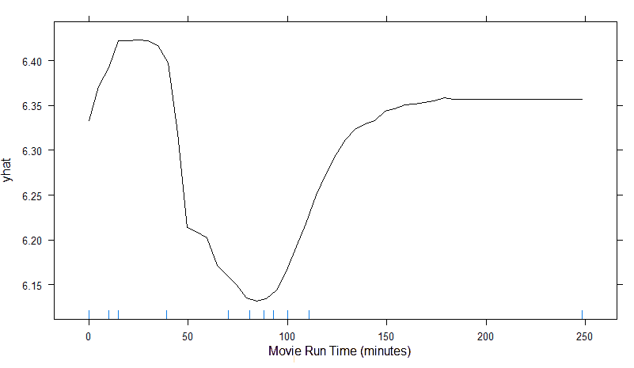
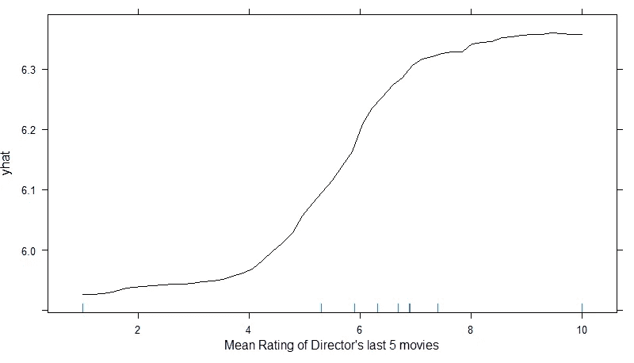
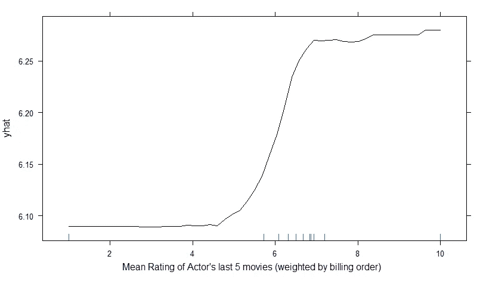
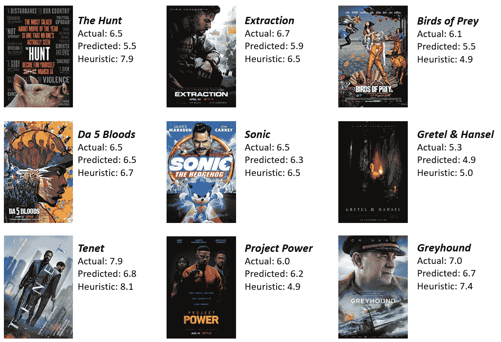

# 评估机器学习模型

> 原文：<https://towardsdatascience.com/evaluating-machine-learning-models-f5c5635db0d7?source=collection_archive---------37----------------------->

## [入门](https://towardsdatascience.com/tagged/getting-started)

## 如何理解一个 ML 模型是否真的在做你想要它做的事情

由[菲利佩·夏罗利](https://unsplash.com/@flpschi?utm_source=medium&utm_medium=referral)在 [Unsplash](https://unsplash.com?utm_source=medium&utm_medium=referral) 上拍摄的照片

当构建模型的艰苦工作完成后，必须有人做出是否按下“go”并将模型放归自然的最终决定。对于数据科学家来说，这是一个至关重要的时刻，当他们发现他们是否会看到他们的工作起飞，或者是否会回到绘图板。对于决策者来说，这也是一个重要的过程，因为如果关键错误在事后才被发现，或者更糟的是根本没有被发现，错误地批准一个算法可能会导致中断和成本。

因此，理解做出该决定的关键因素对于开发算法的数据科学家和依赖这些算法的人都很重要。在这篇博客中，我们将讨论这个决定的一些关键组成部分，使用一个基于开源 IMDB 数据的模型。

# 设置场景

当理解一个模型时，上下文是最重要的，所以让我们花一些时间来勾画一下。比方说，我们的模型是应一位电影制片厂高管的要求建立的，这位高管对一系列缺乏光泽的电影评论感到失望。该模型背后的想法是，它将用于预测电影在推介时的评论分数，从而为电影委托团队提供更多关于批准或拒绝推介的信息。

Jakob Owens 在 [Unsplash](https://unsplash.com?utm_source=medium&utm_medium=referral) 上拍摄的照片

我们将使用 IMDB 用户评级作为我们模型的质量指南。这是一个由网站用户分配的评级，任何人都可以留下评级(暂且不考虑这是否是一个好的质量衡量标准！).经过几周的数据处理，我们的数据科学家使用随机森林回归模型向电影高管展示了一个模型。好到可以被团队使用吗？请继续阅读…

# 理解“准确性”

最自然的问题是这个模型有多精确。这个看似简单的问题可以通过多种方式来解决，很容易抛出大量的准确性度量标准，但仍然让涉众一无所知。这里有一些提示，可以帮助你和你的利益相关者理解你的模型的真正能力:

1.  选择正确的准确性指标
2.  可视化误差指标
3.  选择一个相关的精度基准
4.  开发直接针对模型环境的定制指标
5.  调查数据集中的相关亚人群

## 1.选择正确的准确性指标

选择正确的度量标准是一个理解如何使用模型的问题。在我们的案例中:

*   是否所有的电影推介都将根据预测得分进行排名，前 X 名将获得批准？如果是这样，我们应该探索专门评估排名准确性的准确性指标
*   是不是所有超过某个预测分数的电影都会被批？当我们在处理一个更加二元的是/否批准阈值时，我们可能想把它看作是一个像科恩的 Kappa 或 F1 这样的 metics 的分类问题
*   让一些电影“正确”比其他电影更重要吗，比如根据预算规模？在这里，我们需要对模型进行加权，以对某些电影进行优先级排序，并且我们还需要报告准确性指标
*   这将有助于理解个人电影和各种电影投资组合的预测评论分数吗？在这种情况下，我们最感兴趣的是每部电影的点估计精度。

现在让我们假设最后一个选项最接近模型的使用方式。出于这个原因，我们将选择 R2，因为它能很好地反映个人预测与真实结果的接近程度。

## 2.可视化误差指标

现在我们已经选择了我们的误差度量，我们可以自信地告诉我们的涉众，我们模型的 R2 是 0.3(当然是在验证集上)。仅仅引用这些很难说到底发生了什么，所以可视化的度量可以给涉众一个更准确的触觉。对 R2 来说，最合理的可视化可能是散点图，如下图所示。

*模型预测评级与验证集上的实际评级(2020 部电影)*

*模型预测评分对比验证集上的实际评分(2020 部电影)。“numVotes”表示构成平均评级的投票数，这让人们感受到投票数较少的电影的准确性如何变化*

这告诉我们的不仅仅是简单的 R2 度量。首先，我们可以看到，虽然预测和实际结果之间肯定有关系，但任何给定的预测都有很多不确定性。

此外，我们还看到，在平均 5-7 分的评分附近，有一个预测“群聚”,这在实际结果中我们很少看到。这反映了模型缺乏预测能力:它没有足够的信息来区分高低，因此它在平均分数附近“猜测”结果，因为这将使它具有最小的 R2。这也意味着它通常会低估电影投资组合之间的平均评论评级差异，因为它会将好电影和坏电影的投资组合拉向平均值。

## 3.选择一个相关的精度基准

测试你的算法的最好方法是将它与如果你的算法没有被使用时的决策进行比较。在我们的案例中，与其向我们的电影委托团队推出一个复杂的模型，不如想出一个简单的启发，比如说:“电影评级将与该导演最近五部电影的评级平均值相似”。这很容易理解，任何有网络连接的人都可以快速评估。那么我们的算法表现如何呢？

在这种情况下，启发式算法给出的 R2 为 0.14，因此大约是我们模型的一半准确。这是个好消息，给了我们一些信心，我们的模型比更简单的方法更有价值。

## 4.开发直接针对模型上下文的定制指标

像 R2 和 RMSE 这样的标准模型准确性度量标准可能非常抽象，因此创建更具触觉性且与模型使用方式密切相关的度量标准通常很有价值。在这种情况下，一个好的指标是预测评级最高的前 100 部电影的平均实际评级，为 8.92。这更好，因为它给出了模型将实现的清晰的真实世界视图。

同样，我们可以将其与我们的基准试探法进行比较，后者给出了类似的值 8.13，因此我们的算法比这个指标好 0.79。这足以证明算法的推出是正确的吗？这可能取决于，但现在我们的电影专员可以在“如果我花必要的时间/精力让我的电影委托团队采用这一点，我的电影平均会获得 0.79 的高评级”之间进行权衡。

## 5.调查相关亚人群

照片由 [Pexels](https://www.pexels.com/photo/woman-standing-in-front-of-video-camera-2918590/?utm_content=attributionCopyText&utm_medium=referral&utm_source=pexels) 的 [Caleb Oquendo](https://www.pexels.com/@caleboquendo?utm_content=attributionCopyText&utm_medium=referral&utm_source=pexels) 拍摄

在许多情况下，不仅需要评估总体准确性，还需要评估不同数据组或子部分的准确性。在我们的案例中，我们可能希望检查模型是否对男性或女性导演区别对待，这是一个常见的问题，我们的电影专员热衷于避免。看一下 R2，我们看到女性董事为 0.29，男性董事为 0.3，所以这个模型对这些人群来说似乎非常准确，这是个好消息。当然，这并不是偏见的全部，我们将在后面详细讨论。

现在我们已经很好地掌握了模型的精确度，让我们来了解一下它是如何更好地“思考”的。

# 模型如何做出决策

人们在这个阶段关闭是很常见的，特别是考虑到数据科学有点书呆子气的形象和许多算法被大肆宣传的“黑箱”性质。尽管很复杂，但是可以做很多事情来给非技术观众一个模型如何做决策的感觉。

首先，有一个特性重要性图。大多数 ML 包都提供了这种形式，这表明模型使用了多少变量来进行决策(在随机森林的情况下，当分割该特征时，该特征减少了多少杂质)。

模型使用 70 多项功能，因此仅限于前 20 项功能

在这里，我们看到一些预期的行为，和一些怪异。许多重要的功能与导演、作家或演员以前的电影评级有关，这是有意义的。然而，电影的长度似乎是模型中最重要的因素，这听起来不太对。让我们用一个部分依赖图来理解发生了什么:

在这里，我们可以看到问题可能是什么:似乎有两个“水平”的评论评分，一个是“短片”，即 10-30 分钟的迷你电影，另一个是更正常长度的功能。看起来，平均来说，短片比长篇故事片得到的评价更高。这很可能是一个真实的现象，短片吸引了不同的评论观众，人们喜欢更短的电影，或者一些看不见的功能在“短”电影类别中更普遍。虽然从表面上看，电影长度并没有直观地*感觉到*它应该会影响质量，所以我们可能会决定删除这个功能，前提是它不会严重影响准确性，这个决定可以与我们的电影专员讨论。

我们还可以检查一些其他的高影响特性，看看模型是否以合理的方式对待它们。让我们来看看下一个最重要的变量，导演最近 5 部电影的平均评级，以及演员最近 5 部电影的平均评级(根据演员在电影账单中的排名进行加权)。

这两者都给出了相当合理和直观的结果，演员和导演过去的评级越高，他们未来的电影就越有可能获得高评级。然而，仔细观察确实揭示了一些有趣的行为:可变影响呈 S 形，这意味着超过一定水平后，以前的良好评级就无关紧要了。对于导演最近的电影，这种影响的 S 曲线下降大多发生在数据很少的地方，但对于平均演员评级，我们看到相当多的电影发生在变量停止产生显著影响之后，这意味着超过 6.5-7 左右，它不会显著影响平均评级。糟糕的演员可以搞垮一部电影，但伟大的演员无法让一部平庸的电影变得伟大。

总之，我们的模型与我们之前计算的试探法没有什么不同，只是它考虑了更广泛的类似试探法，考虑了电影的长度(除非我们删除这个特征)。当然，人们可以在这里进入更多的细节，但这给了我们的电影专员一个很好的概述。

# 亲身展示例子

对于所有聪明的可视化和解释技术，除了通过一些例子展示模型的运行，让人们感受到它是如何工作的，通常没有什么可以替代的。

一个人在选择例子时应该小心，可能很容易想到“哦，这是一个奇怪的结果，让我们隐藏它”，但这是一个坏习惯。首先，在模型的实际表现上误导了涉众，但是也让自己暴露在以后的批评中:如果你预先展示了一些不好的结果，而模型仍然被批准，涉众不能说他们没有被警告。然而，如果您隐藏了不方便的结果，涉众可能会合理地问为什么他们只在同意部署模型后才看到奇怪的输出。

虽然在挑选例子时总是有一定的随机性，但如果只展示几个例子，使用完全盲目的随机选择可能不是最好的方法，因为它们不具有代表性的几率很高。相反，有更多值得讨论的引导方法。

首先，你可以挑选利益相关者可能熟悉的众所周知的例子，比如下面我从 2020 年最受欢迎的 50 部电影中随机挑选的。这有一个好处，利益相关者可以参与进来并发表意见，这意味着你更有可能获得有意义的反馈和你无法获得的背景知识。

或者，如果没有明显的例子，人们可以在某些类别中选择最有代表性的，例如“典型的”动作片或爱情片。如果类别不明显，可以使用聚类算法来识别数据中的子群体进行采样。这样做的好处是可以识别质心，从而使你能够从给定的聚类中选择最具数学代表性的例子。

*从 2020 年 IMDB 上排名前 30 的电影中随机抽取，以投票数计。请注意，2020 年的所有电影都被作为模型的验证集*

现在我们有了我们的例子，我们看到一些好的预测(“Da 5 血液”)和一些不太好的(“提取”)。虽然人们不能从这些图表中得出一般性的结论，但它们可以使之前图表中显示的一般性结论更加真实。

请注意，我已经把我们之前讨论过的启发式方法也放进去了，所以你可以看到它的预测性。这是有用的，因为我们看到，尽管模型在总体上优于启发式算法，但它并不总是优于启发式算法(例如，“Gretel & Hansel”、“Sonic”和“Extraction”)。虽然统计学家反复向他们灌输平均绩效改进并不能保证绩效改进，但几个例子可以帮助那些没有…呃…幸运的人明白这一点？…足以进行这种培训。

# 这个模型将如何影响周围的世界

利益相关者最关心的事情之一是模型会以何种方式改变他们的团队、系统或过程的运作。当一个模型进行优化时，它通常不会以中立的方式进行。更确切地说，模型旨在通过支持某些群体和不支持其他群体来改善特定的结果。因此，理解并向利益相关者传达可能的影响是很重要的。

例如，我们在特征重要性图中看到，该模型特别关注恐怖电影。这是否意味着他们可能会被算法所排斥？这可能是我们的电影专员理解的一个关键点，因为这可能意味着在使用这种模式时，较少的恐怖电影被制作出来。让我们更详细地了解一下导演的性别，以及我们之前提到的短片/完整版电影的区别:

在这里，我们看到这个模型并没有惩罚女性董事，尽管这些女性董事在数据中仍然代表不足。此外，在我们的模型中，恐怖电影表现得更好，而不是更差，所以这一点不用担心。

然而，在“短片”上，我们看到了更明显的影响，该模型已经确定短片通常比完整长度的电影获得更高的分数，因此实际上推动了这些类型的电影，甚至超过了我们在实际结果中看到的。这可能不是电影专员想要的，因此将是部署模型的关键考虑因素。一种选择可能是对短片和常规电影有单独的阈值或配额，一直到在输出中对短片和完整长度电影强制类似的分数分布。

人们可以用任何一组指标或特性来做到这一点。这里的技巧是确定哪些输出特征与模型上下文相关，以及涉众可能对什么感兴趣。

# 摘要

决定决定(照片由[TAHA·AJMI](https://unsplash.com/@aj40?utm_source=medium&utm_medium=referral)在 [Unsplash](https://unsplash.com?utm_source=medium&utm_medium=referral) 上拍摄)

希望你现在已经很好的理解了这个模型是如何运作的，以及你是否想在野外使用它。这里没有正确的答案，这是一个收益有多大价值以及如何权衡推出这种模型的复杂性和后果的问题(作者倾向于启发式方法，因为它更简单，性能也不会差太多)。

这里最重要的一点不是关于电影或这个特定的模型，而是关于向非技术利益相关者解释模型的步骤和方法，以及当 ML 模型呈现给你时，作为利益相关者应该问的正确问题。概括一下:

1.  选择正确的误差指标，将它们可视化，不要害怕在测量准确性的方式上有所创新
2.  使用可变重要性和部分相关图等技术来感受模型是如何“思考”的
3.  使用例子，在选择这些例子时要小心公平
4.  仔细思考并举例说明该模型将如何影响它所部署到的系统

随着人工智能越来越多地融入到我们的生活和职业环境中，人们必须学会对这些算法提出正确的问题，以确保它们真正增加价值，而不是在表面下造成意想不到的伤害。伟大的数据科学经常使用黑盒算法，但永远不应该是黑盒。

## 进一步阅读

如果你有兴趣进一步探索这些想法，我强烈推荐下面的一些论文和博客，因为它们是作者写这篇博客时从中获得灵感的文献样本。

模型卡(Timnit Gebru et。艾尔。)[https://arxiv.org/abs/1810.03993](https://arxiv.org/abs/1810.03993)和[https://modelcards.withgoogle.com/about](https://modelcards.withgoogle.com/about)

卡西·科济尔科夫谈 AI 为什么会犯错:【https://towardsdatascience.com/dont-trust-ai-10a7df520925 

TWIML 人工智能博客上关于人工智能可解释性的大讨论:[https://open.spotify.com/episode/2n7PVTEcoQMish70AYoHY4?si=k6PwmW7USSOkx2HtYjQVQg](https://open.spotify.com/episode/2n7PVTEcoQMish70AYoHY4?si=k6PwmW7USSOkx2HtYjQVQg)

可解释机器学习综合指南(Christoph Molnar)[https://christophm.github.io/interpretable-ml-book/](https://christophm.github.io/interpretable-ml-book/)