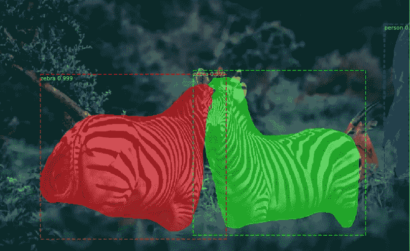
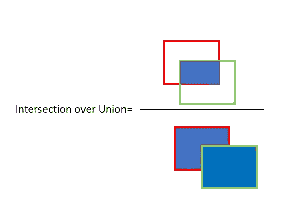
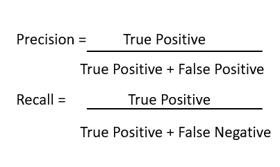
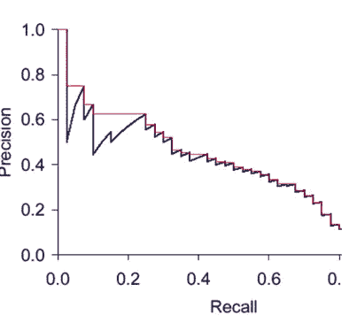
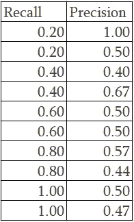
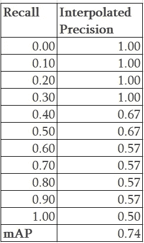
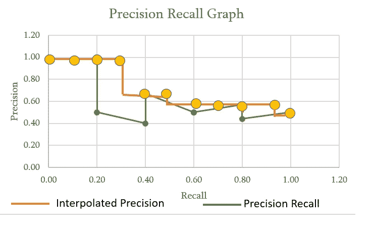
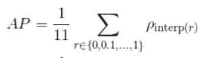
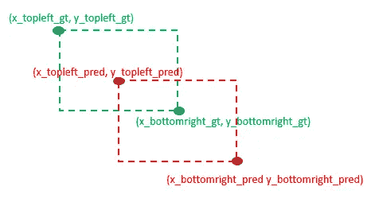

# 评估对象检测模型的性能

> 原文：<https://towardsdatascience.com/evaluating-performance-of-an-object-detection-model-137a349c517b?source=collection_archive---------0----------------------->

## 什么是地图？如何评价一个物体检测模型的性能？

在本文中，您将了解如何使用 mAP 来评估对象检测模型的性能。什么是地图？如何用 11 点插值计算 mAP？



对象检测和实例分割

我们使用机器学习和深度学习来解决回归或分类问题。

我们使用均方根(RMS)或平均百分比误差(MAPE)等。评估回归模型的性能。

使用准确度、精确度、召回率或 F1 分数来评估分类模型。

***是物体检测、分类还是回归问题？***

存在多种深度学习算法用于对象检测，如 RCNN:快速 RCNN、更快 RCNN、YOLO、掩模 RCNN 等。

**目标物体检测模型是为了**

*   **分类**:识别图像中是否存在物体以及物体的类别
*   **定位**:当图像中存在物体时，预测物体周围边界框的坐标。这里我们比较地面真实和预测边界框的坐标

我们需要评估在图像中使用包围盒的分类和定位的性能

***我们如何衡量物体检测模型的性能？***

对于对象检测，我们使用并集上的交集(IoU)的概念。IoU 计算两个边界框的并集上的交集；地面真实的边界框和预测的边界框



红色是真实边界框，绿色是预测边界框

**IoU 为 1 意味着预测边界框和实际边界框完全重叠。**

您可以为 IoU 设置一个阈值，以确定对象检测是否有效。

假设您将 IoU 设置为 0.5，在这种情况下

*   **如果 IoU ≥0.5，**将物体检测分类为**真阳性(TP)**
*   **如果 Iou <为 0.5** ，那么这是一次错误检测，将其归类为**假阳性(FP)**
*   **当图像中存在地面真实且模型未能检测到物体时，**将其归类为**假阴性(FN)。**
*   **真阴性(TN** ): TN 是图像中我们没有预测到物体的每个部分。这个度量对于对象检测没有用，因此我们忽略 TN。

将 IoU 阈值设置为 0.5 或更大。可以设置为 0.5，0.75。0.9 或 0.95 等。

使用精确度和召回率作为评估性能的指标。使用真阳性(TP)、假阳性(FP)和假阴性(FN)来计算精确度和召回率。



计算图像中所有对象的精度和召回率。

您还需要考虑图像中模型检测到的每个对象的置信度得分。考虑置信度得分高于某个阈值的所有预测边界框。高于阈值的边界框被认为是正边界框，低于阈值的所有预测边界框被认为是负边界框。

## **使用 11 点插值平均精度计算平均平均精度(mAP)**

***如何使用 11 点插值计算地图？***

**第一步:绘图精度和召回**

在精确度召回(PR)图上绘制精确度和召回值。PR 图是单调递减的，在精确度和召回率之间总是有一个权衡。增加一个会减少另一个。有时，由于某些例外和/或缺乏数据，PR 图并不总是单调递减的。



来源:[https://NLP . Stanford . edu/IR-book/html/html edition/evaluation-of-ranked-retrieval-results-1 . html](https://nlp.stanford.edu/IR-book/html/htmledition/evaluation-of-ranked-retrieval-results-1.html)

**第二步:计算平均精度(mAP)，使用 11 点插值技术。**

如上图所示，插值精度是在 0.0、0.1、0.2、0.3…0.9、1.0 等 11 个等距召回级别上测得的平均精度。

PR 图有时可能不是单调递减的，为了解决这个问题，我们为 recall 值设置了最大精度。从图形上看，在每个召回级别，我们用该召回级别右侧的最大精度值替换每个精度值，即:我们取所有未来点的最大值

基本原理是，如果精度和召回率都变得更好，人们愿意考虑更高的精度值。

最后计算测试集中每个信息在每个召回级别的插值精度的算术平均值。

mAP 总是在整个数据集上进行计算。

让我们以如下所示的例子来理解，召回值被排序，以便我们绘制 PR 图



样本精度和召回值

11 点插值将使用召回值精度的最高值。

我们创造了 11 个等间隔的回忆水平，分别是 0.0，0.1，0.2，0.3…0.9，1.0。

0.2 的召回具有最高精度值 1.00。0.4 的召回值具有不同的精度值 0.4、0.67、0.5。在这种情况下，我们使用最高精度值 0.67。当精度值为 0.6 时，我们的精度值为 0.5，但是对于 0.8 的召回，我们看到更高的精度值 0.57。基于 11 点插值的基本原理，我们取所有未来点的最大值，因此我们需要考虑的精度是 0.57，而不是 0.5。最后，对于 1.0 的召回，我们取最大精度 0.5。



现在绘制精度召回和插值精度。



我们最后应用平均精度公式



AP = 1/11(4 * 1.0+2 * 0.67+4 * 0.57+1 * 0.5)= 0.74

这给出了使用 11 点插值的平均精度

## 用于计算 Pascal VOC 数据格式地图的 Python 代码

**Pascal VOC 边界框由(*x-左上，y-左上，x-右下，y-右下* )** 定义

```
#GT Boxes
gt_boxes= {"img_00285.png": [[480, 457, 515, 529], [637, 435, 676, 536]]}#Pred Boxes
pred_boxs={"img_00285.png": {"boxes": [[330, 463, 387, 505], [356, 456, 391, 521], [420, 433, 451, 498], [328, 465, 403, 540], [480, 477, 508, 522], [357, 460, 417, 537], [344, 459, 389, 493], [485, 459, 503, 511], [336, 463, 362, 496], [468, 435, 520, 521], [357, 458, 382, 485], [649, 479, 670, 531], [484, 455, 514, 519], [641, 439, 670, 532]], "scores": [0.0739, 0.0843, 0.091, 0.1008, 0.1012, 0.1058, 0.1243, 0.1266, 0.1342, 0.1618, 0.2452, 0.8505, 0.9113, 0.972]}}
```

**导入所需的库**

```
import numpy as np
from copy import deepcopy
import pandas as pd
import matplotlib.pyplot as plt
import seaborn as sns
%matplotlib inline
```

**创建图像 id 和置信度得分的字典**

```
**def get_model_scores(pred_boxes):**
    """Creates a dictionary of from model_scores to image ids.
    Args:
        pred_boxes (dict): dict of dicts of 'boxes' and 'scores'
    Returns:
        dict: keys are model_scores and values are image ids (usually filenames)
    """
    model_score={}
    for img_id, val in pred_boxes.items():
        for score in val['scores']:
            if score not in model_score.keys():
                model_score[score]=[img_id]
            else:
                model_score[score].append(img_id)
    return model_score
```

**计算 Pascal VOC 格式边界框的 IoU**



Pascal VOC 边界框

```
**def calc_iou( gt_bbox, pred_bbox)**:
    '''
    This function takes the predicted bounding box and ground truth bounding box and 
    return the IoU ratio
    '''
    **x_topleft_gt, y_topleft_gt, x_bottomright_gt, y_bottomright_gt= gt_bbox**
    **x_topleft_p, y_topleft_p, x_bottomright_p, y_bottomright_p= pred_bbox**

    if (x_topleft_gt > x_bottomright_gt) or (y_topleft_gt> y_bottomright_gt):
        raise AssertionError("Ground Truth Bounding Box is not correct")
    if (x_topleft_p > x_bottomright_p) or (y_topleft_p> y_bottomright_p):
        raise AssertionError("Predicted Bounding Box is not correct",x_topleft_p, x_bottomright_p,y_topleft_p,y_bottomright_gt)

    #if the GT bbox and predcited BBox do not overlap then iou=0
    if(x_bottomright_gt< x_topleft_p):
        # If bottom right of x-coordinate  GT  bbox is less than or above the top left of x coordinate of  the predicted BBox

        return 0.0
    if(y_bottomright_gt< y_topleft_p):  # If bottom right of y-coordinate  GT  bbox is less than or above the top left of y coordinate of  the predicted BBox

        return 0.0
    if(x_topleft_gt> x_bottomright_p): # If bottom right of x-coordinate  GT  bbox is greater than or below the bottom right  of x coordinate of  the predcited BBox

        return 0.0
    if(y_topleft_gt> y_bottomright_p): # If bottom right of y-coordinate  GT  bbox is greater than or below the bottom right  of y coordinate of  the predcited BBox

        return 0.0

    **GT_bbox_area = (x_bottomright_gt -  x_topleft_gt + 1) * (  y_bottomright_gt -y_topleft_gt + 1)**
   ** Pred_bbox_area =(x_bottomright_p - x_topleft_p + 1 ) * ( y_bottomright_p -y_topleft_p + 1)**

    **x_top_left =np.max([x_topleft_gt, x_topleft_p])
    y_top_left = np.max([y_topleft_gt, y_topleft_p])
    x_bottom_right = np.min([x_bottomright_gt, x_bottomright_p])
    y_bottom_right = np.min([y_bottomright_gt, y_bottomright_p])**

    **intersection_area = (x_bottom_right- x_top_left + 1) * (y_bottom_right-y_top_left  + 1)**

    **union_area = (GT_bbox_area + Pred_bbox_area - intersection_area)**

    **return intersection_area/union_area**
```

**计算精度和召回**

```
**def calc_precision_recall(image_results):**
    """Calculates precision and recall from the set of images
    Args:
        img_results (dict): dictionary formatted like:
            {
                'img_id1': {'true_pos': int, 'false_pos': int, 'false_neg': int},
                'img_id2': ...
                ...
            }
    Returns:
        tuple: of floats of (precision, recall)
    """
    true_positive=0
    false_positive=0
    false_negative=0
    **for img_id, res in image_results.items():**
        **true_positive +=res['true_positive']
        false_positive += res['false_positive']
        false_negative += res['false_negative']**
        try:
            **precision = true_positive/(true_positive+ false_positive)**
        except ZeroDivisionError:
            precision=0.0
        try:
            **recall = true_positive/(true_positive + false_negative)**
        except ZeroDivisionError:
            recall=0.0
    return (precision, recall)
```

**返回单个图像的一批边界框的真阳性、假阳性和假阴性。**

```
**def get_single_image_results(gt_boxes, pred_boxes, iou_thr):**
    """Calculates number of true_pos, false_pos, false_neg from single batch of boxes.
    Args:
        gt_boxes (list of list of floats): list of locations of ground truth
            objects as [xmin, ymin, xmax, ymax]
        pred_boxes (dict): dict of dicts of 'boxes' (formatted like `gt_boxes`)
            and 'scores'
        iou_thr (float): value of IoU to consider as threshold for a
            true prediction.
    Returns:
        dict: true positives (int), false positives (int), false negatives (int)
    """
    all_pred_indices= range(len(pred_boxes))
    all_gt_indices=range(len(gt_boxes))
    if len(all_pred_indices)==0:
        tp=0
        fp=0
        fn=0
        return {'true_positive':tp, 'false_positive':fp, 'false_negative':fn}
    if len(all_gt_indices)==0:
        tp=0
        fp=0
        fn=0
        return {'true_positive':tp, 'false_positive':fp, 'false_negative':fn}

    gt_idx_thr=[]
    pred_idx_thr=[]
    ious=[]
    **for ipb, pred_box in enumerate(pred_boxes):
        for igb, gt_box in enumerate(gt_boxes):
            iou= calc_iou(gt_box, pred_box)**

           ** if iou >iou_thr**:
                gt_idx_thr.append(igb)
                pred_idx_thr.append(ipb)
                ious.append(iou)
    **iou_sort = np.argsort(ious)[::1]**
    if len(iou_sort)==0:
        tp=0
        fp=0
        fn=0
        return {'true_positive':tp, 'false_positive':fp, 'false_negative':fn}
    else:
        gt_match_idx=[]
        pred_match_idx=[]
        **for idx in iou_sort:
            gt_idx=gt_idx_thr[idx]
            pr_idx= pred_idx_thr[idx]**
            # If the boxes are unmatched, add them to matches
            **if(gt_idx not in gt_match_idx) and (pr_idx not in pred_match_idx)**:
                **gt_match_idx.append(gt_idx)
                pred_match_idx.append(pr_idx)**
        **tp= len(gt_match_idx)
        fp= len(pred_boxes) - len(pred_match_idx)
        fn = len(gt_boxes) - len(gt_match_idx)**
    **return {'true_positive': tp, 'false_positive': fp, 'false_negative': fn}**
```

**最后使用 11 点插值技术计算地图。**您可以在此指定 IoU 阈值，否则将使用默认值 0.5

```
**def  get_avg_precision_at_iou(gt_boxes, pred_bb, iou_thr=0.5):**

  **  model_scores = get_model_scores(pred_bb)**
    sorted_model_scores= sorted(model_scores.keys())# Sort the predicted boxes in descending order (lowest scoring boxes first):
    for img_id in pred_bb.keys():

        arg_sort = np.argsort(pred_bb[img_id]['scores'])
        pred_bb[img_id]['scores'] = np.array(pred_bb[img_id]['scores'])[arg_sort].tolist()
        pred_bb[img_id]['boxes'] = np.array(pred_bb[img_id]['boxes'])[arg_sort].tolist()pred_boxes_pruned = deepcopy(pred_bb)

    precisions = []
    recalls = []
    model_thrs = []
    img_results = {}# Loop over model score thresholds and calculate precision, recall
    for ithr, model_score_thr in enumerate(sorted_model_scores[:-1]):
            # On first iteration, define img_results for the first time:
        print("Mode score : ", model_score_thr)
        img_ids = gt_boxes.keys() if ithr == 0 else model_scores[model_score_thr]for img_id in img_ids:

            gt_boxes_img = gt_boxes[img_id]
            box_scores = pred_boxes_pruned[img_id]['scores']
            start_idx = 0
            for score in box_scores:
                if score <= model_score_thr:
                    pred_boxes_pruned[img_id]
                    start_idx += 1
                else:
                    break 
            # Remove boxes, scores of lower than threshold scores:
            pred_boxes_pruned[img_id]['scores']= pred_boxes_pruned[img_id]['scores'][start_idx:]
            pred_boxes_pruned[img_id]['boxes']= pred_boxes_pruned[img_id]['boxes'][start_idx:]# Recalculate image results for this image
            print(img_id)
            img_results[img_id] = get_single_image_results(gt_boxes_img, pred_boxes_pruned[img_id]['boxes'], iou_thr=0.5)# calculate precision and recall
        prec, rec = calc_precision_recall(img_results)
        precisions.append(prec)
        recalls.append(rec)
        model_thrs.append(model_score_thr)precisions = np.array(precisions)
    recalls = np.array(recalls)
    prec_at_rec = []
    for recall_level in np.linspace(0.0, 1.0, 11):
        try:
            args= np.argwhere(recalls>recall_level).flatten()
            prec= max(precisions[args])
            print(recalls,"Recall")
            print(      recall_level,"Recall Level")
            print(       args, "Args")
            print(       prec, "precision")
        except ValueError:
            prec=0.0
        prec_at_rec.append(prec)
    avg_prec = np.mean(prec_at_rec) 
    return {
        'avg_prec': avg_prec,
        'precisions': precisions,
        'recalls': recalls,
        'model_thrs': model_thrs}
```

## **参考文献:**

[](https://nlp.stanford.edu/IR-book/html/htmledition/evaluation-of-ranked-retrieval-results-1.html#tab:11-point) [## 分级检索结果的评估

### 下一节:评估相关性上一节:信息检索中的评估上一节:未分级检索内容的评估…

nlp.stanford.edu](https://nlp.stanford.edu/IR-book/html/htmledition/evaluation-of-ranked-retrieval-results-1.html#tab:11-point) 

[https://www . cl . cam . AC . uk/teaching/1415/infor trv/lecture 5 . pdf](https://www.cl.cam.ac.uk/teaching/1415/InfoRtrv/lecture5.pdf)

[https://medium . com/@ Jonathan _ hui/map-mean-average-precision-for-object-detection-45c 121 a 31173](https://medium.com/@jonathan_hui/map-mean-average-precision-for-object-detection-45c121a31173)