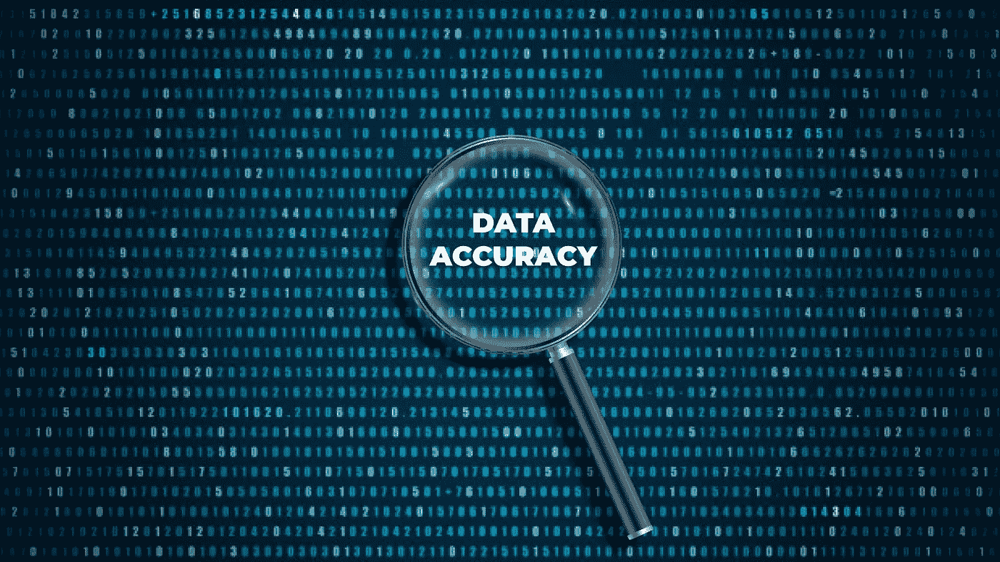
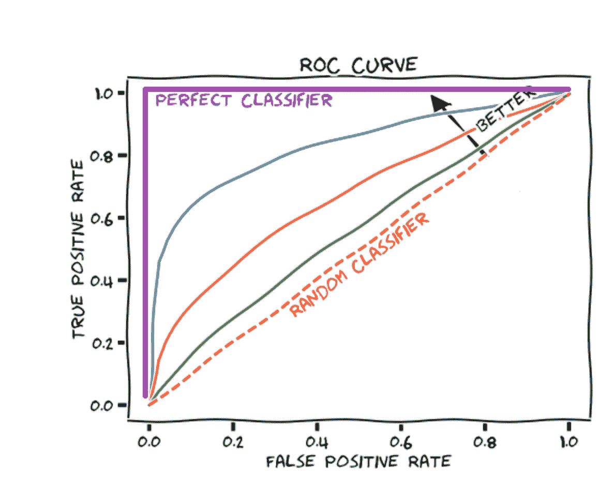
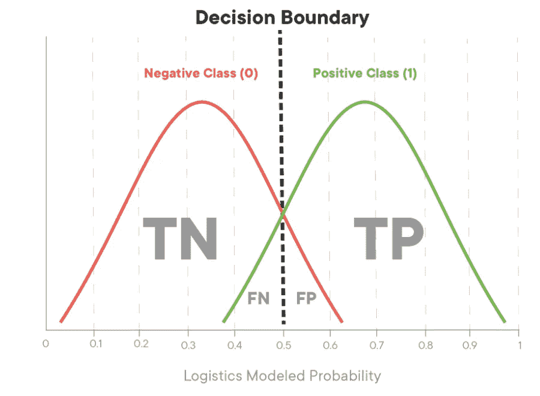
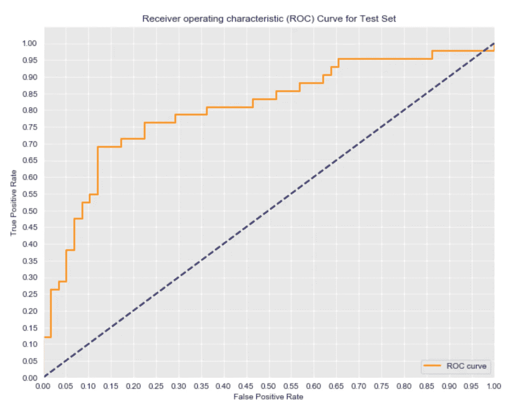

# 评估模型的性能

> 原文：<https://towardsdatascience.com/evaluating-performance-of-models-8d5c3ca6f8cf?source=collection_archive---------14----------------------->

## 你的逻辑回归或分类模型有多有效？



[图片来源:AIthority](https://www.aithority.com/guest-authors/why-data-accuracy-matters/)

在完成了一些逻辑回归和二元分类的数据科学项目后，我决定写更多关于评估我们的模型和采取步骤以确保它们高效准确地运行的内容。你可能有“好”的数据并且知道如何建立模型，但是如果你能够解释你的模型的效率，你就能够解释你的结果并且提供最终的商业决策！


图片来源:【giphy.com 

使用**回归**，我们预测连续变量，因此将误差作为我们的估计有多远的距离来讨论是有意义的。对于分类问题，我们正在处理二元变量，所以我们的模型不是对就是错。因此，当评估分类算法的性能时，我们检查一些特定的测量。

## 评估指标

1.  ***精度*** —衡量预测的精度。
2.  ***回忆*** *—* 表示我们感兴趣的类中有多少百分比被模型实际捕获。
3.  ***准确度*** 大概是最直观的度量。我们用它来衡量一个模型正确预测的总数，包括真正的正面和真正的负面。
4.  **F1 分数**是一个度量，它同时考虑了精确度和召回率来计算分数。它可以被解释为精度和召回值的加权平均值，并且在精度和召回值都不高的情况下不可能高。当一个模特的 F1 分数很高时，你知道你的模特在各方面都做得很好。

**示例:**预测某个员工是否被聘用(活动)。在这个项目中，我们理想地预测候选人是否适合公司。

*Precision:* “在模型显示有人被雇佣的所有次数中，有多少次被讨论的雇员实际上在“牙科魔术”工作？"

*回想一下:*“在我们看到的所有实际被雇佣的员工中，我们的模型正确识别出他们中有多少人是在职的？”

精确度和召回率成反比关系。一个上升，另一个就会下降。

## 精确比回忆好吗？

这是一个经典的数据科学问题。什么是更好的假阳性或假阴性？答案是“视问题而定”，可以测试你的批判性思维能力。让我们来看一个新的例子。

检测信用卡欺诈，**假阳性**将是当我们的模型将交易标记为欺诈，但它不是。这导致了一个稍微恼火的顾客。**假阴性**可能是一种欺诈性交易，一家公司错误地将其视为正常的消费者行为。在这种情况下，信用卡公司可能会因为错过交易欺诈的迹象而向客户偿还数千美元而陷入困境！尽管错误从来都不是理想的，但信用卡公司倾向于将他们的模型构建得有点过于敏感是有道理的，因为高召回率比高精度分数能为他们节省更多的钱。

让我们来分析一下我们的 HR 例子。我们的模型想要预测一个人是否适合“受雇与未受雇”的公司。在这种情况下，我们希望两者都很低:假阴性和假阳性。作为一名人力资源员工，我们希望误报率高于漏报率，原因如下。由于误报率较高，我们的模型预测我们的候选人非常适合，而实际上他们并不适合…这只是候选人的第一轮面试扫描，我们宁愿浏览更多的简历，也不愿错过一个潜在的优秀候选人。最终的雇佣决定来自一个人的最终决定。

## 受试者工作特征曲线

在评估模型时，我们希望可视化 ROC 曲线。说明了我们的分类器的**真阳性率**与**假阳性率**。真实阳性率是回忆的另一个名称，它是真实阳性预测与所有实际阳性值的比率。

*   TPR = TP/(TP+FN)

假阳性率是假阳性预测与实际为阴性的所有值的比率。

*   FPR = FP/(FP+TN)

如果 TPR 是我们的 y 轴，FPR 是我们的 x 轴，我们希望我们的 ROC 曲线紧靠图表的左侧，这意味着 TPR 越高，FPR 越低。



图片来源:[测量性能参考](https://glassboxmedicine.com/2019/02/23/measuring-performance-auc-auroc/)

## 判别边界

逻辑回归模型产生每个观察的特定类的概率。想象它如下图所示:



图片来源:统计学习入门。加雷思·詹姆斯 [特雷弗·哈斯蒂](https://www.chegg.com/authors/trevor-hastie) [罗伯特·蒂布拉尼](https://www.chegg.com/authors/robert-tibshirani) [丹妮拉·威滕](https://www.chegg.com/authors/daniela-witten)

如果我们改变截止点，将会牺牲精度，增加 FPR 以增加 TPR，反之亦然。将判定边界从 0.5 向左移动将导致捕获更多的正类(1)情况。它还会拾取一些假阳性(在阴性(0)病例分布的最右边的红色病例)。

ROC 较差的模型在两个类别的概率估计中可能有很大的重叠。这将表明我们的模型很难将这两个类分开。

让我们看一个例子:

```
*#Import roc_curve, auc*
from sklearn.metrics import roc_curve, auc*#Calculate the probability scores of each point in the training set*
**y_train_score** = model_log.decision_function(X_train)*# Calculate the fpr, tpr, and thresholds for the training set*
**train_fpr, train_tpr, thresholds** = roc_curve(y_train, y_train_score)*#Calculate the probability scores of each point in the test set*
**y_test_score** = model_log.decision_function(X_test)*#Calculate the fpr, tpr, and thresholds for the test set*
**test_fpr, test_tpr, test_thresholds** = roc_curve(y_test, y_test_score)
```

使用 Matplotlib，我们希望可视化我们的 ROC 曲线:

```
plt.plot(test_fpr, test_tpr, color='darkorange', lw=lw, label='ROC curve')
```



图片来源:[米歇尔维纳布尔斯— Github/HR_Project](https://github.com/michellevenables1/HR_project)

如左图所示，您可以看到我们的分类模型 TPR vs FPR。想一想这个模型的场景:预测员工在公司内的适合度。如果您将当前模型调整为具有 76%的真阳性率(您仍然错过了 29%的合适者)，那么假阳性率是多少？

当 TPR = 75%时，FPR 为 22%。真实阳性率决定了被正确识别为合适的在职员工的百分比。同时，这有一个接近 0.25 的 FPR，这意味着大约有四分之一的情况下，我们错误地警告一个员工是一个很好的人选，而他们实际上表现不佳。

**测试 AUC** : 0.8041

分类器的总体准确性可以通过 AUC(曲线下的**面积)来量化。完美的分类器将具有 1.0 的 AUC 分数，而 0.5 的 AUC 毫无价值。这里我们有 0.80 的 AUC，这似乎是准确的。**

## 参考资料:

*   统计学习导论。加雷思·詹姆斯 [特雷弗·哈斯蒂](https://www.chegg.com/authors/trevor-hastie) [罗伯特·提布拉尼](https://www.chegg.com/authors/robert-tibshirani) [丹妮拉·威滕](https://www.chegg.com/authors/daniela-witten)
*   米歇尔维纳布尔斯— [Github](https://github.com/michellevenables1/HR_project)