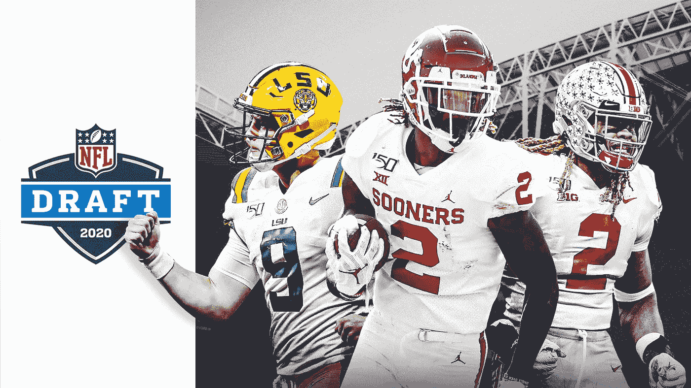
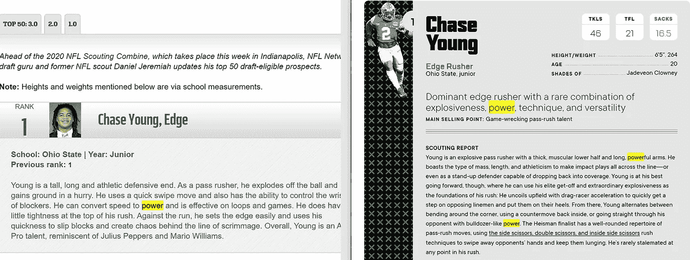
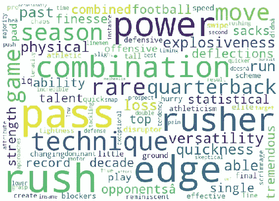
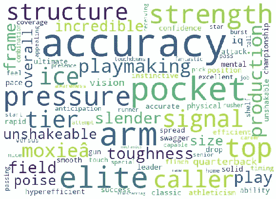
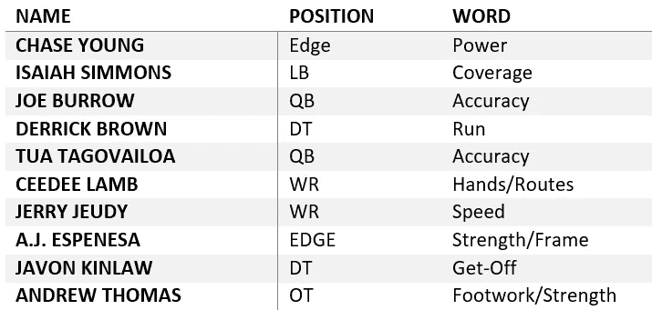
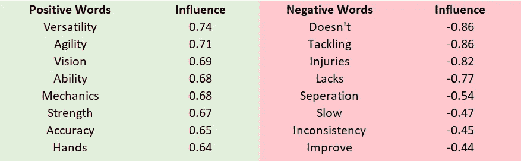
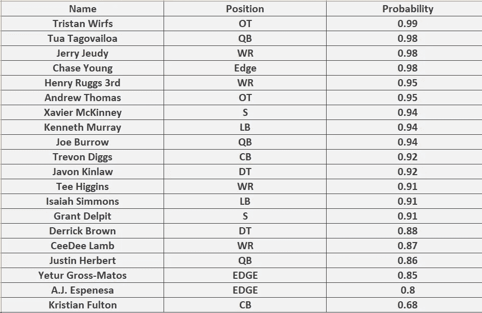
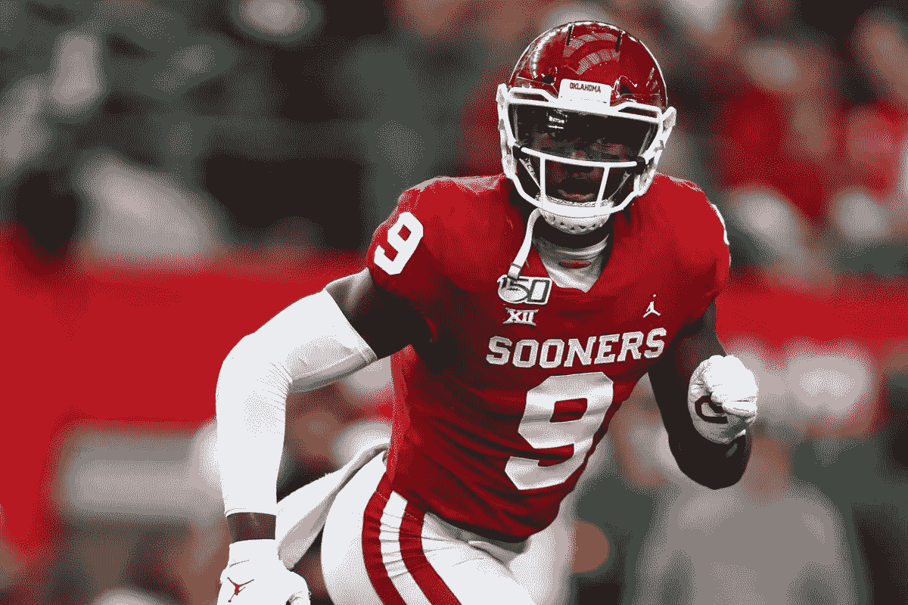
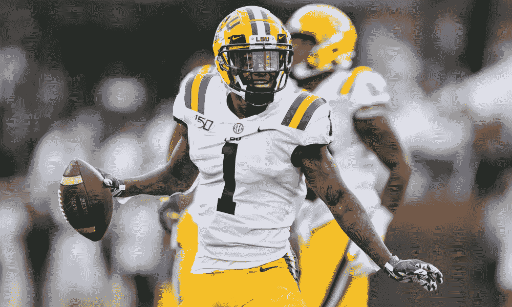

# 使用 NLP 评估 2020 年 NFL 选秀课程

> 原文：<https://towardsdatascience.com/evaluating-the-2020-nfl-draft-class-using-nlp-dc77513cbffe?source=collection_archive---------35----------------------->

## 自然语言处理(NLP)用于识别运动员身上最突出的品质，并确定每个运动员被谈论的程度。

摄影:SNIllustration/Getty Images

在 3 周的时间里，全美橄榄球联盟的球队将决定谁将是未来的球队。为了这一夜，我们投入了数小时的工作，以确保球队能选出所需的合适球员。NFL 选秀是非常不可预测的，球队选秀时没有人看到球员来到球队进行交易，试图在选秀中获得一名运动员，他将成为选秀的抢手货。2017 年，芝加哥熊队抓住了这个机会，给了旧金山 49 人队 4 个选秀权，以提升到第二顺位，他们选中了米切尔·特鲁比斯基(他们认为会是抢断的球员)。几个选秀权之后，一个叫帕特里克·马霍斯的四分卫被拿下了。回到今天，Patrick Mahomes 是 MVP，超级碗冠军四分卫，而 Trubisky 正在芝加哥争夺首发位置。征兵有时会非常残酷。

## 模拟草稿和 NLP

选秀中的大学生球员被放在显微镜下观察，并被球探部门一路分析，直到选秀之夜。因为这是足球界最重要的夜晚之一，许多足球分析家写下他们对这些球员的评论，并制作模拟草稿来模拟他们认为选秀会如何进行。分析师的观点往往是相互矛盾的，那么你信任哪一个来评价某个球员呢？全部都用怎么样。使用自然语言处理(NLP)，我们将使用所有可以找到的分析评论和模拟草稿来评估顶级草稿前景。

# 评估#1:是什么让运动员脱颖而出

选秀中的每个运动员都有独特的品质。这些品质在战场上展示出来时，常常被分析家们所称赞。因此，结合使用分析师评论和模拟草案，我们将找到使每个运动员脱颖而出的品质。为了做到这一点，NLP 将被用来找到在评论中出现最多的品质。

让蔡斯·杨脱颖而出的一点是，与他位置上的其他球员相比，他的力量

出于数据科学的目的，自然语言处理通常用于语音和文本。它变得越来越受欢迎，最明显的形式是 Siri、谷歌家园和亚马逊回声。这导致了许多库的创建，我们可以用它们来使 NLP 更容易编码。一个非常重要的库是 NLTK 库。这个库有能力阅读一个句子，并确定哪些单词是名词、形容词、动词等。这对我们来说很重要，因为我们不想要任何词语，我们想要描述每个运动员和他们比赛风格的词语。这就是为什么评论中只保留形容词和动词的原因。

为了找出这些单词中哪一个出现得最多，每个运动员都使用一个简单的字典。字典中的关键值是所有评论中的唯一单词，这些值是这些单词出现的频率。单词云将用于可视化这些品质，单词越大，出现的频率越高。

# 单词云

## 1.追逐年轻，边缘

蔡斯·杨无疑是选秀中最好的防守球员。只是在云这个词里看到了一些让他成为最优秀的品质。年轻是一个强大的冲锋派。他控球出色，是一名出色的组合型球员，擅长跑位和传球。分析师们也看到了这一点，因为在他们的分析中，这些关键词经常被用来描述杨，导致这些关键词成为他的一些顶级品质，使他脱颖而出。

## 2.QB 乔·伯罗

也许是大学橄榄球历史上最伟大的四分卫赛季。乔·伯罗被一致认为是选秀中的第一顺位。他所拥有的使他成为一名优秀传球手的品质包括他高超的准确性，出色的口袋表现，以及他在比赛中面对艰难情况下的压力的能力。这在之前的全国冠军赛中出现过，当时伯罗将带领路易斯安那州立大学赢得全国冠军。

通过发现球员分析中最常见的特征，你甚至不用看就能对球员的实力有一个很好的了解。例如，下面列出了在选秀中用来描述一些顶级潜在客户的最常用词。仅仅通过观察描述每个球员的一两个词，你就能了解那个球员是什么样的。

# 评估#2:利大于弊吗

对大学生运动员的每一项分析都包括他们的优势和劣势。这很好地评估了运动员在赛场上是资产还是负债，这也是我们进一步评估这些运动员的方法。

情感分析是指使用自然语言处理和文本分析来识别主观信息。一个广泛使用的情感分析的例子是垃圾邮件检测。当您收到带有与垃圾邮件相关的关键字的电子邮件时，垃圾邮件检测会将该电子邮件归类为垃圾邮件，并将其放入垃圾邮件文件夹。对情绪分析的基本理解就是我们如何评估这些运动员。鉴于他们的评论，我们将创建一个模型，输出对运动员的评论是积极的而不是消极的概率。概率越高，运动员被谈论的话题就越多。

## 模型

该模型将是用于分类的逻辑回归模型。这个模型的输入是每个运动员的所有评论。为了确定评论的积极程度或消极程度，该模型将在足球的多个利弊评论上进行训练。实际上，所有的肯定句都用 1 表示，否定句用 0 表示。然后，该模型将评估哪些词对正面评论的反应最大，哪些词对负面评论的反应最大。下面的单词列表是正面/负面评论的最大单词指示器。数字越高，这个词的影响力越大。

在模型被训练之后，我们现在可以将我们的运动员和他们的评论输入到模型中，以真实地查看他们的优点是否超过他们的缺点。

模型的输出

## 分析

计划参加第一轮选秀的 20 名运动员被输入到模型中。输出是他们各自的正面评论比负面评论多的概率。这些结果是我们从一些最好的大学生运动员那里得到的。大多数可能性非常高，因为这些运动员是他们级别中的佼佼者，他们的优势远远超过他们的劣势。然而，在这个列表中有一些惊喜。首先，概率排名最高的运动员不是蔡斯·杨或乔·伯罗，而是特里斯坦·沃夫斯，他是爱荷华大学的一名进攻型铲球手。回顾他的一些评论，他得到了很高的评价，很少有人批评他的进攻铲球。其次，也许是最令人惊讶的是，乔·伯罗甚至不是这份名单上评价最高的四分卫。阿拉巴马州的四分卫图阿·塔戈瓦洛亚。图阿已经为 NFL 做好准备有一段时间了，作为阿拉巴马州的领导者，是他被积极谈论的一个主要原因。另一方面，陋居度过了不可思议的一年，而不是几年。由于他是预计的第一顺位，人们自然会谈论他缺乏什么，导致他的概率低于图阿。在我看来，陋居比图阿更好，但也许差距比人们想象的要小得多，正如通过模型看到的证据。

# 偷和半身像的草案

## 抢断:肯尼斯·默里，LB

马修·埃蒙斯摄于[美国今日体育](https://www.usatoday.com/sports/)

肯尼斯·默里是俄克拉荷马捷足者队的后卫。他是一个充满活力的闪击手，有着在第二场比赛中表现出来的运动能力。在许多模拟选秀中，穆雷被预测为第三后卫。许多人认为他在第一轮的得分在 20 以上。我相信他会成为选秀的抢手货。当我们的模型运行时，穆雷是最高评级的后卫，这意味着与他的缺点相比，他有最高的上升空间。分析家们谈论的主要品质是他的运动能力。今天的后卫被要求做得越来越多，尤其是在报道 NFL 如何转变为一个主要传球联盟方面。我相信这是穆雷将会发光的地方，成为像卢克·库切利一样的统治性内线后卫。

## 半身像:克里斯蒂安·富尔顿，CB

[运动员](https://theathletic.com/1488680/2019/12/26/lsu-football-cornerback-kristian-fulton-journey/)的布罗迪·米勒的照片

克里斯蒂安·富尔顿是路易斯安那州立大学的角卫。富尔顿预计将在第一轮被选中，但我相信他会成为选秀的焦点。当模型为富尔顿运行时，输出仅为 0.68，是所有被测试运动员中最低的。这表明他被正面谈论，但他的缺点经常出现在他的分析中。这些缺陷表明他不是一个强硬/身体素质好的球员。我相信，由于他是国家队的首发队员，这可能会提高他的股票。自从路易斯安那州立大学击败了他们所有的竞争对手后，他可能表现得很好。但当克莱姆森之间的全国冠军赛(一场非常激烈的比赛)到来时，富尔顿在覆盖顶级竞争对手方面苦苦挣扎。

# 结论

花在评估这些运动员身上的时间可能有 100 多个小时。在任何团队中，找到合适的运动员来填补合适的空缺都需要付出很多努力。有这么多关于运动员应该是谁的意见，自然语言处理给了我们一个解决方案来听取每个人的意见。这只是我们可以做的又一个评估，以进一步分析这些运动员，希望找到谁将是 NFL 的下一个明星。

## 参考

[1] D. Jeremiah，[丹尼尔-Jeremiah 排名前 50: 2020 NFL 选秀前景排名 2.0](http://www.nfl.com/news/story/0ap3000001102767/article/daniel-jeremiahs-top-50-2020-nfl-draft-prospect-rankings-20) (2020)，http://www.nfl.com/news/story/0ap3000001102767/article/丹尼尔-Jeremiah-Top-50-2020-NFL-Draft-prospect-rankings-20

[2] K. Hanson， [2020 年 NFL 选秀前景排名:大板 100 强](https://www.si.com/nfl/2020/03/19/draft-big-board-top-100-prospects) (2020)，https://www . si . com/NFL/2020/03/19/Draft-Big-Board-Top-100-prospects

[3] V. Iyer，[NFL Draft prospects 2020:Big board of the top 100 players total&按位置排名](https://www.sportingnews.com/ca/nfl/news/nfl-draft-prospects-2020-big-board-top-100-players/rpxsao3p9a0z16jk9e80julb8) (2020)，https://www.sportingnews.com/ca/nfl/news/ NFL-Draft-prospects-2020-Big-board-top-100-players/rpx Sao 3p 9 a 0 z 16 JK 9 e 80 julb 8

[4] D .凯利， [2020 NFL 指导线](https://nfldraft.theringer.com/) (2020)，https://nfldraft.theringer.com/

[5]阵容，[阵容 2020 NFL 选秀指南](https://www.lineups.com/articles/nfl-draft-guide-2020-profiling-the-top-50-nfl-prospects/) (2020)，https://www.lineups.com/articles/NFL-Draft-Guide-2020-profiling-the-top-50-NFL-prospects/

[6]今日美国，[NFL 2020 年选秀:竞争者如何解决顶级前景的突出需求](https://www.usatoday.com/story/sports/nfl/2020/04/01/nfl-draft-2020-team-needs-eagles-cowboys-patriots/5092924002/) (2020)，https://www.usatoday.com/story/sports/nfl/2020/04/01/NFL-draft-2020-团队需求-老鹰-牛仔-爱国者/5092924002/

[7] B .米勒，[LSU CB 克里斯蒂安富尔顿](https://theathletic.com/1488680/2019/12/26/lsu-football-cornerback-kristian-fulton-journey/) (2020)漫长、奇特、几乎不为人知的旅程，https://theahlettic . com/1488680/2019/12/26/LSU-football-cornerback-克里斯蒂安-富尔顿-journey/