# 评估我的视频搜索引擎的准确性

> 原文：<https://towardsdatascience.com/evaluating-the-accuracy-of-my-video-search-engine-1235f375bd5?source=collection_archive---------43----------------------->

## 我训练了一个 ResNet-50 模型，让它在一个视频帧中找到一个乒乓球。我的模型好吗，或者我只是训练了一个“白色斑点”检测器？

在[我在“视频搜索引擎”](/the-video-search-engine-my-journey-into-computer-vision-9789824e76bb)上的帖子之后的几个星期里，我兴奋地向任何愿意听的人展示我的进步。

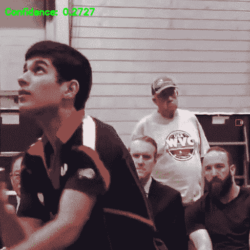

当 ML 社区的朋友们认为这很棒时，一个问题困扰着我，

> 我的模型好吗？
> 
> 我刚刚训练了一个白色斑点探测器吗？

有时我的模特会发现一个乒乓球，我会高兴地大叫。但其他时候，模型是在推断球员短裤上的乒乓球，光头，等等。没什么了不起的。

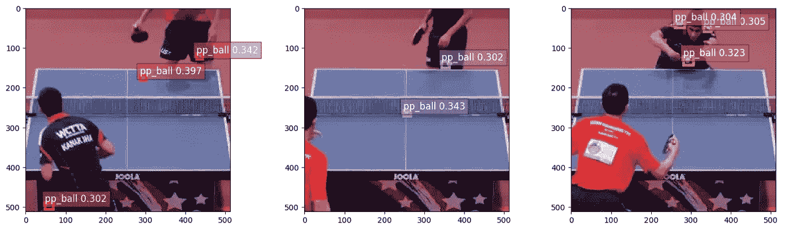

我旅程的下一步是测量模型的准确性。

使用平均精度(mAP)的变量来测量对象检测精度。有无数的[帖子](https://www.pyimagesearch.com/2016/11/07/intersection-over-union-iou-for-object-detection/)描述了这一指标的变体，所以我不会在这里赘述。但是有必要总结一下将在下面的代码示例中出现的要点。

# 背景和方法

[Mean average Precision(mAP)](https://blog.zenggyu.com/en/post/2018-12-16/an-introduction-to-evaluation-metrics-for-object-detection/)是每个类的*平均精度* (AP)的平均值，其被测量为每个类的精度-召回曲线下的面积:

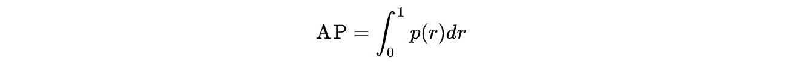

假设一个物体检测器可以识别 20 个不同的类别。地图计算每个类的平均精度，然后对结果进行平均。

因此，我们需要为给定的*召回*值计算*精度*:

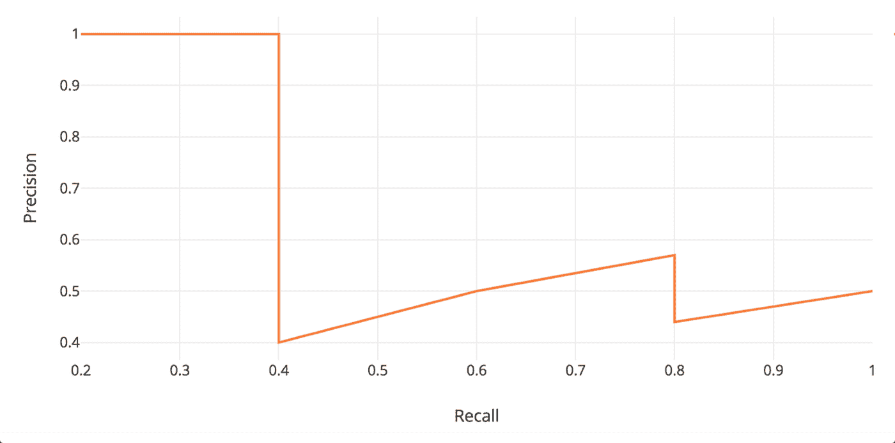

然后测量精确-召回对的曲线下的面积。为了简单起见，精确召回曲线的之字形被平滑了，就像这样:

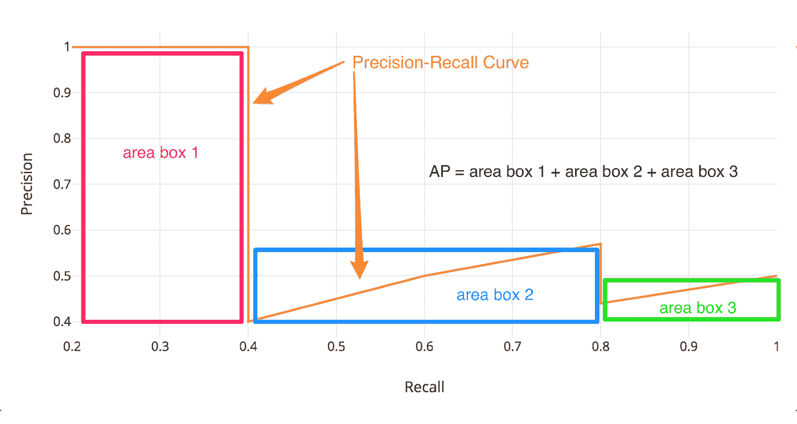

因此，我们需要计算精度和召回率。这些公式信息丰富:

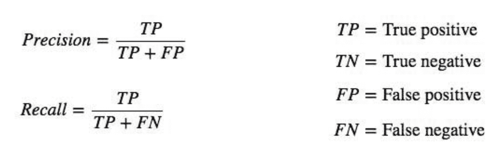

其中*精度*指的是准确度(所有预测中正确的预测的百分比)，而*召回*指的是真阳性率(真阳性与所有真实阳性的比率)。

在 [PASCAL VOC challenge](http://host.robots.ox.ac.uk/pascal/VOC/voc2012/htmldoc/devkit_doc.html#SECTION00054000000000000000) (包括基准对象检测模型的评估指标)中，如果 IoU 大于或等于 0.5 ，则**预测为真。小于 0.5 的 IoU 是“误报”(就像[重复的边界框](/breaking-down-mean-average-precision-map-ae462f623a52))。**

IoU 是一种评估指标，用于计算地面实况边界框和预测边界框之间的重叠。来自 Jonathan Hui 的这张图是一个精彩的总结:

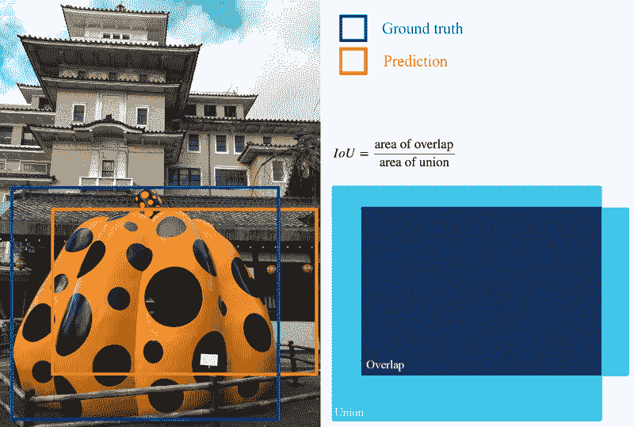

IoU 相当[容易计算](https://www.pyimagesearch.com/2016/11/07/intersection-over-union-iou-for-object-detection/):

*   在分子中，我们计算预测边界框和真实边界框之间的重叠区域。
*   分母是联合区域，由预测边界框和实际边界框包围。
*   将重叠面积除以并集面积得到分数“交集超过并集”。

现在我们有了计算我的模型准确性所需的一切。以下部分显示了实现上述步骤的代码片段。

# 我的视频搜索引擎的平均精度

我们从导入本例所需的包开始:

```
# import the necessary packages
import json
import os
import boto3
from collections import namedtuple
import cv2
import matplotlib.image as mpimg
import pandas as pd
# set Pandas table options for viewing data on screen
pd.set_option(‘display.max_columns’, 500)
pd.set_option(‘display.width’, 1000)
```

遵循 [Adrian Rosebrock 的示例](https://www.pyimagesearch.com/2016/11/07/intersection-over-union-iou-for-object-detection/)，我们定义一个将存储三个属性的检测对象:

*   `image_path`:驻留在磁盘上的输入图像的路径。
*   `gt`:地面实况包围盒。
*   `pred`:来自我们模型的预测包围盒。

然后我们创建一个函数来计算并集上的交集:

```
# Define the `Detection` object
Detection = namedtuple("Detection", ["image_path", "gt", "pred"])def bb_intersection_over_union(boxA, boxB):
  # determine the (x, y)-coordinates of the intersection rectangle
  xA = max(boxA[0], boxB[0])
  yA = max(boxA[1], boxB[1])
  xB = min(boxA[2], boxB[2])
  yB = min(boxA[3], boxB[3])
  # compute the area of intersection rectangle
  interArea = max(0, xB - xA + 1) * max(0, yB - yA + 1)
  # compute the area of both the prediction and ground-truth
  # rectangles
  boxAArea = (boxA[2] - boxA[0] + 1) * (boxA[3] - boxA[1] + 1)
  boxBArea = (boxB[2] - boxB[0] + 1) * (boxB[3] - boxB[1] + 1)
  # compute the intersection over union by taking the intersection
  # area and dividing it by the sum of prediction + ground-truth
  # areas - the interesection area
  iou = interArea / float(boxAArea + boxBArea - interArea)
  # return the intersection over union value
  return ioudef bb_intersection_over_union(boxA, boxB):
 # determine the (x, y)-coordinates of the intersection rectangle
 xA = max(boxA[0], boxB[0])
 yA = max(boxA[1], boxB[1])
 xB = min(boxA[2], boxB[2])
 yB = min(boxA[3], boxB[3])
 # compute the area of intersection rectangle
 interArea = max(0, xB - xA + 1) * max(0, yB - yA + 1)
 # compute the area of both the prediction and ground-truth
 # rectangles
 boxAArea = (boxA[2] - boxA[0] + 1) * (boxA[3] - boxA[1] + 1)
 boxBArea = (boxB[2] - boxB[0] + 1) * (boxB[3] - boxB[1] + 1)
 # compute the intersection over union by taking the intersection
 # area and dividing it by the sum of prediction + ground-truth
 # areas - the interesection area
 iou = interArea / float(boxAArea + boxBArea - interArea)
 # return the intersection over union value
 return iou
```

理想情况下，我们对验证集中的每个图像重复这种计算。因此，让我们通过(1)遍历每个验证图像来构建检测元组的数组；(2)调用对象检测端点；以及(3)存储预测边界框、地面实况边界框和图像路径的结果。这就完成了工作:

```
for filename in os.listdir(directory):
 if filename.endswith(".png"):
  file_with_path = (os.path.join(directory, filename))
  img = mpimg.imread(file_with_path)
  height = img.shape[0]
  width = img.shape[1]
  with open(file_with_path, 'rb') as image:
   f = image.read()
   b = bytearray(f)
   ne = open('n.txt', 'wb')
   ne.write(b)response = runtime_client.invoke_endpoint(EndpointName=endpoint_name, ContentType='image/png', Body=b)
  result = response['Body'].read().decode('ascii')
  detections = json.loads(result)
  best_detection = detections['prediction'][0] # ordered by max confidence; take the first one b/c only one ping pong ball in play ever
  print(best_detection)(klass, score, x0, y0, x1, y1) = best_detection
  xmin = int(x0 * width)
  ymin = int(y0 * height)
  xmax = int(x1 * width)
  ymax = int(y1 * height)
  pred_pixels = [xmin, ymin, xmax, ymax]
  gt_pixels = find_gt_bbox_for_image(annotation_filename, filename)
  det = Detection(filename, gt_pixels, pred_pixels)
  det_array.append(det)
  mAP_df.loc[filename, 'Confidences'] = score
  continue
 else:
  continue
```

请注意，上面的代码片段通过使用图像文件名作为关键字引用 annotations.json 文件来获取基本事实边界框，使用如下方式:

```
def find_gt_bbox_for_image(annotation_filename, image_filename):
 with open(annotation_filename) as f:
  js = json.load(f)
  images = js['images']
  categories = js['categories']
  annotations = js['annotations']
  for i in images:
   if i['file_name'] == image_filename:
    line = {}
    line['file'] = i['file_name']
    line['image_size'] = [{
     'width': int(i['width']),
     'height': int(i['height']),
     'depth': 3
    }]
    line['annotations'] = []
    line['categories'] = []
    for j in annotations:
     if j['image_id'] == i['id'] and len(j['bbox']) > 0:
      line['annotations'].append({
       'class_id': int(j['category_id']),
       'top': int(j['bbox'][1]),
       'left': int(j['bbox'][0]),
       'width': int(j['bbox'][2]),
       'height': int(j['bbox'][3])
      })
      class_name = ''
      for k in categories:
       if int(j['category_id']) == k['id']:
        class_name = str(k['name'])
      assert class_name is not ''
      line['categories'].append({
       'class_id': int(j['category_id']),
       'name': class_name
      })
    if line['annotations']:
     x0 = line['annotations'][0]['left']
     y0 = line['annotations'][0]['top']
     x1 = int(line['annotations'][0]['left'] + line['annotations'][0]['width'])
     y1 = int(line['annotations'][0]['top'] + line['annotations'][0]['height'])
     gt = [x0, y0, x1, y1]
 return gt
```

现在让我们取检测数组`det_array`中的每个`Detection`元组，并计算它的 IoU，此外还输出一个图像供我们检查:

```
for detection in det_array:
 # load the image
 image_with_path = (os.path.join(directory, detection.image_path))
 image = cv2.imread(image_with_path)
 # draw the ground-truth bounding box and predicted bounding box
 cv2.rectangle(image, tuple(detection.gt[:2]),
  tuple(detection.gt[2:]), (0, 255, 0), 1)
 cv2.rectangle(image, tuple(detection.pred[:2]),
  tuple(detection.pred[2:]), (0, 0, 255), 1)
 # compute the intersection over union and display it
 iou = bb_intersection_over_union(detection.gt, detection.pred)
 mAP_df.loc[detection.image_path, 'IoU'] = iou # add to df for PR-curve calc.
 cv2.putText(image, "IoU: {:.4f}".format(iou), (10, 30),
  cv2.FONT_HERSHEY_SIMPLEX, 0.6, (0, 255, 0), 2)
 print("{}: {:.4f}".format(detection.image_path, iou))
 if not cv2.imwrite('./IoU/{}'.format(detection.image_path), image):
  raise Exception("Could not write image")
```

下面是上面脚本中的一个示例图像:

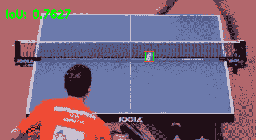

但是我们的工作还没有完成。我们仍然需要计算精确回忆曲线，并测量曲线下的面积。[根据谭](/breaking-down-mean-average-precision-map-ae462f623a52)的这个例子，我做了一个熊猫表，按照各自的推理得分排序。我承认熊猫对于这个简单的任务来说火力太大了，但是我想在这篇文章中利用熊猫的表格布局和可视化:

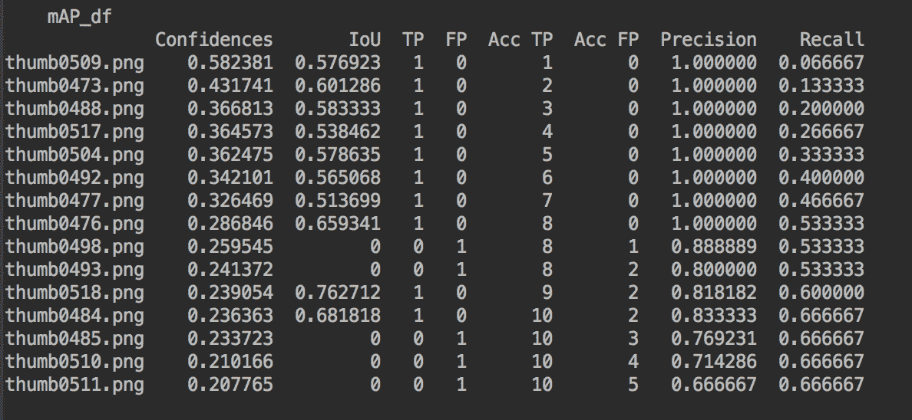

让我们通过在上面的`det_array`中的每次迭代期间将 IoU 结果存储在具有 image_path 索引的数据帧中来计算精度召回表:

```
mAP_df.loc[detection.image_path, 'IoU']
```

然后，我们可以根据置信度对数据帧进行排序:

```
mAP_df = mAP_df.sort_values(by='Confidences', ascending=False)
```

并计算数据帧中每一行的真阳性、假阳性、精度和召回值:

```
def calc_TP(row):
 iou = row['IoU']
 if iou >= 0.5:
  result = 1
 else:
  result = 0
 return resultdef calc_FP(row):
 iou = row['IoU']
 if iou < 0.5:
  result = 1
 else:
  result = 0
 return resultmAP_df['TP'] = mAP_df.apply(calc_TP, axis=1)
mAP_df['FP'] = mAP_df.apply(calc_FP, axis=1)
mAP_df['Acc TP'] = mAP_df['TP'].cumsum(axis=0)
mAP_df['Acc FP'] = mAP_df['FP'].cumsum(axis=0)def calc_Acc_Precision(row):
 precision = row['Acc TP'] / (row['Acc TP'] + row['Acc FP'])
 return precisiondef calc_Acc_Recall(row):
 recall = row['Acc TP'] / (mAP_df.count()[0])
 return recallmAP_df['Precision'] = mAP_df.apply(calc_Acc_Precision, axis=1)
mAP_df['Recall'] = mAP_df.apply(calc_Acc_Recall, axis=1)
```

这个方便的绘图函数揭示了 PR 曲线，考虑到我有限的验证示例数量，它看起来相当不足:

```
import matplotlib.pyplot as plt
mAP_df.plot(kind='line',x='Recall',y='Precision',color='red')
plt.show()
```

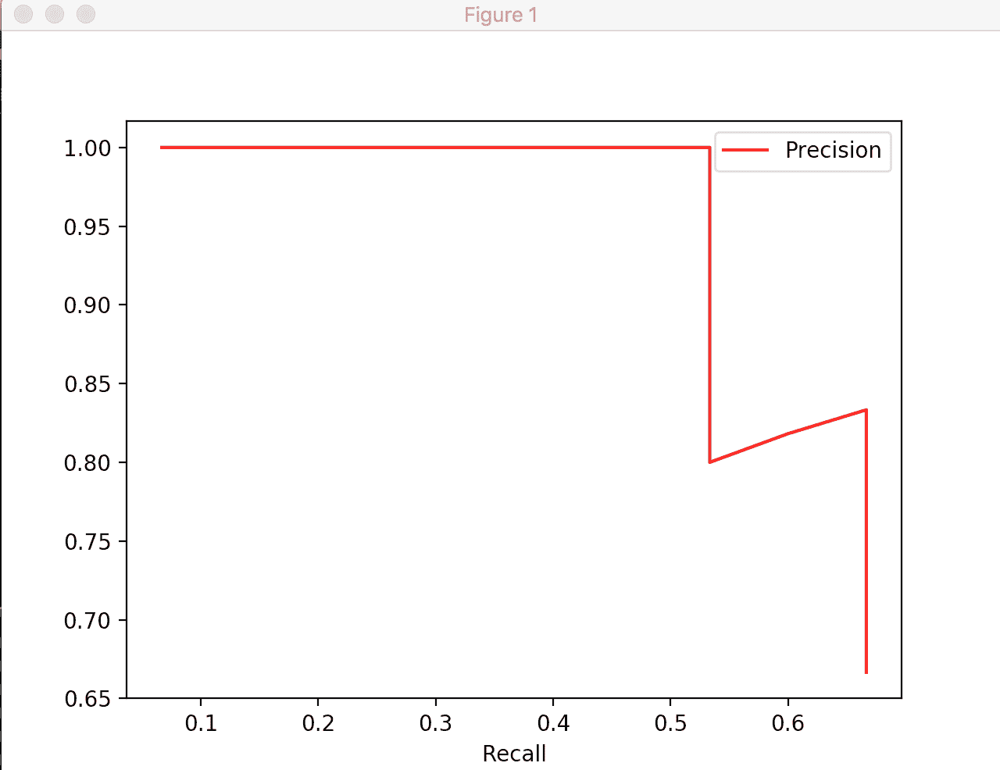

剩下的就是计算曲线下的面积了。该函数在给定一系列(x，y)坐标的情况下执行数值积分:

```
def calc_PR_AUC(x, y):
   sm = 0
   for i in range(1, len(x)):
       h = x[i] - x[i-1]
       sm += h * (y[i-1] + y[i]) / 2return smcalc_PR_AUC(mAP_df['Recall'], mAP_df['Precision'])
```

那么我的模型的平均精度是多少呢？

请敲鼓…


# **> > > 0.57**

万岁…？没有上下文，很难对这个数字感到兴奋。让我们将我的平均精度与其他模型进行比较。

# 将我的平均精确度联系起来

“自 2006 年以来，Pascal 视觉对象类(VOC)挑战赛一直是一项年度活动。挑战由两部分组成:(一)从 Flickr 网站(2013 年)获得的公开图像数据集，以及地面实况注释和标准化评估软件；(二)年度竞赛和研讨会。”(Everingham，m .，Eslami，S.M.A .，Van Gool，l .等人，[《帕斯卡视觉对象类挑战:回顾》](https://doi.org/10.1007/s11263-014-0733-5) (2015)。)如这里，该论文中的一个任务是对象检测，它询问“图像中特定对象类的实例(如果有的话)在哪里？”( *Id。*)

看看 2012 年 PASCAL VOC 挑战赛，我们得到了来自几个世界级团队的结果表:

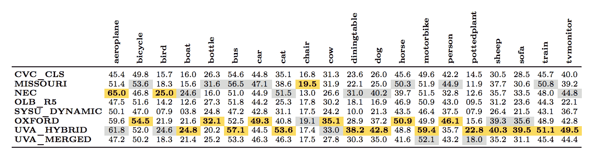

在那里，每个团队都在 VOC2012 数据上训练了一个对象检测器，该表报告了每个对象类别和提交的 AP 分数。每列中的金色条目表示相应类别的最大 AP，银色条目表示排名第二的结果( *Id。*)我们看到最高 AP 是 65。该论文还显示了通过任何方法获得的最佳 AP(最大值)和所有方法的中值 AP(中值):

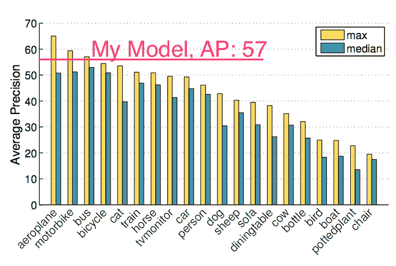

放在这样的背景下，我 57 的 AP 看起来还不错！

但如果你像我一样，你会想，

> 等等，这太好了，不可能是真的…

将我的结果与 2012 年的 OC 挑战进行比较**是善意的，但有严重的局限性**。各种因素使我的模型看起来比实际要好:

*   我的模型只预测了一个类。要求模型预测许多类肯定会降低我的整体地图。
*   给定我的领域特定的任务，假设在任何时候都只有“一个球在玩”，所以我的计算采用了每帧的最高得分检测，这排除了重复的边界框。查看*所有的预测*都会降低我的地图质量。
*   我的模型利用了一种新颖的深度学习架构 ResNet-50(一种具有 50 层的卷积神经网络，在 ILSVRC 和 COCO 2015 比赛中获得了第一名)，相对于 PASCAL VOC challenge 中提供的技术，这代表了最先进技术的一次重大飞跃。
*   我的模型使用了“迁移学习”，利用 ImageNet 数据库中的 100 多万张图像对模型进行预训练，然后为它提供更多针对我的任务的数据
*   PASCAL VOC 的方法并不是计算目标探测任务平均精度的最新方法。Jonathan Hui 很好地总结了这一点:“最新的研究论文往往只给出 COCO 数据集的结果。。。。对于 COCO 来说，AP 是多个 IoU 的平均值。。。。AP@[.5:.95]对应于 0.5 至 0.95 范围内 IoU 的平均 AP，步长为 0.05。 [YOLOv3](https://pjreddie.com/darknet/yolo/) (一个来自 2018 年的最先进的深度学习神经网络)，在 COCO test-dev 数据集上以每秒 30 帧的速度运行，在 80 个类上获得了 57.9%的 mAP，而我的模型预测一个类每秒约 0.3 帧！

也就是说，我对在*环境中学习和校准*我对这一指标的理解的 AP 计算感到满意。我谦卑地补充一点，上面的比较并不意味着我的模型很棒，或者它的表现与世界级研究人员的模型相似。

# 未来方向

鉴于模型的平均精度，我开始梦想组装整个系统:

*   给定一个乒乓球视频，
*   通过在每一帧上调用我的模型来识别球何时在运动
*   当球在比赛时存储时间戳
*   向用户提供 web UI 界面，以及
*   允许用户查看球在比赛时的精彩镜头。

但我想知道我的模型将如何推广到不同的乒乓球比赛。不同的拍摄角度会放大我的模型吗？不同的桌面颜色或球员的服装会影响表现吗？我惊喜地看到这样的结果:

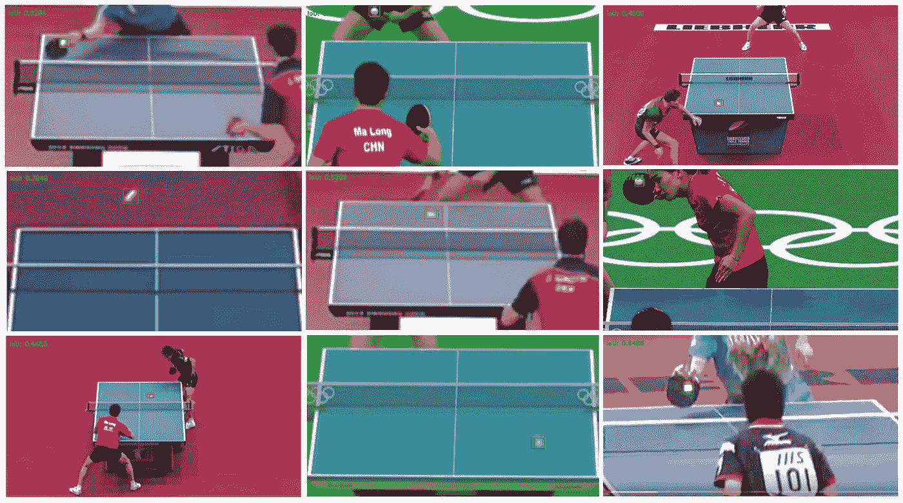

计算各种匹配帧的 IoU。

满怀希望，我潦草地画了这张图，以指引我旅程的下一步:

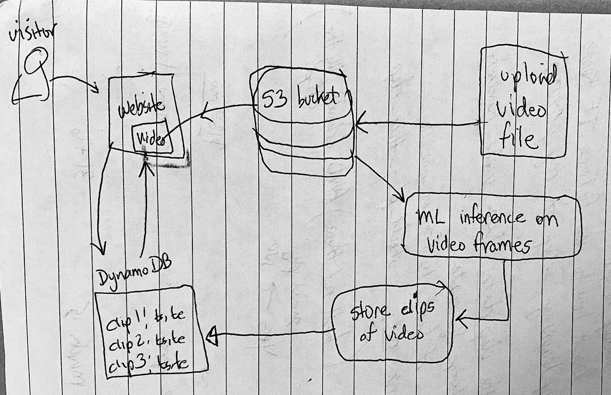

请继续关注这方面的更多内容！

虽然上面的帖子解释了各种代码片段，但最好有完整的要点，这样您就可以自己探索代码了:

对象检测的计算平均精度. py