# 评价 NBA 球队板凳的有效性

> 原文：<https://towardsdatascience.com/evaluating-the-effectiveness-of-the-benches-of-nba-teams-ee1a28f41963?source=collection_archive---------39----------------------->

## 看看 2019–2020 NBA 赛季，哪些 NBA 球队的板凳球员表现不佳，而超出了预期。

马库斯·斯皮斯克在 [Unsplash](https://unsplash.com/s/photos/basketball?utm_source=unsplash&utm_medium=referral&utm_content=creditCopyText) 上的照片

对于每一场比赛，每个 NBA 球队的名册都有多达 15 名球员被正式列入名单。然而，即使在这 15 名球员中，他们每个人都是世界上最好的篮球运动员，当谈到对球队的贡献时，他们每个人都有不同程度的责任也就不足为奇了。定义球员在球队中的角色的一个非常基本的启发是看“先发球员”和“替补球员”在职业篮球赛中，一个队可以同时有五名队员在场。“先发球员”(或“首发阵容”)是一场比赛开始时在场的五名球员。通常情况下，这些是球队在[五个位置](https://jr.nba.com/basketball-positions/#:~:text=A%20basketball%20team%20can%20have,point%20guard%2C%20and%20shooting%20guard.)的每一个位置上最好的五名球员，有时，首发阵容可以由球队整体最好的五名球员组成。首发球员也往往是在一场比赛中上场时间最多的球员。每场比赛的首发阵容会有所不同，但在大多数情况下，球队喜欢保持他们相当一致，这就是为什么我们可以区分首发和“替补”(不是首发的球员)。即使在替补球员中，一些球员也有更多的责任和更多的上场时间(例如“[第六人](https://en.wikipedia.org/wiki/Sixth_man)”)，而其他人在一场场比赛中的阵容中并不重要。当谈到我的分析时，我想看看 NBA 的哪些板凳球员表现不佳，而超出了预期，以及与其他球队的板凳球员相比，哪些板凳球员对球队的贡献更大(根据球队的成功进行了调整)。

# 数据

为了进行这种分析，我需要一种方法来衡量团队的成功和球员的贡献。为了衡量团队的成功，我会查看团队在常规赛中的获胜次数，为了衡量球员的贡献，我会查看一个名为“获胜份额”的高级统计数据

## 团队获胜

这基本上就是一支球队在常规赛中赢球的场次。除非出现特殊情况(就像我们在 2020 年看到的 COVID 关闭)，NBA 球队通常会在常规赛中打 82 场比赛，比赛可能会导致胜利或失败。以下是 2019-2020 赛季按胜场数排名的前 10 名 NBA 球队。

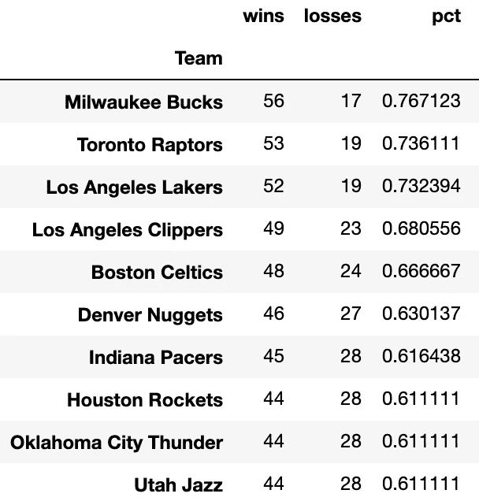

(图片由作者提供)

## 赢得份额(WS)

根据 basketball-reference.com 的说法，“‘赢得份额’是一种玩家统计，它试图将团队成功的功劳分配给团队中的个人。”从现在开始，我将“赢股”简称为 WS。在这个分析中，我收集了 basketball-reference.com 的数据，所以我将使用他们对 WS 的定义，这意味着一场团队胜利可以转化为大约一场 WS(这在篮球参考定义中并不完全是一场，所以 WS 也可以因为在失败中的出色表现而获得奖励)。这意味着一个赛季 50 胜的球队将会有大约 50 胜。球员在一个赛季的 WS 之和等于球队在那个赛季的 WS。WS 是一项统计数据，基于个人和团队的表现与其他团队和球员的表现进行比较。WS 的完整定义在这里给出[。值得注意的是，WS 是一个累积的统计数据，因此在两个在类似球队打球并对这些球队有类似贡献的球员之间，上场时间更长的球员可能会有更多的 WS。](https://www.basketball-reference.com/about/ws.html#:~:text=Win%20Shares%20is%20a%20player,the%20individuals%20on%20the%20team.)

为了粗略地比较这些玩家，我们使用“每 48 赢股”(我此后将把它称为 WS/48)。这是不言而喻的:你把一个玩家积累的总 WS 数，除以这个玩家玩的分钟数，然后乘以 48。假设一场 NBA 比赛持续 48 分钟，这试图估计一名球员在一场比赛中会贡献多少 WS。下面，我列出了一些历史和 2019–20 WS 和 WS/48 排行榜，以帮助让概念更清晰一些。

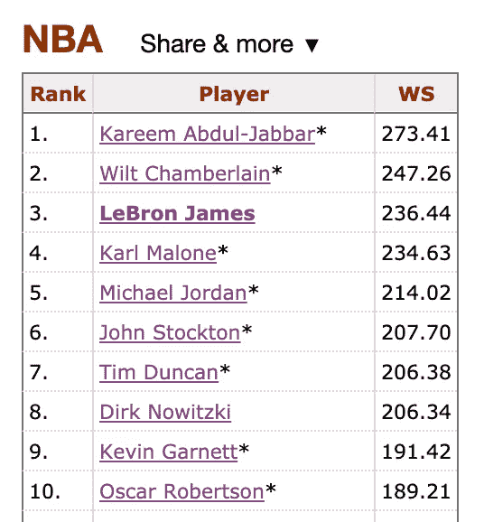

空前的 NBA WS 领袖(图片由作者通过 basketball-reference.com 提供)

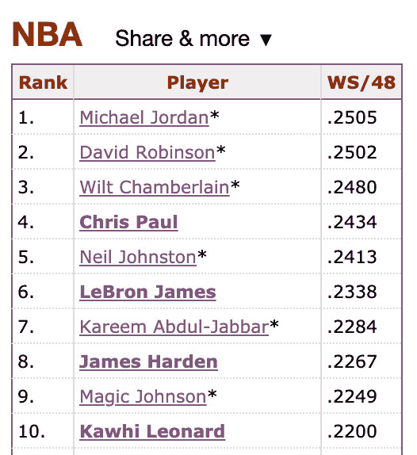

空前的 NBA WS/48 领袖(图片由作者通过 basketball-reference.com 提供)

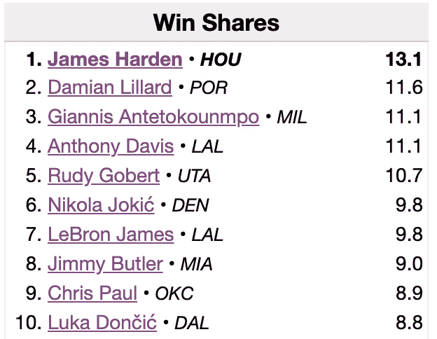

2019-20 NBA WS 领袖(图片由作者 via basketball-reference.com 提供)

必须注意的是，WS 和 WS/48 不应该被认为是比较 NBA 球员的综合指标。例如，没有不尊重伟大的尼尔·约翰斯顿，但我没有办法选择他超过勒布朗詹姆斯，即使他有更高的历史最高 WS/48。肯定有其他指标可以用来比较球员，包括“球员效率评级”(PER)和“方块加减”(BPM)，有时甚至简单的方块得分比较就足够了。此外，篮球比赛的许多方面并没有被基本和高级统计所捕捉。然而，当比较一组球员或整个球队时，这些偏差肯定会得到平衡，这就是为什么我们可以使用这种分析来比较不同球队的替补阵容。例如，下面我展示了 2019-2020 NBA 赛季球队胜利与球队胜利的散点图。

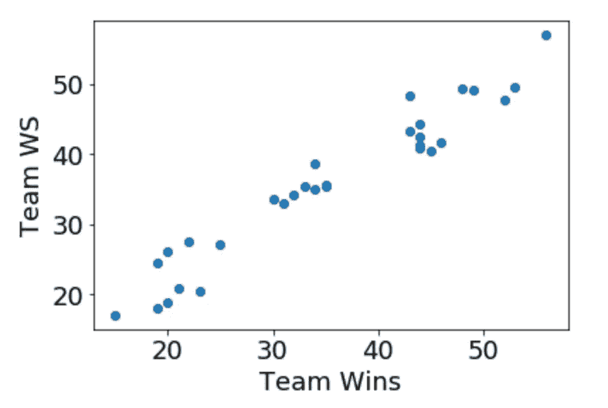

(图片由作者提供)

# 方法学

现在我们有了胜败的概念，我们需要一种方法来定义谁是我们的“板凳球员”，特别是考虑到每场比赛的阵容都可能不同。以下是我用来筛选“首发”和替补球员的标准。这些肯定有些武断，但我认为它们很好地区分了经常首发的球员和替补球员。

1.  首先，我根据开始游戏的百分比筛选出每支球队的前五名球员，这就是一名球员开始的游戏数除以该球员参加的游戏总数。
2.  之后，我会过滤掉所有首发次数超过 70%的球员。
3.  然后我会过滤掉那些至少打了赛季 85%的比赛，并且在超过一半(50%)的比赛中首发的球员。
4.  然后，我会筛选出至少打了半个赛季(50%)并且首发次数超过 60%的球员。
5.  团队的其他成员被定义为该团队的“替补队员”。

例如，这里是 2019-20 NBA 赛季的一些名单，以及应用这些过滤器后的名单。

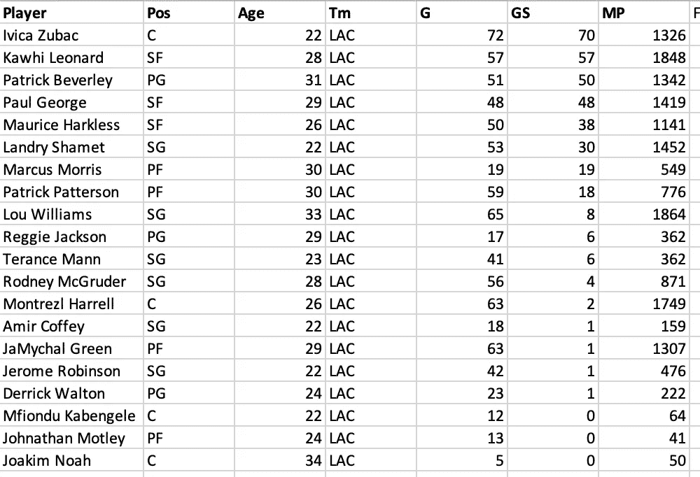

2019–20 洛杉矶快船队(图片由作者提供)

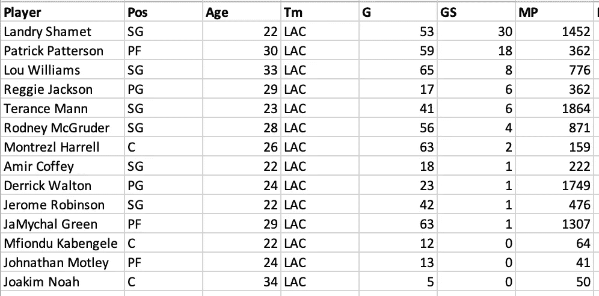

2019–20 洛杉矶快船替补席(图片由作者提供)

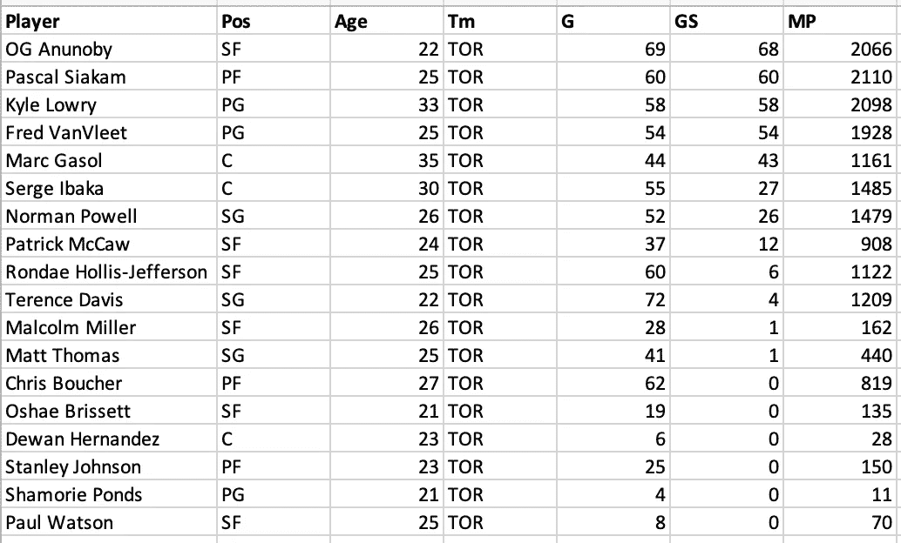

2019–20 多伦多猛龙队(图片由作者提供)

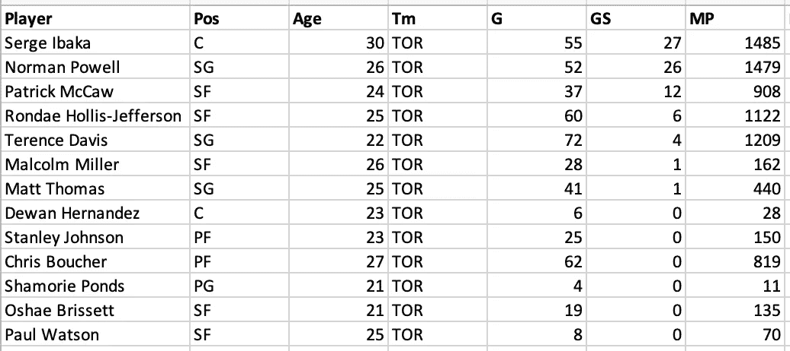

2019–20 多伦多猛龙替补席(图片由作者提供)

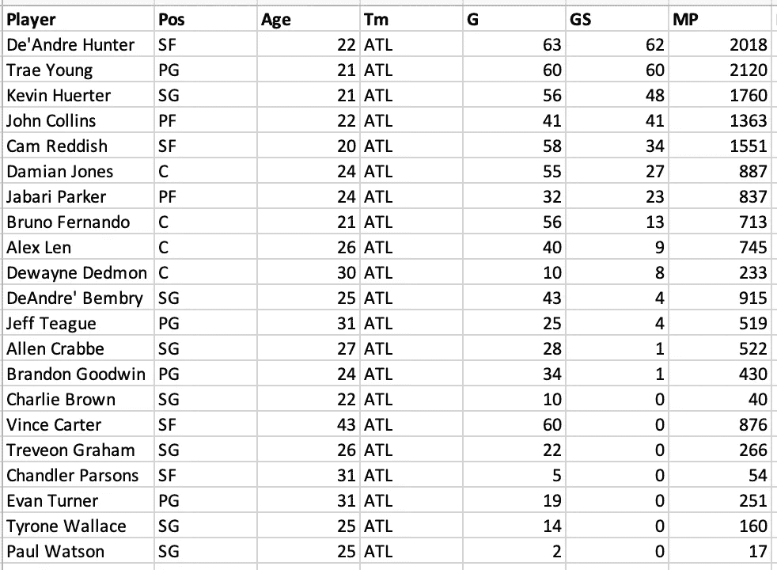

2019-20 亚特兰大老鹰队(图片由作者提供)

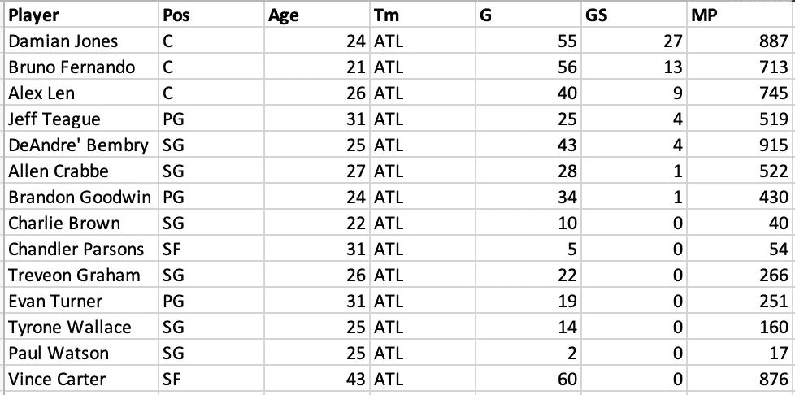

2019-20 亚特兰大老鹰队替补席(图片由作者提供)

# 分析

利用我掌握的数据，我进行了两种不同的分析。第一个是 wins 对 WS 的[普通最小二乘法](https://statisticsbyjim.com/glossary/ordinary-least-squares/#:~:text=Ordinary%20least%20squares%2C%20or%20linear,and%20the%20corresponding%20fitted%20values.) (OLS)线性回归，其中 wins 是自变量(x)，WS 是因变量(y)。用通俗的话说，这就是所谓的最佳拟合线。第二个分析是 wins 对 WS/48 的 OLS 回归。第一个回归没有考虑上场时间，而是给出了一个总体的概念，即哪支球队比其他球队更多地使用板凳。第二个分析提供了洞察，哪些长凳超过他们的整体团队绩效调整后的期望。为了确定“表现优于”和“表现差于”的概念，我查看了残差，它只是该团队赢得的比赛数量的观察值和期望值之间的差异(期望值位于回归线上)。

# 结果

这两项分析都给出了一些非常有趣的结果，这些结果大多符合我对最近 NBA 赛季球队的直觉。以下是 2019-20 NBA 赛季的表格和回归结果。

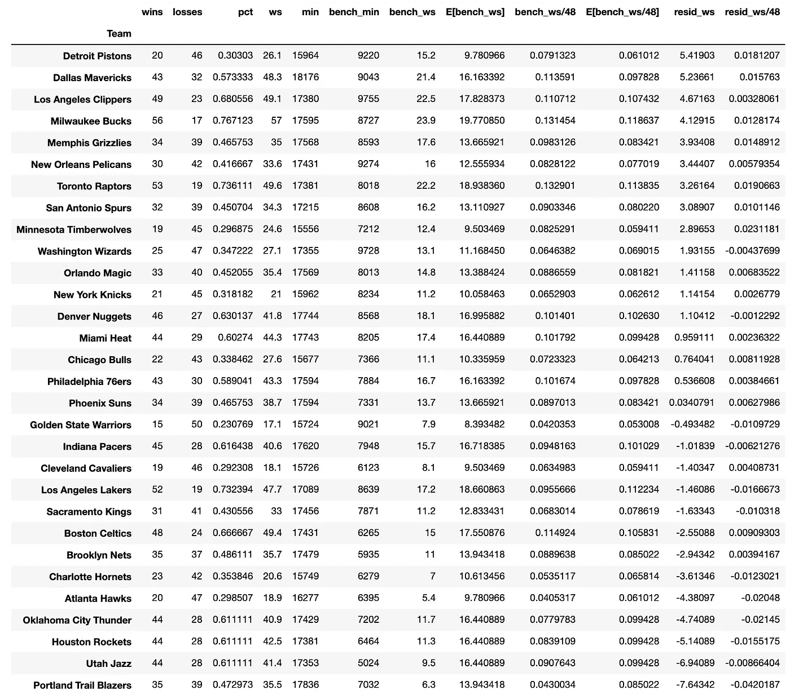

(图片由作者提供)

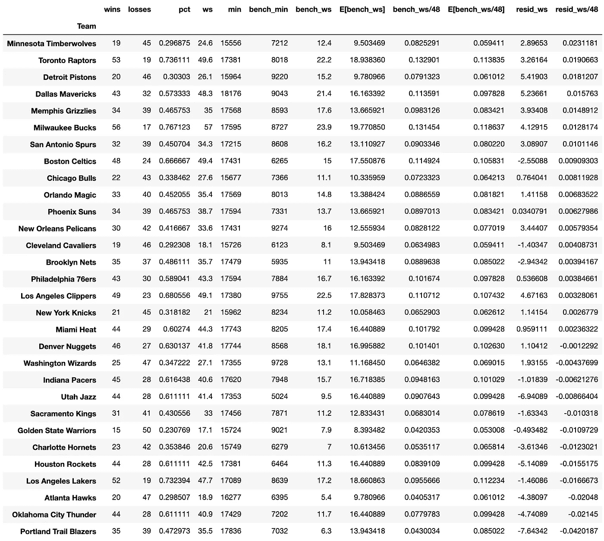

(图片由作者提供)

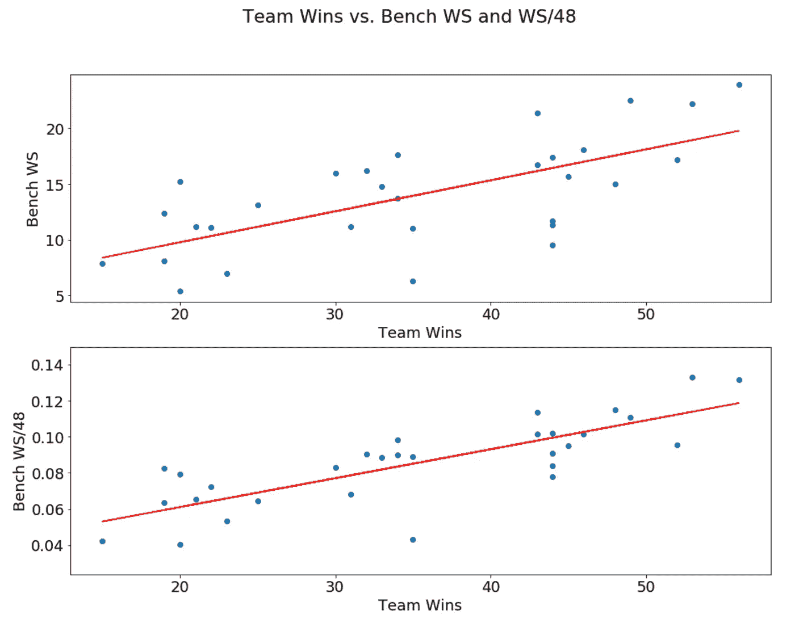

(图片由作者提供)

第一个表基于 WS 的残差按降序排序。具有最高正残差的团队比预期更多地利用他们的板凳，这些板凳比其他团队的板凳对团队的成功更重要。回顾 2019-20 NBA 赛季，这是有意义的。例如，洛杉矶快船队有两个年度第六人决赛选手(NBA 最佳“第六人”奖的决赛选手)，所以就板凳重要性而言，他们接近榜首是有道理的。然而，快船板凳球员被一些快船板凳球员打了很多分钟的事实夸大了，所以这肯定夸大了他们似乎比 NBA 板凳球员表现得更好。这表现在 WS/48 回归中，快船板凳只有很小的正残差。此外，一些我认为真正头重脚轻的球队，包括开拓者队，其中像达米恩·利拉德和 CJ 麦科勒姆这样的首发球员产生了大部分的进攻，以及休斯顿火箭队，其中整个进攻都是以首发阵容中的詹姆斯·哈登为中心，也在名单的底部。此外，我只想对我最喜欢的芝加哥人之一，德里克·罗斯大喊一声，他去年在底特律活塞队替补出场。

值得注意的是，这不是一个关于板凳阵容有多强大或有多有效的排名，而是他们对球队的成功做出了多少贡献。我宁愿要纽约尼克斯队的板凳球员名单，而不是洛杉矶湖人队的:当然不是。但是尼克斯的板凳对球队的成功相对来说比湖人更重要(尽管很少)，至少在常规赛中是这样。

# 结论

我的方法肯定有一些可以改进的地方。首先，如果我看看每场比赛的实际阵容，分析会更准确。例如，如果一个常规的先发球员受伤了，一些替补球员将不得不替补上场，直到先发球员完全康复。在这种情况下，他们在这些比赛中获得的 WS 应该流向首发 WS 而不是替补 WS。此外，团队只是喜欢在很多时候尝试不同的阵容。不幸的是，为每场比赛的每个球员请求网页，然后计算 WS，这可能是非常计算密集型的，但是我的过滤器提供了整个赛季板凳球员的粗略估计。

当谈到推广这些结果时，我想到了它们是否有任何预测能力。显然，我们不应该根据板凳有多重要来预测一支球队在接下来的赛季中的成功。然而，这种分析在休赛期肯定是重要的，那时总经理和 NBA 特许经营的篮球运营团队正在评估应该做出什么样的名册变化。这对于训练人员和教练来说也是很有用的，可以帮助他们了解球员发展的重点。总的来说，我只是认为这是一种很酷的方式来感受不同 NBA 球队的动态，并验证你对球场上发生的事情的直觉。

# 杂项

我也开始将我的研究项目的 Python 脚本推送到 Github 上的一个公共存储库中，链接[这里](https://github.com/shourieanish/sports_analytics)！这些脚本在。ipynb 文件，所以你必须使用 Jupyter Notebook 或 Google Colab 之类的工具打开它们。此外，如果你想讨论我的任何项目和其他研究想法，或者如果你想让我运行不同 NBA 赛季的结果，请随时通过[脸书](https://www.facebook.com/BhangraLeBron/)或 [LinkedIn](https://www.linkedin.com/in/shourieanish/) 与我联系。我也喜欢谈论篮球。下次再见！