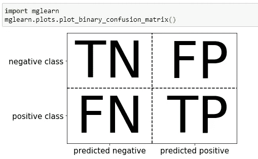
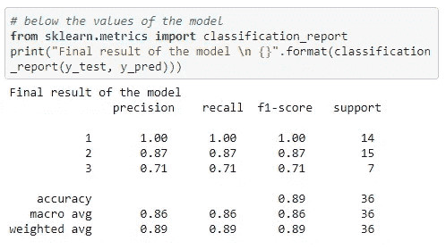

# 分类的评估标准

> 原文：<https://towardsdatascience.com/evaluation-metrics-for-classification-1dc9945bee2?source=collection_archive---------33----------------------->

## 精确度、召回率、ROC 曲线和 F1 分数概述


[非](https://unsplash.com/@non_creation?utm_source=unsplash&utm_medium=referral&utm_content=creditCopyText)在 [Unsplash](https://unsplash.com/s/photos/futuristic-art?utm_source=unsplash&utm_medium=referral&utm_content=creditCopyText) 上拍照

**简介**

了解模型的准确性是必要的，但仅仅了解模型的性能水平是不够的。因此，有其他的评估标准可以帮助我们更好地理解模型的执行程度。这些指标包括精确度、召回率、ROC 曲线和 F1 分数。

显然，当我们选择一个指标时，我们必须知道机器学习应用程序的最终目标。因此，我们需要了解整个决策过程，以便建立一个好的模型。

在本文中，我们将看到所有这些主题以及 python 的应用。

所以，让我们开始吧！

**第一部分:精确度和召回率**

在谈论精度和召回率之前，让我简单介绍一下什么是混淆矩阵。

混淆矩阵是表示评估二元分类结果的最全面的方式。下面是一个混淆矩阵的例子。



作者图片

正如你在上面看到的，一个值可以分为 TN(真阴性)、TP(真阳性)或 FN(假阴性)、FP(假阳性)。

*   **TP** :预测为正，实际值也为正
*   **FP** :预测为正，实际为负
*   **TN** :预测为负，实际值也为负
*   **FN** :预测为负，实际为正

综上所述，你可以制度化地理解，当一个值被错误地分类到一个特定的类中时，结果将是 FN 或 FP。相反，当分类正确时，我们将得到 TN 或 TP。

从这个角度来看，我们可以很容易地计算出我们的精度，由以下比率给出:

```
(TP+TN) / (TN+FN+TP+FP)
```

所以，我们可以说，准确度是考虑所有不同结果的真实结果的比例。

关于**精度**，我们想知道**预测值**被正确归类为正值的比例。所以:

```
TP / (TP + FP)
```

当我们想要确定我们的**预测**时，精度非常有用，因为它告诉我们有多少预测为正的值实际上是正的。

**回忆**是另一个非常有用的指标，例如，它允许我们知道被正确分类为阳性的**值的数量**占实际为阳性的**总值**的比例。

```
TP / (TP + FN)
```

**第二部分:接收机工作特性(ROC)**

现在假设您想要比较假阳性率(FPR)和真阳性率(TPR)。

TPR 是我们以前见过的召回。所以公式将会是:

```
TPR(recall) = TP/(TP+FN)
```

相反，FPR 由以下比率给出:

```
FPR = FP/(FP+TN)
```

因此，为了比较 FRP 和 TPR，我们可以简单地使用 ROC 曲线。

对于 ROC 曲线，理想曲线接近左上方。目标是获得一个产生高 TPR(召回)和低 FPR 的模型。

然而，如果我们想用一个数字来概括 ROC 曲线，我们可以计算曲线下面积(AUC)。下图表示 ROC 曲线及其面积。


作者图片

**第三部分:F1-得分**

一个全面了解精确度和召回率的好方法是使用 F1 分数。F1 分数给出了精确度和召回率的调和平均值。下面我们可以看到公式。

```
F = 2*(precision-recall)/(precision+recall)
```

当我们处理不平衡的二进制分类数据集时，F1 值是一个比精确度更好的度量，知道这一点很重要。

无论如何，从 **sklean metrics** 中，我们可以导入**分类报告**，该报告为我们提供 F1 分数和所有指标，如精度和召回率。



**结论**

在分类问题中，这些是最常用于评估模型性能的指标。因此，每当您必须构建分类模型时，使用我们在本文中看到的度量标准来评估您的模型的性能是一个好主意。

感谢你阅读这篇文章。您还可以通过其他方式与我保持联系并关注我的工作:

*   订阅我的时事通讯。
*   也可以通过我的电报群 [*数据科学初学者*](https://t.me/DataScienceForBeginners) 联系。