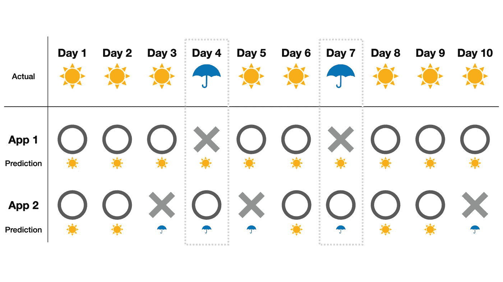
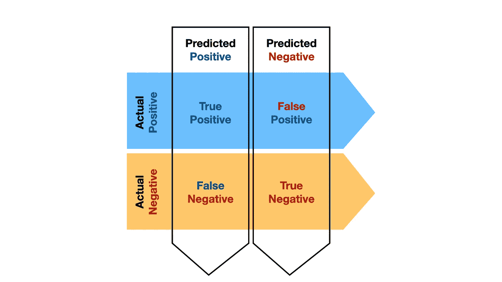
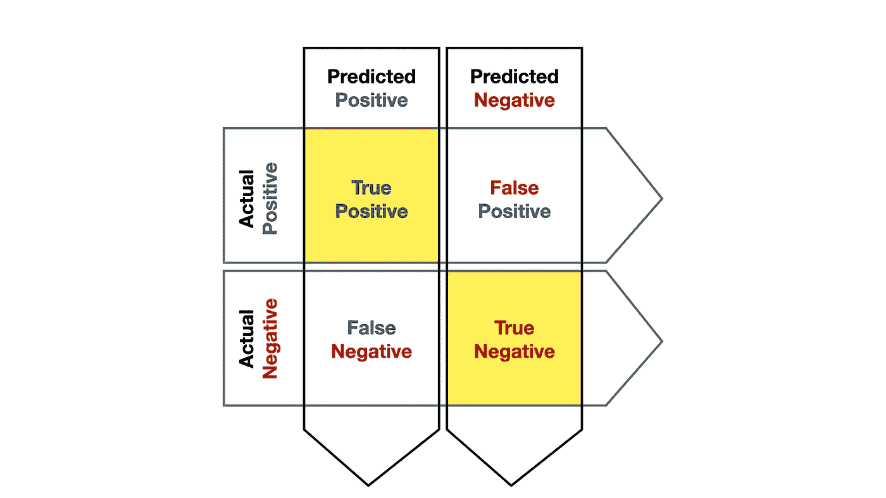

# 分类的评估标准已解释

> 原文：<https://towardsdatascience.com/evaluation-metrics-for-classification-cdea775c97d4?source=collection_archive---------41----------------------->

## 为 Python 中的多类和二类分类问题选择合适的评估度量


艾萨克·史密斯在 [Unsplash](https://unsplash.com?utm_source=medium&utm_medium=referral) 上拍摄的照片

评估指标是指我们用来评估不同模型的度量。选择一个合适的评估指标是一个决策问题，需要对项目的目标有一个透彻的理解，并且是所有建模过程之前的一个基本步骤。那么为什么它如此重要，我们应该如何选择呢？

# 为什么重要？

假设你住在一个一年大约 300 天都是晴天的城市。在另外的 65 天里，大雨或大雪会让天气变得很不舒服。在这个想象的世界里，只有两个天气 app。一个应用程序预测天气的准确率为 80%,而另一个应用程序的准确率为 70%。你会选择哪个 app？


照片由[黑脸田鸡·佐野](https://unsplash.com/@sorasagano?utm_source=medium&utm_medium=referral)在 [Unsplash](https://unsplash.com?utm_source=medium&utm_medium=referral) 上拍摄

如果一个应用程序总是预测这个城市是晴天，这个应用程序将有 80%的正确率，即使它从来没有准确预测坏天气。这样的话，这个 app 就没用了！另一方面，另一个应用程序可能在 30%的时间里无法预测晴天，但它会在 80%的时间里准确地告诉你坏天气。在这种情况下，这个 70%正确预测天气的 app 比 80%的 app 有用多了。



App 1 在 80%的情况下是正确的，但是错过了所有的坏天气。App 2 在 70%的情况下是正确的，但不会错过任何坏天气。

正如我们在这里看到的，我们如何选择评估我们的模型可以告诉我们的数据非常不同的信息。它必须由项目的目标和数据集的属性决定。任何数据都不会没有方差，任何模型都无法完美地解释这个世界。所以我们必须知道我们宁愿让这样的预测错误发生在哪里。

# 真或假，积极或消极



当模型进行二元预测时，有 4 种可能的结果。一个模型可以预测是(**正**)或否(**负**)，也可以是正确的(**真**)或错误的(**假**)。当模型进行多类预测时，同样的逻辑也适用。这个模型预测一个单独的类是或不是，它可能是对的，也可能是错的，我们决定如何组合这些单独的结果。

# 正确预测的概率



正确的案例

## 精确度和召回率

但是我们如何解释一个模型超出了这四个结果。首先，真阳性(TP)涉及两个事件:模型预测和实际状态。我们的解释可以根据我们对这两个事件的优先顺序而改变。我们可以看到当实际值为正时模型是否预测为正，或者当模型预测为正时我们可以看到实际值是否为正。

比方说，当天气晴朗时，应用程序有 80%的可能性预测天气晴朗。但是这并没有告诉我们任何有用的信息。相反，我们应该看到应用程序显示天气晴朗的频率。这将告诉我们该应用程序在预测晴天时的预测有多精确。这是**精度**指标，代表模型在所有情况下都正确的概率。

```
**from** sklearn.metrics **import** precision_score
precision_score(actual_y, predicted_y)
# scoring parameter: ‘precision’
```


由[陈乐德](https://unsplash.com/@mero_dnt?utm_source=medium&utm_medium=referral)在 [Unsplash](https://unsplash.com?utm_source=medium&utm_medium=referral) 上拍摄的照片

但有时知道所有阳性病例中阳性预测的概率可能更重要。想象一下，我们正在预测一种食物是否有毒。一个模型的**精度**(预测食物有毒时食物有毒的可能性)没有预测食物有毒时食物有毒重要。因为如果模型说它有毒，我们可以干脆不吃，但如果它不能告诉我们，我们就冒着吃有毒食物的风险。所以我们想要一个当食物有毒时有很高概率预测阳性的模型。这是针对**召回**或**灵敏度**指标的情况。也叫**真阳性率**。它代表了我们的模型在检测阳性病例时的灵敏度。

```
**from** sklearn.metrics **import** recall_score
recall_score(actual_y, predicted_y)
# scoring parameter: ‘recall’
```

## F1 分数

但是如果这两个都很重要呢？换句话说，在不遗漏正面案例和不遗漏负面案例同等重要的情况下，我们该怎么办？想象一下，你正在预测一种可以通过某种治疗方法治愈的疾病。但是这种治疗对没有患病的人是有害的。在这种情况下，我们需要一个对检测阳性病例敏感且检测同样精确的模型。这时 **F1 分数**开始发挥作用。 **F1 得分**是精确率和召回率的调和平均值，是精确率和召回率的平均值。

```
**from** sklearn.metrics **import** f1_score
f1_score(actual_y, predicted_y)
# scoring parameter: ‘f1’
```

## 准确(性)

精确度和召回率指标侧重于预测正面案例:对问题'*这是 __？*’。但正如我们之前看到的，模型有两种不同的正确方式:它可以在应该说是时说是，也可以在应该说不是时说不是。**准确性**是在这两种情况下正确的概率。当等级相等时，我们可以使用**精确度**。比如说我们想预测一张图片是不是狗。我们只想让模特在它是狗的时候说是，在它不是狗的时候说不是。当它是一只猫的时候说它是一只狗和当它是一只狗的时候说它不是一只狗没有任何不同的结果。在这种情况下，我们可以使用**精度**。

```
**from** sklearn.metrics **import** accuracy_score
accuracy_score(actual_y, predicted_y)
# scoring parameter: ‘accuracy’
```


这是一只狗吗？由 [Karsten Winegeart](https://unsplash.com/@karsten116?utm_source=medium&utm_medium=referral) 在 [Unsplash](https://unsplash.com?utm_source=medium&utm_medium=referral) 上拍摄

## 特征

最后，**特异性**是预测阴性病例的**灵敏度**(在所有阴性病例中预测阴性的概率)。换句话说，当不遗漏负面案例比犯错更重要时，我们可以使用**特异性**。假设你想知道井里的水是否可以饮用。你宁愿把可饮用的水标为不可饮用，也不愿错误地标为不可饮用。如果我们交换正反两面，问一个问题'*这水有传染性吗？*'，我们将使用**灵敏度**而不是**特异性**。

特异性在 Sci-kit 学习包中没有内置功能。相反，您可以使用灵敏度并交换正反例，或者使用混淆矩阵通过自定义函数来计算。

```
# custom function to calculate specificity for binary classification**from** sklearn.metrics **import** confusion_matrixdef **specificity_score**(y_true, y_predicted):
    cm = **confusion_matrix**(y_true, y_predicted)
    **return** cm[0, 0] / (cm[0, 0] + cm[0, 1])**print**(**specificity_score**(y_true, y_predicted))
```

# 多类问题


马库斯·斯皮斯克在 [Unsplash](https://unsplash.com?utm_source=medium&utm_medium=referral) 上拍摄的照片

## 微观平均值

我们回顾了如何为我们的二元分类数据选择评估指标。但是，当我们的目标不是“是”或“否”，而是由多个类别组成时，我们该怎么办呢？一种方法是对每个结果进行全局计数，而不考虑类内分布，并计算指标。我们可以通过使用**微平均值**来实现这一点。

让我们想想使用全局计数意味着什么。如果我们只看全局结果，我们没有之前的四个结果(TP，TN，FP，FN)。相反，我们有真(预测=实际类)或假(预测！=实际类)。因此，**微精度**、**微召回**、**准确度**都代表准确预测的概率，并且相等。此外，由于 **F1 得分**是**精度**和**召回**的调和平均值，因此**微 F1 得分**与其他指标相同。

```
# these are all the same **recall_score**(actual_y, predicted_y, average = **'micro'**)
**precision_score**(actual_y, predicted_y, average = **'micro'**)
**accuracy_score**(actual_y, predicted_y)
**f1_score**(actual_y, predicted_y, average = **'micro'**)# scoring parameter: 'f1_micro', 'recall_micro', 'precision_micro'
```

计算全局结果不考虑每一类预测的分布(只计算有多少预测正确)。当数据集包含高度不平衡的类，并且我们不关心控制任何特定类中的预测误差时，这可能会很有帮助。但是正如我们上面讨论的，我们的许多问题确实涉及到对预测误差来源的特定控制。

## 宏观平均值

另一种处理多类的方法是简单地计算每个类的二元测度。例如，如果我们的目标变量可以是*猫*、*狗*或*鸟*，那么我们对每个预测都会得到一个二元的是或否的答案。这是一只猫吗？这是一只狗吗？这是一只鸟吗？这将导致与我们的目标职业一样多的分数。然后，我们可以汇总这些分数，并使用**宏观平均值**或**加权平均值将它们转化为一个单一指标。**

**宏平均值**计算单个类的指标，然后计算它们的平均值。这意味着它对每个类返回的结果给予相同的权重，而不管它们的总体大小。所以它对每个班级的规模不敏感，但它更重视单个班级的表现，即使它是少数。因此，如果很好地预测少数类与整体准确性一样重要，并且我们也相信少数类中有可靠的信息量来准确地表示基本事实模式，则**宏观平均值**是一个很好的度量。

**宏观平均召回分数**与多类问题中的**平衡准确率**相同。

```
print(**f1_score**(actual_y, predicted_y, average = **'macro'**))
print(**precision_score**(actual_y, predicted_y, average = **'macro'**))# below two are the same measures**from** sklearn.metrics **import** balanced_accuracy_score, recall_score
print(**recall_score**(actual_y, predicted_y, average = **'macro'**))
print(**balanced_accuracy_score**(actual_y, predicted_y))# scoring parameter: 'f1_macro', 'recall_macro', ...etc.
```


由[马库斯·斯皮斯克](https://unsplash.com/@markusspiske?utm_source=medium&utm_medium=referral)在 [Unsplash](https://unsplash.com?utm_source=medium&utm_medium=referral) 上拍摄的照片

## 加权平均值

概括地说，微观平均给予单个观察值同等的权重，宏观平均给予单个类别同等的权重。根据定义，宏平均值并不关心每个类有多少数据。因此，即使少数群体没有足够的数据来显示可靠的模式，它仍然会平等地衡量少数群体。如果是这种情况，我们可能希望通过使用**加权平均值来考虑每个类的总体大小。**

```
# we can also compute precision, recall, and f1 at the same time**from** sklearn.metrics **import** precision_recall_fscore_support
**precision_recall_fscore_support**(actual_y, predicted_y, average = '**weighted**')# scoring parameter: 'f1_weighted', 'recall_weighted', ...etc.
```

## 科恩的卡帕

到目前为止，我们讨论的每个指标都讲述了一个故事的一部分，这就是为什么我们希望确保我们的目标是明确的，并与我们选择的指标保持一致。但是，如果我们只是想要一个度量，可以全面地告诉我们，相对于随机机会，我们的模型分类做得如何呢？**科恩的 Kappa** 将分类器的性能与随机分类器的性能进行了比较。自然地，它考虑了类别不平衡，因为随机分类器将依赖于每个类别的分布。与其他衡量概率的指标不同，**科恩的卡帕值**从-1 到 1 不等。

```
**from** sklearn.metrics **import** cohen_kappa_scoreprint(**cohen_kappa_score**(actual_y, predicted_y))
```

我们研究了二元和多类分类的每个评估指标如何唯一地用于个体问题，以及为什么关注我们选择的指标很重要。我试图用简单的英语复习最基本的小节。但我仍然忽略了另一个非常重要的指标，ROC/AUC 得分，我将在另一篇文章中讨论。


只是一只小狗。照片由[克里斯·莱佩尔特](https://unsplash.com/@cleipelt?utm_source=medium&utm_medium=referral)在 [Unsplash](https://unsplash.com?utm_source=medium&utm_medium=referral) 上拍摄