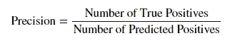
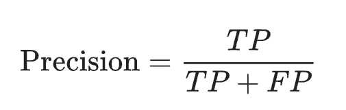
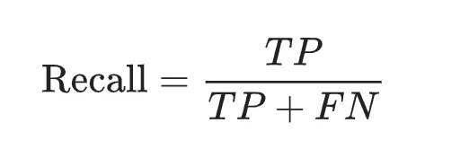
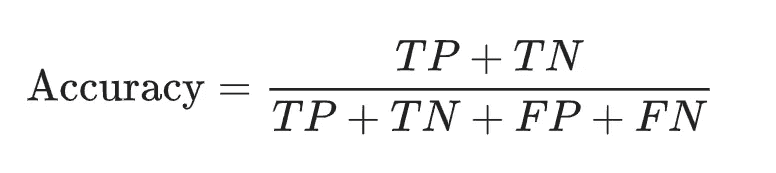
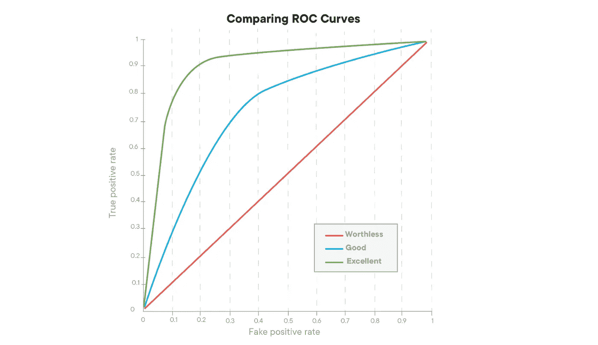

# 机器学习中分类问题的评价指标

> 原文：<https://towardsdatascience.com/evaluation-metrics-for-classification-problems-in-machine-learning-d9f9c7313190?source=collection_archive---------27----------------------->

在 [Unsplash](https://unsplash.com/s/photos/evaluation?utm_source=unsplash&utm_medium=referral&utm_content=creditCopyText) 上由 [Helloquence](https://unsplash.com/@helloquence?utm_source=unsplash&utm_medium=referral&utm_content=creditCopyText) 拍摄的照片

知道如何创建机器学习模型是成为成功的数据科学家的一大步，但第一个模型很少是“最好”的模型。评估我们的机器学习模型的质量对于继续改进我们的模型至关重要，直到它尽可能地发挥最佳性能。对于 ***分类*** 问题， ***评估度量*** 将预期类别标签与预测类别标签进行比较，或者解释类别标签的预测概率。分类问题是常见的，并且具有许多现实世界的应用，例如检测垃圾邮件、定向营销、欺诈检测或评估患者是否处于发展特定疾病诊断的高风险中。在这篇博文中，我们将回顾针对这些类型问题的一些不同类型的分类评估标准。

> 1.混淆矩阵
> 
> 2.精确
> 
> 3.回忆
> 
> 4.准确(性)
> 
> 5.f1-分数
> 
> 6.AUC ROC

# 混淆矩阵

混淆矩阵是一个包含预测值和实际值的四种不同组合的表格。这是一个很好的方式来可视化不同的输出，并计算**精度、召回、** **精度、F-1 评分**为以及 **AUC-ROC。**我们将在本博客后面更详细地讨论每一个问题。首先，让我们将 TP、FP、FN 和 TN 分解成一个混淆矩阵。

混淆矩阵

*   **真阳性(TP)** :我们的模型预测的次数是肯定的，实际输出也是肯定的。
*   **真阴性(TN)** :我们的模型预测为 NO 而实际输出为 NO 的次数。
*   **假阳性(FP)** :我们的模型预测为是而实际输出为否的次数，这就是所谓的 1 类错误。
*   **漏报****【FN】**:我们的模型预测为否，实际输出为是的次数。这就是所谓的第二类错误。

# *——*

*精度可以描述为相关实例在检索实例中所占的比例。这回答了“多大比例的积极认同是正确的？”公式如下:*

**

*根据我们的混淆矩阵，等式可以表示为:*

**

*精度表示我们的模型所说的相关数据点的比例实际上是相关的。*

# ****回忆*** —*

*回忆，又称*敏感性。*这回答了“有多少比例的实际阳性被正确分类？”这可以用下面的等式来表示:*

**

*在我们的混淆矩阵中，它可以表示为:*

**

*召回表示数据集中哪些实例是相关的。在评估模型时，检查精确度和召回率是很重要的，因为它们通常有相反的关系。当精确度增加时，回忆倾向于减少，反之亦然。*

# ****准确度*** —*

*准确性决定了在所有的分类中，我们正确分类了多少？这在数学上可以表示为:*

**

*使用我们的混淆矩阵术语，该等式可写成:*

**

*我们希望准确度分数**尽可能** **高**。值得注意的是，准确性可能不总是使用的最佳指标，尤其是在 [**类不平衡数据集**](https://www.quora.com/What-is-an-imbalanced-dataset) **的情况下。**这是指数据在所有类别中的分布不相等。*

*例如，假设我们正在寻求建立一个模型来帮助诊断脑癌患者。如果我们的模型只是将每个人归类为没有患脑癌，我们在绝大多数情况下都是正确的，但事实上，当某人患有脑癌而没有被诊断出来的代价是毁灭性的。根据行业的不同，这些成本可能会超过模型的准确性。在这种不平衡的情况下，最好使用 **F1-Score** 来代替。*

# ****F1-得分*** —*

*F1 分数是精确度和召回率的函数。它用于在两个指标之间找到正确的平衡。它决定了在不遗漏大量实例的情况下，模型正确分类的实例数量。这个分数可以用下面的等式来表示:*

**

*精确度和召回率之间的不平衡，例如高精确度和低召回率，可以给你一个非常精确的模型，但是不能正确地分类困难的数据。我们希望 F1 分数尽可能高，以实现我们车型的最佳性能。*

# *AUC(曲线下面积)ROC(受试者操作特征)曲线*

*AUC ROC 曲线是显示分类模型在所有阈值的性能的图表。ROC 是概率曲线，AUC 代表可分离度。ROC 绘制了以下参数:*

*   ***真阳性率(TPR)** ，也称回忆或敏感度，在上一节有解释。*

**

*   ***假阳性率(FPR)** ，也称为漏失，假阳性预测与所有实际为阴性的值的比率。*

**

*RPR 和 FPR 都在范围[0，1]内。该曲线是在范围[0，1]中不同点的 FPR 对 TPR。表现最好的分类模型会有一条类似于下图中绿线的曲线。绿线在曲线下的面积最大。AUC 越高，你的模型表现越好。只有 50-50 准确度的分类器实际上并不比随机猜测好多少，这使得模型毫无价值(红线)。*

**

*我希望这篇博客有助于澄清用于评估机器学习中分类模型性能的不同度量标准！*

*如果这篇博文有什么启示，请务必记住，没有适用于所有问题的评估标准。这取决于行业和你要处理什么样的数据集。*

*感谢阅读！*

*参考资料:*

1.  *[https://developers . Google . com/machine-learning/速成课程/分类/真-假-正-负](https://developers.google.com/machine-learning/crash-course/classification/true-false-positive-negative)*
2.  *[https://towards data science . com/understanding-mission-matrix-a9ad 42 dcfd 62](/understanding-confusion-matrix-a9ad42dcfd62)*
3.  *[http://gim.unmc.edu/dxtests/ROC3.htm](http://gim.unmc.edu/dxtests/ROC3.htm)*
4.  *[https://towards data science . com/beyond-accuracy-precision-and-recall-3da 06 bea 9 f6c](/beyond-accuracy-precision-and-recall-3da06bea9f6c)*
5.  *[https://towards data science . com/accuracy-precision-recall-or-f1-331 FB 37 C5 CB 9](/accuracy-precision-recall-or-f1-331fb37c5cb9)*