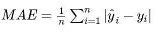
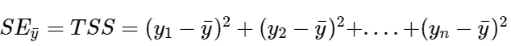
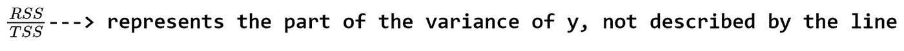
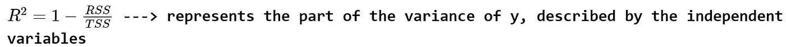
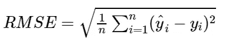
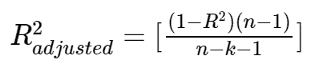
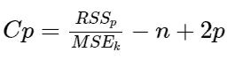

# 线性回归中的评价指标和模型选择

> 原文：<https://towardsdatascience.com/evaluation-metrics-model-selection-in-linear-regression-73c7573208be?source=collection_archive---------5----------------------->

## 数据科学

## 揭开最常见的度量和模型选择方法的神秘面纱

克里斯·利维拉尼在 [Unsplash](https://unsplash.com?utm_source=medium&utm_medium=referral) 上的照片

在本文中，我们将回顾线性回归中最常见的评估指标以及模型选择策略。

# 残差图-评估模型之前

我们知道，线性回归试图拟合一条线，使预测值和实际值之间的差异最小，这些差异也是无偏的。这种差异或误差也被称为**残差。(** *无偏是指预测值没有系统的分布模式)*

**残差=实际值—预测值**

*e*=*y*—*ŷ*

值得注意的是，在使用 R 平方等评估指标评估或评价我们的模型之前，我们必须利用残差图。

***残差图暴露了一个比其他任何评价指标都有偏差的模型。如果你的残差图看起来正常，继续，用各种度量评估你的模型。***

残差图在 y 轴上显示残差值，在 x 轴上显示预测值。如果你的模型有偏差，你就不能相信结果。

显示对应于预测值的误差的残差图必须是随机分布的。然而，如果有任何系统模式的迹象，那么你的模型是有偏见的。

但是随机分布的误差意味着什么呢？
线性回归模型的假设之一是误差必须是正态分布的。这意味着，对于整个预测值范围，确保残差分布在零附近。因此，如果残差是均匀分布的，那么您的模型可能表现良好。

# 线性回归模型的评估指标

评估指标是衡量模型表现的好坏以及它与关系的近似程度。让我们看看 MSE、MAE、R 平方、调整 R 平方和 RMSE。

## 均方误差

回归任务最常见的度量是 MSE。它有一个凸起的形状。它是预测值和实际值之差的平均值。因为它是可微分的，并且具有凸形，所以更容易优化。

均方差。图片由作者提供。

MSE 惩罚大的错误。

## 平均绝对误差

这只是目标值和模型预测值之间的绝对差值的平均值。在异常值突出的情况下，不推荐使用。

平均绝对误差。图片由作者提供。

MAE 不惩罚大的错误。

## r 平方或决定系数

此指标表示由模型的自变量解释的因变量方差部分。它衡量模型和因变量之间的关系强度。

为了理解 R-square 真正代表什么，让我们考虑下面的情况，在有和没有独立变量的知识的情况下，我们测量模型的误差。

**计算回归误差** 当我们知道自变量的值时，我们可以计算回归误差。

我们知道残差是实际值和预测值之间的差值。因此，RSS(残差平方和)可以计算如下。

剩余平方和。图片由作者提供。

**计算平方残差** 考虑我们不知道自变量的值的情况。我们只有 y 的值。这样，我们就可以计算出 *y* 值的**平均值。**这个点可以表示为一条水平线。现在我们计算平均**y 值**和每隔一个**y*y*值之间的误差平方和。**

Y 中的总变化可以被给出为每个点之间的距离的平方差和 Y 值的算术平均值。这可以被称为 **TSS** (总平方和)。

y 或 TSS 的总变化。图片由作者提供。

**用 RSS & TSS** 计算决定系数，因此我们想找出 Y 的总变化的百分比，由独立变量 x 描述。如果我们知道 Y 的总变化的百分比，即回归线描述的**而不是**，我们可以从 1 中减去相同的值以获得**决定系数或 R 平方。**

图片由作者提供。

决定系数。图片由作者提供。

> *如果数据点非常接近回归线，则该模型说明了大量的方差，从而导致高 R 值。*
> 
> 然而，不要让 R 值欺骗了你。一个好的模型可以具有低的 R 值，而一个有偏差的模型也可以具有高的 R 值。这就是你应该利用剩余地块的原因。

总之，残差(RSS)与总误差(TSS)的比率告诉您回归模型中还有多少总误差。从 1 中减去该比率，就可以得出使用回归分析消除了多少误差。这就是 R 平方误差。

***如果 R 很高(比如说 1)，那么模型代表因变量的方差。***

***如果 R 非常低，那么模型不代表因变量的方差，回归并不比取平均值好，也就是说，你没有使用来自其他变量的任何信息。***

***负 R 表示你做的比平均值差。如果预测值根本不能解释因变量，那么 RSS ~ TSS 可能为负值。***

因此，R 评估回归线周围的分散数据点。

不可能看到 R 为 1 的模型。在这种情况下，所有预测值都与实际值相同，这实质上意味着所有值都落在回归线上。

## 均方根误差(RMSE)

这是预测值和实际值的平方差的平均值的平方根。

r 平方误差优于 RMSE。这是因为 R 平方是相对测量值，而 RMSE 是拟合的绝对测量值(高度依赖于变量，而不是归一化测量值)。

基本上，RMSE 只是残差平方平均值的根。我们知道残差是一个度量点离回归线有多远的指标。因此，RMSE 测量这些残差的分散。

均方根误差。图片由作者提供。

RMSE 惩罚大错误。

# 模型选择和子集回归

让我澄清一下，当你开发任何考虑到所有预测或回归变量的模型时，它被称为**完整模型。** 如果你丢弃一个或多个回归变量或预测变量，那么这个模型就是一个**子集模型。**

***子集回归背后的一般思想是找出哪个做得更好。子集模型或完整模型。***

我们选择在所有可用候选预测值中表现最好的预测值子集，这样我们就有最大的 *R* 值、最大的调整 R 或最小的 *MSE* 。

*然而，R 从不用于比较模型，因为 R 的值随着预测因子数量的增加而增加(即使这些预测因子没有给模型增加任何值)。*

> **选择模型的原因** 我们着手选择能很好解释数据的预测因子的最佳子集。由于降低了复杂性，充分解释关系的更简单模型总是更好的选择。增加不必要的回归变量会增加噪声。

**我们现在来看看比较和选择最佳模型的最常见标准和策略。**

## 调整的 R 平方—选择标准

**调整后的 R 平方**与 R 平方的主要区别在于， **R 平方**描述的是每个独立变量所代表的因变量的方差，而**调整后的 R 平方**测量的是仅由实际影响因变量的独立变量所解释的方差。

调整后的 R 平方。图片由作者提供。

*在上面的等式中，n 是数据点的数量，而 k 是模型中变量的数量，不包括常数。*

r 往往随着自变量数量的增加而增加。这可能会产生误导。因此，调整后的 R 平方由于增加了不符合模型的独立变量(方程中的 k)而对模型不利。

## 马洛的 Cp —选择标准

Mallow 的 Cp 衡量模型的有用性。它试图计算均方预测误差。

马洛的 Cp 统计。作者图片。

这里的 ***p*** 是回归数，*是模型的 RSS 为给定的 ***p*** 回归数，*是总 MSE 为 ***k*** 总预测数，而 ***n*** 是 ***这在 n>>k>***时很有用**

**Mallow 的 Cp 将完整模型与子集模型进行了比较。如果 ***Cp*** 几乎等于 ***p*** (越小越好)，那么子集模型就是一个合适的选择。**

**可以为每个子集模型绘制 ***Cp 对 p*** 以找出候选模型。**

## **穷举和最佳子集搜索**

****穷举搜索**查看所有模型。如果有 ***k*** 个回归量，就有*个可能的模型。这是一个非常缓慢的过程。***

*****最佳子集策略**通过为每个 ***P 值*** 寻找最小化 RSS 的模型来简化搜索。***

## **逐步回归**

**逐步回归比穷举和最佳子集搜索更快。选择最佳模型是一个反复的过程。
*逐步回归分为向后选择和向前选择。*
**逆向选择**从一个完整的模型开始，然后我们一步一步减少回归变量，找到 RSS 最小、R 最大或者 MSE 最小的模型。要删除的变量是那些具有高 p 值的变量。然而，重要的是要注意，你不能删除一个分类变量的一个层次。这样做会导致一个有偏见的模型。要么删除分类变量的所有级别，要么不删除。
**前向选择**从一个空模型开始，然后我们逐步增加回归变量，直到我们无法再提高模型的误差性能。我们通常选择调整后 R 最高的模型。**

** [## 机器学习中模型评估和选择的终极指南- neptune.ai

### 在高层次上，机器学习是统计和计算的结合。机器学习的关键在于…

bit.ly](https://bit.ly/3lSfQM2)** 

# **结论**

**我们讨论了线性回归中最常用的评估指标。我们看到了在多元线性回归和模型选择过程中使用的指标。在浏览了最常见的评估指标和选择策略的用例之后，我希望您理解了它们的潜在含义。下一场见。干杯。**

# **谢谢你**