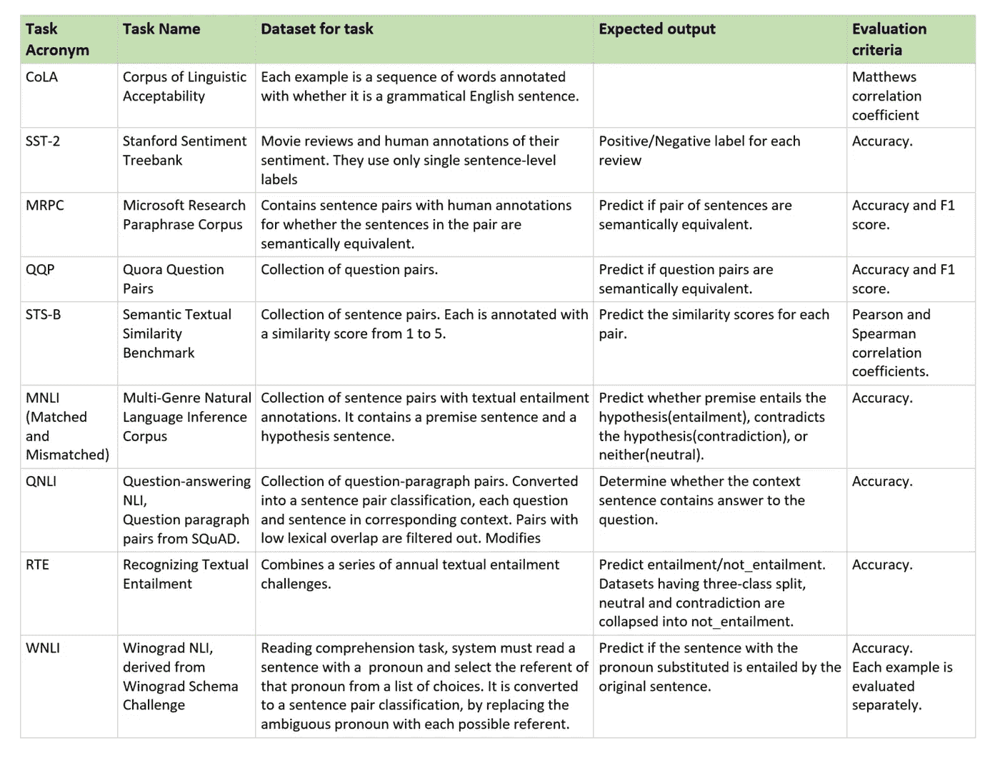
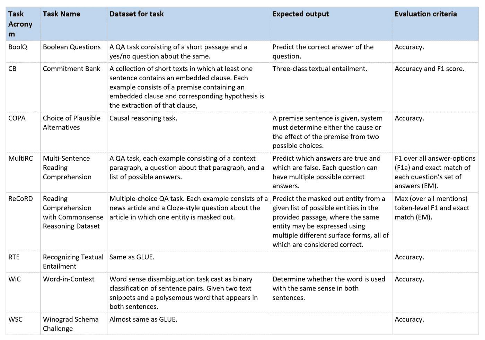
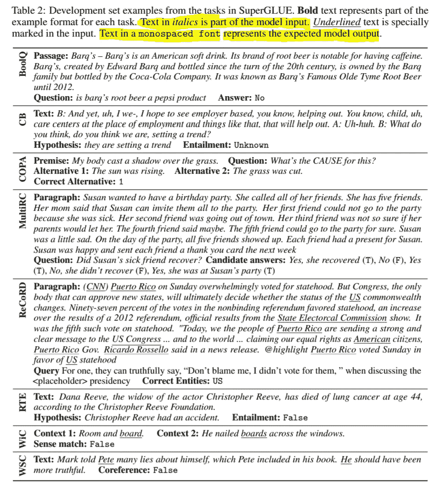

# NLP 模型的评估—最新基准

> 原文：<https://towardsdatascience.com/evaluation-of-an-nlp-model-latest-benchmarks-90fd8ce6fae5?source=collection_archive---------18----------------------->

## 以及为什么它很重要


在 [Unsplash](https://unsplash.com?utm_source=medium&utm_medium=referral) 上由 [Carlos Muza](https://unsplash.com/@kmuza?utm_source=medium&utm_medium=referral) 拍摄的照片

# 需要评估指标

## 其他领域的损失计算

在大多数深度学习任务中——分类、回归或图像生成——评估模型的性能是非常容易和直接的，因为解决方案空间是有限的/不是很大。

在大多数分类问题中，标签的数量是固定的，这使得有可能计算每一类的分数，并因此使得有可能计算从基础事实的损失/偏移。

在图像生成的情况下，输出和地面实况的分辨率是固定的。因此，我们可以计算一个像素的地面真实值的损失/偏移。水平。

在回归的情况下，输出中值的数量是固定的，因此可以为每个值计算损失，即使每个值的可能性是无限的。

注意:我在这篇文章中交替使用了问题和任务，因为每个问题都是围绕着一个模型需要执行的任务来定义的，所以请不要混淆。

## 自然语言处理中的损失计算问题

在 NLP 的情况下，即使输出格式是预先确定的，尺寸也不能是固定的。如果我们希望我们的模型输出单个句子，那么限制该句子的字数将是违反直觉的，因为我们知道有多种方式来表达相同的信息。

## 一个例子


照片由[奥拉夫·特维特](https://unsplash.com/@olav_tvedt?utm_source=medium&utm_medium=referral)在 [Unsplash](https://unsplash.com?utm_source=medium&utm_medium=referral) 拍摄

如果我要求您从以下选项中为上图选择不正确的标题:

*   房子前面的一辆汽车。
*   一辆汽车停在房子前面的路上。
*   一辆灰色汽车停在一所房子前面的路上。
*   一辆灰色跑车停在一栋房子前。

你可以选择其中任何一个，仍然是正确的，没有一个是不正确的，只是细节有所不同。如果我们的数据集中该图像的真实情况是“*一辆灰色汽车在路上*”。你将如何教一个模型使用地面真相标签，所有 4 个输出都是正确的？不太容易，是吗？

## 为什么拥有良好的评估指标很重要？

在我们深入到各种度量的细节和细微差别之前，我想在这里不仅谈谈为什么有一个好的度量很重要，而且还谈谈什么是一个好的度量——在我看来——以防你在文章结束之前没有做到。

开发这些 AI 解决方案的主要目的是将它们应用到现实世界的问题中，让我们的生活变得更轻松、更美好。但是我们的现实世界并不简单。那么，我们如何决定使用哪个模型来解决特定的问题呢？这就是这些指标派上用场的时候了。

如果我们试图用一个模型解决两个问题，我们会想知道模型在这两个任务上的表现，做出明智的决定，意识到我们正在做的权衡。这也是衡量标准的“优点”所在。现实世界充满了偏见，我们不希望我们的解决方案有偏见，因为这可能会产生不可想象的后果。

举个简单的例子，如果我们把一篇文章从 X 语言翻译成英语。对于一个特定的句子，如果我们谈论的是 A 组，它被翻译成“他们做了一个 ***好的*** 工作。”相比之下，对于 B 组，它被翻译成“他们做了一件 ***伟大的*** 工作。”，这是一个非常明显的迹象，表明我们的模型偏向于 b 组。这种偏见应该在它部署到现实世界之前就知道，度量标准应该有助于我们发现这些偏见。

尽管学习偏差与训练数据的关系更大，而与模型架构的关系更小，但我觉得，拥有一个捕捉偏差的指标或偏差的标准将是一个适应的好做法。

# BLEU 评分-双语评估替补演员

顾名思义，它最初用于评估从一种语言到另一种语言的翻译。

## 如何计算 BLEU 分数？

计算单字精度:

**步骤 1:** 查看输出句子中的每个单词，如果它出现在任何参考句子中，则给它打分，如果没有出现，则给 0 分。
**第二步:**通过将一个参考译文中出现的单词数除以输出句子中的总单词数，使计数标准化，使其始终介于 0 和 1 之间。

继续上面的例子:
**地面真相:*一辆灰色的车在路上***
S1:《一辆车在路上》会得到 5/6 的分数，
S2:《一辆灰色的车在路上》会得到 6/6 的分数，
S3:《一辆灰色的车在路上》也会得到 6/6 的分数！
事实上 S4:“车车车车车车”也将获得 6/6 的分数！！

这似乎是不正确的；我们不应该给 S3 和 S4 打这么高的分。为了惩罚最后两种情况，我们使用一元、二元、三元和 n 元的组合，将它们相乘。使用 n-grams 在某种程度上帮助我们捕捉句子的顺序——S3 情景。我们还根据每个单词在任何参考句子中出现的最高次数来限制计数每个单词的次数，这有助于我们避免不必要的重复单词——S4 情景。

最后，为了避免因为标题太短而错过细节，我们使用了简短惩罚。我们通过将它与长度最接近的参考句子的长度进行比较来做到这一点。

```
if (length(output) > length(shortest_References))
    brevity_Penalty = 1;
else { // output caption is shorter.
    brevity_Penalty = exponent(length(output)/length(shortest_Reference)-1);
}BLEU Score = unigram_precision * bigram_precision *...*            ngram_precision * brevity_Penalty; 
```

## BLEU 的问题是:

*   **不考虑意义**:现实中，句子中的单词对句子意义的贡献是不平等的。但是 BLEU 方法对所有单词的评估都是平等的。
    *地面真相*:我有一辆栗色车。S1:我有一辆蓝色的汽车。S2:我有一辆红色的汽车。S3:我有一艘栗色的船。所有人都会得到相同的分数，尽管 S1 和 S3 在这里传达了错误的信息。
*   **不直接考虑句子结构**:无法捕捉句法。词序对一句话的得分贡献不大。或者在翻译的情况下，句子的顺序。
    例如，如果我试图评估一部小说中某一章的翻译，我交换了翻译的前半部分和后半部分，这只会对 BLEU 分数产生一点点影响。同时，翻译的故事情节会被完全扭曲，这只有在诺兰电影中才能接受。
*   **它** **不处理形态丰富的语言**。如果你想用法语说“我很高”，“我很高”和“我很高”都是正确的翻译。唯一的区别是“grand(e)”这个词的性别。但是对于一个布鲁来说，这些词可能会像白天和黑夜一样不同。如果一个模型预测了其中一个，而期望另一个，BLEU 只会认为这是一个不匹配。

# SQuAD —斯坦福问答数据集

在这种类型的度量测试中，给定一个问题和一个文本，模型需要从给定的文本中预测答案。

*【以防你不熟悉《奇幻参考》，这里是你需要知道的一切，以便理解我的类比:
哈利波特是 JK 罗琳的系列丛书；《波西·杰克森》&《奥运选手》是雷克·莱尔顿制作的一个完全不同且毫无关联的系列；在《哈利·波特》系列中，主角——哈利·波特，在 90%的时间里，要么处于困境，要么正在陷入困境；
波西·杰克森是我提到的另一个书系列的主角，也和哈利有同样的惹上麻烦的倾向；《哈利·波特》系列中有一个角色叫珀西，虽然不是很重要。是的，这就是你所需要知道的。:D]*

如果我给你一篇哈利波特系列的课文，问你“为什么波西·杰克森和他的朋友会有麻烦”？人类能够分辨出问题和文本没有上下文关系，因此问题是不可回答的；一个陶工脑袋会和我断绝关系。但当被问及 NLP 模型时，它可能只是试图预测最有可能的答案，这可能是关于某个陷入困境的其他角色——暗示哈利·波特或某个名叫珀西或杰克逊的角色所做的事情。

为了解决这些弱点，SQuAD 2.0 将现有的小队数据与超过 50，000 个无法回答的问题相结合，这些问题由人群工作者以敌对的方式编写，看起来与可回答的问题相似。为了在 SQuAD 2.0 上做得好，系统不仅必须在可能的情况下回答问题，还必须确定何时没有答案被段落支持并放弃回答。

你可以在这里查看[班长板](https://rajpurkar.github.io/SQuAD-explorer/)。

# MS MACRO —机器阅读理解数据集

这是一个大规模的机器阅读理解数据集。它由以下任务组成:

*   ***问题回答***——根据问题和段落上下文所能理解的上下文段落，生成一个结构良好的答案(如果可能的话)。
*   ***段落排名*** —对给定问题的一组检索到的段落进行排名。
*   ***关键短语提取*** —在给定一组上下文段落的情况下，预测问题是否可回答，并像人类一样提取和合成答案。

该数据集开始关注 QnA，但后来发展到关注任何与搜索相关的问题。

该数据集由 1，010，916 个匿名问题组成——从 Bing 的搜索查询日志中取样——每个问题都有一个人为生成的答案和 182，669 个完全由人重写的生成答案。此外，该数据集包含 8，841，823 个段落，这些段落是从 Bing 检索的 3，563，535 个 web 文档中提取的，为管理自然语言答案提供了必要的信息。

# 胶水和强力胶——通用语言理解评估

GLUE 和 SuperGLUE 评估模型在一组任务上的性能，而不是单个任务，以获得性能的整体视图。它们由单句任务、相似性和释义任务以及推理任务组成。

我浏览了他们的论文，并收集了他们各自任务的简要概述。为了更快更好地理解，我将它们组织成这些表格。如果你想详细了解每项任务，请浏览文章末尾参考资料部分的链接。



胶水中的任务。



强力胶中的任务。



超级胶水纸上给出的每个任务的例子。[来源](https://w4ngatang.github.io/static/papers/superglue.pdf)。

务必检查[胶水](https://gluebenchmark.com/leaderboard)和[强力胶](https://super.gluebenchmark.com/leaderboard)各自的导板。

了解这些指标无论如何都不会帮助您提高模型的性能。然而，它肯定会帮助你理解更大的画面，我们目前在这个领域试图解决的问题！希望你觉得有用。

# 参考资料和其他好读物:

*   [BLeU 自担风险](/evaluating-text-output-in-nlp-bleu-at-your-own-risk-e8609665a213)。
*   [粘](https://openreview.net/pdf?id=rJ4km2R5t7)纸。
*   [强力胶纸](https://w4ngatang.github.io/static/papers/superglue.pdf)。
*   [MS 宏](https://github.com/microsoft/MSMARCO-Question-Answering)。[纸张](https://arxiv.org/pdf/1611.09268.pdf)。
*   [小队](https://rajpurkar.github.io/SQuAD-explorer/)。

> 我很高兴你坚持到了这篇文章的结尾。*🎉我希望你的阅读体验和我写这篇文章时一样丰富。*💖**
> 
> 请点击这里查看我的其他文章[。](https://medium.com/@ria.kulshrestha16)
> 
> 如果你想联系我，我会选择推特。